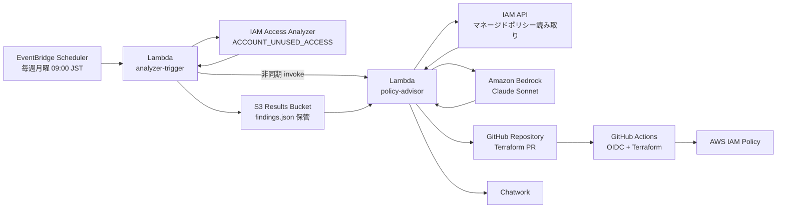
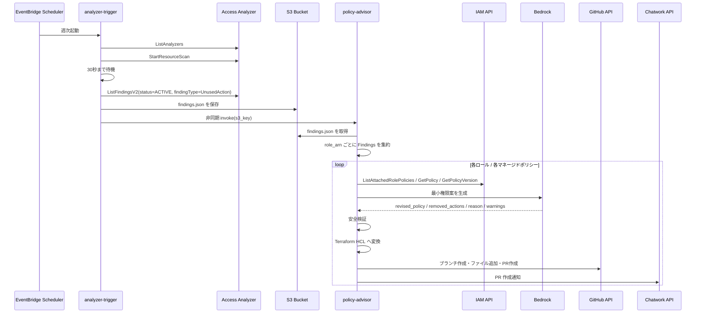
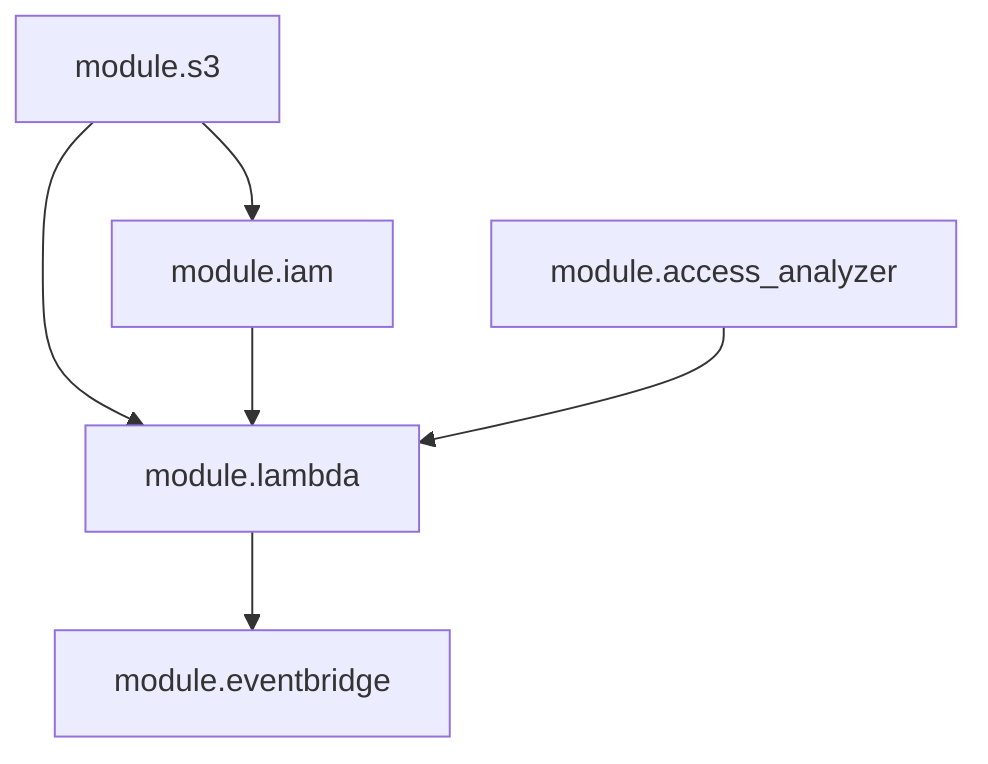

# ARCHITECTURE.md

## 概要

`iam-least-privilege-advisor` は、IAM Access Analyzer の未使用アクセス検出結果をもとに、Amazon Bedrock で IAM ポリシーの最小権限化案を生成し、Terraform 形式の GitHub PR として提案する GitOps 型システムです。

このプロジェクトの最重要方針は次の 2 点です。

1. IAM の過剰権限を継続的に見つける
2. 実際の権限変更は Lambda ではなく GitHub PR と Terraform Apply を経由して人間レビュー付きで行う

つまり、このシステムは「自動修正システム」ではなく「安全な自動提案システム」です。

## 目的と設計思想

- Access Analyzer の未使用アクション検出を定期実行する
- 既存のマネージド IAM ポリシーを読み取り、未使用アクションだけを削除候補にする
- Bedrock の生成結果をそのまま信用せず、コード側で 5 つの安全検証を行う
- 変更は Terraform HCL に変換して PR 化し、人間がレビューしてから反映する
- Lambda 実行ロールには IAM 変更権限を与えない

## 全体像



## なぜ 2 つの Lambda に分かれているか

### `analyzer-trigger`

- 定期実行の入口
- Access Analyzer のスキャン実行
- Findings の収集
- S3 への保存
- `policy-advisor` の非同期起動

この関数は「分析結果を集めて次工程へ渡す」ことに集中しています。

### `policy-advisor`

- Findings の読み込み
- IAM ロールごとの集約
- 現行ポリシー取得
- Bedrock による修正案生成
- AI 出力検証
- Terraform HCL 生成
- GitHub PR 作成
- Chatwork 通知

この関数は「提案を作って届ける」ことに集中しています。

責務を分離することで、スキャン処理と提案生成処理の失敗切り分けがしやすく、権限設計も明確になります。

## 実行シーケンス



## ディレクトリ構成と責務

| パス | 役割 |
|---|---|
| `terraform/main.tf` | 全モジュールを束ねるルート構成 |
| `terraform/modules/s3` | Findings 保存用 S3 バケット |
| `terraform/modules/iam` | 2 つの Lambda 実行ロールと最小権限ポリシー |
| `terraform/modules/access_analyzer` | Access Analyzer 本体 |
| `terraform/modules/lambda` | Lambda 関数、ロググループ、Lambda 間呼び出し許可 |
| `terraform/modules/eventbridge` | 週次スケジューラー |
| `lambda/analyzer_trigger` | スキャン実行と S3 保存 |
| `lambda/policy_advisor` | AI 提案生成から PR 通知まで |
| `.github/workflows/deploy.yml` | GitHub Actions による plan/apply |

## Terraform 構成

### ルートモジュール

[`terraform/main.tf`](/home/takuya/terraform-lab/iam-least-privilege-advisor/terraform/main.tf:1) は次の 5 モジュールを組み合わせます。

1. `s3`
2. `iam`
3. `access_analyzer`
4. `lambda`
5. `eventbridge`

依存関係は次の通りです。



補足:

- 実際の Terraform 参照上、`lambda` は `access_analyzer` の output を直接使ってはいません
- ただしシステムの意味上、`access_analyzer` が存在しないと `analyzer-trigger` は成立しないため、論理依存はあります

### `modules/s3`

[`terraform/modules/s3/main.tf`](/home/takuya/terraform-lab/iam-least-privilege-advisor/terraform/modules/s3/main.tf:1) は結果保存バケットを作成します。

- バケット名: `{project_name}-results-{account_id}`
- パブリックアクセス全面禁止
- バージョニング有効
- SSE-S3 暗号化
- `analyzer-results/` 配下を 90 日で自動削除

このバケットは中間データ置き場です。監査アーカイブではなく、週次分析結果の受け渡しバッファとして設計されています。

### `modules/iam`

[`terraform/modules/iam/main.tf`](/home/takuya/terraform-lab/iam-least-privilege-advisor/terraform/modules/iam/main.tf:1) は最重要のセキュリティ境界です。

#### `analyzer-trigger` ロール

許可される主な操作:

- `access-analyzer:ListAnalyzers`
- `access-analyzer:StartResourceScan`
- `access-analyzer:ListFindings`
- `s3:PutObject`
- `lambda:InvokeFunction` for `policy-advisor`
- CloudWatch Logs 書き込み

#### `policy-advisor` ロール

許可される主な操作:

- `s3:GetObject`
- `iam:GetPolicy`
- `iam:GetPolicyVersion`
- `iam:ListPolicyVersions`
- `bedrock:InvokeModel`
- `secretsmanager:GetSecretValue`
- CloudWatch Logs 書き込み

明確に禁止している思想:

- `iam:PutRolePolicy`
- `iam:PutUserPolicy`
- `iam:CreatePolicyVersion`
- そのほか IAM 変更系権限

この設計により、AI が暴走しても Lambda 単体では IAM 権限を変更できません。

### `modules/access_analyzer`

[`terraform/modules/access_analyzer/main.tf`](/home/takuya/terraform-lab/iam-least-privilege-advisor/terraform/modules/access_analyzer/main.tf:1) は 2 種類の Analyzer を作成します。

- `ACCOUNT`: 外部アクセス検出
- `ACCOUNT_UNUSED_ACCESS`: 未使用アクセス検出

実際に週次処理で使うのは後者です。`unused_access_age = 90` により、90 日間使われていない権限が検出対象になります。

### `modules/lambda`

[`terraform/modules/lambda/main.tf`](/home/takuya/terraform-lab/iam-least-privilege-advisor/terraform/modules/lambda/main.tf:1) は以下を作成します。

- 2 つの Lambda 関数
- 2 つの CloudWatch Logs グループ
- `analyzer-trigger` から `policy-advisor` を invoke するための Lambda permission
- `archive_file` による ZIP 生成設定

Lambda 設定:

| 関数 | Runtime | Arch | Memory | Timeout |
|---|---|---:|---:|---:|
| `analyzer-trigger` | Python 3.12 | arm64 | 256 MB | 60 秒 |
| `policy-advisor` | Python 3.12 | arm64 | 512 MB | 120 秒 |

### `modules/eventbridge`

[`terraform/modules/eventbridge/main.tf`](/home/takuya/terraform-lab/iam-least-privilege-advisor/terraform/modules/eventbridge/main.tf:1) は週次実行の起点です。

- `aws_scheduler_schedule`
- Scheduler 用 IAM ロール
- Scheduler から Lambda を呼ぶための permission

スケジュールは `cron(0 0 ? * MON *)` です。これは UTC 基準なので、毎週月曜 09:00 JST に相当します。

## Lambda 詳細

### `analyzer-trigger` の内部フロー

実装: [`lambda/analyzer_trigger/handler.py`](/home/takuya/terraform-lab/iam-least-privilege-advisor/lambda/analyzer_trigger/handler.py:1)

主要処理:

1. `get_unused_access_analyzer_arn()`
2. `run_scan_and_wait()`
3. `list_active_findings()`
4. `build_s3_key()` / `build_payload()`
5. `save_to_s3()`
6. `invoke_policy_advisor()`

ポイント:

- 対象 Analyzer は `ACCOUNT_UNUSED_ACCESS` タイプのみ
- Findings は `ACTIVE` かつ `UnusedAction` のみ抽出
- 対象リソース種別は `AWS::IAM::Role` と `AWS::IAM::User`
- S3 パスは JST 日付ベース
- `policy-advisor` は同期ではなく `InvocationType=Event` で非同期起動

### `policy-advisor` の内部フロー

実装: [`lambda/policy_advisor/handler.py`](/home/takuya/terraform-lab/iam-least-privilege-advisor/lambda/policy_advisor/handler.py:1)

主要処理:

1. `_resolve_s3_key()`
2. `_load_findings_from_s3()`
3. `_group_findings_by_role()`
4. `_process_role()`
5. `validate_ai_policy()`

この関数の中心は `_process_role()` です。1 ロールずつ以下を行います。

1. 未使用アクションをロール単位でマージ
2. `IamFetcher` でアタッチ済みマネージドポリシー取得
3. `BedrockClient` で修正版ポリシー生成
4. `validate_ai_policy()` で安全検証
5. `TerraformFormatter` で HCL 生成
6. `GithubPrCreator` で PR 作成
7. `ChatworkNotifier` で通知

## 補助クラス

### `IamFetcher`

実装: [`lambda/policy_advisor/iam_fetcher.py`](/home/takuya/terraform-lab/iam-least-privilege-advisor/lambda/policy_advisor/iam_fetcher.py:1)

役割:

- ロール ARN からロール名抽出
- `ListAttachedRolePolicies` でマネージドポリシー列挙
- `GetPolicy` と `GetPolicyVersion` で現行ドキュメント取得

重要な前提:

- インラインポリシーは対象外
- マネージドポリシーのみを修正提案対象にする

### `BedrockClient`

実装: [`lambda/policy_advisor/bedrock_client.py`](/home/takuya/terraform-lab/iam-least-privilege-advisor/lambda/policy_advisor/bedrock_client.py:1)

役割:

- Claude Sonnet へのプロンプト構築
- Bedrock Messages API 呼び出し
- スロットリング時の指数バックオフ
- JSON レスポンスのパース

入力:

- 対象ロール ARN
- 現行ポリシー JSON
- 未使用アクション一覧
- 最終アクセス日

出力:

- `revised_policy`
- `removed_actions`
- `reason`
- `warnings`

安全策:

- Markdown コードブロックを除去して JSON パース
- 必須キー不足時は失敗扱い
- `ThrottlingException` は 1 秒, 2 秒, 4 秒でリトライ

### `TerraformFormatter`

実装: [`lambda/policy_advisor/terraform_formatter.py`](/home/takuya/terraform-lab/iam-least-privilege-advisor/lambda/policy_advisor/terraform_formatter.py:1)

役割:

- 修正済み IAM ポリシー JSON を Terraform HCL に変換
- `jsonencode(...)` 形式で出力
- AI 生成物であること、削除アクション、変更理由をコメントとして付与

出力ファイルは GitHub 側で `terraform/iam_policies/{role_name_short}.tf` に保存されます。

### `GithubPrCreator`

実装: [`lambda/policy_advisor/github_pr_creator.py`](/home/takuya/terraform-lab/iam-least-privilege-advisor/lambda/policy_advisor/github_pr_creator.py:1)

役割:

1. Secrets Manager から GitHub Token 取得
2. `main` ブランチの最新 SHA 取得
3. `fix/iam-least-privilege-{YYYYMMDD}-{role_name_short}` ブランチ作成
4. HCL ファイルをコミット
5. PR 作成

特徴:

- GitHub API 失敗時は例外を投げる
- ロール名は 20 文字に切り詰めてブランチ名とファイル名に使う
- PR 本文には削除アクション、理由、警告、レビューチェックリストを含める

### `ChatworkNotifier`

実装: [`lambda/policy_advisor/chatwork_notifier.py`](/home/takuya/terraform-lab/iam-least-privilege-advisor/lambda/policy_advisor/chatwork_notifier.py:1)

役割:

- Secrets Manager から Chatwork API トークン取得
- PR 作成完了を通知

設計上の扱い:

- 通知失敗は処理全体を失敗させない
- GitHub PR 作成の成功を優先し、通知は best effort

## データ契約

### S3 に保存される `findings.json`

生成元: `analyzer-trigger`

```json
{
  "scan_date": "2026-05-06T09:00:00+09:00",
  "analyzer_arn": "arn:aws:access-analyzer:ap-northeast-1:123456789012:analyzer/example",
  "findings": [
    {
      "finding_id": "finding-123",
      "resource_arn": "arn:aws:iam::123456789012:role/example-role",
      "resource_type": "AWS::IAM::Role",
      "unused_actions": ["s3:DeleteObject"],
      "last_accessed": "2026-02-01T00:00:00+00:00"
    }
  ],
  "total_count": 1
}
```

このファイルが 2 つの Lambda を疎結合にするインターフェースです。

### Bedrock 入出力契約

`BedrockClient` は JSON のみを期待します。

```json
{
  "revised_policy": {},
  "removed_actions": [],
  "reason": "変更理由",
  "warnings": []
}
```

ここで自由文や Markdown を返されると処理はスキップされます。

## AI 出力検証

このプロジェクトの安全性は [`validate_ai_policy()`](/home/takuya/terraform-lab/iam-least-privilege-advisor/lambda/policy_advisor/handler.py:124) に強く依存しています。

検証項目:

1. `Version` と `Statement` が存在するか
2. `unused_actions` 以外のアクションが削除されていないか
3. `Resource` が変更されていないか
4. `Condition` が変更または削除されていないか
5. `Deny` の Statement が変更されていないか

この検証に落ちた提案は PR 化されません。

## セキュリティ境界

### 1. 提案と適用を分離

- Lambda は提案まで
- 適用は GitHub PR のレビューとマージ後
- 実変更は GitHub Actions の Terraform Apply

### 2. シークレットをコードに埋め込まない

- GitHub Token は Secrets Manager
- Chatwork Token も Secrets Manager
- Lambda には ARN だけを環境変数で渡す

### 3. モデル権限を限定

- Bedrock は指定モデル ARN のみ Invoke 可能

### 4. 監査しやすい経路

- S3 に分析結果を保存
- CloudWatch Logs に各処理を記録
- GitHub PR に変更意図を残す

## GitHub Actions とデプロイ

実装: [deploy.yml](/home/takuya/terraform-lab/iam-least-privilege-advisor/.github/workflows/deploy.yml:1)

### PR 時

- checkout
- Python / Terraform セットアップ
- OIDC で AWS 認証
- Lambda 依存パッケージを含む ZIP を生成
- `terraform init`
- `terraform fmt -check`
- `terraform validate`
- `terraform plan`
- plan 結果を PR コメントへ投稿

### `main` push 時

- 同様に ZIP 生成
- `terraform init`
- `terraform apply`

補足:

- Lambda ZIP は Actions ランナー上で `pip install -t ./` してからまとめられます
- Terraform 側の `archive_file` と合わせて、デプロイアーティファクト生成を CI 前提で成立させています

## 環境変数

### `analyzer-trigger`

- `S3_BUCKET_NAME`
- `POLICY_ADVISOR_FUNCTION_NAME`

### `policy-advisor`

- `S3_BUCKET_NAME`
- `GITHUB_TOKEN_SECRET_ARN`
- `CHATWORK_SECRET_ARN`
- `CHATWORK_ROOM_ID`
- `GITHUB_OWNER`
- `GITHUB_REPO`
- `BEDROCK_MODEL_ID`

## 運用上の特徴

### コストの主要因

- Access Analyzer の `ACCOUNT_UNUSED_ACCESS`
- Bedrock 推論
- CloudWatch Logs

Lambda と S3 は軽量ですが、Analyzer は対象ロール数に比例してコスト影響が出ます。

### 障害時の振る舞い

- Analyzer 未存在: `analyzer-trigger` が失敗
- Bedrock 失敗: 対象ポリシーをスキップ
- AI 検証失敗: PR 作成せずスキップ
- GitHub API 失敗: 例外で Lambda エラー
- Chatwork 失敗: ログのみ

この方針は「危険な提案を出すくらいならスキップする」に寄っています。

## 現状実装の前提と制約

コードを読む限り、理解しておくとよい点がいくつかあります。

### 1. 修正対象はマネージドポリシーのみ

`IamFetcher` は `ListAttachedRolePolicies` を使っており、インラインポリシーは対象外です。すべての IAM 過剰権限を網羅する設計ではなく、まずマネージドポリシーに絞っています。

### 2. S3 は Lambda 間の疎結合バッファ

`analyzer-trigger` が Findings を直接 payload で渡さず、いったん S3 に保存してから `policy-advisor` を起動します。これにより payload サイズ制限回避、再実行容易性、監査性向上を得ています。

### 3. `policy-advisor` にはフォールバック読込パスがある

イベントに `s3_key` が無い場合、当日最新ファイルを S3 から探します。通常フローでは `analyzer-trigger` が `s3_key` を渡すため、これは手動起動や再実行向けの保険です。

### 4. GitHub 反映先は別 Terraform 管理リポジトリでも成立する

`github_owner` と `github_repo` は変数化されているため、このリポジトリ自身ではなく、IAM ポリシーを管理する別リポジトリへ PR を送る構成も可能です。

## 実装上の注意点

アーキテクチャ理解の補助として、現行コード上の注意点も残します。

- [`IamFetcher`](/home/takuya/terraform-lab/iam-least-privilege-advisor/lambda/policy_advisor/iam_fetcher.py:28) は `iam:ListAttachedRolePolicies` を使いますが、[`modules/iam/main.tf`](/home/takuya/terraform-lab/iam-least-privilege-advisor/terraform/modules/iam/main.tf:136) の `policy_advisor` ロール定義にはその許可が含まれていません
- [`_resolve_s3_key()`](/home/takuya/terraform-lab/iam-least-privilege-advisor/lambda/policy_advisor/handler.py:224) は `list_objects_v2` を使うフォールバックを持ちますが、Terraform 上は `s3:GetObject` のみで `s3:ListBucket` は付与されていません
- README の説明では「エンジニアが PR をレビュー・マージ後に GitHub Actions が apply」と整理されていますが、現行の [deploy.yml](/home/takuya/terraform-lab/iam-least-privilege-advisor/.github/workflows/deploy.yml:1) は `main` push 時に自動で `terraform apply` を実行します

これらは設計破綻ではありませんが、運用前に見直すと理解と実装のズレを減らせます。

## このシステムを一言で表すと

「未使用 IAM 権限の検出」と「AI による最小権限提案」を組み合わせつつ、最終適用は GitOps と人間レビューに残した、安全側に倒した自動化基盤です。
