# アーキテクチャドキュメント

> **対象読者**: このプロジェクトを初めて触る人、設計意図を把握したい人
> **最終更新**: 2026-05-14

---

## 目次

1. [プロジェクト概要](#1-プロジェクト概要)
2. [システム全体構成](#2-システム全体構成)
3. [AWS インフラ層](#3-aws-インフラ層)
   - 3.1 [VPC / ネットワーク](#31-vpc--ネットワーク)
   - 3.2 [EKS クラスタ](#32-eks-クラスタ)
   - 3.3 [IAM 権限設計](#33-iam-権限設計)
   - 3.4 [S3 レポートバケット](#34-s3-レポートバケット)
4. [Kubernetes / Istio 層](#4-kubernetes--istio-層)
   - 4.1 [Namespace 設計](#41-namespace-設計)
   - 4.2 [アプリケーション構成](#42-アプリケーション構成)
   - 4.3 [Istio コントロールプレーン](#43-istio-コントロールプレーン)
5. [トラフィック制御](#5-トラフィック制御)
   - 5.1 [リクエストフロー（外部→内部）](#51-リクエストフロー外部内部)
   - 5.2 [カナリアリリース](#52-カナリアリリース)
   - 5.3 [サーキットブレーカー](#53-サーキットブレーカー)
   - 5.4 [mTLS 相互認証](#54-mtls-相互認証)
6. [セキュリティアーキテクチャ](#6-セキュリティアーキテクチャ)
7. [自動化フロー](#7-自動化フロー)
   - 7.1 [Terraform（インフラプロビジョニング）](#71-terraformインフラプロビジョニング)
   - 7.2 [Ansible（OS設定・Istio導入）](#72-ansibleos設定istio導入)
8. [可観測性](#8-可観測性)
9. [コスト設計](#9-コスト設計)
10. [フェーズ別実装マップ](#10-フェーズ別実装マップ)
11. [設計判断の記録（ADR 要約）](#11-設計判断の記録adr-要約)

---

## 1. プロジェクト概要

**Terraform × Ansible × Istio on EKS** を組み合わせたサービスメッシュ基盤の構築ハンズオン。
単なる動作確認ではなく、**ポートフォリオ品質**（可観測性・セキュリティ・GitOps）を目標にしている。

### 採用技術スタック

| レイヤー | 技術 | バージョン | 役割 |
|---|---|---|---|
| IaC | Terraform | >= 1.7 | AWS リソース一括プロビジョニング |
| 構成管理 | Ansible | 9.3.0 | OS Hardening + Istio インストール |
| コンテナ基盤 | Amazon EKS | Kubernetes 1.29 | コンテナオーケストレーション |
| サービスメッシュ | Istio | 1.21.0 | mTLS・トラフィック制御・可観測性 |
| クラウド | AWS | - | ap-northeast-1 (東京) |
| スクリプト | Python | 3.12 | HTML 観測レポート生成 |

### 実装する主要機能

```
[セキュリティ]          [トラフィック制御]       [可観測性]
 mTLS STRICT            カナリアリリース         S3 HTML レポート
 CIS Hardening          サーキットブレーカー      istioctl tls-check
 IAM 最小権限           タイムアウト/リトライ      Kiali (オプション)
 GitHub Actions OIDC
```

---

## 2. システム全体構成

プロジェクト全体を俯瞰したアーキテクチャ図。

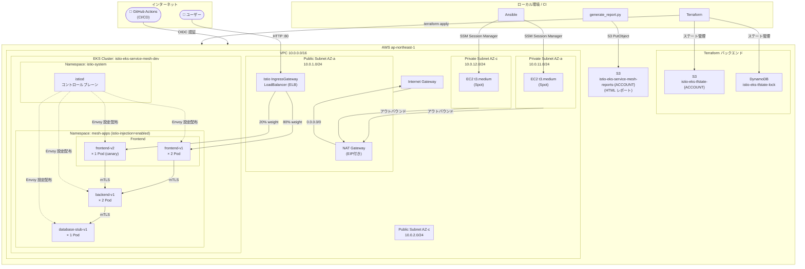

---

## 3. AWS インフラ層

Terraform で管理する 4 つのモジュールで構成される。

```
terraform/
├── main.tf          ← module 呼び出し（4モジュール）
├── backend.tf       ← S3 + DynamoDB リモートステート
├── versions.tf      ← provider バージョン固定
├── variables.tf     ← 入力変数
├── outputs.tf       ← 出力値
└── modules/
    ├── vpc/         ← ネットワーク基盤
    ├── eks/         ← Kubernetes クラスタ
    ├── iam/         ← 権限管理
    └── s3/          ← レポートストレージ
```

### 3.1 VPC / ネットワーク

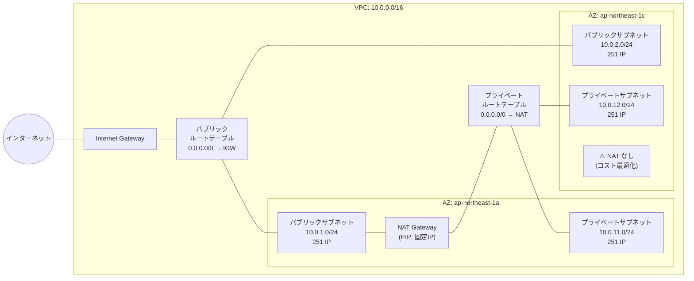

**設計のポイント:**

- **シングル NAT Gateway**: AZ-a にのみ配置（冗長性よりコスト優先。ハンズオン環境）
- **EKS ワーカーノードはプライベートサブネット**: 直接インターネット露出なし
- **ELB (Istio IngressGateway) はパブリックサブネット**: ユーザーからのアクセス受口
- **DNS**: VPC 内 DNS 解決・ホスト名有効化（EKS サービスディスカバリに必要）

| リソース | 名前パターン | 備考 |
|---|---|---|
| VPC | `{project}-vpc-{env}` | CIDR 10.0.0.0/16 |
| パブリックサブネット | `{project}-public-{az}-{env}` | 2 AZ × 1 = 2 個 |
| プライベートサブネット | `{project}-private-{az}-{env}` | 2 AZ × 1 = 2 個 |
| Internet Gateway | `{project}-igw-{env}` | VPC に 1 つ |
| NAT Gateway | `{project}-nat-{env}` | AZ-a のみ |
| EIP | `{project}-nat-eip-{env}` | NAT Gateway 用固定 IP |

---

### 3.2 EKS クラスタ

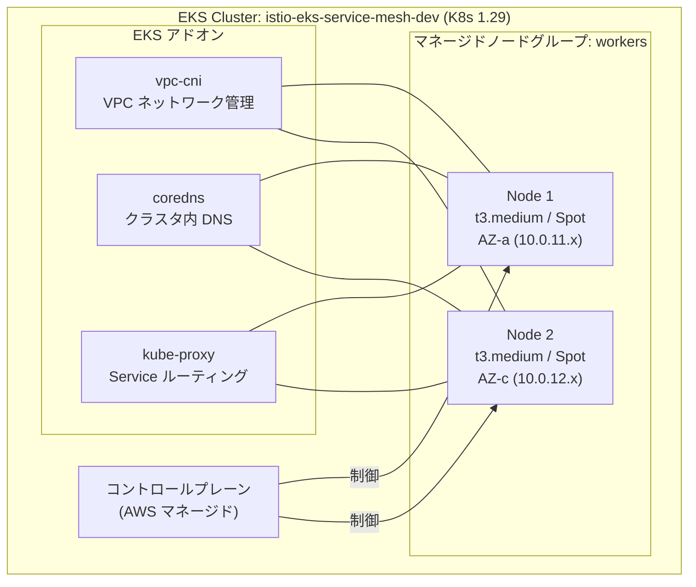

| 設定項目 | 値 | 理由 |
|---|---|---|
| Kubernetes バージョン | 1.29 | Istio 1.21 との互換性保証バージョン |
| インスタンスタイプ | t3.medium | Istio sidecar 含め 2 コンテナ/Pod 動作可能な最小スペック |
| 容量タイプ | SPOT | コスト削減（最大 70%）。ステートレスなアプリのため中断耐性あり |
| ノード数 | 最小 1 / 希望 2 / 最大 3 | 通常 2 ノード稼働、スケールアウト余地あり |
| AMI | Amazon Linux 2023 x86_64 | CIS Hardening ロールが AL2023 に対応 |
| API エンドポイント | Public + Private | 外部からの `kubectl` アクセスと Pod 間通信の両立 |
| ログ出力 | api / audit / authenticator | セキュリティ監査・トラブルシューティング用 |

**ノードに付与されるラベル:**
```
role=worker
env=dev
node.kubernetes.io/instance-type=t3.medium
```

---

### 3.3 IAM 権限設計

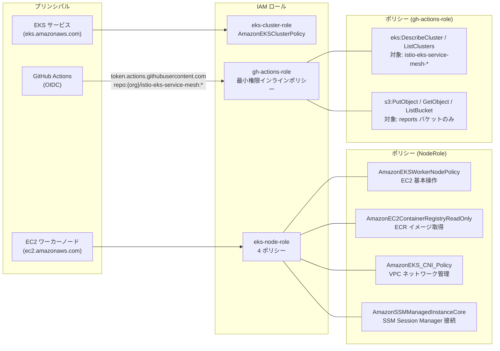

**設計原則: 最小権限**

- `"*"` リソース指定を禁止。全 IAM ポリシーはリソース ARN を特定
- ワイルドカードを許容するのはプロジェクト名プレフィックス (`istio-eks-service-mesh-*`) のみ
- GitHub Actions はアクセスキー不要 → OIDC フェデレーションで一時クレデンシャル取得

---

### 3.4 S3 レポートバケット

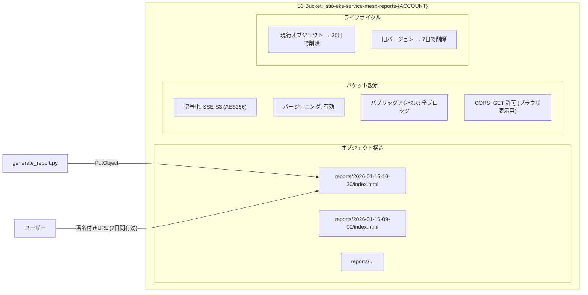

署名付き URL を使う理由: バケットは完全非公開のまま、特定の人だけに期限付きアクセスを付与できる。

---

## 4. Kubernetes / Istio 層

### 4.1 Namespace 設計

```
クラスタ内の Namespace 構成:

kube-system       ← K8s システムコンポーネント (aws-node, coredns, kube-proxy)
istio-system      ← Istio コントロールプレーン (istiod, ingressgateway)
mesh-apps         ← アプリケーション (istio-injection=enabled)
```

`mesh-apps` Namespace に付与されるラベル:

```yaml
labels:
  istio-injection: enabled   # ← このラベルがある限り、全 Pod に Envoy が自動注入される
  env: dev
  managed-by: ansible
```

### 4.2 アプリケーション構成

3 層アーキテクチャを **hashicorp/http-echo** でシミュレートする。
実際のアプリケーションロジックは持たず、**Istio の動作確認に特化**した構成。

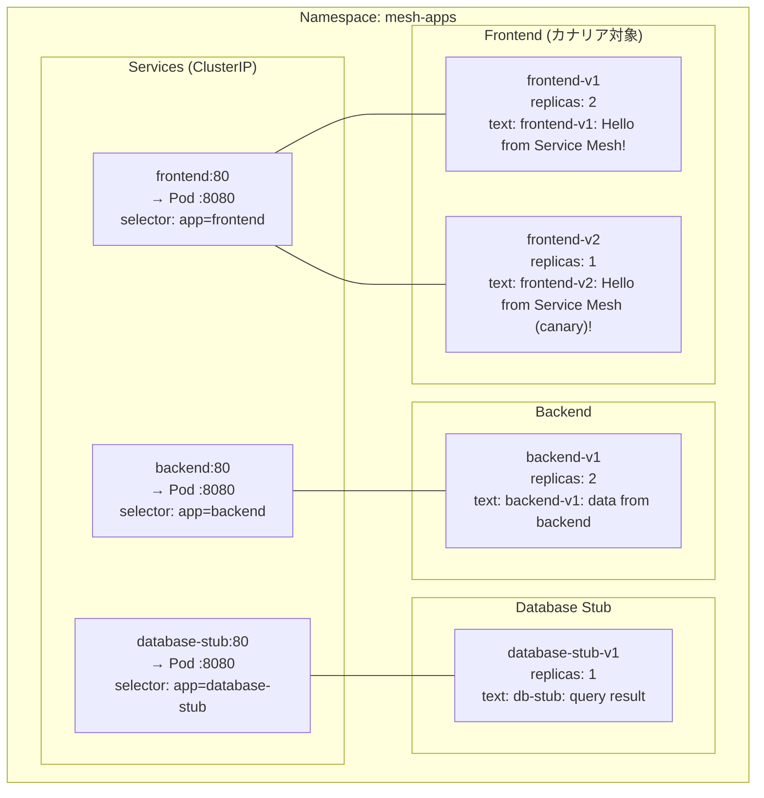

**各 Pod のリソース設定（全サービス共通）:**

| 項目 | Request | Limit |
|---|---|---|
| CPU | 50m | 100m |
| Memory | 64Mi | 128Mi |

**ヘルスチェック設定（全サービス共通）:**

| 種別 | パス | 初期遅延 | 周期 |
|---|---|---|---|
| Liveness Probe | `GET /` | 5 秒 | 10 秒 |
| Readiness Probe | `GET /` | 3 秒 | 5 秒 |

**Service のポート名が重要な理由:**

```yaml
ports:
  - name: http   # ← "http" プレフィックスで Istio がプロトコルを自動判定
    port: 80
    targetPort: 8080
```
`name: http` がないと Istio が TCP として扱い、L7 ルーティング（カナリア等）が機能しない。

### 4.3 Istio コントロールプレーン

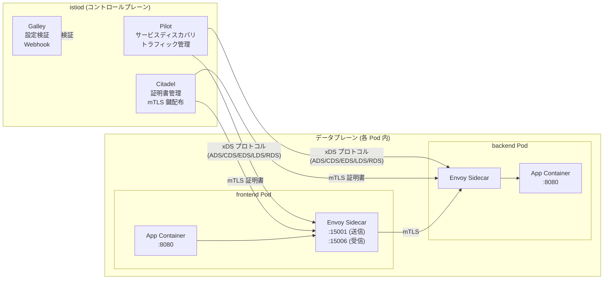

**Envoy Sidecar が行うこと:**
- iptables ルールでアプリのトラフィックを透過的にインターセプト（アプリ側コード変更不要）
- `istiod` から受け取った設定（DestinationRule / VirtualService）に従ってルーティング
- mTLS 証明書の管理・更新（アプリ側は意識しない）
- メトリクス・アクセスログの収集

---

## 5. トラフィック制御

### 5.1 リクエストフロー（外部→内部）

外部からのリクエストがサービスに届くまでの全経路。

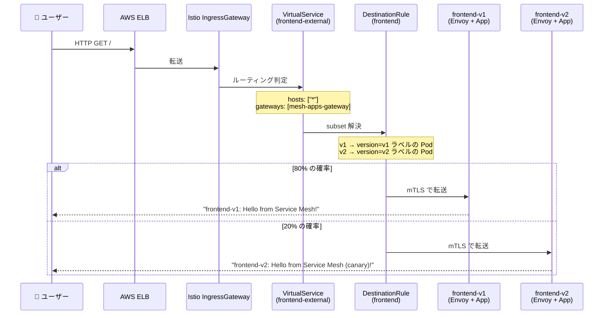

**Istio リソースの役割分担:**

| リソース | 役割 | 例 |
|---|---|---|
| **Gateway** | 外部からどのトラフィックを受け入れるか | ポート 80、全ホスト許可 |
| **VirtualService** | どのサービスのどのバージョンに何%振るか | v1:80%, v2:20% |
| **DestinationRule** | subset の定義 + TLS モード + サーキットブレーカー | v1→`version=v1` ラベル |
| **PeerAuthentication** | サービス間の mTLS を強制するか | STRICT（平文不可） |

### 5.2 カナリアリリース

VirtualService の `weight` フィールドを変更するだけで段階的移行ができる。

```mermaid
gantt
    title カナリアリリース 段階的移行ロードマップ
    dateFormat X
    axisFormat %s

    section v1 トラフィック割合
    100% (初期)     :done, 0, 1
    80%             :active, 1, 2
    50%             :2, 3
    0%  (完全移行)  :3, 4

    section v2 トラフィック割合
    0%  (初期)      :done, 0, 1
    20% (現在)      :active, 1, 2
    50%             :2, 3
    100% (完全移行) :3, 4
```

**移行手順:**

```bash
# Step 1: 現在の状態確認
kubectl get vs frontend-external -n mesh-apps -o yaml | grep weight

# Step 2: canary.yaml の weight を編集して apply
# (例: v1=50%, v2=50% に変更)
kubectl apply -f k8s/istio/traffic-policy/canary.yaml

# Step 3: 動作確認 (10回のうち約5回 v2 が応答するはず)
for i in {1..10}; do curl -s http://${ISTIO_INGRESS_IP}/; done

# Step 4: 問題があればロールバック
# weight を v1=100, v2=0 に戻して apply
```

**VirtualService の分割設計（外部/内部）:**

```
frontend-external  ← Ingress Gateway 経由（外部ユーザー向け）
  hosts: ["*"]
  gateways: [mesh-apps-gateway]

frontend-internal  ← クラスタ内部通信（Pod 間）
  hosts: ["frontend"]
  gateways: [mesh]
```

`"*"` ワイルドカードは Ingress Gateway スコープ内に閉じているため安全。
内部通信は明示的なホスト名 `frontend` で管理する。

### 5.3 サーキットブレーカー

DestinationRule の `outlierDetection` で設定する。

```
通常時:
  [frontend Pod] → 全リクエストをバックエンドに送信

サーキットブレーカー発動条件 (本番設定):
  ・30秒ウィンドウ内に 3回連続 5xx エラー
  ↓
  [障害 Pod を一時的に除外]
  ・最低 30秒間、該当 Pod へのルーティングを停止
  ・除外対象は全 Pod の最大 50%（可用性確保）
  ↓
  [自動回復]
  ・時間経過後に復帰試行（指数バックオフ）
```

**設定値の意味:**

```yaml
outlierDetection:
  consecutive5xxErrors: 3     # 何回連続で失敗したら除外するか
  interval: 30s               # エラーカウントのリセット周期
  baseEjectionTime: 30s       # 最初の除外時間（2回目は60s、3回目は90s...）
  maxEjectionPercent: 50      # 同時除外できる Pod の上限割合
```

**テスト用設定** (`traffic-policy/circuit-breaker.yaml`):
`consecutive5xxErrors: 1` に変更することで、1 回のエラーで即座にトリップを確認できる。

### 5.4 mTLS 相互認証

**PeerAuthentication + DestinationRule のペア設定が必須:**

```
PeerAuthentication (mesh-apps Namespace 全体に適用):
  mode: STRICT
  → このNamespace内の全Podへの通信はmTLS必須

DestinationRule (各サービスごと):
  tls.mode: ISTIO_MUTUAL
  → このサービスへの接続時にIstio管理の証明書でmTLSを確立

この2つがセットで初めて機能する。
PeerAuthenticationだけでは「要求」、DestinationRuleで「実施」となる。
```

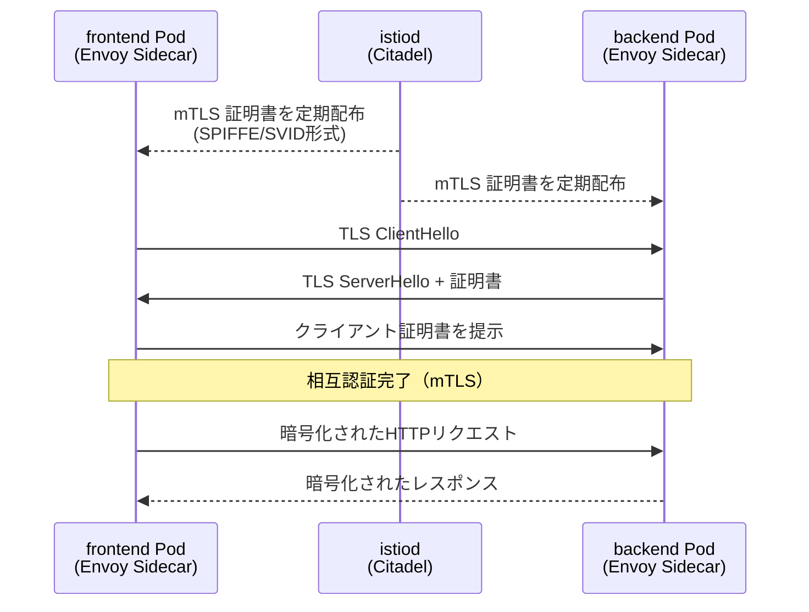

**確認コマンド:**
```bash
istioctl authn tls-check frontend.mesh-apps.svc.cluster.local
# STATUS が "mTLS" と表示されれば正常
```

---

## 6. セキュリティアーキテクチャ

セキュリティは **4つの層** で多重防御を実装している。

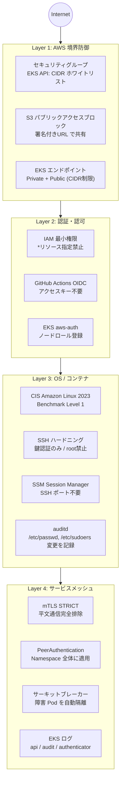

**OS Hardening の適用項目（CIS Amazon Linux 2023 Level 1）:**

| カテゴリ | 設定内容 | CIS 番号 |
|---|---|---|
| パッチ管理 | 全パッケージ最新化 | 1.9 |
| 不要サービス | telnet / rsh / ypserv / tftp を無効化 | 2.x |
| SSH | root ログイン禁止、鍵認証のみ、X11 転送禁止 | 5.2 |
| カーネル | IP forwarding 有効（K8s 必須）、リダイレクト受信無効 | 3.x |
| ファイル権限 | /etc/shadow → 0000、/etc/crontab → 0600 | 6.1 |
| 監査ログ | auditd で /etc/passwd, sudoers, execve 記録 | 4.x |
| umask | 027（グループ書込・他者全権限なし） | 5.4.4 |

---

## 7. 自動化フロー

### 7.1 Terraform（インフラプロビジョニング）

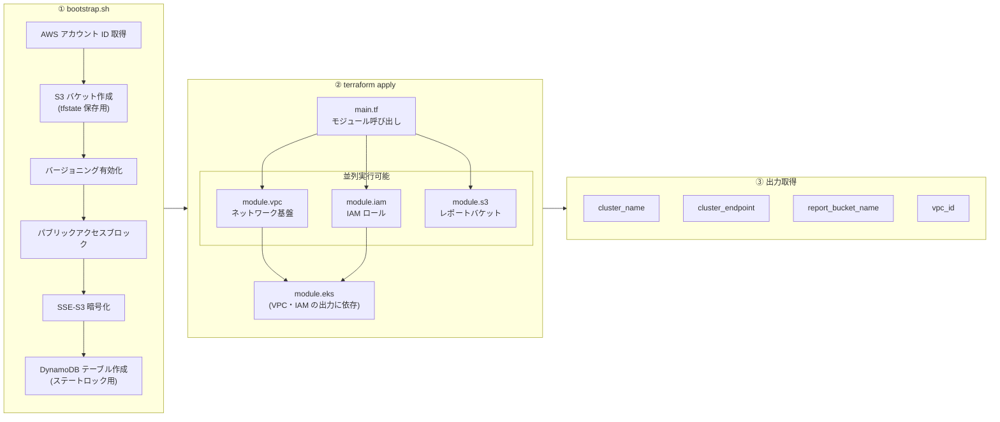

**モジュール間の依存関係:**

```
module.vpc.outputs → module.eks (subnet_ids, vpc_id)
module.iam.outputs → module.eks (cluster_role_arn, node_role_arn)
module.eks.outputs → module.s3 (cluster_name for bucket lifecycle tag)
```

**リモートステート設計:**

```hcl
# backend.tf
terraform {
  backend "s3" {
    bucket         = "istio-eks-tfstate-{ACCOUNT_ID}"
    key            = "istio-eks-service-mesh/terraform.tfstate"
    region         = "ap-northeast-1"
    dynamodb_table = "istio-eks-tfstate-lock"
    encrypt        = true
  }
}
```

DynamoDB の `LockID` 属性でステートファイルの同時書き込みを防ぐ（チーム開発・CI/CD で安全に実行可能）。

---

### 7.2 Ansible（OS設定・Istio導入）

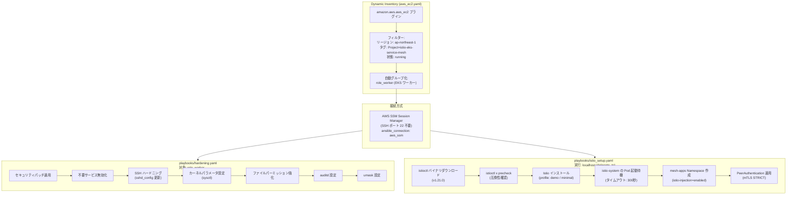

**Ansible が SSH の代わりに SSM Session Manager を使う理由:**
- ワーカーノードはプライベートサブネットにあり SSH ポートが閉じている
- キーペア管理が不要（IAM ロールで認証）
- AWS CloudTrail にセッション履歴が残る（監査対応）

---

## 8. 可観測性

```mermaid
graph LR
    subgraph Cluster["EKS クラスタ"]
        Pods["各 Pod<br/>(Envoy Sidecar)"]
        kubectl["kubectl コマンド"]
        istioctl["istioctl コマンド"]
    end

    subgraph Script["generate_report.py"]
        direction TB
        C1["kubectl get nodes -o json"]
        C2["kubectl get pods -n mesh-apps -o json"]
        C3["kubectl get vs,dr,gw,pa -n mesh-apps -o json"]
        C4["istioctl authn tls-check"]
        C5["istioctl version"]
        HTML["HTML レポート生成<br/>(ダークテーマ)"]

        C1 & C2 & C3 & C4 & C5 --> HTML
    end

    subgraph Report["HTML レポート (S3)"]
        S1["📊 統計カード<br/>ノード数 / Pod数 / VS数"]
        S2["🖥️ EKS ノード状態テーブル<br/>Ready / NotReady / インスタンスタイプ"]
        S3["🔵 Pod 状態テーブル<br/>ステータスバッジ色分け / Restart数"]
        S4["📈 カナリア重みバー<br/>v1:80% / v2:20% プログレスバー"]
        S5["⚡ サーキットブレーカー設定<br/>閾値 / ウィンドウ / 除外時間"]
        S6["🔐 mTLS 状態テーブル<br/>istioctl authn tls-check 出力"]
    end

    Pods --> kubectl & istioctl
    kubectl & istioctl --> Script
    Script -->|"S3 PutObject"| Report
    Report -->|"署名付きURL (7日間)"| User["👤 ユーザー<br/>ブラウザで閲覧"]
```

**レポートの HTML 設計:**
- ダークテーマ（背景 `#0d1117`）— GitHub Markdown に合わせた配色
- Pod ステータスのバッジ色分け: Running=緑 / Pending=黄 / Failed=赤
- CSS インライン記述 → 外部ファイル不要、ブラウザ単体で完結
- レスポンシブ対応（スマートフォンでも閲覧可能）

**オプション（追加可能）:**

| ツール | 用途 | 導入方法 |
|---|---|---|
| Kiali | サービスグラフ・トラフィックフロー可視化 | `istioctl dashboard kiali` |
| Jaeger | 分散トレーシング | Istio addon として導入 |
| Prometheus + Grafana | メトリクスダッシュボード | Istio addon として導入 |

---

## 9. コスト設計

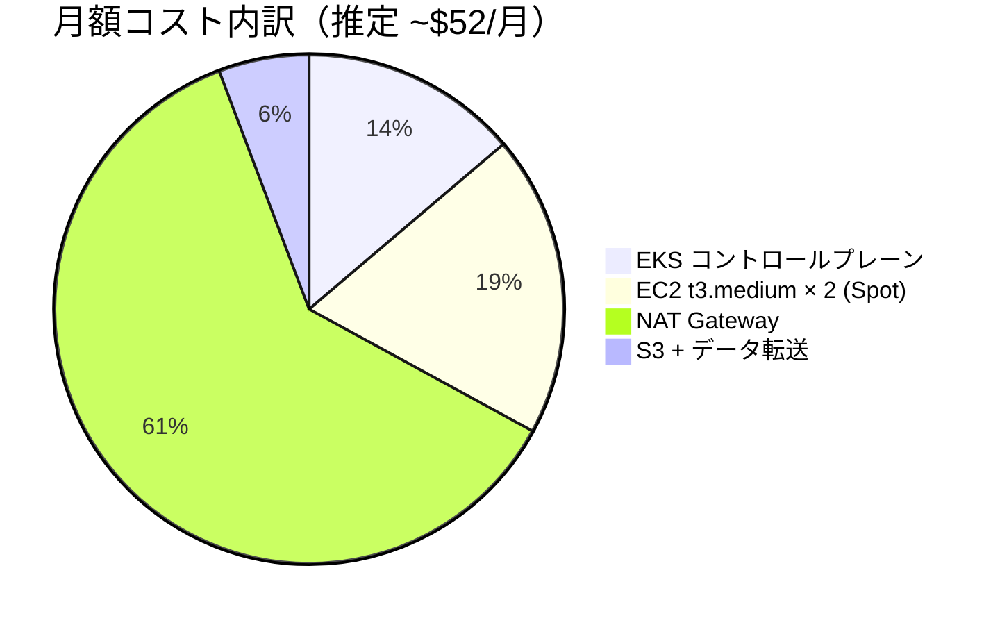

| リソース | 単価 | 数量 | 月額 | コスト最適化の工夫 |
|---|---|---|---|---|
| EKS コントロールプレーン | $0.10/時間 | 1 | $7.2 | 不使用時は削除 |
| EC2 t3.medium (Spot) | $0.007/時間 | 2 | ~$10 | Spot で約 70% 削減 |
| NAT Gateway | $0.045/時間 + 転送料 | 1 | ~$32 | 1 AZ のみ（HA 不要） |
| S3 (レポートバケット) | $0.025/GB/月 | < 1GB | ~$1 | 30日ライフサイクル削除 |
| データ転送 | $0.114/GB | 少量 | ~$2 | VPC 内は無料 |
| **合計** | | | **~$52** | |

> **注意**: NAT Gateway の固定費が支配的。ハンズオン後は必ず `cleanup.sh` を実行すること。

---

## 10. フェーズ別実装マップ

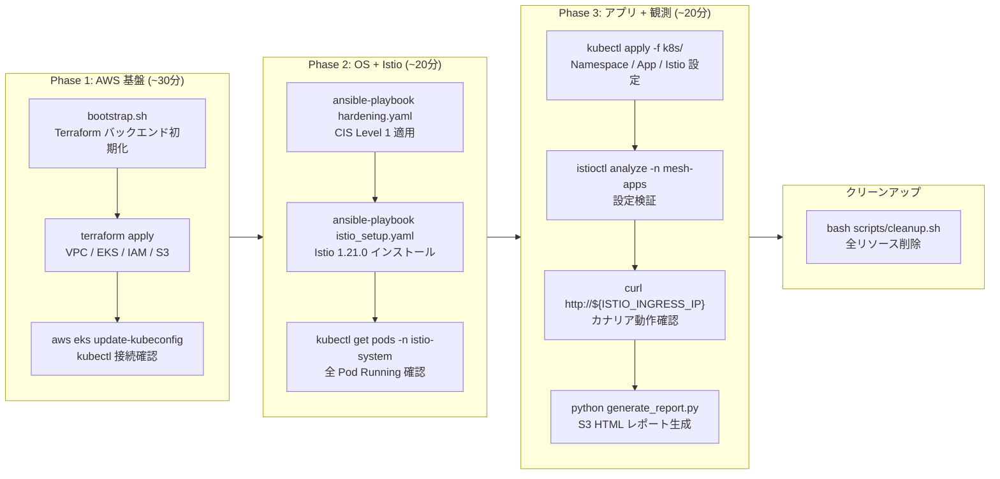

**各フェーズの前提条件:**

| フェーズ | 開始前に確認すること |
|---|---|
| Phase 1 | `aws configure` 完了、必要な権限があること |
| Phase 2 | Phase 1 完了、`kubectl get nodes` で Ready 表示 |
| Phase 3 | Phase 2 完了、`kubectl get pods -n istio-system` で全 Running |

---

## 11. 設計判断の記録（ADR 要約）

詳細は `docs/adr/` を参照。

### ADR-001: Istio を App Mesh ではなく採用

| | 内容 |
|---|---|
| **決定** | AWS App Mesh ではなく OSS Istio を採用 |
| **理由** | より豊富なトラフィック制御機能（カナリア・サーキットブレーカー・リトライ）、Kiali/Jaeger 等の可視化エコシステム、ポートフォリオとして汎用性が高い |
| **トレードオフ** | AWS との統合は App Mesh の方が深い（CloudMap, X-Ray）。Istio は自己管理コストがある |

### ADR-002: EKS マネージドノードグループを採用

| | 内容 |
|---|---|
| **決定** | Fargate / セルフマネージドではなくマネージドノードグループ |
| **理由** | Istio sidecar は DaemonSet として動作するため Fargate 非対応。マネージドは OS パッチ適用が半自動化 |
| **トレードオフ** | セルフマネージドより柔軟性は低いが、運用コストが大幅に削減できる |

### ADR-003: S3 署名付き URL で HTML レポートを共有

| | 内容 |
|---|---|
| **決定** | Grafana/Kibana ではなく S3 静的 HTML で観測レポートを提供 |
| **理由** | 追加インフラ不要、バケットは完全非公開のまま期限付き共有が可能、ポートフォリオとして「スクリーンショット URL」を渡せる |
| **トレードオフ** | リアルタイム更新は不可（手動実行が必要）|

---

## ファイル構成早見表

```
istio-eks-service-mesh/
│
├── terraform/                   ← AWS リソース定義
│   ├── modules/vpc/             ← VPC・サブネット・ルーティング
│   ├── modules/eks/             ← EKS クラスタ・ノードグループ・アドオン
│   ├── modules/iam/             ← IAM ロール・OIDC・GitHub Actions
│   └── modules/s3/              ← レポートバケット・ライフサイクル
│
├── ansible/                     ← OS 設定・Istio 導入
│   ├── roles/os_hardening/      ← CIS Amazon Linux 2023 Level 1
│   ├── roles/istio_install/     ← istioctl によるインストール
│   └── playbooks/               ← hardening.yaml / istio_setup.yaml
│
├── k8s/
│   ├── namespaces/              ← mesh-apps (istio-injection=enabled)
│   ├── apps/                    ← frontend(v1/v2) / backend / database-stub
│   └── istio/                   ← gateway / virtual-service / destination-rule
│       └── traffic-policy/      ← canary.yaml / circuit-breaker.yaml
│
├── scripts/
│   ├── bootstrap.sh             ← Terraform バックエンド初期化
│   ├── generate_report.py       ← HTML 観測レポート生成 → S3
│   └── cleanup.sh               ← 全リソース削除（逆順）
│
└── docs/
    ├── adr/                     ← 設計判断記録 (001-003)
    └── runbook/                 ← deploy.md / troubleshoot.md
```
