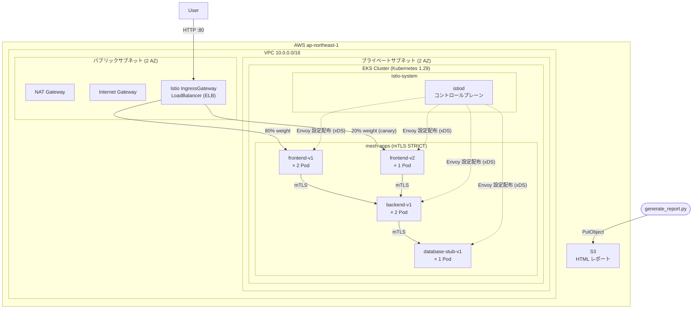

# istio-eks-service-mesh

Terraform × Ansible × Istio on EKS を組み合わせたサービスメッシュ基盤の構築ハンズオン。
可観測性・セキュリティ・GitOps を体系的に実装した、ポートフォリオ品質のプロジェクト。

---

## このハンズオンで得られること

### 習得できる技術スタック

| 分野 | 習得内容 |
|---|---|
| **IaC (Terraform)** | モジュール分割・リモートステート・OIDC 認証・最小権限 IAM の設計 |
| **構成管理 (Ansible)** | Dynamic Inventory・SSM Session Manager 接続・冪等なタスク設計 |
| **コンテナ基盤 (EKS)** | マネージドノードグループ・アドオン管理・kubeconfig 設定 |
| **サービスメッシュ (Istio)** | Envoy sidecar の仕組み・VirtualService/DestinationRule の設計・mTLS の実装 |
| **セキュリティ** | CIS Benchmark Level 1 対応・OS Hardening・ネットワーク多層防御 |
| **可観測性** | S3 HTML レポート生成・istioctl による mTLS 診断 |

### ハンズオン後にできること

- **カナリアリリース**を 1 コマンドで実施し、安全にバージョン移行する
- **サーキットブレーカー**でバックエンド障害を自動検知・隔離する
- サービス間通信が **mTLS で暗号化**されていることをコマンドで証明する
- Terraform だけで **VPC / EKS / IAM / S3 を一括プロビジョニング**する
- Ansible で **再現可能な OS Hardening** を自動適用する
- クラスタの状態を **HTML レポートとして S3 に保存**し、URL で共有する

### なぜこのスタックか

```
AWS App Mesh ではなく Istio を選んだ理由
  → カナリア・サーキットブレーカー・mTLS を標準機能として持ち、
    Kiali / Jaeger などの可視化エコシステムが充実しているため。
    (詳細: docs/adr/001-use-istio-over-appmesh.md)

Fargate ではなくマネージドノードグループを選んだ理由
  → Istio の sidecar injection は DaemonSet を利用するため Fargate 非対応。
    (詳細: docs/adr/002-eks-managed-nodegroup.md)
```

---

## アーキテクチャ全体図



> 詳細なアーキテクチャ解説（各レイヤーの設計意図・Istio のデータフロー・セキュリティ多層防御）は [ARCHITECTURE.md](./ARCHITECTURE.md) を参照。

---

## 前提条件

### 必要なツールとバージョン

| ツール | 最低バージョン | インストール確認コマンド |
|---|---|---|
| AWS CLI | 2.15 | `aws --version` |
| Terraform | 1.7 | `terraform version` |
| kubectl | 1.29 | `kubectl version --client` |
| Ansible | 9.3 | `ansible --version` |
| istioctl | 1.20 | `istioctl version --remote=false` |
| Python | 3.12 | `python3 --version` |
| jq | 1.6 | `jq --version` |

### AWS の準備

```bash
# プロファイルが設定済みか確認
aws sts get-caller-identity

# 期待する出力例:
# {
#     "UserId": "AIDA...",
#     "Account": "123456789012",
#     "Arn": "arn:aws:iam::123456789012:user/your-user"
# }
```

以下の IAM 権限が必要です:

- `AmazonVPCFullAccess`
- `AmazonEKSClusterPolicy` / `AmazonEKSWorkerNodePolicy`
- `AmazonEC2FullAccess`
- `AmazonS3FullAccess`
- `AmazonDynamoDBFullAccess`
- `IAMFullAccess`

### リポジトリのクローン

```bash
git clone https://github.com/YOUR_GITHUB_ORG/istio-eks-service-mesh.git
cd istio-eks-service-mesh
```

---

## ハンズオン手順

ハンズオンは **3 つのフェーズ**で構成されています。
各フェーズの完了確認を必ず行ってから次に進んでください。

```
Phase 1: AWS 基盤構築    (~30 分)  VPC / EKS / IAM / S3 を Terraform で構築
Phase 2: OS + Istio 導入  (~20 分)  Ansible で Hardening + Istio インストール
Phase 3: アプリ + 観測   (~20 分)  アプリデプロイ + トラフィック制御 + レポート生成
```

---

## Phase 1: AWS 基盤構築

### Step 1-1: 環境変数の設定

ターミナルを開き、以下を設定します。**このターミナルはハンズオン中ずっと使い続けてください。**

```bash
export AWS_PROFILE=your-profile          # aws configure で設定したプロファイル名
export AWS_DEFAULT_REGION=ap-northeast-1
```

### Step 1-2: Terraform バックエンドの初期化

Terraform のステートファイルを保存する S3 バケットと、同時実行を防ぐ DynamoDB テーブルを作成します。

```bash
bash scripts/bootstrap.sh
```

**実行後の出力例:**

```
Terraform バックエンドリソースを作成中...
  S3 バケット: istio-eks-tfstate-123456789012
  DynamoDB テーブル: istio-eks-tfstate-lock
バックエンドリソースの作成が完了しました
```

次に `backend.tf` のプレースホルダーを実際のアカウント ID に置換します:

```bash
AWS_ACCOUNT_ID=$(aws sts get-caller-identity --query Account --output text)
sed -i "s/REPLACE_WITH_ACCOUNT_ID/${AWS_ACCOUNT_ID}/g" terraform/backend.tf

# 置換されたことを確認
grep "bucket" terraform/backend.tf
# → bucket = "istio-eks-tfstate-123456789012"
```

### Step 1-3: tfvars ファイルの作成

自分の環境に合わせた変数ファイルを作成します。

```bash
# 自分のグローバル IP アドレスを確認
MY_IP=$(curl -s ifconfig.me)
echo "あなたの IP: ${MY_IP}"

# tfvars ファイルを作成
cat > terraform/dev.tfvars << EOF
project_name        = "istio-eks-service-mesh"
env                 = "dev"
aws_region          = "ap-northeast-1"
eks_cluster_version = "1.29"
node_instance_type  = "t3.medium"
node_desired_size   = 2
node_min_size       = 1
node_max_size       = 3
allowed_cidr_blocks = ["${MY_IP}/32"]
report_bucket_lifecycle_days = 30
github_org          = "YOUR_GITHUB_ORG"
EOF

echo "tfvars を作成しました:"
cat terraform/dev.tfvars
```

> **`allowed_cidr_blocks` について**: EKS の API エンドポイントにアクセスできる IP を制限します。自宅・社内 IP のみを許可することでセキュリティを高めます。

### Step 1-4: Terraform 初期化

```bash
cd terraform
terraform init
```

**正常時の出力例:**

```
Initializing the backend...
Successfully configured the backend "s3"!

Initializing provider plugins...
- Finding hashicorp/aws versions matching "~> 5.0"...
- Installing hashicorp/aws v5.x.x...

Terraform has been successfully initialized!
```

### Step 1-5: 実行計画の確認

実際に作成されるリソースを事前に確認します。**Apply 前に必ず実行してください。**

```bash
terraform plan -var-file=dev.tfvars
```

作成されるリソース数を確認します（目安: 30〜40 リソース）:

```
Plan: 38 to add, 0 to change, 0 to destroy.
```

### Step 1-6: インフラのプロビジョニング

> ⚠️ このコマンドは AWS 上に実際のリソースを作成し、**課金が発生**します。

```bash
terraform apply -var-file=dev.tfvars
```

`yes` を入力して実行します。**完了まで約 15〜20 分**かかります。

EKS クラスタの作成が最も時間がかかります（約 10〜15 分）。

**完了後の出力例:**

```
Apply complete! Resources: 38 added, 0 changed, 0 destroyed.

Outputs:

eks_cluster_name = "istio-eks-service-mesh-dev"
eks_cluster_endpoint = "https://XXXX.gr7.ap-northeast-1.eks.amazonaws.com"
report_bucket_name = "istio-eks-service-mesh-reports-123456789012"
vpc_id = "vpc-0xxxxxxxxxxxxxxxxx"
```

### Step 1-7: kubectl の接続設定

EKS クラスタに `kubectl` でアクセスできるよう kubeconfig を更新します。

```bash
aws eks update-kubeconfig \
  --region ap-northeast-1 \
  --name $(terraform output -raw eks_cluster_name)

# 接続確認
kubectl get nodes -o wide
```

**期待する出力（2 ノードが Ready）:**

```
NAME                                          STATUS   ROLES    AGE   VERSION   INTERNAL-IP
ip-10-0-11-xxx.ap-northeast-1.compute.internal   Ready    <none>   2m    v1.29.x   10.0.11.xxx
ip-10-0-12-xxx.ap-northeast-1.compute.internal   Ready    <none>   2m    v1.29.x   10.0.12.xxx
```

> ノードが `NotReady` の場合は数分待ってから再実行してください。起動直後は `NotReady` になることがあります。

### Step 1-8: 引き継ぎ用環境変数の設定

Phase 2 以降で使うため、重要な値を環境変数に保存します。

```bash
export EKS_CLUSTER_NAME=$(terraform output -raw eks_cluster_name)
export REPORT_BUCKET=$(terraform output -raw report_bucket_name)
export AWS_REGION="ap-northeast-1"

# プロジェクトルートに戻る
cd ..

echo "EKS クラスタ名: ${EKS_CLUSTER_NAME}"
echo "レポートバケット: ${REPORT_BUCKET}"
```

### Phase 1 完了チェック ✅

```bash
# 全て OK ならば Phase 2 に進める
kubectl get nodes                              # 2 ノードが Ready
kubectl get ns                                 # default, kube-system 等が表示される
aws s3 ls | grep istio-eks-service-mesh-reports  # レポートバケットが存在する
```

---

## Phase 2: OS Hardening + Istio インストール

### Step 2-1: Python 仮想環境のセットアップ

```bash
python3 -m venv .venv
source .venv/bin/activate

pip install -r requirements.txt

# インストール確認
ansible --version    # 9.3.0 以上
```

### Step 2-2: Dynamic Inventory の動作確認

Ansible は AWS EC2 の API を使ってワーカーノードを自動検出します。

```bash
ansible-inventory -i ansible/inventory/aws_ec2.yaml --list | jq '.role_worker'
```

**期待する出力（ノードのプライベート IP が表示される）:**

```json
{
  "hosts": [
    "10.0.11.xxx",
    "10.0.12.xxx"
  ]
}
```

> 何も表示されない場合は `AWS_PROFILE` / `AWS_DEFAULT_REGION` が正しく設定されているか確認してください。

### Step 2-3: OS Hardening の実行

CIS Amazon Linux 2023 Benchmark Level 1 に準拠した Hardening を実施します。

適用される主な設定:
- **SSH**: root ログイン禁止・パスワード認証禁止・鍵認証のみ
- **カーネル**: IP forwarding 有効（K8s 必須）・リダイレクト受信無効
- **ファイル権限**: `/etc/shadow` → `0000`・`/etc/crontab` → `0600`
- **auditd**: `/etc/passwd`・`/etc/sudoers` の変更を監査ログに記録

```bash
ansible-playbook ansible/playbooks/hardening.yaml \
  -i ansible/inventory/aws_ec2.yaml \
  -v
```

**完了の目安:**

```
PLAY RECAP *****
10.0.11.xxx : ok=18  changed=12  unreachable=0  failed=0
10.0.12.xxx : ok=18  changed=12  unreachable=0  failed=0
```

`failed=0` であれば成功です。

### Step 2-4: Istio のインストール

```bash
ansible-playbook ansible/playbooks/istio_setup.yaml \
  -i ansible/inventory/aws_ec2.yaml \
  -v
```

このプレイブックは以下を実行します:
1. istioctl v1.21.0 をダウンロード
2. `istioctl x precheck` でクラスタ互換性を確認
3. Istio を demo プロファイルでインストール
4. `istio-system` の全 Pod が Ready になるまで待機（最大 300 秒）
5. `mesh-apps` Namespace を作成（`istio-injection: enabled` ラベル付き）
6. PeerAuthentication を適用（mTLS STRICT）

### Step 2-5: Istio の起動確認

```bash
# istio-system の全 Pod が Running になっているか確認
kubectl get pods -n istio-system
```

**期待する出力:**

```
NAME                                    READY   STATUS    RESTARTS   AGE
istio-ingressgateway-xxxxxxxxx-xxxxx    1/1     Running   0          3m
istiod-xxxxxxxxx-xxxxx                  1/1     Running   0          3m
```

```bash
# Istio のバージョン確認
istioctl version
```

```
client version: 1.21.0
control plane version: 1.21.0
data plane version: 1.21.0
```

### Step 2-6: Istio IngressGateway の外部 IP 確認

```bash
kubectl get svc istio-ingressgateway -n istio-system
```

**期待する出力（EXTERNAL-IP に ELB のホスト名が表示される）:**

```
NAME                   TYPE           CLUSTER-IP      EXTERNAL-IP                          PORT(S)
istio-ingressgateway   LoadBalancer   172.20.xxx.xxx   xxxxx.ap-northeast-1.elb.amazonaws.com   80:xxxxx/TCP
```

> `EXTERNAL-IP` が `<pending>` のままの場合は 1〜2 分待ってから再実行してください。ELB のプロビジョニングに時間がかかります。

```bash
# 環境変数に保存（Phase 3 で使用）
export ISTIO_INGRESS_IP=$(kubectl get svc istio-ingressgateway \
  -n istio-system -o jsonpath='{.status.loadBalancer.ingress[0].hostname}')

echo "IngressGateway: ${ISTIO_INGRESS_IP}"
```

### Phase 2 完了チェック ✅

```bash
kubectl get pods -n istio-system                    # 全 Pod が Running
kubectl get ns mesh-apps --show-labels              # istio-injection=enabled が表示される
kubectl get peerauthentication -n mesh-apps         # STRICT が表示される
echo ${ISTIO_INGRESS_IP}                            # ELB ホスト名が表示される
```

---

## Phase 3: アプリデプロイ・トラフィック制御・観測レポート

### Step 3-1: アプリケーションのデプロイ

```bash
# Istio Gateway・VirtualService・DestinationRule を先に apply する
# （アプリより先にトラフィックルールを設定しておく）
kubectl apply -f k8s/istio/gateway.yaml
kubectl apply -f k8s/istio/destination-rule.yaml
kubectl apply -f k8s/istio/virtual-service.yaml

# アプリケーションをデプロイ
kubectl apply -f k8s/apps/frontend/
kubectl apply -f k8s/apps/backend/
kubectl apply -f k8s/apps/database-stub/
```

### Step 3-2: Pod の起動確認

```bash
# 全 Pod が Running かつ READY が 2/2 になるまで待つ
# （2/2 = アプリコンテナ + Istio sidecar の 2 コンテナ）
kubectl get pods -n mesh-apps -w
```

**期待する出力（全 Pod が `2/2 Running`）:**

```
NAME                              READY   STATUS    RESTARTS   AGE
backend-v1-xxxxxxxxx-xxxxx        2/2     Running   0          60s
backend-v1-xxxxxxxxx-yyyyy        2/2     Running   0          60s
database-stub-v1-xxxxxxxx-xxxxx   2/2     Running   0          60s
frontend-v1-xxxxxxxxx-xxxxx       2/2     Running   0          60s
frontend-v1-xxxxxxxxx-yyyyy       2/2     Running   0          60s
frontend-v2-xxxxxxxxx-xxxxx       2/2     Running   0          60s
```

`READY` が `1/1` の場合は Istio sidecar が注入されていません。
Namespace のラベルを確認してください: `kubectl get ns mesh-apps --show-labels`

### Step 3-3: Istio 設定の検証

```bash
istioctl analyze -n mesh-apps
```

問題がなければ以下が表示されます:

```
✔ No validation issues found when analyzing namespace: mesh-apps.
```

警告・エラーが出た場合は `docs/runbook/troubleshoot.md` を参照してください。

### Step 3-4: 疎通確認

```bash
curl -s "http://${ISTIO_INGRESS_IP}/"
```

`frontend-v1: Hello from Service Mesh!` または `frontend-v2: Hello from Service Mesh (canary)!` が返れば成功です。

---

## トラフィック制御デモ

### デモ 1: カナリアリリースの確認

現在の設定では **v1 に 80%、v2 に 20%** のトラフィックが流れます。
10 回リクエストして比率を確認します。

```bash
for i in {1..10}; do
  curl -s "http://${ISTIO_INGRESS_IP}/" | tr -d '\n'
  echo " (request ${i})"
done
```

**期待する出力（10 回中 約 8 回 v1、約 2 回 v2）:**

```
frontend-v1: Hello from Service Mesh! (request 1)
frontend-v1: Hello from Service Mesh! (request 2)
frontend-v2: Hello from Service Mesh (canary)! (request 3)  ← v2
frontend-v1: Hello from Service Mesh! (request 4)
...
```

### デモ 2: カナリアの段階的移行

`weight` の値を変更するだけで移行割合を調整できます。

```bash
# Step 1: v2 を 50% に増やす
# k8s/istio/traffic-policy/canary.yaml を開き、
# v1 の weight を 50、v2 の weight を 50 に変更してから:
kubectl apply -f k8s/istio/traffic-policy/canary.yaml

# 変更後の確認（50:50 になっているか）
for i in {1..10}; do curl -s "http://${ISTIO_INGRESS_IP}/"; done

# Step 2: v2 に完全移行
# v1 の weight を 0、v2 の weight を 100 に変更してから:
kubectl apply -f k8s/istio/traffic-policy/canary.yaml

# Step 3: 問題があればロールバック（v1=100, v2=0 に戻す）
kubectl apply -f k8s/istio/virtual-service.yaml
```

### デモ 3: サーキットブレーカーのテスト

#### 3-1: テスト用設定を適用（閾値を 1 に下げる）

```bash
kubectl apply -f k8s/istio/traffic-policy/circuit-breaker.yaml

# 設定確認
kubectl get dr frontend -n mesh-apps -o jsonpath='{.spec.trafficPolicy.outlierDetection}'
# → {"baseEjectionTime":"30s","consecutive5xxErrors":1,"interval":"10s","maxEjectionPercent":50}
```

#### 3-2: 負荷テストツール（fortio）を一時デプロイ

```bash
kubectl run fortio \
  --image=fortio/fortio:latest \
  --restart=Never \
  -n mesh-apps \
  -- sleep 3600

# 起動確認
kubectl get pod fortio -n mesh-apps
# → fortio   2/2   Running   ...（sidecar も注入される）
```

#### 3-3: エラーを意図的に発生させてサーキットブレーカーを発動

```bash
# 存在しないパス（404）への大量リクエスト
kubectl exec fortio -n mesh-apps -- \
  fortio load -c 3 -qps 20 -n 100 "http://frontend/"

# Envoy の統計情報でエジェクション数を確認
kubectl exec fortio -n mesh-apps -c istio-proxy -- \
  pilot_agent request GET stats | grep outlier_detection
```

`ejections_active: 1` 以上が表示されれば、サーキットブレーカーが発動しています。

#### 3-4: テスト後のクリーンアップ

```bash
kubectl delete pod fortio -n mesh-apps
kubectl apply -f k8s/istio/destination-rule.yaml  # 本番設定（閾値 3）に戻す
```

### デモ 4: mTLS の確認

すべてのサービス間通信が mTLS で暗号化されていることを確認します。

```bash
istioctl authn tls-check -n mesh-apps
```

**期待する出力（STATUS がすべて `mTLS` または `AUTO`）:**

```
HOST:PORT                                         STATUS      SERVER     CLIENT
backend.mesh-apps.svc.cluster.local:80            OK          mTLS       mTLS
database-stub.mesh-apps.svc.cluster.local:80      OK          mTLS       mTLS
frontend.mesh-apps.svc.cluster.local:80           OK          mTLS       mTLS
```

`CONFLICT` や `PERMISSIVE` が表示された場合は `docs/runbook/troubleshoot.md` を確認してください。

---

## HTML 観測レポートの生成

クラスタの状態を HTML レポートとして S3 に保存し、ブラウザで確認できます。

```bash
# 環境変数の確認
echo "REPORT_BUCKET: ${REPORT_BUCKET}"  # 空の場合は下記で再設定
export REPORT_BUCKET=$(cd terraform && terraform output -raw report_bucket_name)

# レポート生成
python scripts/generate_report.py
```

**出力例:**

```
メッシュ状態データを収集中...
HTML レポートを生成中...
S3 にアップロード中...
レポート生成完了！
閲覧 URL（7日間有効）: https://istio-eks-service-mesh-reports-xxxx.s3.ap-northeast-1.amazonaws.com/reports/2026-01-15-10-30/index.html?X-Amz-...
```

出力された URL をブラウザで開くと、以下のレポートが確認できます:

- ノード一覧とステータス（Ready / NotReady）
- Pod 一覧とコンテナ状態（バッジ色分け）
- カナリア重み設定（プログレスバー表示）
- サーキットブレーカー設定値
- mTLS 状態一覧

---

## Phase 3 完了チェック ✅

```bash
# 全 Pod が 2/2 Running
kubectl get pods -n mesh-apps

# エンドポイントからレスポンスが返る
curl -s "http://${ISTIO_INGRESS_IP}/"

# mTLS が全サービスで有効
istioctl authn tls-check -n mesh-apps

# Istio 設定にエラーがない
istioctl analyze -n mesh-apps
```

---

## コスト見積もり（月額）

| リソース | スペック | 月額 |
|---|---|---|
| EKS コントロールプレーン | 固定費 | ~$7.2 |
| EC2 ワーカーノード | t3.medium × 2 (Spot) | ~$10 |
| NAT Gateway | 1 AZ・$0.045/時間 | ~$32 |
| S3 レポートバケット | < 1 GB | ~$1 |
| データ転送 | 外部向け | ~$2 |
| **合計** | | **~$52** |

> ⚠️ **NAT Gateway が最大のコスト要因です。** ハンズオン終了後は必ず `cleanup.sh` でリソースを削除してください。

---

## クリーンアップ

ハンズオン終了後は以下のコマンドで全リソースを削除します。

> ⚠️ このコマンドは **元に戻せません**。削除前に必要なアウトプット（レポート URL 等）を保存してください。

```bash
bash scripts/cleanup.sh
```

削除順序（依存関係の逆順で実行されます）:

```
1. Kubernetes リソース (mesh-apps Namespace)
2. Istio のアンインストール (istio-system Namespace)
3. terraform destroy (VPC / EKS / IAM / S3)
4. Terraform バックエンドの削除 (S3 バケット / DynamoDB)
```

完了後に念のため確認:

```bash
# EKS クラスタが削除されていることを確認
aws eks list-clusters --region ap-northeast-1

# VPC が削除されていることを確認
aws ec2 describe-vpcs --region ap-northeast-1 \
  --filters "Name=tag:Project,Values=istio-eks-service-mesh" \
  --query 'Vpcs[].VpcId'
```

---

## ディレクトリ構成

```
istio-eks-service-mesh/
├── CLAUDE.md                    # Claude Code 用プロジェクト設定
├── ARCHITECTURE.md              # アーキテクチャ詳細ドキュメント
├── README.md                    # このファイル
├── requirements.txt             # Python / Ansible 依存ライブラリ
│
├── terraform/                   # AWS リソース定義 (IaC)
│   ├── backend.tf               # S3 + DynamoDB リモートステート
│   ├── main.tf                  # モジュール呼び出し
│   └── modules/
│       ├── vpc/                 # VPC・サブネット・NAT Gateway
│       ├── eks/                 # EKS クラスタ・ノードグループ・アドオン
│       ├── iam/                 # IAM ロール・OIDC プロバイダ
│       └── s3/                  # レポートバケット・ライフサイクル
│
├── ansible/                     # OS 設定・Istio 導入 (構成管理)
│   ├── roles/os_hardening/      # CIS Amazon Linux 2023 Level 1
│   ├── roles/istio_install/     # istioctl によるインストール
│   └── playbooks/               # hardening.yaml / istio_setup.yaml
│
├── k8s/
│   ├── namespaces/              # mesh-apps (istio-injection=enabled)
│   ├── apps/                    # frontend / backend / database-stub
│   └── istio/                   # Gateway / VirtualService / DestinationRule
│       └── traffic-policy/      # canary.yaml / circuit-breaker.yaml
│
├── scripts/
│   ├── bootstrap.sh             # Terraform バックエンド初期化
│   ├── generate_report.py       # HTML 観測レポート生成 → S3
│   └── cleanup.sh               # 全リソース削除
│
└── docs/
    ├── adr/                     # 設計判断記録 (001-003)
    └── runbook/                 # deploy.md / troubleshoot.md
```

---

## 参考リンク

- [Istio 公式ドキュメント](https://istio.io/latest/docs/)
- [Istio トラフィック管理](https://istio.io/latest/docs/concepts/traffic-management/)
- [Amazon EKS ドキュメント](https://docs.aws.amazon.com/eks/latest/userguide/)
- [Terraform AWS Provider](https://registry.terraform.io/providers/hashicorp/aws/latest/docs)
- [CIS Amazon Linux 2023 Benchmark](https://www.cisecurity.org/benchmark/amazon_linux)
- [Ansible AWS EC2 Dynamic Inventory](https://docs.ansible.com/ansible/latest/collections/amazon/aws/aws_ec2_inventory.html)
