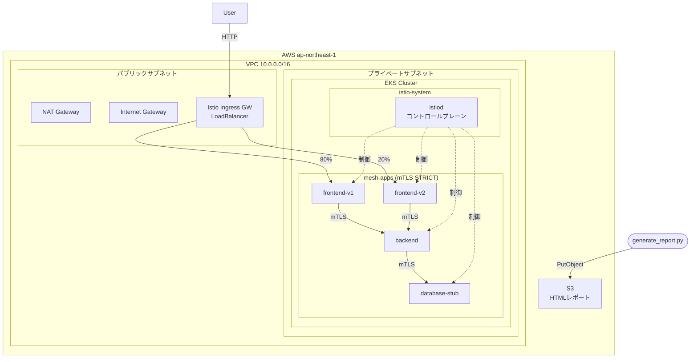

# ✅Phase 3 — アプリデプロイ・トラフィック制御・HTML観測レポート生成

## Phase 2 からの引き継ぎ確認

このフェーズを開始する前に、以下が完了していること:

```bash
# 確認コマンド
kubectl get pods -n istio-system          # 全Pod Running
kubectl get ns mesh-apps --show-labels    # istio-injection=enabled
kubectl get peerauthentication -A         # STRICT モード確認
kubectl get svc -n istio-system istio-ingressgateway  # EXTERNAL-IP 確認

export ISTIO_INGRESS_IP=$(kubectl get svc istio-ingressgateway \
  -n istio-system -o jsonpath='{.status.loadBalancer.ingress[0].hostname}')
export REPORT_BUCKET=$(cd terraform && terraform output -raw report_bucket_name)
```

## このフェーズのゴール

1. 3層サンプルアプリ（frontend / backend / database-stub）を mesh-apps にデプロイ
2. Istio のトラフィック制御（カナリアリリース・サーキットブレーカー）を設定
3. メッシュの状態を可視化する HTML レポートを生成し S3 にアップロード

---

## Step 1: サンプルアプリケーション

シンプルな Python Flask アプリを 3 つのサービスとして構成する。
本番相当の設計を意識し、`app` / `version` ラベルを必ず付与する。

### `k8s/apps/frontend/deployment.yaml`

```yaml
apiVersion: apps/v1
kind: Deployment
metadata:
  name: frontend-v1
  namespace: mesh-apps
  labels:
    app: frontend
    version: v1
    # Istio サービスメッシュの可視化に必要なラベル
spec:
  replicas: 2
  selector:
    matchLabels:
      app: frontend
      version: v1
  template:
    metadata:
      labels:
        app: frontend
        version: v1
    spec:
      containers:
        - name: frontend
          image: hashicorp/http-echo:latest
          args:
            - "-text=frontend-v1: Hello from Service Mesh!"
            - "-listen=:8080"
          ports:
            - containerPort: 8080
          resources:
            requests:
              cpu: 50m
              memory: 64Mi
            limits:
              cpu: 100m
              memory: 128Mi
          # ヘルスチェック設定
          livenessProbe:
            httpGet:
              path: /
              port: 8080
            initialDelaySeconds: 5
            periodSeconds: 10
          readinessProbe:
            httpGet:
              path: /
              port: 8080
            initialDelaySeconds: 3
            periodSeconds: 5
```

frontend-v2 の Deployment も同様に作成する（`text` を `frontend-v2` に変更）。

### `k8s/apps/frontend/service.yaml`

```yaml
apiVersion: v1
kind: Service
metadata:
  name: frontend
  namespace: mesh-apps
  labels:
    app: frontend
spec:
  selector:
    app: frontend  # v1/v2 両方を含む（バージョン選択はDestinationRuleで行う）
  ports:
    - name: http   # Istio はポート名を参照するため必須
      port: 80
      targetPort: 8080
```

### backend と database-stub も同様に作成する

- `backend`: port 8080, text "backend-v1: data from backend"
- `database-stub`: port 5432 → 8080 (http-echo で stub), text "db-stub: query result"

各サービスに対して Service マニフェストも作成。ポート名は `http` または `grpc` とする。

---

## Step 2: Istio トラフィック制御マニフェスト

### `k8s/istio/gateway.yaml`

```yaml
apiVersion: networking.istio.io/v1beta1
kind: Gateway
metadata:
  name: mesh-apps-gateway
  namespace: mesh-apps
spec:
  selector:
    istio: ingressgateway  # デフォルトの Istio Ingress Gateway を使用
  servers:
    - port:
        number: 80
        name: http
        protocol: HTTP
      hosts:
        - "*"  # ハンズオン環境のため全ホスト許可
```

### `k8s/istio/virtual-service.yaml`

```yaml
apiVersion: networking.istio.io/v1beta1
kind: VirtualService
metadata:
  name: frontend
  namespace: mesh-apps
spec:
  hosts:
    - frontend
    - "*"
  gateways:
    - mesh-apps-gateway
    - mesh  # クラスタ内部通信用
  http:
    # カナリアリリース: v2 に 20% のトラフィックを流す
    - route:
        - destination:
            host: frontend
            subset: v1
          weight: 80
        - destination:
            host: frontend
            subset: v2
          weight: 20
      # タイムアウトとリトライ設定
      timeout: 10s
      retries:
        attempts: 3
        perTryTimeout: 3s
        retryOn: gateway-error,connect-failure,retriable-4xx
```

### `k8s/istio/destination-rule.yaml`

```yaml
apiVersion: networking.istio.io/v1beta1
kind: DestinationRule
metadata:
  name: frontend
  namespace: mesh-apps
spec:
  host: frontend
  # サービス間通信に mTLS を強制する（PeerAuthenticationと連動）
  trafficPolicy:
    tls:
      mode: ISTIO_MUTUAL
    # サーキットブレーカー設定
    outlierDetection:
      consecutive5xxErrors: 3        # 3回連続5xxエラーでサーキットブレーク
      interval: 30s                  # 検出ウィンドウ
      baseEjectionTime: 30s          # 最小除外時間
      maxEjectionPercent: 50         # 最大除外割合（可用性確保）
  subsets:
    - name: v1
      labels:
        version: v1
    - name: v2
      labels:
        version: v2
```

backend、database-stub の DestinationRule も同様に作成する。

### `k8s/istio/traffic-policy/canary.yaml`

frontend の VirtualService でカナリアを 0% → 20% → 50% → 100% と段階的に切り替えるためのコメント付きマニフェスト（`weight` の値をコメントで段階説明）。

### `k8s/istio/traffic-policy/circuit-breaker.yaml`

サーキットブレーカーの動作確認用テスト手順のコメントを含む DestinationRule の別バリエーション（`consecutive5xxErrors: 1` に変更してテストしやすくしたバージョン）。

---

## Step 3: HTML 観測レポート生成スクリプト

`scripts/generate_report.py` を作成する。

### 要件

- Python 3.12 対応
- 依存ライブラリ: `boto3`, `kubernetes`（pip install）
- 収集する情報:
  1. EKS ノードステータス（Ready/NotReady 一覧）
  2. mesh-apps Namespace の Pod 一覧（STATUS, RESTARTS, AGE）
  3. Istio リソース一覧（VirtualService, DestinationRule, Gateway, PeerAuthentication）
  4. Istio mTLS 状態（`istioctl authn tls-check` の結果）
  5. カナリア重み設定（VirtualService から weight を抽出）
  6. サーキットブレーカー設定（DestinationRule から outlierDetection を抽出）

### HTML レポート設計

```python
#!/usr/bin/env python3
"""
Istio サービスメッシュ観測レポート生成スクリプト
EKS クラスタの状態と Istio 設定を HTML レポートとして S3 に保存する
"""

import subprocess
import json
import boto3
import datetime
from pathlib import Path

def collect_kubectl_data():
    """kubectl コマンドで必要なデータを収集する"""
    # kubectl get pods -n mesh-apps -o json
    # kubectl get pods -n istio-system -o json
    # kubectl get virtualservice -n mesh-apps -o json
    # kubectl get destinationrule -n mesh-apps -o json
    # kubectl get peerauthentication -n mesh-apps -o json
    # kubectl get nodes -o json

def generate_html_report(data: dict) -> str:
    """
    収集したデータを HTML レポートに変換する
    CSS はインラインで記述しブラウザ単体で表示可能にする
    """
    # HTML テンプレート設計:
    # - ヘッダー: プロジェクト名、生成日時、クラスタ名
    # - セクション1: クラスタ概要（ノード数、Pod数、Istio バージョン）
    # - セクション2: Pod 状態テーブル（色分け: Running=緑, Pending=黄, Error=赤）
    # - セクション3: Istio トラフィック制御設定
    #   - カナリア重み（v1: 80%, v2: 20% のビジュアルバー表示）
    #   - サーキットブレーカー設定値
    # - セクション4: mTLS 状態テーブル
    # - フッター: 生成スクリプト情報

def upload_to_s3(html_content: str, bucket_name: str) -> str:
    """
    HTML レポートを S3 にアップロードし署名付き URL を返す
    ファイル名: reports/YYYY-MM-DD-HH-MM/index.html
    署名付き URL の有効期限: 7日間
    """
    s3_client = boto3.client('s3', region_name='ap-northeast-1')
    timestamp = datetime.datetime.now().strftime('%Y-%m-%d-%H-%M')
    key = f"reports/{timestamp}/index.html"
    
    s3_client.put_object(
        Bucket=bucket_name,
        Key=key,
        Body=html_content.encode('utf-8'),
        ContentType='text/html; charset=utf-8',
    )
    
    # 署名付き URL を生成（7日間有効）
    url = s3_client.generate_presigned_url(
        'get_object',
        Params={'Bucket': bucket_name, 'Key': key},
        ExpiresIn=604800  # 7日 = 604800秒
    )
    return url

def main():
    import os
    bucket_name = os.environ.get('REPORT_BUCKET')
    if not bucket_name:
        raise ValueError("REPORT_BUCKET 環境変数が設定されていません")
    
    print("📊 メッシュ状態データを収集中...")
    data = collect_kubectl_data()
    
    print("📝 HTML レポートを生成中...")
    html = generate_html_report(data)
    
    print("☁️  S3 にアップロード中...")
    url = upload_to_s3(html, bucket_name)
    
    print(f"✅ レポート生成完了！")
    print(f"🔗 閲覧URL（7日間有効）: {url}")

if __name__ == "__main__":
    main()
```

HTML のスタイル要件:
- ダークテーマ（背景 `#0d1117`、テキスト `#e6edf3`）
- モノスペースフォント（コード部分）
- Pod ステータスの色分けバッジ
- カナリア重みを水平プログレスバーで表示
- レスポンシブ対応（モバイルでも閲覧可能）

---

## Step 4: cleanup スクリプト

`scripts/cleanup.sh` を作成する。

```bash
#!/bin/bash
# リソース全削除スクリプト
# 順序に注意: Kubernetes リソース → Istio → EKS → VPC → S3/DynamoDB
set -euo pipefail

echo "🧹 Kubernetes リソースを削除中..."
kubectl delete namespace mesh-apps --ignore-not-found

echo "🔧 Istio をアンインストール中..."
istioctl uninstall --purge -y
kubectl delete namespace istio-system --ignore-not-found

echo "🏗️  Terraform でAWSリソースを削除中..."
cd terraform
terraform destroy -auto-approve

echo "🗄️  Terraform バックエンドリソースを削除中..."
# S3バケットを空にしてから削除
BUCKET="istio-eks-tfstate-$(aws sts get-caller-identity --query Account --output text)"
aws s3 rm s3://${BUCKET} --recursive
aws s3 rb s3://${BUCKET}
aws dynamodb delete-table --table-name istio-eks-tfstate-lock --region ap-northeast-1

echo "✅ 全リソースの削除が完了しました"
```

---

## Step 5: README.md

プロジェクトルートに `README.md` を作成する。

内容:
1. プロジェクト概要（日本語）
2. アーキテクチャ図（Mermaid）:



3. 前提条件と使用ツールバージョン
4. セットアップ手順（Phase 1→2→3）
5. トラフィック制御デモ手順
6. コスト見積もり表
7. 参考リンク（Istio公式、EKSドキュメント）

---

## Step 6: docs/runbook/troubleshoot.md

トラブルシューティングランブックを作成する。

内容:
- Istio sidecar が inject されない場合の確認手順
- mTLS 接続失敗時のデバッグコマンド（`istioctl proxy-status`, `istioctl analyze`）
- カナリアが正しく動作しない場合の確認手順
- サーキットブレーカーの動作確認方法
- EKS ノードが NotReady になった場合の対応

---

## 実行手順

```bash
# 1. アプリケーションデプロイ
kubectl apply -f k8s/namespaces/
kubectl apply -f k8s/apps/
kubectl apply -f k8s/istio/

# 2. デプロイ確認
kubectl get pods -n mesh-apps
kubectl get svc -n mesh-apps

# 3. Istio 設定確認
istioctl analyze -n mesh-apps
kubectl get vs,dr,gw,pa -n mesh-apps

# 4. トラフィックテスト（カナリア確認）
# 10回リクエストして v1/v2 の比率を確認
for i in {1..10}; do
  curl -s http://${ISTIO_INGRESS_IP}/
done

# 5. mTLS 確認
istioctl authn tls-check frontend.mesh-apps.svc.cluster.local

# 6. HTML レポート生成
pip install boto3 kubernetes
python scripts/generate_report.py
```

---

## Phase 3 完了条件

- [ ] mesh-apps の全 Pod が `Running`（sidecar コンテナ含め 2/2）
- [ ] `curl http://${ISTIO_INGRESS_IP}` でレスポンスが返る
- [ ] `istioctl authn tls-check` で全サービスが `mTLS` 表示
- [ ] カナリア確認: 10リクエスト中 1〜3回が v2 レスポンス
- [ ] `generate_report.py` が S3 署名付き URL を出力する
- [ ] ブラウザで HTML レポートが正しく表示される
- [ ] `scripts/cleanup.sh` でリソースが全削除できる

## ポートフォリオとしての仕上げ

- [ ] `docs/adr/` に 3 つの ADR が揃っている
- [ ] README の Mermaid アーキテクチャ図が GitHub でレンダリングされる
- [ ] コード全体に日本語コメントで設計意図が記述されている
- [ ] `terraform fmt` と `terraform validate` が通る
- [ ] Ansible playbook が冪等（2回実行してもエラーなし）
- [ ] GitHub にプッシュして公開