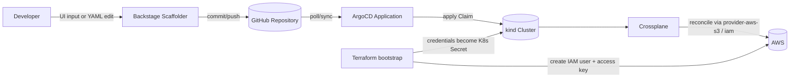
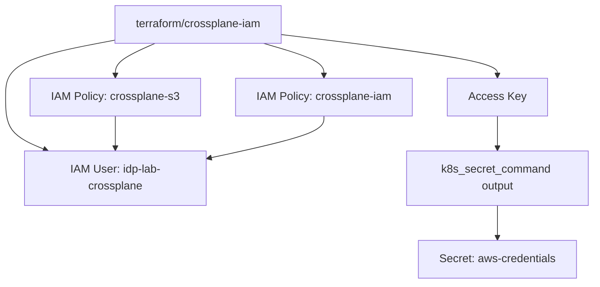
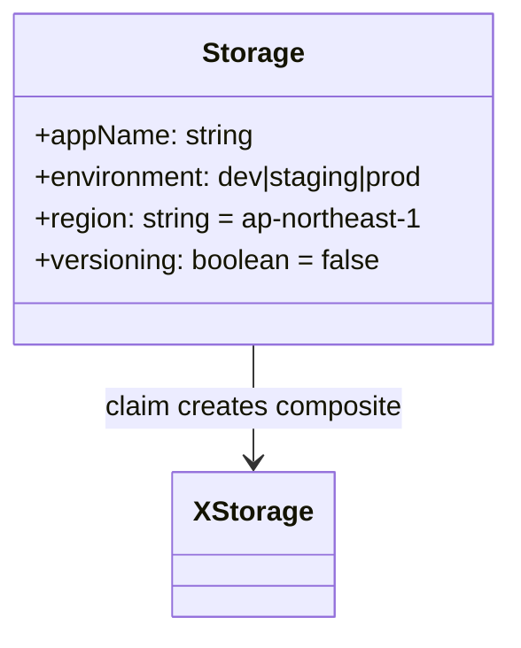
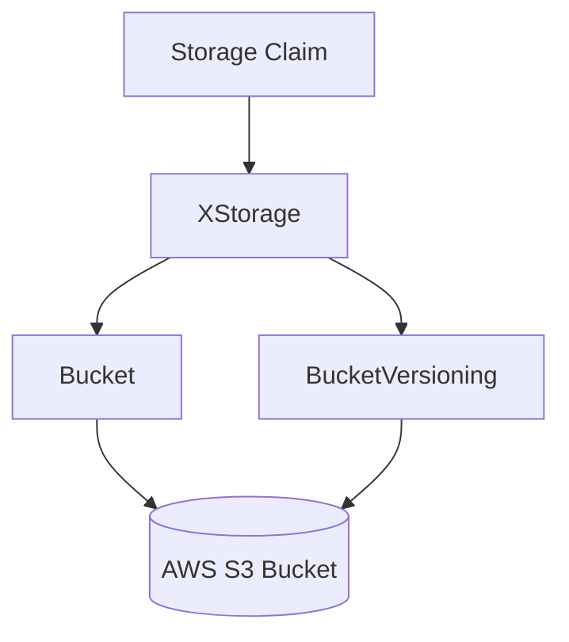
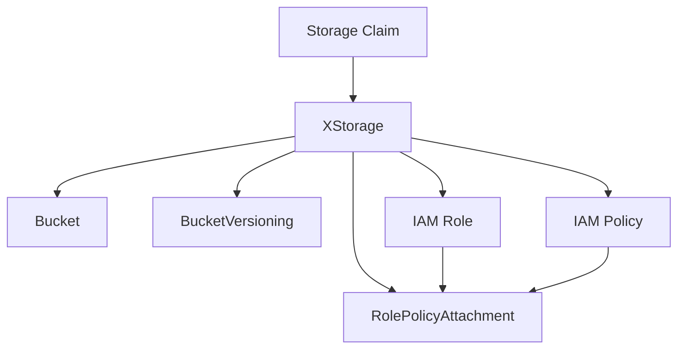
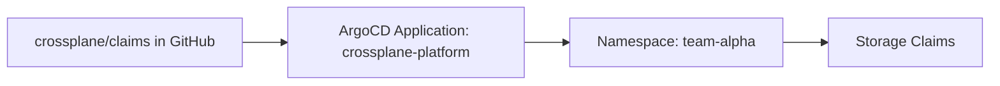
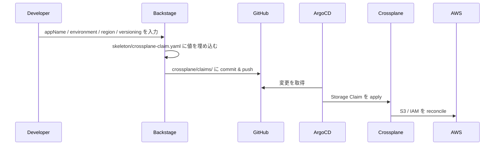
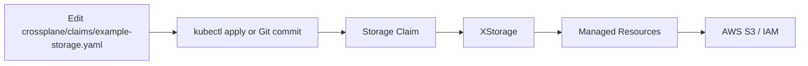
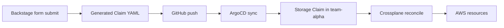
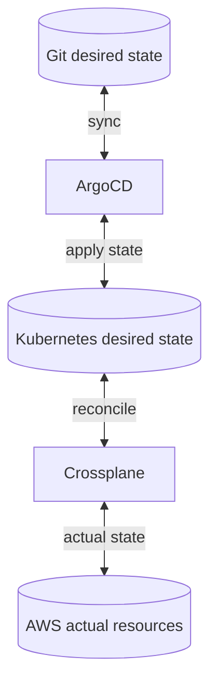

# ARCHITECTURE

`k8s-idp-lab` は、`Crossplane`・`ArgoCD`・`Backstage` を組み合わせて、AWS リソースを Git 経由でセルフサービス提供するための学習用 IDP（Internal Developer Platform）です。ローカル Kubernetes として `kind` を使い、AWS 側の初期権限だけを Terraform で用意し、その後のリソース作成は Crossplane に委譲します。

この文書は、README のハンズオン手順を補完する「実装ベースの理解ドキュメント」です。どのディレクトリが何を担い、どの YAML がどのリソースに変換され、どこで責務が切り替わるのかを、実ファイルに沿って整理しています。

## 1. 目的と設計思想

このプロジェクトが目指しているのは、次の状態です。

1. 開発者は AWS コンソールや `kubectl` を直接触らず、宣言だけで環境を要求できる。
2. Git を唯一の真実として、Kubernetes と AWS の状態を継続的に同期できる。
3. プラットフォームチームは、提供したい AWS リソースの作り方を `Composition` として標準化できる。

そのために、役割を次のように分離しています。

| レイヤー | 主な利用者 | 役割 |
|---|---|---|
| Backstage | 開発者 | フォーム入力から Claim YAML を生成する UI |
| Git / ArgoCD | 開発者・プラットフォーム | Git の変更を Kubernetes に自動同期する GitOps レイヤー |
| Crossplane | プラットフォーム | 開発者向け API を AWS リソースへ変換する制御レイヤー |
| Terraform | 管理者 | Crossplane が AWS API を叩くための初期 IAM 権限を準備する |
| AWS | 実行基盤 | 実際の S3 / IAM リソースが作成される先 |

## 2. 全体像



### 実際の責務分担

- `Terraform` は最初の一度だけ使い、Crossplane 用 IAM ユーザーとアクセスキーを作る。
- `Crossplane` は `Storage` Claim を受け、`Bucket` や `Role` などの Managed Resource を生成する。
- `ArgoCD` は `crossplane/claims/` を見て、Git 上の宣言をクラスターへ反映し続ける。
- `Backstage` は Claim YAML を人が手で書かなくても済むようにするフロントエンドで、必須コンポーネントではない。

## 3. リポジトリ構造

```text
.
├── README.md
├── ARCHITECTURE.md
├── kind-cluster.yaml
├── argocd/
│   ├── apps/
│   └── install/
├── backstage/
│   ├── app-config.yaml
│   └── templates/
├── crossplane/
│   ├── claims/
│   ├── compositions/
│   └── providers/
├── docs/
│   ├── architecture.md
│   ├── crossplane-guide.md
│   └── troubleshooting.md
└── terraform/
    ├── crossplane-iam/
    └── eks-cluster/
```

### ディレクトリごとの責務

| パス | 役割 | 主なファイル |
|---|---|---|
| `kind-cluster.yaml` | ローカル K8s クラスター定義 | kind 3 ノード構成、NodePort 公開設定 |
| `terraform/crossplane-iam/` | AWS 初期 IAM ブートストラップ | `main.tf`, `iam.tf`, `outputs.tf` |
| `crossplane/providers/` | Crossplane Provider の導入と認証 | `aws-provider.yaml`, `provider-config.yaml` |
| `crossplane/compositions/` | 開発者向け API と AWS リソース変換ロジック | XRD と Composition 群 |
| `crossplane/claims/` | 開発者が要求する具体的な環境宣言 | `example-storage.yaml` |
| `argocd/apps/` | GitOps 同期対象の定義 | `platform-app.yaml`, `argocd-nodeport.yaml` |
| `argocd/install/` | ArgoCD 導入手順の自動化 | `install.sh` |
| `backstage/` | Backstage の設定とテンプレート | `app-config.yaml`, `template.yaml` |
| `docs/` | 補助資料 | 操作ガイド、トラブルシューティング |

## 4. 実行環境

### kind クラスター

`kind-cluster.yaml` では `idp-lab` という 3 ノード構成の kind クラスターを定義しています。

| ノード | 役割 |
|---|---|
| `control-plane` | API Server / etcd / scheduler / controller-manager |
| `worker` | Crossplane, ArgoCD などのワークロード配置先 |
| `worker` | 将来の拡張や分散を意識した追加ワーカーノード |

### ホスト公開ポート

| ホストポート | 用途 | 定義元 |
|---|---|---|
| `30080` | ArgoCD UI | `kind-cluster.yaml` + `argocd/apps/argocd-nodeport.yaml` |
| `30443` | 将来の HTTPS/Ingress 用予約 | `kind-cluster.yaml` |
| `30000` | Backstage 用の予約ポート | `kind-cluster.yaml` |

注意点として、Backstage の `app-config.yaml` 自体は `http://localhost:3000` を前提にしており、kind の `30000` 公開は「Kubernetes に載せる場合を見越した予約」に近い扱いです。現状の README の手順では Backstage はローカル Node プロセスとして `3000` で起動します。

## 5. ブートストラップ層: Terraform

Crossplane は AWS に対して常時 reconcile を行うため、まず AWS API を呼べる認証情報が必要です。この初期権限だけは `terraform/crossplane-iam/` で作成します。

### 作成されるもの



### 主な実装ポイント

- [main.tf](/home/takuya/terraform-lab/k8s-idp-lab/terraform/crossplane-iam/main.tf) で `/crossplane/` パス配下の IAM ユーザー `idp-lab-crossplane` とアクセスキーを作成。
- [iam.tf](/home/takuya/terraform-lab/k8s-idp-lab/terraform/crossplane-iam/iam.tf) で S3 と IAM の最小権限ポリシーを定義。
- [outputs.tf](/home/takuya/terraform-lab/k8s-idp-lab/terraform/crossplane-iam/outputs.tf) で、Kubernetes Secret 登録用コマンド `k8s_secret_command` を生成。

### IAM 制約の考え方

| 対象 | 制約 |
|---|---|
| S3 | `arn:aws:s3:::idp-*` のバケットに限定 |
| IAM Role | `arn:aws:iam::*:role/crossplane/*` に限定 |
| IAM Policy | `arn:aws:iam::*:policy/crossplane/*` に限定 |
| 認証方式 | kind 環境のため OIDC ではなくアクセスキー方式 |

つまり Terraform は「プラットフォームが AWS に触るための鍵」を作る層であり、アプリ環境そのものは作りません。

## 6. 制御層: Crossplane

Crossplane はこのプロジェクトの中核です。実装は `providers`・`XRD`・`Composition`・`Claim` の 4 要素に分かれます。

### 6.1 Provider

`crossplane/providers/aws-provider.yaml` では、用途ごとに分割された Upbound Provider を 2 つ導入しています。

| Provider | 役割 |
|---|---|
| `provider-aws-s3` | S3 Bucket / BucketVersioning を管理 |
| `provider-aws-iam` | IAM Role / Policy / RolePolicyAttachment を管理 |

`crossplane/providers/provider-config.yaml` では `ProviderConfig` 名を `default` にし、`crossplane-system/aws-credentials` Secret を参照しています。Composition 側で `providerConfigRef` を明示していないため、`default` という共通設定を前提に運用している構成です。

### 6.2 API 定義: XRD

[s3-bucket-xrd.yaml](/home/takuya/terraform-lab/k8s-idp-lab/crossplane/compositions/s3-bucket-xrd.yaml) は、開発者向けの API 契約です。



この XRD で定義しているポイント:

- API グループは `idp.example.com/v1alpha1`
- Composite は `XStorage`
- 開発者が触る Claim は `Storage`
- 必須パラメータは `appName` と `environment`
- `appName` は `^[a-z][a-z0-9-]{2,30}$` に制限
- `environment` は `dev` / `staging` / `prod`
- `region` と `versioning` にはデフォルト値あり

### 6.3 実装: Composition

この XRD に対して、現在 2 種類の Composition 実装があります。

| Composition | 目的 | 生成リソース |
|---|---|---|
| `s3-storage` | 最小構成のストレージ提供 | `Bucket`, `BucketVersioning` |
| `app-environment` | ストレージ + 利用 IAM 権限の一括提供 | `Bucket`, `BucketVersioning`, `Role`, `Policy`, `RolePolicyAttachment` |

#### `s3-storage`

[s3-bucket-composition.yaml](/home/takuya/terraform-lab/k8s-idp-lab/crossplane/compositions/s3-bucket-composition.yaml) は最もシンプルな実装です。



主な変換ルール:

- `appName` + `environment` を結合して `crossplane.io/external-name = idp-<appName>-<environment>` を生成
- `region` を `spec.forProvider.region` に転送
- `environment` / `appName` を S3 タグへ転送
- `versioning: true|false` を `Enabled|Suspended` へ変換

#### `app-environment`

[app-environment-composition.yaml](/home/takuya/terraform-lab/k8s-idp-lab/crossplane/compositions/app-environment-composition.yaml) は、アプリがバケットを使うための IAM まで含めた実装です。



この Composition で追加されるもの:

- IAM ロール名: `idp-<appName>-<environment>-role`
- IAM ポリシー名: `idp-<appName>-<environment>-policy`
- IAM リソースのパス: `/crossplane/`
- ポリシーの許可先: `arn:aws:s3:::idp-<appName>-<environment>` とその配下オブジェクト

### 6.4 Claim

[example-storage.yaml](/home/takuya/terraform-lab/k8s-idp-lab/crossplane/claims/example-storage.yaml) は、開発者が直接書く最小例です。

```yaml
apiVersion: idp.example.com/v1alpha1
kind: Storage
spec:
  compositionRef:
    name: s3-storage
  parameters:
    appName: myapp
    environment: dev
    region: ap-northeast-1
    versioning: false
```

ここで重要なのは、開発者は「S3 バケットの正式な API 呼び出し」や「IAM の JSON ポリシー」を知らなくてよいことです。必要なのは、標準 API として定義された `parameters` だけです。

## 7. GitOps 層: ArgoCD

ArgoCD は `crossplane/claims/` ディレクトリを監視し、Git 上の Claim を kind クラスターに同期します。

### 構成

- [platform-app.yaml](/home/takuya/terraform-lab/k8s-idp-lab/argocd/apps/platform-app.yaml)
- [argocd-nodeport.yaml](/home/takuya/terraform-lab/k8s-idp-lab/argocd/apps/argocd-nodeport.yaml)
- [install.sh](/home/takuya/terraform-lab/k8s-idp-lab/argocd/install/install.sh)

### `Application` の意味



`platform-app.yaml` の設計ポイント:

- 同期対象は Git リポジトリの `crossplane/claims`
- 反映先はクラスター内 `team-alpha` namespace
- `automated.prune = true`
- `automated.selfHeal = true`
- `CreateNamespace=true`

この設定により、Git にある Claim は作成され、Git から消した Claim はクラスターからも削除され、クラスターで手動変更された内容は Git の状態へ戻されます。

## 8. 開発者入口: Backstage

Backstage はこの IDP のセルフサービス入口です。現状の実装は「Claim YAML を Git に追加する UI」に集中しています。

### 構成ファイル

- [app-config.yaml](/home/takuya/terraform-lab/k8s-idp-lab/backstage/app-config.yaml)
- [template.yaml](/home/takuya/terraform-lab/k8s-idp-lab/backstage/templates/aws-environment/template.yaml)
- [crossplane-claim.yaml](/home/takuya/terraform-lab/k8s-idp-lab/backstage/templates/aws-environment/skeleton/crossplane-claim.yaml)

### 処理フロー



### テンプレートでやっていること

1. `fetch:template` で雛形 YAML にフォーム値を埋め込む
2. `publish:github` で `crossplane/claims/` に commit & push
3. `catalog:register` を optional で実行する

Backstage はあくまで Claim 生成器であり、AWS リソースの作成そのものはしません。実際の作成責務は最後まで Crossplane 側にあります。

## 9. エンドツーエンドのリソース変換

### パターン A: 開発者が YAML を直接書く



### パターン B: Backstage からセルフサービス



### 具体例

入力:

```yaml
appName: myapp-takuya
environment: dev
region: ap-northeast-1
versioning: false
```

生成される主な AWS 名称:

| 種別 | 名前 |
|---|---|
| S3 Bucket | `idp-myapp-takuya-dev` |
| IAM Role | `idp-myapp-takuya-dev-role` |
| IAM Policy | `idp-myapp-takuya-dev-policy` |

## 10. 同期と自動修復

このプロジェクトは 2 種類の reconcile を重ねています。



### ArgoCD が直すもの

- クラスター上で消された Claim
- Git とずれた Kubernetes マニフェスト
- Git から削除されたオブジェクトの prune

### Crossplane が直すもの

- AWS コンソール上で手動変更された S3 バージョニングやタグ
- Claim / Composition の期待値と AWS 実体のズレ

つまり:

- ArgoCD は「Git と Kubernetes の差分」を直す
- Crossplane は「Kubernetes と AWS の差分」を直す

この二段構えが、このリポジトリのアーキテクチャ上のいちばん重要なポイントです。

## 11. セキュリティ設計

### 最小権限

Terraform 側で、Crossplane の権限を次のように絞っています。

- S3 は `idp-*` バケットだけ
- IAM は `/crossplane/` パス配下だけ
- Access Key は Kubernetes Secret に格納

### 命名規約で守っていること

- S3 バケットは `idp-<appName>-<environment>`
- IAM Role / Policy は `/crossplane/` パス配下
- 開発者の入力値は XRD と Backstage 両方でバリデーション

### 信頼境界

| 境界 | 意味 |
|---|---|
| 開発者 → Backstage | ユーザー入力 |
| Git → ArgoCD | 宣言的な desired state |
| Kubernetes → AWS | 実リソース変更の境界 |
| Terraform → Crossplane | 初期権限の受け渡し |

## 12. 現在の設計上の前提と制約

このプロジェクトは学習用として意図的にシンプルにしているため、いくつか前提があります。

| 項目 | 現状 |
|---|---|
| クラスター | ローカル kind 固定 |
| 認証 | アクセスキー方式 |
| Backstage DB | `:memory:` の SQLite |
| ArgoCD repoURL | ユーザーごとに書き換え前提 |
| namespace | `team-alpha` に固定 |
| ProviderConfig | `default` 1 つを共有 |

本番向けに広げるなら、EKS、IRSA/OIDC、複数 team namespace、Secret 管理の強化、Backstage の永続 DB 化などが次の論点になります。

## 13. 実装を読む順番

初めて触る人には、次の順で追うと理解しやすいです。

1. [README.md](/home/takuya/terraform-lab/k8s-idp-lab/README.md): 何を作るハンズオンかを掴む
2. [crossplane/compositions/s3-bucket-xrd.yaml](/home/takuya/terraform-lab/k8s-idp-lab/crossplane/compositions/s3-bucket-xrd.yaml): 開発者 API を理解する
3. [crossplane/compositions/s3-bucket-composition.yaml](/home/takuya/terraform-lab/k8s-idp-lab/crossplane/compositions/s3-bucket-composition.yaml): 最小構成の変換ルールを読む
4. [crossplane/compositions/app-environment-composition.yaml](/home/takuya/terraform-lab/k8s-idp-lab/crossplane/compositions/app-environment-composition.yaml): IAM 付き構成へ拡張された実装を読む
5. [argocd/apps/platform-app.yaml](/home/takuya/terraform-lab/k8s-idp-lab/argocd/apps/platform-app.yaml): GitOps の同期対象を確認する
6. [backstage/templates/aws-environment/template.yaml](/home/takuya/terraform-lab/k8s-idp-lab/backstage/templates/aws-environment/template.yaml): 開発者体験の入口を確認する
7. [terraform/crossplane-iam/iam.tf](/home/takuya/terraform-lab/k8s-idp-lab/terraform/crossplane-iam/iam.tf): AWS 権限境界を確認する

## 14. まとめ

このプロジェクトは「開発者が要求を書く」「GitOps がクラスターへ届ける」「Crossplane が AWS へ変換する」という 3 段階の責務分離で成り立っています。

- 開発者の API は `Storage Claim`
- プラットフォーム実装は `Composition`
- 同期は `ArgoCD`
- 実リソース制御は `Crossplane`
- 初期権限だけ `Terraform`

そのため、このリポジトリを理解する鍵は「YAML の量」ではなく「どのレイヤーで何が責務を持つか」を見抜くことです。`ARCHITECTURE.md` を起点にコードを辿れば、Backstage から AWS までの流れを一続きで追えるようになっています。
