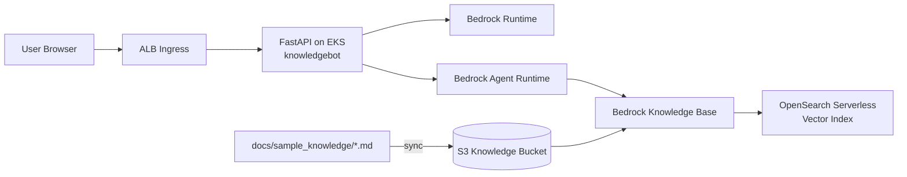
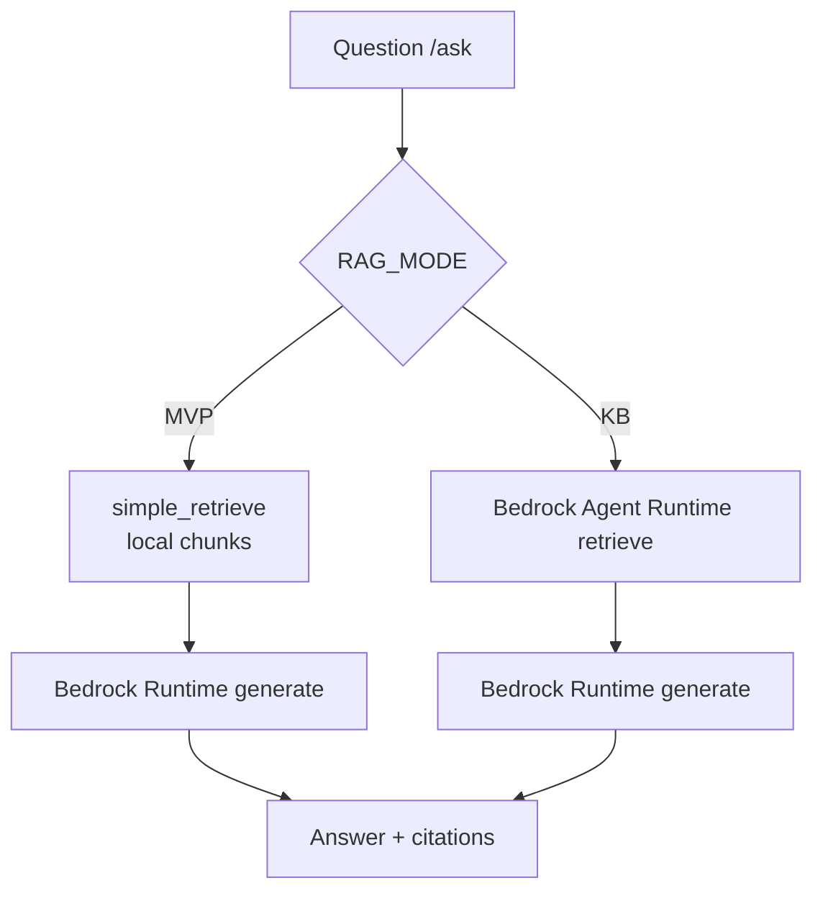
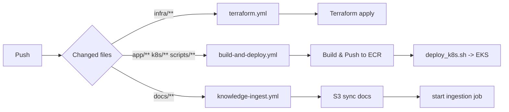
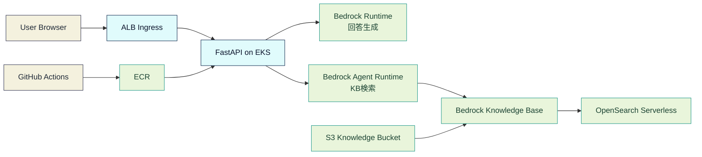
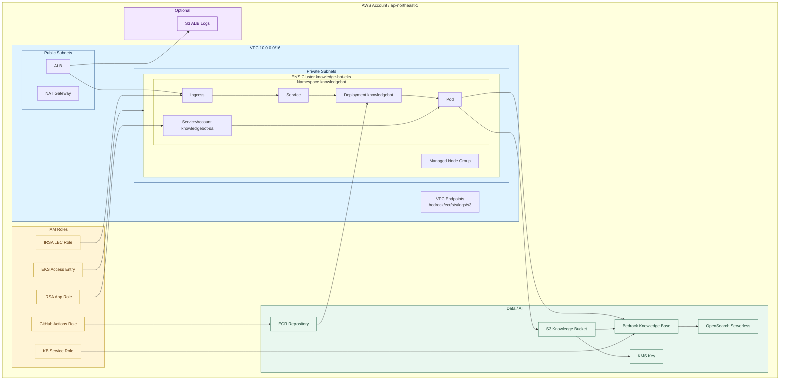
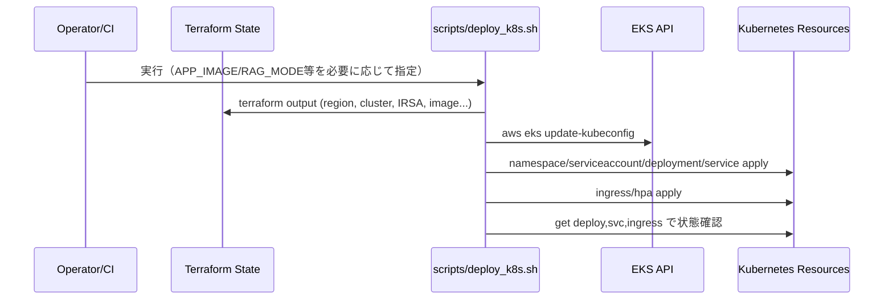
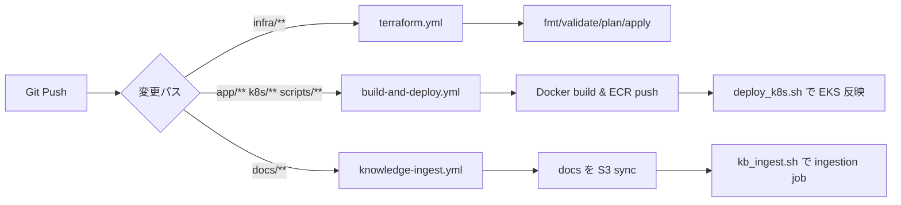

# Knowledge Bot

FastAPI + Amazon Bedrock Knowledge Bases を使った社内ナレッジ Q&A アプリです。  
ローカル実行（UI/API）と、Terraform + EKS でのデプロイを想定しています。

## クイックスタート（初回3コマンド）

```bash
cd app
python3 -m venv .venv && source .venv/bin/activate && pip install -r requirements.txt
uvicorn src.main:app --host 0.0.0.0 --port 8000 --reload
```

注意:
- `uvicorn src.main:app ...` は `app/` ディレクトリで実行してください（リポジトリルートで実行すると `ModuleNotFoundError: No module named 'src'` になります）

起動後:
- UI: `http://localhost:8000/`
- API Docs: `http://localhost:8000/docs`

KB モードで使う場合は、起動前に以下を設定:

```bash
export RAG_MODE=KB
export KNOWLEDGE_BASE_ID="<your-kb-id>"
export AWS_REGION="ap-northeast-1"
export BEDROCK_MODEL_ID="anthropic.claude-3-5-sonnet-20240620-v1:0"
```

## 構成

- `app/`: FastAPI アプリ
- `docs/sample_knowledge/`: ナレッジ原文（KB 取り込み元）
- `infra/`: AWS インフラ（Terraform）
- `k8s/`: Kubernetes マニフェスト
- `scripts/`: ビルド/デプロイ/取り込み補助スクリプト

`app/` のUI関連ファイル:
- `src/templates/index.html`: 画面テンプレート
- `src/static/style.css`: スタイル
- `src/static/app.js`: フロント側の `/ask` 呼び出し処理

## 全体像（図解）

### 1. システム全体マップ



### 2. モード別の回答経路



### 3. 変更内容ごとのパイプライン



### 4. AWS詳細構成図（Terraform実装ベース）

#### 4-1. 処理フロー（ユーザー操作から回答生成まで）



#### 4-2. AWSリソース配置（どこに何があるか）



EKS 部分の読み方:
- ALB から `Ingress -> Service -> Deployment -> Pod` の順でトラフィックが流れます。
- `ServiceAccount knowledgebot-sa` に IRSA ロールを紐づけ、Pod はその権限で Bedrock を呼びます。
- CI は ECR に push したイメージを Deployment に反映してロールアウトします。
- `Managed Node Group` は EKS ワーカーノード用の EC2 群です（この構成では `t3.medium`）。

## 仕組み詳細（アーキテクチャ）

### 全体像

```text
[User Browser]
   |  HTTP (/, /ask)
   v
[FastAPI app (app/src/main.py)]
   |-- MVP mode: local chunks (rag_mvp.py) + Bedrock Runtime(Claude)
   |
   `-- KB mode: Bedrock Agent Runtime retrieve (rag_kb.py)
               + Bedrock Runtime generate (Claude)

KB data path:
docs/sample_knowledge/*.md -> S3 knowledge bucket -> Bedrock Knowledge Base
          -> OpenSearch Serverless vector index
```

### アプリのリクエスト処理

`app/src/main.py` のエンドポイントは次の2つです。

- `GET /`: ブラウザUIを返す（質問入力、回答表示、引用表示）
- `POST /ask`: 質問を受けて回答生成するコアAPI

`POST /ask` の処理は `RAG_MODE` で分岐します。

1. `MVP` モード（デフォルト）
- `rag_mvp.py` の `simple_retrieve()` で、アプリ内のダミーチャンクを単純スコアリング
- ヒットしたチャンクをコンテキスト化し、Bedrock Runtime の Claude に問い合わせ
- 回答本文と引用（source/section）を返却

2. `KB` モード
- `rag_kb.py` の `retrieve()` で Bedrock Agent Runtime `retrieve` を実行
- 上位スニペットをコンテキストにして Bedrock Runtime で回答生成
- S3 URI 由来の引用情報を整形して返却

MVP と KB の違い（検索部分）:

| 観点 | MVPモード | KBモード |
|---|---|---|
| 検索方式 | アプリ内の簡易スコアリング検索 | Bedrock Knowledge Base のベクトル検索 |
| 検索に使う基盤 | アプリ内ダミーチャンク | S3 + 埋め込み + OpenSearch Serverless |
| Bedrock Agent Runtime | 使わない | 使う（`Retrieve`） |
| Bedrock Runtime | 使う（回答生成） | 使う（回答生成） |
| 向いている用途 | ローカル検証・最小構成 | 本番運用・実ドキュメント検索 |

### Bedrock Runtime と Agent Runtime の違い

- Bedrock Runtime
  - 役割: 生成モデルを直接呼び、回答テキストを作る
  - 代表API: `InvokeModel`

- Bedrock Agent Runtime
  - 役割: Knowledge Base から関連情報を取得する
  - 代表API: `Retrieve`, `RetrieveAndGenerate`

このプロジェクトでは両方を利用します。
- KBモード: `Agent Runtime` で検索し、`Runtime` で最終回答を生成
- MVPモード: `Runtime` のみで回答生成

### 埋め込みモデルと回答生成モデルの違い

このプロジェクトでは、モデルを2種類に分けて使います。

- 埋め込みモデル（検索用）
  - 役割: ドキュメント/質問をベクトル化して類似検索を行う
  - 利用箇所: Bedrock Knowledge Base
  - 現在の設定: `amazon.titan-embed-text-v2:0`（`infra/bedrock_kb.tf`）

- 回答生成モデル（生成用）
  - 役割: 検索で得たコンテキストを使って自然文の回答を生成する
  - 利用箇所: アプリの `POST /ask`
  - 設定値: `BEDROCK_MODEL_ID`（デフォルト: Claude 3.5 Sonnet）

### ナレッジ取り込みフロー（docs -> KB）

`docs/sample_knowledge/` 更新時は `knowledge-ingest.yml` が動き、以下を実施します。

1. `terraform output` で `knowledge_bucket` を取得
2. `aws s3 sync ../docs s3://<bucket>/docs/ --delete`
3. `scripts/kb_ingest.sh` で Bedrock ingestion job を開始

その結果、Knowledge Base が埋め込みを生成し、OpenSearch Serverless のベクトルインデックスへ反映します。

### Terraform が作る主なAWSリソース

- ネットワーク/実行基盤
- VPC（public/private subnet, NAT）
- EKS クラスタ（managed node group）
- ECR リポジトリ（アプリイメージ）

- RAG/データ基盤
- S3 knowledge bucket（KMS暗号化）
- OpenSearch Serverless collection（VECTORSEARCH）
- OpenSearch index（`knn_vector` マッピング）
- Bedrock Knowledge Base + S3 data source

- 認証/権限
- IRSA ロール（アプリPodから Bedrock API 呼び出し）
- KB用IAMロール（Bedrockが S3/AOSS/KMS にアクセス）
- GitHub OIDC provider + CI用IAMロール（GitHub Actions からAWS操作）

- 周辺
- ALBログ用S3バケット
- VPC Endpoint（Bedrock/ECR/STS/Logs/S3等）

### Kubernetes デプロイの流れ

`scripts/deploy_k8s.sh` は「Terraformで作った値」を使って、Kubernetesマニフェストへ実値を注入してから適用します。  
単に `kubectl apply` するだけでなく、IRSA・画像タグ・ConfigMap/Secret を組み立てるのが主目的です。

シーケンス図:



事前に参照する Terraform output:
- `region`, `cluster_name`
- `irsa_app_role_arn`
- `app_image`（または `APP_IMAGE` で上書き）
- `knowledge_base_id`（KB利用時）
- `alb_logs_bucket`

実行ステップ（順序）:
1. `aws eks update-kubeconfig` で対象EKSクラスタに接続
2. `namespace.yaml` を適用
3. `serviceaccount.yaml` の `REPLACE_WITH_IRSA_APP_ROLE_ARN` を置換して適用
4. `configmap.yaml` に `RAG_MODE`, `KNOWLEDGE_BASE_ID`, `BEDROCK_MODEL_ID` などを注入して適用
5. `secret-app.yaml`（`knowledgebot-secrets`）を作成/更新
6. `deployment.yaml` の `REPLACE_WITH_ECR_IMAGE` を置換して適用
7. `service.yaml` を適用
8. `ingress.yaml` に ALBログ設定を必要に応じて注入して適用
9. `hpa.yaml` と `pdb.yaml` を適用
10. `kubectl get deploy,svc,ingress,pdb` で状態確認

このスクリプトで担保しているポイント:
- Bedrock呼び出しに必要なIRSAをServiceAccountに確実に紐付け
- CIでビルドしたイメージを `APP_IMAGE` 経由でそのまま反映可能
- ConfigMap/Secret でアプリ設定をマニフェスト本体から分離
- Readiness/Liveness/Startup Probe は `/healthz` を使用
- `resources requests/limits` でPodのリソース境界を明示
- RollingUpdate（`maxUnavailable: 0`）で無停止に近い更新を実現
- PDB で voluntary disruption 時の最低可用性を確保

`deploy_k8s.sh` 実行時に使える主な上書き環境変数:
- `APP_IMAGE`: デプロイするコンテナイメージを強制指定（未指定時は Terraform output `app_image`）
- `RAG_MODE`: `MVP` / `KB`（未指定時 `MVP`）
- `BEDROCK_MODEL_ID`: 利用モデルID（未指定時 Claude 3.5 Sonnet）
- `KB_MODEL_ARN`: `knowledgebot-secrets` に注入する互換用値

内部で実施しているテンプレート置換:
- `k8s/base/configmap.yaml`: `AWS_REGION`, `RAG_MODE`, `BEDROCK_MODEL_ID`, `KNOWLEDGE_BASE_ID`
- `k8s/base/serviceaccount.yaml`: `REPLACE_WITH_IRSA_APP_ROLE_ARN`
- `k8s/base/deployment.yaml`: `REPLACE_WITH_ECR_IMAGE`
- `k8s/base/ingress.yaml`: ALB access logs annotation（条件付き）

よくある失敗要因:
- `terraform output` が未作成（`terraform apply` 前）
- `AWS_ROLE_TO_ASSUME` や OIDC trust policy 不整合でCIがAWS認証に失敗

Kubernetes マニフェストの役割:
- `namespace.yaml`: `knowledgebot` 名前空間を作成
- `serviceaccount.yaml`: IRSAロールを紐づけるServiceAccount
- `configmap.yaml`: 非機密設定（`RAG_MODE`, `BEDROCK_MODEL_ID` など）
- `secret-app.yaml`: 機密設定（`KB_MODEL_ARN` など）
- `deployment.yaml`: Pod本体、Probe、resources、RollingUpdate戦略
- `service.yaml`: Cluster内公開（port 80 -> 8080）
- `ingress.yaml`: ALB公開、必要時OIDC認証
- `hpa.yaml`: CPU利用率ベースの水平スケール
- `pdb.yaml`: ノードメンテ時などの可用性下限を維持

デプロイ後の確認コマンド:

```bash
kubectl -n knowledgebot get deploy,rs,pods,svc,ingress,hpa,pdb
kubectl -n knowledgebot describe deploy knowledgebot
kubectl -n knowledgebot logs deploy/knowledgebot --tail=100
kubectl -n knowledgebot get events --sort-by=.lastTimestamp | tail -n 30
```

更新時の運用パターン:
1. アプリコード変更（`app/**`）: `make build-push` -> `make deploy`
2. K8s設定変更（`k8s/**`）: `make deploy`
3. ナレッジ更新（`docs/**`）: `make kb-ingest`
4. インフラ変更（`infra/**`）: Terraform apply 後に必要なら `make deploy`

ロールバックの基本:
```bash
kubectl -n knowledgebot rollout history deploy/knowledgebot
kubectl -n knowledgebot rollout undo deploy/knowledgebot
```

### CI/CD の役割分担

このリポジトリは「インフラ」「アプリ配備」「ナレッジ投入」を別ワークフローに分離しています。

シーケンス図:



`terraform.yml`（インフラ担当）
- トリガー: `infra/**` 変更時
- 処理: `terraform init` -> `fmt` -> `validate` -> (`plan` or `apply`)
- 目的: AWS基盤（VPC/EKS/ECR/KB/IAMなど）の状態をコードに同期

`build-and-deploy.yml`（アプリ配備担当）
- トリガー: `app/**`, `k8s/**`, `scripts/**` 変更時
- 処理: ECRログイン -> Docker build/push（タグ: `github.sha`） -> `APP_IMAGE=<pushed-image> bash scripts/deploy_k8s.sh` でEKS反映
- 目的: アプリ変更をコンテナ化してクラスターにデプロイ

`knowledge-ingest.yml`（ナレッジ投入担当）
- トリガー: `docs/**` 変更時
- 処理: `docs/` を S3 knowledge bucket に同期 -> `scripts/kb_ingest.sh` で Bedrock ingestion job 開始
- 目的: ドキュメント更新をKB検索インデックスへ反映

運用上の意図:
- `infra` 変更と `app` 変更を分離し、失敗時の切り分けを簡単にする
- `docs` 変更だけで再インデックスできるため、アプリ再デプロイを不要にする
- それぞれの責務が明確なため、レビュー観点（IaC / App / Knowledge）を分けられる

### セキュリティ上の要点

- アプリは IRSA を使い、Podに長期AWSキーを持たせない構成
- ナレッジS3は KMS 暗号化・Public Access Block を有効化
- KB ロールに KMS `Decrypt` を明示付与
- GitHub Actions は OIDC で AWS ロールを引き受ける構成
- CI IAMは `*:*` ではなく、このプロジェクトで使うAWSサービス群に限定

### IAM 全体像

このプロジェクトでは、用途ごとにIAMロールを分離しています。

1. アプリ実行ロール（IRSA）
- 対象: `knowledgebot` namespace の `knowledgebot-sa`
- 用途: アプリPodから Bedrock Runtime / Bedrock Agent Runtime を呼び出す
- 定義: `infra/irsa_app.tf`

2. Bedrock Knowledge Base 実行ロール
- 対象: `bedrock.amazonaws.com` が Assume
- 用途: S3ナレッジ読取、AOSSアクセス、埋め込みモデル呼び出し、KMS復号
- 定義: `infra/bedrock_kb.tf`, `infra/kms.tf`

3. AWS Load Balancer Controller ロール（`enable_lbc=true` のとき）
- 対象: `kube-system/aws-load-balancer-controller` ServiceAccount
- 用途: ALB/NLB 関連リソースの作成・更新
- 定義: `infra/irsa_lbc.tf`, `infra/lbc_iam_policy.json`

4. GitHub Actions CI ロール（OIDC）
- 対象: `repo:<owner>/<repo>:*`（`github_repository` で制御）
- 用途: Terraform apply、ECR push、EKS deploy などCI/CD処理
- 定義: `infra/github_oidc_ci.tf`

5. EKS 管理アクセス（人/運用ロール）
- 対象: `eks_admin` ロール + 任意の SSO 管理ロール
- 用途: `aws_eks_access_entry` / `aws_eks_access_policy_association` によるクラスタ管理権限付与
- 定義: `infra/eks_admin_role.tf`

運用メモ:
- `sso_admin_role_arn` には `assumed-role` ではなく `iam::...:role/...` 形式を設定
- `github_repository` は必ず実リポジトリ名（`owner/repo`）に更新

### 現状の注意点（実装に基づく）

- `infra/github_oidc_ci.tf` は `var.github_repository` を参照するため、`infra/envs/dev.tfvars` などで `owner/repo` を指定する必要あり
- Claudeモデル利用には、AWSアカウントで Anthropic use case details 提出が必要

## 前提条件

- Python 3.12
- AWS 認証情報（`aws configure` など）
- Bedrock 利用可能リージョン（既定: `ap-northeast-1`）
- KB モード利用時: Bedrock Knowledge Base 作成済み

重要:
- Anthropic モデル（例: Claude 3.5 Sonnet）を使う場合、AWS アカウントで `use case details` 提出が必要です。未提出だと `ResourceNotFoundException` で失敗します。

## 動作確認バージョン（目安）

- Python: `3.12.x`
- Terraform: `1.8+`（`terraform -version`）
- kubectl: `1.29+`（EKSクラスタバージョンに合わせる）
- AWS CLI: `2.x`

確認コマンド:

```bash
python3 --version
terraform -version
kubectl version --client
aws --version
```

## 本番導入ランブック（Terraform実行から本番確認まで）

この章は「最初の1回」を時系列で実施するための手順です。  
実行ディレクトリはリポジトリルート（`knowledge-bot/`）を想定します。

### 0. 事前設定（tfvars）

`infra/envs/dev.tfvars` を編集:

```hcl
github_repository = "your-org/knowledge-bot"
```

### 1. Terraform 初期化と適用

```bash
make tf-init
terraform -chdir=infra validate
terraform -chdir=infra apply -var-file=envs/dev.tfvars -auto-approve
```

補足（LBCを使う場合の推奨順序）:
1. 初回は `enable_lbc=false` で EKS クラスタ本体を先に作成
2. `aws eks update-kubeconfig --region ap-northeast-1 --name knowledge-bot-eks` を実行し、`kubectl get ns` が通ることを確認
3. `enable_lbc=true` に変更して再度 `terraform apply`

### 2. Terraform 出力値の確認

```bash
make tf-output
```

確認ポイント:
- `cluster_name`
- `ecr_repo_url`
- `irsa_app_role_arn`
- `knowledge_base_id`（KB利用時）

### 3. アプリイメージのビルドとECR push

```bash
make build-push
```

特定タグを使う場合:

```bash
./scripts/build_push_ecr.sh <tag>
```

### 4. EKS へデプロイ

```bash
make deploy
```

KBモードでデプロイする場合:

```bash
RAG_MODE=KB make deploy
```

CIで作ったイメージを指定してデプロイする場合:

```bash
APP_IMAGE="<account>.dkr.ecr.<region>.amazonaws.com/knowledge-bot/app:<tag>" make deploy
```

### 5. デプロイ後の状態確認

```bash
kubectl -n knowledgebot get deploy,svc,ingress,pods
kubectl -n knowledgebot rollout status deploy/knowledgebot
```

### 6. ナレッジ取り込み（docs -> KB）

まず docs を S3 へアップロード:

```bash
./scripts/upload_knowledge.sh
```

このコマンドは `docs/` 配下を再帰的に同期するため、現在の運用ディレクトリである `docs/sample_knowledge/` も対象です。

差分削除もしたい場合:

```bash
./scripts/upload_knowledge.sh --delete
```

続けて KB ingestion を開始（デフォルトは完了まで待機し、進捗を表示）:

```bash
make kb-ingest
```

待機せずにジョブ開始だけしたい場合:

```bash
./scripts/kb_ingest.sh --no-wait
```

### 7. 本番動作確認（UI/API）

1. Ingress のURLにブラウザでアクセス
2. UIで質問を送信して回答と引用が返ることを確認
3. ヘルスチェック: `/healthz`

API確認例:

```bash
curl -s -X POST http://<ingress-host>/ask \
  -H "Content-Type: application/json" \
  -d '{"question":"VPN 接続方法を教えて"}'
```

### 8. 環境削除（Terraform destroy）

必ず `apply` と同じ `tfvars` を指定して実行します。

```bash
terraform -chdir=infra destroy -var-file=envs/dev.tfvars -auto-approve
```

注意:
- `terraform destroy` だけで実行すると、変数がデフォルト評価になり、削除漏れや依存残りの原因になります
- 削除は 10-30分以上かかる場合があります（NAT Gateway / ALB ENI 削除待ち）
- `destroy` 前に `enable_lbc` などの値を変更しないでください（`apply` 時と同じ `tfvars` のまま実行）

S3 が `BucketNotEmpty` で失敗する場合（バージョン/削除マーカー含め削除）:

```bash
BUCKET="knowledge-bot-<account-id>-ap-northeast-1-knowledge"

aws s3api list-object-versions --bucket "$BUCKET" --output json \
| jq '{Objects: [(.Versions[]? | {Key, VersionId}), (.DeleteMarkers[]? | {Key, VersionId})], Quiet: true}' \
| aws s3api delete-objects --bucket "$BUCKET" --delete file:///dev/stdin
```

ECR が `RepositoryNotEmpty` で失敗する場合:

```bash
REPO="knowledge-bot/app"

# 1) manifest list を含む全imageIdを取得
aws ecr list-images --repository-name "$REPO" --query 'imageIds[*]' --output json > /tmp/ecr-image-ids.json

# 2) 一括削除（空配列ならスキップ）
if [ "$(cat /tmp/ecr-image-ids.json)" != "[]" ]; then
  aws ecr batch-delete-image --repository-name "$REPO" --image-ids file:///tmp/ecr-image-ids.json
fi
```

## ローカル起動

### 1. 依存インストール

```bash
cd app
python3 -m venv .venv
source .venv/bin/activate
pip install -r requirements.txt
```

### 2. MVP モードで起動（既定）

```bash
uvicorn src.main:app --host 0.0.0.0 --port 8000 --reload
```

アクセス:
- UI: `http://localhost:8000/`
- API Docs: `http://localhost:8000/docs`

### 3. KB モードで起動

```bash
export RAG_MODE=KB
export KNOWLEDGE_BASE_ID="<your-kb-id>"
export AWS_REGION="ap-northeast-1"
export BEDROCK_MODEL_ID="anthropic.claude-3-5-sonnet-20240620-v1:0"

uvicorn src.main:app --host 0.0.0.0 --port 8000 --reload
```

### 4. UIで動作確認

ローカル実行時:
1. `http://localhost:8000/` を開く
2. 質問を入力して `送信する` を押す（`Ctrl+Enter` / `Cmd+Enter` でも送信可）
3. 回答欄に回答、引用欄に参照元が表示されることを確認
4. エラー時は回答欄に赤字メッセージが表示される

ヘルスチェック（任意）:
- `http://localhost:8000/healthz` で `{"status":"ok"}` を確認

EKSデプロイ済みの場合:
- `localhost:8000` の代わりに Ingress のURLで同じ手順を実施

## API 例

```bash
curl -s -X POST http://localhost:8000/ask \
  -H "Content-Type: application/json" \
  -d '{"question":"VPN 接続方法を教えて"}'
```

## Docker 実行

```bash
cd app
docker build -t knowledge-bot:local .
docker run --rm -p 8080:8080 \
  -e AWS_REGION=ap-northeast-1 \
  -e RAG_MODE=MVP \
  knowledge-bot:local
```

アクセス:
- `http://localhost:8080/`

## Terraform / デプロイ

よく使うコマンド:

```bash
make tf-init
make tf-apply
make tf-output
make build-push
make deploy
make kb-ingest
```

ナレッジ同期系:

```bash
./scripts/upload_knowledge.sh
./scripts/kb_ingest.sh
```

`infra/envs/dev.tfvars` の例:

```hcl
github_repository = "your-org/knowledge-bot"
```

対応スクリプト:
- `scripts/build_push_ecr.sh`: ECR へイメージ push
- `scripts/deploy_k8s.sh`: EKS へマニフェスト適用
- `scripts/upload_knowledge.sh`: `docs/` を S3 knowledge bucket に同期
- `scripts/kb_ingest.sh`: KB ingestion job 実行（進捗ポーリング対応）

## トラブルシュート（よくあるエラー）

- `Kubernetes cluster unreachable: the server has asked for the client to provide credentials`
  - `aws sso login --profile <profile>` で再ログイン
  - `aws eks update-kubeconfig --region ap-northeast-1 --name knowledge-bot-eks`
  - `kubectl get ns` で認証確認

- `Unexpected attribute: enable_lbc is not expected here`（IDE表示）
  - Terraform 実行が成功していれば、IDEの Terraform 拡張が古い可能性があります
  - `infra/variables.tf` に `variable "enable_lbc"` があることを確認し、拡張の再読み込みを実施

- `ValidationException ... dataSourceId ... [0-9a-zA-Z]{10}`
  - `scripts/kb_ingest.sh` は複数ID文字列から先頭の有効IDを自動抽出する実装です
  - `terraform output data_source_id` の値を確認し、必要なら state/output を整理してください

- `CrashLoopBackOff` / Pod起動失敗
  - `kubectl -n knowledgebot describe pod <pod-name>`
  - `kubectl -n knowledgebot logs <pod-name> --previous`
  - `kubectl -n knowledgebot get configmap knowledgebot-config -o yaml`
  - `kubectl -n knowledgebot get secret knowledgebot-secrets -o yaml`

- Ingress が作成されない / ADDRESS が空のまま
  - `kubectl -n knowledgebot describe ingress knowledgebot`
  - `kubectl -n kube-system get pods | grep -i aws-load-balancer-controller`
  - `kubectl -n kube-system logs deploy/aws-load-balancer-controller --tail=100`

- KB ingestion が失敗する
  - `./scripts/kb_ingest.sh --no-wait` で JOB ID を取得
  - `aws bedrock-agent get-ingestion-job --region <region> --knowledge-base-id <kb-id> --data-source-id <ds-id> --ingestion-job-id <job-id>`
  - `./scripts/upload_knowledge.sh --delete` 後に再実行

- `terraform destroy` で止まる（S3/ECR/Subnet）
  - `BucketNotEmpty`: バージョン/削除マーカーを含めてS3を空にする
  - `RepositoryNotEmpty`: ECRイメージ（manifest list含む）を先に削除する
  - `DependencyViolation (subnet)`: `describe-network-interfaces` で残存ENI（多くはALB）を特定して削除する

## GitHub Actions

- `terraform.yml`: `infra/**` 変更時に `fmt/validate/plan/apply`
- `build-and-deploy.yml`: `app/**`, `k8s/**`, `scripts/**` 変更時に build & EKS deploy
- `knowledge-ingest.yml`: `docs/**` 変更時に S3 sync + ingestion

必要 Secrets:
- `AWS_ROLE_TO_ASSUME`

CI/CD 有効化チェックリスト（初回）:

1. `infra/envs/dev.tfvars` の `github_repository` を実リポジトリに変更
2. `terraform -chdir=infra apply -var-file=envs/dev.tfvars -auto-approve` を実行して OIDC trust policy を反映
3. `terraform -chdir=infra validate` が通ることを確認
4. GitHub の Repository Secrets に `AWS_ROLE_TO_ASSUME` を設定（`knowledge-bot-gha` 相当ロールARN）
5. GitHub Actions の実行ログで `Configure AWS credentials (OIDC)` が成功することを確認
6. `build-and-deploy` で `rollout status deploy/knowledgebot` が成功することを確認

## 主な環境変数（アプリ）

- `AWS_REGION` (default: `ap-northeast-1`)
- `RAG_MODE` (`MVP` or `KB`)
- `BEDROCK_MODEL_ID`
- `KNOWLEDGE_BASE_ID`（KBモード時必須）
- `KB_MODEL_ARN`（現状は互換用で未使用）

## このプロジェクトで学んだこと

RAG アプリを AWS 上で動かすには、Bedrock の API だけ知っていても足りません。
「なぜこう書くのか」「何を間違えるとどうなるか」をまとめます。

---

### Terraform 編

#### 1. OpenSearch Serverless は「ポリシー3つが揃って初めて Collection を作れる」

通常の OpenSearch Service と違い、Amazon OpenSearch Serverless (AOSS) には独自のポリシー体系があります。
Collection を作る前に、**3種類のポリシーをすべて存在させる**必要があります。

```
Encryption policy（誰が暗号化するか）
  +
Network policy（どこからアクセス可能か）
  +
Data Access policy（誰がデータを読み書きできるか）
  ↓
この3つが揃って初めて Collection を作れる
```

これが `infra/opensearch_serverless.tf` で `depends_on` を明示している理由です。

```hcl
resource "aws_opensearchserverless_collection" "kb" {
  ...
  depends_on = [
    aws_opensearchserverless_security_policy.encryption,
    aws_opensearchserverless_security_policy.network,
    aws_opensearchserverless_access_policy.kb   # ← この3つが先
  ]
}
```

Terraform はデフォルトでリソースを並列 apply します。`depends_on` を書かないと、ポリシーが作成される前に Collection の apply が走り、エラーになります。

**よくある失敗：** Data Access policy を後から追加しようとすると「Collection は作られているのに検索ができない」という謎の状態になります。最初から3つ揃えておくことが重要です。

---

#### 2. Bedrock Knowledge Base を動かすには4種類の IAM 権限が必要

「Bedrock の Knowledge Base を作るだけ」と思いがちですが、KB が内部で動く際に複数の AWS サービスを横断します。KB 専用の IAM ロール（`infra/bedrock_kb.tf`）に必要な権限は4種類あります。

```
Bedrock Knowledge Base が ingestion（取り込み）を実行するとき：

S3 から原文を読む      → s3:GetObject, s3:ListBucket
AOSS に書き込む        → aoss:APIAccessAll
文章をベクトル化する   → bedrock:InvokeModel（Titan Embed v2）
KMS 暗号化を復号する  → kms:Decrypt, kms:DescribeKey
```

特に **KMS の Decrypt** は見落としやすいです。S3 バケットを KMS 暗号化すると、ファイルの読み取り自体には `s3:GetObject` があれば成功しますが、中身の復号には別途 KMS 権限が必要です。

```hcl
# infra/kms.tf 抜粋 ─ KB ロールに Decrypt を許可
statement {
  sid = "AllowKBRoleDecrypt"
  principals {
    type        = "AWS"
    identifiers = [aws_iam_role.kb.arn]
  }
  actions   = ["kms:Decrypt", "kms:DescribeKey"]
  resources = ["*"]
  condition {
    test     = "StringEquals"
    variable = "kms:ViaService"
    values   = ["s3.${var.region}.amazonaws.com"]  # S3 経由の復号のみ許可
  }
}
```

**失敗時の症状：** ingestion job のステータスが `FAILED` になるが、エラーメッセージが「AccessDenied on KMS」のように表示されず、S3 や AOSS 側のエラーと区別しにくいです。`kms:ViaService` 条件をつけると「S3 経由でのみ復号可」という最小権限になります。

---

#### 3. IRSA は「AWS 側」と「K8s 側」の両方を設定しないと機能しない

IRSA（IAM Roles for Service Accounts）は、EKS の Pod に AWS の IAM ロールを紐づける仕組みです。
アクセスキーを Pod に渡さずに済むため、セキュリティ的に優れています。

仕組みを図解すると：

```
[Pod 起動]
  ↓
K8s の ServiceAccount に annotation がある？
  → eks.amazonaws.com/role-arn: arn:aws:iam::123:role/knowledge-bot-app
  ↓
EKS の OIDC プロバイダが「この ServiceAccount は信頼できる」と証明
  ↓
AWS STS に AssumeRoleWithWebIdentity を実行
  ↓
一時的な IAM 認証情報を取得（15 分～1時間）
  ↓
Pod が AWS API（Bedrock 等）を呼べる
```

設定は「AWS 側（Terraform）」と「K8s 側（マニフェスト）」の**2箇所を一致させる**必要があります。

```hcl
# AWS 側（infra/irsa_app.tf）
oidc_providers = {
  main = {
    provider_arn = module.eks.oidc_provider_arn
    namespace_service_accounts = ["knowledgebot:knowledgebot-sa"]
    #                             ↑namespace  ↑serviceaccount名
  }
}
```

```yaml
# K8s 側（k8s/base/serviceaccount.yaml）
metadata:
  name: knowledgebot-sa          # ← Terraform 側と一致させる
  namespace: knowledgebot        # ← Terraform 側と一致させる
  annotations:
    eks.amazonaws.com/role-arn: REPLACE_WITH_IRSA_APP_ROLE_ARN
```

**よくある失敗：** Terraform 側を変えたが K8s のマニフェストを apply し直していない（または逆）。片方だけ変えると `AccessDenied` になります。`deploy_k8s.sh` が ServiceAccount の ARN を自動注入してくれているのはこの理由です。

---

#### 4. ベクトルインデックスは `aws` provider では作れない

AOSS の Collection は `aws` provider で作れますが、その中に作るベクトルインデックスは `aws` provider に対応するリソースがありません。
別途 `opensearch` provider を追加し、Collection の endpoint に接続してインデックスを作ります（`infra/opensearch_index.tf`）。

```hcl
resource "opensearch_index" "kb" {
  name      = var.aoss_index_name
  index_knn = true   # ベクトル検索を有効化

  mappings = jsonencode({
    properties = {
      vector = {
        type      = "knn_vector"
        dimension = var.vector_dimension   # 1024（Titan Embed v2 の出力次元）
        method = {
          name       = "hnsw"   # 近似最近傍探索アルゴリズム
          engine     = "faiss"  # Facebook AI が開発したベクトルライブラリ
          space_type = "l2"     # ユークリッド距離で類似度計算
        }
      }
      text     = { type = "text" }
      metadata = { type = "text", index = false }
    }
  })

  depends_on = [aws_opensearchserverless_collection.kb, ...]
}
```

`hnsw`（Hierarchical Navigable Small World）は「大量のベクトルから近い順に探す」アルゴリズムです。全件比較より高速で、RAG のような「似たドキュメントを探す」用途に向いています。

---

#### 5. `data "aws_caller_identity"` で実行者を動的に取得する

AOSS の Data Access policy は「誰がインデックスを読み書きできるか」を定義します。
ここに Terraform 実行者（インデックスを作る人）を含める必要がありますが、ARN をハードコードすると CI とローカルで設定を分ける必要が生じます。

```hcl
# infra/opensearch_serverless.tf 抜粋
Principal = [
  data.aws_caller_identity.current.arn,  # ← 実行者の ARN を動的取得
  aws_iam_role.kb.arn                    # ← Bedrock KB が使うロール
]
```

`data.aws_caller_identity.current.arn` は `terraform apply` を実行したときの IAM ユーザー/ロールの ARN を自動で返します。ローカルでは開発者の IAM ユーザー、GitHub Actions では OIDC ロールが入ります。ハードコード不要です。

---

### Kubernetes 編

#### 6. 3種類の Probe はそれぞれ別の問題を解決している

`k8s/base/deployment.yaml` に3つの Probe が定義されています。なぜ3種類必要なのかを理解するには、それぞれが「異なるフェーズ」を監視していることを把握する必要があります。

```
Pod が起動
  ↓
[startupProbe] が成功するまで readiness/liveness は無視される
  - /healthz を 5秒ごとに確認、最大30回（= 150秒待つ）
  - 失敗したら Pod を再起動
  ↓ 成功
[readinessProbe] が成功すると Service の Endpoints に追加される（トラフィックが来る）
  - 失敗すると Endpoints から除外（トラフィックが来なくなる）
  ↓
[livenessProbe] が失敗し続けると強制再起動
  - プロセスがデッドロックしているが死んでいない状態を検出
```

**startupProbe を省略すると何が起きるか：**

FastAPI + Bedrock SDK の初期化には数秒かかることがあります。startupProbe がないと、起動中の Pod に livenessProbe が走り「応答なし」と判定して再起動します。再起動してもまた同じことが起きる→ `CrashLoopBackOff` になります。

```yaml
startupProbe:
  httpGet: { path: /healthz, port: 8080 }
  failureThreshold: 30   # 30回 × 5秒 = 最大150秒待つ
  periodSeconds: 5
livenessProbe:
  httpGet: { path: /healthz, port: 8080 }
  initialDelaySeconds: 20  # startupProbe 成功後さらに20秒待ってから開始
  periodSeconds: 10
```

---

#### 7. ConfigMap と Secret の使い分け

Pod の設定値を外から注入する方法として ConfigMap と Secret があります。どちらに入れるかは「機密かどうか」で決まります。

```yaml
env:
  # ConfigMap（平文で保存 / git に入れても問題ない設定値）
  - name: RAG_MODE
    valueFrom:
      configMapKeyRef:
        name: knowledgebot-config
        key: RAG_MODE

  - name: KNOWLEDGE_BASE_ID
    valueFrom:
      configMapKeyRef:
        name: knowledgebot-config
        key: KNOWLEDGE_BASE_ID

  # Secret（base64 エンコードされて保存 / 機密情報）
  - name: KB_MODEL_ARN
    valueFrom:
      secretKeyRef:
        name: knowledgebot-secrets
        key: KB_MODEL_ARN
        optional: true   # ← Secret が存在しなくても起動できる
```

`optional: true` のポイント：Secret がなくても Pod が起動します。「最初は MVP モードで動かし、後から KB モードに切り替える」という段階的な運用が可能になります。`optional: true` を忘れると、Secret を作っていない状態では Pod が起動すらしません。

---

#### 8. RollingUpdate の `maxUnavailable: 0` が「無停止更新」を実現する

新しいバージョンのアプリを停止なしで切り替えるのが RollingUpdate です。
パラメータの意味を具体的に示します（`replicas: 2` の場合）。

```yaml
strategy:
  type: RollingUpdate
  rollingUpdate:
    maxSurge: 1        # 最大で replicas+1 台（= 3台）まで増やしてよい
    maxUnavailable: 0  # 最低でも replicas 台（= 2台）を常に維持する
```

更新中の Pod の増減イメージ：

```
初期状態:  [v1] [v1]          ← 2台稼働
更新開始:  [v1] [v1] [v2]    ← v2 を1台追加（最大 maxSurge=1 で3台）
v2 Ready:  [v1] [v2]          ← v1 を1台削除（最低 2台を維持）
更新完了:  [v2] [v2]          ← 完了
```

`maxUnavailable: 1` にすると「旧 Pod を先に落とし、空きができたら新 Pod を起動」という逆順になります。その間 1台しか動かないため、レスポンスが遅くなります。ユーザーへの影響を最小化したい場合は `maxUnavailable: 0` が適切です。

---

#### 9. HPA と PDB はセットで使って初めて意味がある

**HPA（Horizontal Pod Autoscaler）：** CPU 使用率が上がると Pod を増やし、下がると減らします。

```yaml
# hpa.yaml
minReplicas: 2
maxReplicas: 6
metrics:
  - type: Resource
    resource:
      name: cpu
      target:
        type: Utilization
        averageUtilization: 60  # CPU 60% を超えたらスケールアウト
```

**PDB（Pod Disruption Budget）：** ノードメンテナンス（kubectl drain）などの際に「最低何台は維持する」を保証します。

```yaml
# pdb.yaml
spec:
  minAvailable: 1  # 少なくとも 1台は必ず稼働させる
```

**なぜセットが必要か：**

HPA でスケールインしているとき（Pod が 6台 → 2台に減っている途中）にノードのメンテナンスが走ると、全 Pod が同時に終了することがあります。PDB があると「最低 1台は必ず残す」制約がかかるため、ゼロダウンタイムが保証されます。

```
HPA スケールイン中:   [v] [v] [v] [v] ← 削減中
ノード drain 発生:    [v] [v] [×] [×]  ← PDB が「最低1台」を守る
                      [v] [_]           ← 1台は生き残る（PDB の効果）
```

---

### Bedrock 編

#### 10. 「検索」と「生成」は別の API エンドポイントを使う

Bedrock というサービスは1つですが、内部で用途ごとにエンドポイントが分かれています。

```
bedrock-runtime（生成専用）
  └─ InvokeModel → Claude, Titan 等を直接呼ぶ

bedrock-agent-runtime（エージェント・KB 専用）
  └─ Retrieve          → KB からドキュメントを検索するだけ
  └─ RetrieveAndGenerate → 検索 + 生成を1回で完結
```

このプロジェクトの IRSA ポリシーには両方の権限が必要です（`infra/irsa_app.tf`）：

```hcl
actions = [
  "bedrock:InvokeModel",            # ← bedrock-runtime 用
  "bedrock:Retrieve",               # ← bedrock-agent-runtime 用
  "bedrock:RetrieveAndGenerate"     # ← bedrock-agent-runtime 用
]
```

`InvokeModel` だけ書いて KB 検索が `AccessDenied` になるのは、エンドポイントが別だからです。

---

#### 11. `RetrieveAndGenerate` を使わず2段構成にした理由

Bedrock には `RetrieveAndGenerate` という「検索 + 生成を1回の API で完結させる」便利な API があります。
このプロジェクトでは意図的に使わず、`retrieve()` → `generate_with_claude()` に分けています（`app/src/rag_kb.py`）。

**比較：**

| 観点 | `RetrieveAndGenerate` | 手動2段（このプロジェクト） |
|---|---|---|
| 実装量 | 少ない（API 1回） | 多い（API 2回） |
| プロンプト制御 | Bedrock 側が自動生成 | 自由に書ける |
| 引用番号 `[1][2]` の形式 | 制御しにくい | 自分で整形できる |
| 「ヒットなし」の早期リターン | できない | 検索後に判断できる |
| 重複引用の除去 | できない | 自前でフィルタできる |
| 複数 KB の統合 | できない | 複数 retrieve を合成できる |

**2段構成の実装イメージ（`rag_kb.py` の流れ）：**

```
1. retrieve(kb_id, question, k=3)
   └─ Bedrock Agent Runtime に「この質問に関係するドキュメントを3件返して」
   └─ 結果：[{text: "...", source: "docs/vpn.md", score: 0.92}, ...]

2. ヒットが0件なら早期リターン（「該当なし」を返す）

3. generate_with_claude(snippets, question)
   └─ Bedrock Runtime に「この検索結果を使って質問に答えて」
   └─ プロンプトに引用番号 [1][2] を自前で埋め込む
   └─ 結果：「VPN 接続は... [1] 参照してください。」
```

「まずは動かす」なら `RetrieveAndGenerate`、「回答の品質や形式を細かく制御したい」なら2段構成が適しています。

---

#### 12. 埋め込みモデルと `dim` は必ずセットで考える

ベクトルインデックスの `dimension` は、使う埋め込みモデルの出力次元と**完全に一致させる**必要があります。

```
RAG の検索がなぜ機能するか：

ドキュメント本文 → 埋め込みモデル → 1024次元のベクトル → AOSS に保存
                    ↑
             amazon.titan-embed-text-v2:0 の出力次元 = 1024

質問テキスト  → 埋め込みモデル → 1024次元のベクトル → AOSS で類似検索
                    ↑
             同じモデルを使うから次元が揃う
```

`infra/opensearch_index.tf` の `dimension = var.vector_dimension`（デフォルト 1024）と、`infra/bedrock_kb.tf` の `amazon.titan-embed-text-v2:0` はセットです。

**モデルを変えるときの注意点：**

```
Titan Embed Text v2   → dim = 1024 ✓（このプロジェクトの設定）
Cohere Embed v3       → dim = 1024 ✓（そのまま使える）
OpenAI text-embedding-3-small → dim = 1536 ✗（Bedrock 外なので使えない）
```

次元が合っていないと ingestion job は FAILED になりますが、エラーメッセージが「dimension mismatch」のように明確には出ません。埋め込みモデルを変えたら必ずインデックスを再作成してください。

---

#### 13. IAM の「委譲の連鎖」 ─ 権限は4層に分かれている

「アプリから Bedrock を呼べる」ことと「Bedrock が Knowledge Base を動かせる」は別の権限体系です。混同するとデバッグが困難になります。

```
[EKS Pod]（knowledgebot-sa）
  │
  │ IRSA（eks.amazonaws.com/role-arn annotation）
  ▼
[IRSA App ロール]（infra/irsa_app.tf）
  ├─ bedrock:InvokeModel    → Claude で回答生成
  ├─ bedrock:Retrieve       → KB 検索
  └─ bedrock:RetrieveAndGenerate
           │
           │ （Bedrock が内部で KB を呼ぶ）
           ▼
    [Bedrock Knowledge Base]（infra/bedrock_kb.tf）
           │
           │ KB が使うロール（aws_iam_role.kb）
           ▼
    [KB 実行ロール]（bedrock.amazonaws.com が Assume）
      ├─ s3:GetObject, ListBucket   → ナレッジ原文を読む
      ├─ aoss:APIAccessAll          → ベクトルを読み書き
      ├─ bedrock:InvokeModel        → Titan Embed でベクトル化
      └─ kms:Decrypt, DescribeKey   → KMS 暗号化を復号
```

**デバッグの切り分け方：**

| エラー発生箇所 | 原因の可能性 |
|---|---|
| `POST /ask` が 403 | IRSA ロールの `bedrock:Retrieve` が不足 |
| ingestion job が FAILED | KB 実行ロールの S3/AOSS/KMS 権限が不足 |
| 検索は成功するが回答が空 | `bedrock:InvokeModel`（Claude）が不足 |
| AOSS へのアクセスが拒否 | Data Access policy に KB ロールが含まれていない |

---

#### 14. MVP モードと KB モードで「検索のしくみ」が根本的に異なる

`RAG_MODE=MVP` のとき `rag_mvp.py` が使われます。その実装は非常にシンプルです。

```python
def simple_retrieve(chunks, query, k=4):
    q = re.findall(r"\w+", query.lower())        # 質問を単語に分割
    scored = []
    for c in chunks:
        text = c["text"].lower()
        score = sum(1 for w in q if w in text)   # 単語が何個含まれるか数える
        if score > 0:
            scored.append((score, c))
    scored.sort(key=lambda x: x[0], reverse=True)
    return [c for _, c in scored[:k]]
```

「VPN 接続方法」という質問なら「VPN」「接続」「方法」という単語がチャンクに何個含まれるかを数えるだけです。実装は 10行ですが、同義語や文脈は無視されます。

KB モードでは Titan Embed v2 が文章全体の「意味」をベクトル化するため、「VPN をつなぐ手順」のような言い換えでも正しく検索できます。MVP モードと KB モードの違いは、「文字のマッチング」か「意味のマッチング」かという根本的な差があります。

---

## コスト注意（運用前に要確認）

常時課金になりやすい主なリソース:
- EKS クラスタ（コントロールプレーン課金）
- NAT Gateway（時間課金 + 転送料）
- ALB（時間課金 + LCU）
- OpenSearch Serverless（OCU）
- Bedrock（推論 + 埋め込み + KB取り込み）

使わない期間の基本対応:
- 検証環境は `terraform destroy` を検討
- docs 更新頻度が低い場合は ingestion 実行回数を必要最小限にする
