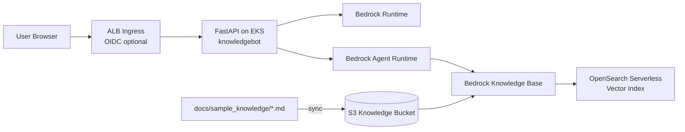
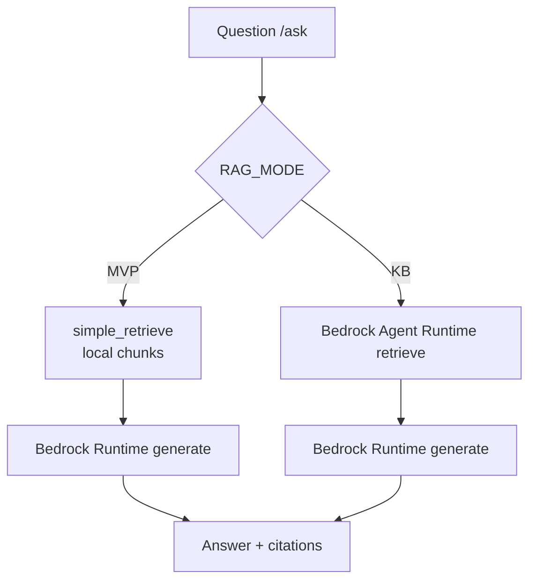
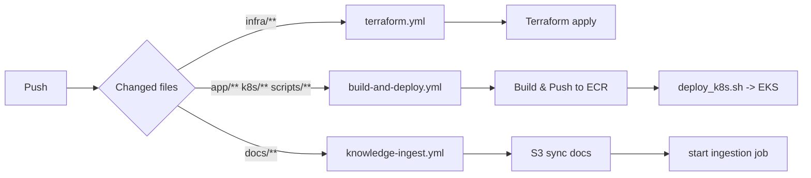
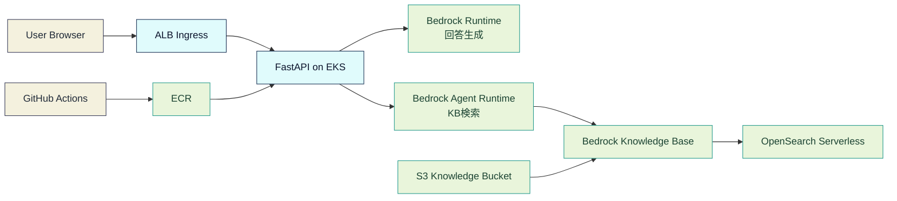
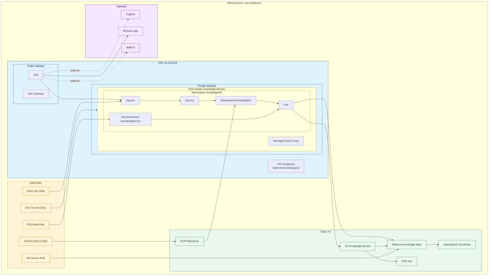
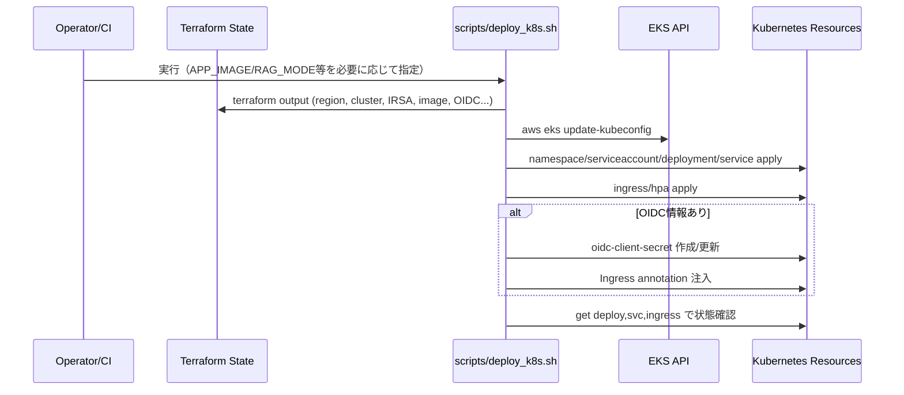
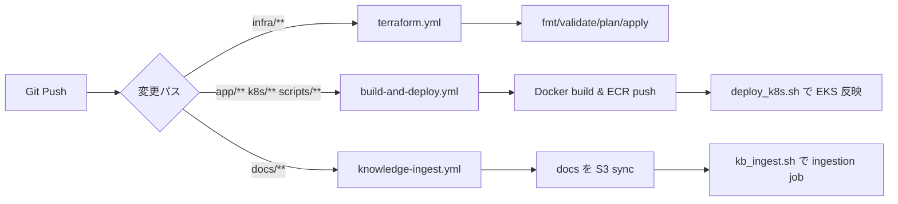

# Knowledge Bot

FastAPI + Amazon Bedrock Knowledge Bases を使った社内ナレッジ Q&A アプリです。  
ローカル実行（UI/API）と、Terraform + EKS でのデプロイを想定しています。

## クイックスタート（初回3コマンド）

```bash
cd app
python3 -m venv .venv && source .venv/bin/activate && pip install -r requirements.txt
uvicorn src.main:app --host 0.0.0.0 --port 8000 --reload
```

注意:
- `uvicorn src.main:app ...` は `app/` ディレクトリで実行してください（リポジトリルートで実行すると `ModuleNotFoundError: No module named 'src'` になります）

起動後:
- UI: `http://localhost:8000/`
- API Docs: `http://localhost:8000/docs`

KB モードで使う場合は、起動前に以下を設定:

```bash
export RAG_MODE=KB
export KNOWLEDGE_BASE_ID="<your-kb-id>"
export AWS_REGION="ap-northeast-1"
export BEDROCK_MODEL_ID="anthropic.claude-3-5-sonnet-20240620-v1:0"
```

## 構成

- `app/`: FastAPI アプリ
- `docs/sample_knowledge/`: ナレッジ原文（KB 取り込み元）
- `infra/`: AWS インフラ（Terraform）
- `k8s/`: Kubernetes マニフェスト
- `scripts/`: ビルド/デプロイ/取り込み補助スクリプト

`app/` のUI関連ファイル:
- `src/templates/index.html`: 画面テンプレート
- `src/static/style.css`: スタイル
- `src/static/app.js`: フロント側の `/ask` 呼び出し処理

## 全体像（図解）

### 1. システム全体マップ



### 2. モード別の回答経路



### 3. 変更内容ごとのパイプライン



### 4. AWS詳細構成図（Terraform実装ベース）

#### 4-1. 処理フロー（ユーザー操作から回答生成まで）



#### 4-2. AWSリソース配置（どこに何があるか）



EKS 部分の読み方:
- ALB から `Ingress -> Service -> Deployment -> Pod` の順でトラフィックが流れます。
- `ServiceAccount knowledgebot-sa` に IRSA ロールを紐づけ、Pod はその権限で Bedrock を呼びます。
- CI は ECR に push したイメージを Deployment に反映してロールアウトします。
- `Managed Node Group` は EKS ワーカーノード用の EC2 群です（この構成では `t3.medium`）。

## 仕組み詳細（アーキテクチャ）

### 全体像

```text
[User Browser]
   |  HTTP (/, /ask)
   v
[FastAPI app (app/src/main.py)]
   |-- MVP mode: local chunks (rag_mvp.py) + Bedrock Runtime(Claude)
   |
   `-- KB mode: Bedrock Agent Runtime retrieve (rag_kb.py)
               + Bedrock Runtime generate (Claude)

KB data path:
docs/sample_knowledge/*.md -> S3 knowledge bucket -> Bedrock Knowledge Base
          -> OpenSearch Serverless vector index
```

### アプリのリクエスト処理

`app/src/main.py` のエンドポイントは次の2つです。

- `GET /`: ブラウザUIを返す（質問入力、回答表示、引用表示）
- `POST /ask`: 質問を受けて回答生成するコアAPI

`POST /ask` の処理は `RAG_MODE` で分岐します。

1. `MVP` モード（デフォルト）
- `rag_mvp.py` の `simple_retrieve()` で、アプリ内のダミーチャンクを単純スコアリング
- ヒットしたチャンクをコンテキスト化し、Bedrock Runtime の Claude に問い合わせ
- 回答本文と引用（source/section）を返却

2. `KB` モード
- `rag_kb.py` の `retrieve()` で Bedrock Agent Runtime `retrieve` を実行
- 上位スニペットをコンテキストにして Bedrock Runtime で回答生成
- S3 URI 由来の引用情報を整形して返却

MVP と KB の違い（検索部分）:

| 観点 | MVPモード | KBモード |
|---|---|---|
| 検索方式 | アプリ内の簡易スコアリング検索 | Bedrock Knowledge Base のベクトル検索 |
| 検索に使う基盤 | アプリ内ダミーチャンク | S3 + 埋め込み + OpenSearch Serverless |
| Bedrock Agent Runtime | 使わない | 使う（`Retrieve`） |
| Bedrock Runtime | 使う（回答生成） | 使う（回答生成） |
| 向いている用途 | ローカル検証・最小構成 | 本番運用・実ドキュメント検索 |

### Bedrock Runtime と Agent Runtime の違い

- Bedrock Runtime
  - 役割: 生成モデルを直接呼び、回答テキストを作る
  - 代表API: `InvokeModel`

- Bedrock Agent Runtime
  - 役割: Knowledge Base から関連情報を取得する
  - 代表API: `Retrieve`, `RetrieveAndGenerate`

このプロジェクトでは両方を利用します。
- KBモード: `Agent Runtime` で検索し、`Runtime` で最終回答を生成
- MVPモード: `Runtime` のみで回答生成

### 埋め込みモデルと回答生成モデルの違い

このプロジェクトでは、モデルを2種類に分けて使います。

- 埋め込みモデル（検索用）
  - 役割: ドキュメント/質問をベクトル化して類似検索を行う
  - 利用箇所: Bedrock Knowledge Base
  - 現在の設定: `amazon.titan-embed-text-v2:0`（`infra/bedrock_kb.tf`）

- 回答生成モデル（生成用）
  - 役割: 検索で得たコンテキストを使って自然文の回答を生成する
  - 利用箇所: アプリの `POST /ask`
  - 設定値: `BEDROCK_MODEL_ID`（デフォルト: Claude 3.5 Sonnet）

### ナレッジ取り込みフロー（docs -> KB）

`docs/sample_knowledge/` 更新時は `knowledge-ingest.yml` が動き、以下を実施します。

1. `terraform output` で `knowledge_bucket` を取得
2. `aws s3 sync ../docs s3://<bucket>/docs/ --delete`
3. `scripts/kb_ingest.sh` で Bedrock ingestion job を開始

その結果、Knowledge Base が埋め込みを生成し、OpenSearch Serverless のベクトルインデックスへ反映します。

### Terraform が作る主なAWSリソース

- ネットワーク/実行基盤
- VPC（public/private subnet, NAT）
- EKS クラスタ（managed node group）
- ECR リポジトリ（アプリイメージ）

- RAG/データ基盤
- S3 knowledge bucket（KMS暗号化）
- OpenSearch Serverless collection（VECTORSEARCH）
- OpenSearch index（`knn_vector` マッピング）
- Bedrock Knowledge Base + S3 data source

- 認証/権限
- IRSA ロール（アプリPodから Bedrock API 呼び出し）
- KB用IAMロール（Bedrockが S3/AOSS/KMS にアクセス）
- GitHub OIDC provider + CI用IAMロール（GitHub Actions からAWS操作）

- 周辺
- ALBログ用S3バケット
- （任意）Cognito OIDC 用リソース
- （任意）WAFv2
- VPC Endpoint（Bedrock/ECR/STS/Logs/S3等）

### Kubernetes デプロイの流れ

`scripts/deploy_k8s.sh` は「Terraformで作った値」を使って、Kubernetesマニフェストへ実値を注入してから適用します。  
単に `kubectl apply` するだけでなく、IRSA・画像タグ・ConfigMap/Secret・OIDC設定を組み立てるのが主目的です。

シーケンス図:



事前に参照する Terraform output:
- `region`, `cluster_name`
- `irsa_app_role_arn`
- `app_image`（または `APP_IMAGE` で上書き）
- `knowledge_base_id`（KB利用時）
- `cognito_client_id`, `cognito_client_secret`, `oidc_*`（OIDC利用時）
- `alb_logs_bucket`

実行ステップ（順序）:
1. `aws eks update-kubeconfig` で対象EKSクラスタに接続
2. `namespace.yaml` を適用
3. `serviceaccount.yaml` の `REPLACE_WITH_IRSA_APP_ROLE_ARN` を置換して適用
4. `configmap.yaml` に `RAG_MODE`, `KNOWLEDGE_BASE_ID`, `BEDROCK_MODEL_ID` などを注入して適用
5. `secret-app.yaml`（`knowledgebot-secrets`）を作成/更新
6. `deployment.yaml` の `REPLACE_WITH_ECR_IMAGE` を置換して適用
7. `service.yaml` を適用
8. OIDC情報がある場合は `oidc-client-secret` を作成/更新
9. `ingress.yaml` に ALBログ設定とOIDC annotationを必要に応じて注入して適用
10. `hpa.yaml` と `pdb.yaml` を適用
11. `kubectl get deploy,svc,ingress,pdb` で状態確認

このスクリプトで担保しているポイント:
- Bedrock呼び出しに必要なIRSAをServiceAccountに確実に紐付け
- CIでビルドしたイメージを `APP_IMAGE` 経由でそのまま反映可能
- ConfigMap/Secret でアプリ設定をマニフェスト本体から分離
- Readiness/Liveness/Startup Probe は `/healthz` を使用
- `resources requests/limits` でPodのリソース境界を明示
- RollingUpdate（`maxUnavailable: 0`）で無停止に近い更新を実現
- PDB で voluntary disruption 時の最低可用性を確保
- OIDC有効時の Ingress annotation と Secret 作成を自動化

`deploy_k8s.sh` 実行時に使える主な上書き環境変数:
- `APP_IMAGE`: デプロイするコンテナイメージを強制指定（未指定時は Terraform output `app_image`）
- `RAG_MODE`: `MVP` / `KB`（未指定時 `MVP`）
- `BEDROCK_MODEL_ID`: 利用モデルID（未指定時 Claude 3.5 Sonnet）
- `KB_MODEL_ARN`: `knowledgebot-secrets` に注入する互換用値

内部で実施しているテンプレート置換:
- `k8s/base/configmap.yaml`: `AWS_REGION`, `RAG_MODE`, `BEDROCK_MODEL_ID`, `KNOWLEDGE_BASE_ID`
- `k8s/base/serviceaccount.yaml`: `REPLACE_WITH_IRSA_APP_ROLE_ARN`
- `k8s/base/deployment.yaml`: `REPLACE_WITH_ECR_IMAGE`
- `k8s/base/ingress.yaml`: ALB access logs annotation と OIDC annotation（条件付き）

よくある失敗要因:
- `terraform output` が未作成（`terraform apply` 前）
- `cognito_callback_urls` 未設定でOIDCログインが成立しない
- `AWS_ROLE_TO_ASSUME` や OIDC trust policy 不整合でCIがAWS認証に失敗

Kubernetes マニフェストの役割:
- `namespace.yaml`: `knowledgebot` 名前空間を作成
- `serviceaccount.yaml`: IRSAロールを紐づけるServiceAccount
- `configmap.yaml`: 非機密設定（`RAG_MODE`, `BEDROCK_MODEL_ID` など）
- `secret-app.yaml`: 機密設定（`KB_MODEL_ARN` など）
- `deployment.yaml`: Pod本体、Probe、resources、RollingUpdate戦略
- `service.yaml`: Cluster内公開（port 80 -> 8080）
- `ingress.yaml`: ALB公開、必要時OIDC認証
- `hpa.yaml`: CPU利用率ベースの水平スケール
- `pdb.yaml`: ノードメンテ時などの可用性下限を維持

デプロイ後の確認コマンド:

```bash
kubectl -n knowledgebot get deploy,rs,pods,svc,ingress,hpa,pdb
kubectl -n knowledgebot describe deploy knowledgebot
kubectl -n knowledgebot logs deploy/knowledgebot --tail=100
kubectl -n knowledgebot get events --sort-by=.lastTimestamp | tail -n 30
```

更新時の運用パターン:
1. アプリコード変更（`app/**`）: `make build-push` -> `make deploy`
2. K8s設定変更（`k8s/**`）: `make deploy`
3. ナレッジ更新（`docs/**`）: `make kb-ingest`
4. インフラ変更（`infra/**`）: Terraform apply 後に必要なら `make deploy`

ロールバックの基本:
```bash
kubectl -n knowledgebot rollout history deploy/knowledgebot
kubectl -n knowledgebot rollout undo deploy/knowledgebot
```

### CI/CD の役割分担

このリポジトリは「インフラ」「アプリ配備」「ナレッジ投入」を別ワークフローに分離しています。

シーケンス図:



`terraform.yml`（インフラ担当）
- トリガー: `infra/**` 変更時
- 処理: `terraform init` -> `fmt` -> `validate` -> (`plan` or `apply`)
- 目的: AWS基盤（VPC/EKS/ECR/KB/IAMなど）の状態をコードに同期

`build-and-deploy.yml`（アプリ配備担当）
- トリガー: `app/**`, `k8s/**`, `scripts/**` 変更時
- 処理: ECRログイン -> Docker build/push（タグ: `github.sha`） -> `APP_IMAGE=<pushed-image> bash scripts/deploy_k8s.sh` でEKS反映
- 目的: アプリ変更をコンテナ化してクラスターにデプロイ

`knowledge-ingest.yml`（ナレッジ投入担当）
- トリガー: `docs/**` 変更時
- 処理: `docs/` を S3 knowledge bucket に同期 -> `scripts/kb_ingest.sh` で Bedrock ingestion job 開始
- 目的: ドキュメント更新をKB検索インデックスへ反映

運用上の意図:
- `infra` 変更と `app` 変更を分離し、失敗時の切り分けを簡単にする
- `docs` 変更だけで再インデックスできるため、アプリ再デプロイを不要にする
- それぞれの責務が明確なため、レビュー観点（IaC / App / Knowledge）を分けられる

### セキュリティ上の要点

- アプリは IRSA を使い、Podに長期AWSキーを持たせない構成
- ナレッジS3は KMS 暗号化・Public Access Block を有効化
- KB ロールに KMS `Decrypt` を明示付与
- GitHub Actions は OIDC で AWS ロールを引き受ける構成
- CI IAMは `*:*` ではなく、このプロジェクトで使うAWSサービス群に限定

### IAM 全体像

このプロジェクトでは、用途ごとにIAMロールを分離しています。

1. アプリ実行ロール（IRSA）
- 対象: `knowledgebot` namespace の `knowledgebot-sa`
- 用途: アプリPodから Bedrock Runtime / Bedrock Agent Runtime を呼び出す
- 定義: `infra/irsa_app.tf`

2. Bedrock Knowledge Base 実行ロール
- 対象: `bedrock.amazonaws.com` が Assume
- 用途: S3ナレッジ読取、AOSSアクセス、埋め込みモデル呼び出し、KMS復号
- 定義: `infra/bedrock_kb.tf`, `infra/kms.tf`

3. AWS Load Balancer Controller ロール（`enable_lbc=true` のとき）
- 対象: `kube-system/aws-load-balancer-controller` ServiceAccount
- 用途: ALB/NLB 関連リソースの作成・更新
- 定義: `infra/irsa_lbc.tf`, `infra/lbc_iam_policy.json`

4. GitHub Actions CI ロール（OIDC）
- 対象: `repo:<owner>/<repo>:*`（`github_repository` で制御）
- 用途: Terraform apply、ECR push、EKS deploy などCI/CD処理
- 定義: `infra/github_oidc_ci.tf`

5. EKS 管理アクセス（人/運用ロール）
- 対象: `eks_admin` ロール + 任意の SSO 管理ロール
- 用途: `aws_eks_access_entry` / `aws_eks_access_policy_association` によるクラスタ管理権限付与
- 定義: `infra/eks_admin_role.tf`

運用メモ:
- `sso_admin_role_arn` には `assumed-role` ではなく `iam::...:role/...` 形式を設定
- `github_repository` は必ず実リポジトリ名（`owner/repo`）に更新

### 現状の注意点（実装に基づく）

- `infra/github_oidc_ci.tf` は `var.github_repository` を参照するため、`infra/envs/dev.tfvars` などで `owner/repo` を指定する必要あり
- `infra/cognito_oidc.tf` の callback URL はダミー値（`https://example.com/...`）のため、本番URLへ要更新
- Claudeモデル利用には、AWSアカウントで Anthropic use case details 提出が必要

### Cognito 認証を有効化する手順

このプロジェクトでは、アプリ本体ではなく ALB Ingress 側で OIDC 認証を実施します。

ALBドメインは初回デプロイ後に確定するため、以下の2段階で有効化します。

1. 先に通常デプロイ（OIDC未確定のまま）
   1. `terraform -chdir=infra apply -var-file=envs/dev.tfvars -auto-approve`
   2. `./scripts/deploy_k8s.sh`
2. ALBドメインを取得
   1. `kubectl -n knowledgebot get ingress`
   2. `ADDRESS`（`*.elb.amazonaws.com`）を控える
3. `infra/envs/dev.tfvars` の callback URL を更新
   - `cognito_callback_urls = ["https://<ALB-DNS>/oauth2/idpresponse"]`
4. OIDC有効化を反映
   1. `terraform -chdir=infra apply -var-file=envs/dev.tfvars -auto-approve`
   2. `./scripts/deploy_k8s.sh`
5. 有効化確認
   1. `kubectl -n knowledgebot get secret oidc-client-secret`
   2. `kubectl -n knowledgebot describe ingress knowledgebot` で `auth-type: oidc` を確認
   3. Ingress URLアクセス時に Cognito ログイン画面へリダイレクトされることを確認

`deploy_k8s.sh` は以下を自動で行います。

- Cognito の `clientID/clientSecret` から `oidc-client-secret` を作成/更新
- Ingress に OIDC annotation（`auth-type: oidc`, `auth-idp-oidc` など）を注入

CI (`build-and-deploy.yml`) でも `scripts/deploy_k8s.sh` を呼ぶため、同じ認証設定が反映されます。

## 前提条件

- Python 3.12
- AWS 認証情報（`aws configure` など）
- Bedrock 利用可能リージョン（既定: `ap-northeast-1`）
- KB モード利用時: Bedrock Knowledge Base 作成済み

重要:
- Anthropic モデル（例: Claude 3.5 Sonnet）を使う場合、AWS アカウントで `use case details` 提出が必要です。未提出だと `ResourceNotFoundException` で失敗します。

## 動作確認バージョン（目安）

- Python: `3.12.x`
- Terraform: `1.8+`（`terraform -version`）
- kubectl: `1.29+`（EKSクラスタバージョンに合わせる）
- AWS CLI: `2.x`

確認コマンド:

```bash
python3 --version
terraform -version
kubectl version --client
aws --version
```

## 本番導入ランブック（Terraform実行から本番確認まで）

この章は「最初の1回」を時系列で実施するための手順です。  
実行ディレクトリはリポジトリルート（`knowledge-bot/`）を想定します。

### 0. 事前設定（tfvars）

`infra/envs/dev.tfvars` を編集:

```hcl
github_repository = "your-org/knowledge-bot"
cognito_callback_urls = ["https://<your-alb-domain>/oauth2/idpresponse"] # OIDC利用時
```

### 1. Terraform 初期化と適用

```bash
make tf-init
terraform -chdir=infra validate
terraform -chdir=infra apply -var-file=envs/dev.tfvars -auto-approve
```

補足（LBCを使う場合の推奨順序）:
1. 初回は `enable_lbc=false` で EKS クラスタ本体を先に作成
2. `aws eks update-kubeconfig --region ap-northeast-1 --name knowledge-bot-eks` を実行し、`kubectl get ns` が通ることを確認
3. `enable_lbc=true` に変更して再度 `terraform apply`

### 2. Terraform 出力値の確認

```bash
make tf-output
```

確認ポイント:
- `cluster_name`
- `ecr_repo_url`
- `irsa_app_role_arn`
- `knowledge_base_id`（KB利用時）

### 3. アプリイメージのビルドとECR push

```bash
make build-push
```

特定タグを使う場合:

```bash
./scripts/build_push_ecr.sh <tag>
```

### 4. EKS へデプロイ

```bash
make deploy
```

KBモードでデプロイする場合:

```bash
RAG_MODE=KB make deploy
```

CIで作ったイメージを指定してデプロイする場合:

```bash
APP_IMAGE="<account>.dkr.ecr.<region>.amazonaws.com/knowledge-bot/app:<tag>" make deploy
```

### 5. デプロイ後の状態確認

```bash
kubectl -n knowledgebot get deploy,svc,ingress,pods
kubectl -n knowledgebot rollout status deploy/knowledgebot
```

### 6. ナレッジ取り込み（docs -> KB）

まず docs を S3 へアップロード:

```bash
./scripts/upload_knowledge.sh
```

このコマンドは `docs/` 配下を再帰的に同期するため、現在の運用ディレクトリである `docs/sample_knowledge/` も対象です。

差分削除もしたい場合:

```bash
./scripts/upload_knowledge.sh --delete
```

続けて KB ingestion を開始（デフォルトは完了まで待機し、進捗を表示）:

```bash
make kb-ingest
```

待機せずにジョブ開始だけしたい場合:

```bash
./scripts/kb_ingest.sh --no-wait
```

### 7. 本番動作確認（UI/API）

1. Ingress のURLにブラウザでアクセス
2. UIで質問を送信して回答と引用が返ることを確認
3. ヘルスチェック: `/healthz`

API確認例:

```bash
curl -s -X POST http://<ingress-host>/ask \
  -H "Content-Type: application/json" \
  -d '{"question":"VPN 接続方法を教えて"}'
```

### 8. 環境削除（Terraform destroy）

必ず `apply` と同じ `tfvars` を指定して実行します。

```bash
terraform -chdir=infra destroy -var-file=envs/dev.tfvars -auto-approve
```

注意:
- `terraform destroy` だけで実行すると、変数がデフォルト評価になり、削除漏れや依存残りの原因になります
- 削除は 10-30分以上かかる場合があります（NAT Gateway / ALB ENI 削除待ち）
- `destroy` 前に `enable_lbc` などの値を変更しないでください（`apply` 時と同じ `tfvars` のまま実行）

S3 が `BucketNotEmpty` で失敗する場合（バージョン/削除マーカー含め削除）:

```bash
BUCKET="knowledge-bot-<account-id>-ap-northeast-1-knowledge"

aws s3api list-object-versions --bucket "$BUCKET" --output json \
| jq '{Objects: [(.Versions[]? | {Key, VersionId}), (.DeleteMarkers[]? | {Key, VersionId})], Quiet: true}' \
| aws s3api delete-objects --bucket "$BUCKET" --delete file:///dev/stdin
```

ECR が `RepositoryNotEmpty` で失敗する場合:

```bash
REPO="knowledge-bot/app"

# 1) manifest list を含む全imageIdを取得
aws ecr list-images --repository-name "$REPO" --query 'imageIds[*]' --output json > /tmp/ecr-image-ids.json

# 2) 一括削除（空配列ならスキップ）
if [ "$(cat /tmp/ecr-image-ids.json)" != "[]" ]; then
  aws ecr batch-delete-image --repository-name "$REPO" --image-ids file:///tmp/ecr-image-ids.json
fi
```

## ローカル起動

### 1. 依存インストール

```bash
cd app
python3 -m venv .venv
source .venv/bin/activate
pip install -r requirements.txt
```

### 2. MVP モードで起動（既定）

```bash
uvicorn src.main:app --host 0.0.0.0 --port 8000 --reload
```

アクセス:
- UI: `http://localhost:8000/`
- API Docs: `http://localhost:8000/docs`

### 3. KB モードで起動

```bash
export RAG_MODE=KB
export KNOWLEDGE_BASE_ID="<your-kb-id>"
export AWS_REGION="ap-northeast-1"
export BEDROCK_MODEL_ID="anthropic.claude-3-5-sonnet-20240620-v1:0"

uvicorn src.main:app --host 0.0.0.0 --port 8000 --reload
```

### 4. UIで動作確認

ローカル実行時:
1. `http://localhost:8000/` を開く
2. 質問を入力して `送信する` を押す（`Ctrl+Enter` / `Cmd+Enter` でも送信可）
3. 回答欄に回答、引用欄に参照元が表示されることを確認
4. エラー時は回答欄に赤字メッセージが表示される

ヘルスチェック（任意）:
- `http://localhost:8000/healthz` で `{"status":"ok"}` を確認

EKSデプロイ済みの場合:
- `localhost:8000` の代わりに Ingress のURLで同じ手順を実施

## API 例

```bash
curl -s -X POST http://localhost:8000/ask \
  -H "Content-Type: application/json" \
  -d '{"question":"VPN 接続方法を教えて"}'
```

## Docker 実行

```bash
cd app
docker build -t knowledge-bot:local .
docker run --rm -p 8080:8080 \
  -e AWS_REGION=ap-northeast-1 \
  -e RAG_MODE=MVP \
  knowledge-bot:local
```

アクセス:
- `http://localhost:8080/`

## Terraform / デプロイ

よく使うコマンド:

```bash
make tf-init
make tf-apply
make tf-output
make build-push
make deploy
make kb-ingest
```

ナレッジ同期系:

```bash
./scripts/upload_knowledge.sh
./scripts/kb_ingest.sh
```

`infra/envs/dev.tfvars` の例:

```hcl
github_repository = "your-org/knowledge-bot"
cognito_callback_urls = ["https://<your-alb-domain>/oauth2/idpresponse"]
```

対応スクリプト:
- `scripts/build_push_ecr.sh`: ECR へイメージ push
- `scripts/deploy_k8s.sh`: EKS へマニフェスト適用
- `scripts/upload_knowledge.sh`: `docs/` を S3 knowledge bucket に同期
- `scripts/kb_ingest.sh`: KB ingestion job 実行（進捗ポーリング対応）

## トラブルシュート（よくあるエラー）

- `Kubernetes cluster unreachable: the server has asked for the client to provide credentials`
  - `aws sso login --profile <profile>` で再ログイン
  - `aws eks update-kubeconfig --region ap-northeast-1 --name knowledge-bot-eks`
  - `kubectl get ns` で認証確認

- `Unexpected attribute: enable_lbc is not expected here`（IDE表示）
  - Terraform 実行が成功していれば、IDEの Terraform 拡張が古い可能性があります
  - `infra/variables.tf` に `variable "enable_lbc"` があることを確認し、拡張の再読み込みを実施

- `ValidationException ... dataSourceId ... [0-9a-zA-Z]{10}`
  - `scripts/kb_ingest.sh` は複数ID文字列から先頭の有効IDを自動抽出する実装です
  - `terraform output data_source_id` の値を確認し、必要なら state/output を整理してください

- `CrashLoopBackOff` / Pod起動失敗
  - `kubectl -n knowledgebot describe pod <pod-name>`
  - `kubectl -n knowledgebot logs <pod-name> --previous`
  - `kubectl -n knowledgebot get configmap knowledgebot-config -o yaml`
  - `kubectl -n knowledgebot get secret knowledgebot-secrets -o yaml`

- Ingress が作成されない / ADDRESS が空のまま
  - `kubectl -n knowledgebot describe ingress knowledgebot`
  - `kubectl -n kube-system get pods | grep -i aws-load-balancer-controller`
  - `kubectl -n kube-system logs deploy/aws-load-balancer-controller --tail=100`

- KB ingestion が失敗する
  - `./scripts/kb_ingest.sh --no-wait` で JOB ID を取得
  - `aws bedrock-agent get-ingestion-job --region <region> --knowledge-base-id <kb-id> --data-source-id <ds-id> --ingestion-job-id <job-id>`
  - `./scripts/upload_knowledge.sh --delete` 後に再実行

- `terraform destroy` で止まる（S3/ECR/Subnet）
  - `BucketNotEmpty`: バージョン/削除マーカーを含めてS3を空にする
  - `RepositoryNotEmpty`: ECRイメージ（manifest list含む）を先に削除する
  - `DependencyViolation (subnet)`: `describe-network-interfaces` で残存ENI（多くはALB）を特定して削除する

## GitHub Actions

- `terraform.yml`: `infra/**` 変更時に `fmt/validate/plan/apply`
- `build-and-deploy.yml`: `app/**`, `k8s/**`, `scripts/**` 変更時に build & EKS deploy
- `knowledge-ingest.yml`: `docs/**` 変更時に S3 sync + ingestion

必要 Secrets:
- `AWS_ROLE_TO_ASSUME`

CI/CD 有効化チェックリスト（初回）:

1. `infra/envs/dev.tfvars` の `github_repository` を実リポジトリに変更
2. `infra/envs/dev.tfvars` の `cognito_callback_urls` を実ALBドメインに変更（OIDC利用時）
3. `terraform -chdir=infra apply -var-file=envs/dev.tfvars -auto-approve` を実行して OIDC trust policy を反映
4. `terraform -chdir=infra validate` が通ることを確認
5. GitHub の Repository Secrets に `AWS_ROLE_TO_ASSUME` を設定（`knowledge-bot-gha` 相当ロールARN）
6. GitHub Actions の実行ログで `Configure AWS credentials (OIDC)` が成功することを確認
7. `build-and-deploy` で `rollout status deploy/knowledgebot` が成功することを確認

## 主な環境変数（アプリ）

- `AWS_REGION` (default: `ap-northeast-1`)
- `RAG_MODE` (`MVP` or `KB`)
- `BEDROCK_MODEL_ID`
- `KNOWLEDGE_BASE_ID`（KBモード時必須）
- `KB_MODEL_ARN`（現状は互換用で未使用）

## コスト注意（運用前に要確認）

常時課金になりやすい主なリソース:
- EKS クラスタ（コントロールプレーン課金）
- NAT Gateway（時間課金 + 転送料）
- ALB（時間課金 + LCU）
- OpenSearch Serverless（OCU）
- Bedrock（推論 + 埋め込み + KB取り込み）

使わない期間の基本対応:
- 検証環境は `terraform destroy` を検討
- docs 更新頻度が低い場合は ingestion 実行回数を必要最小限にする
