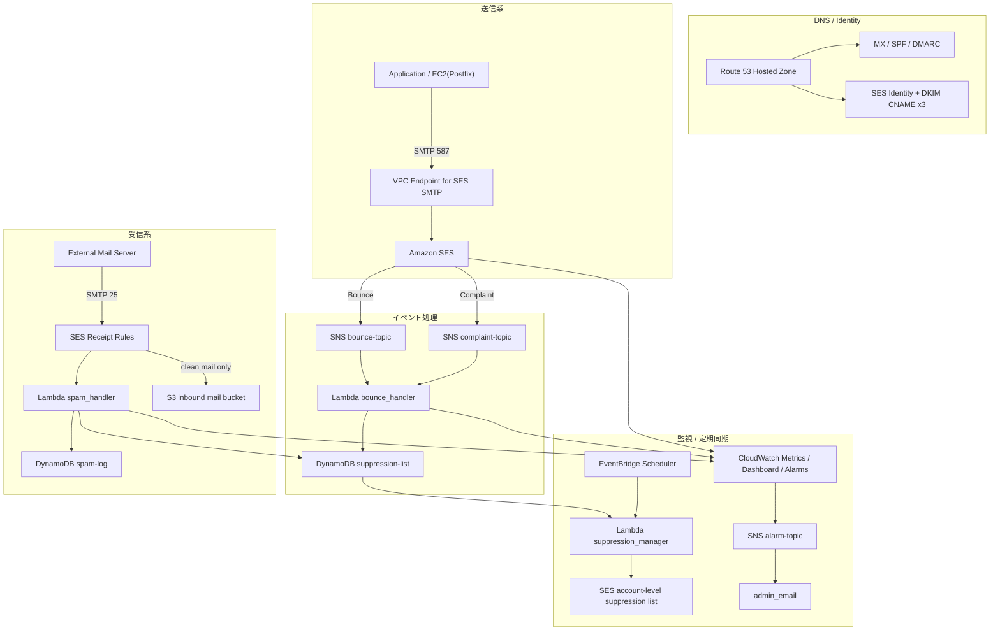
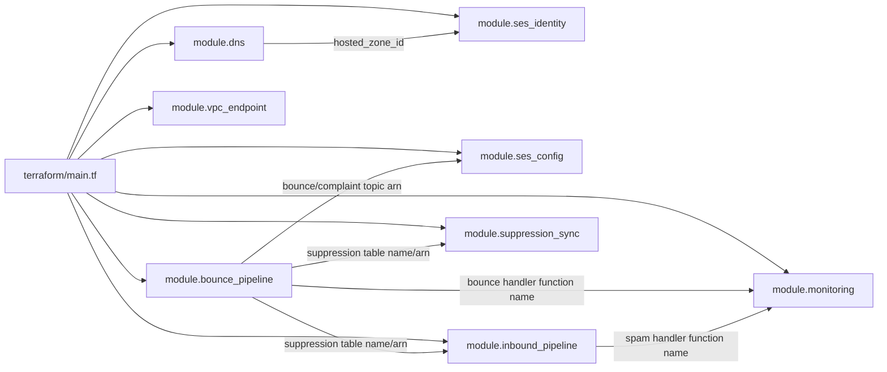
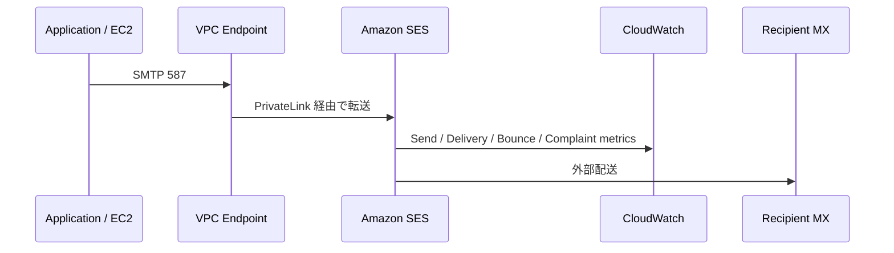
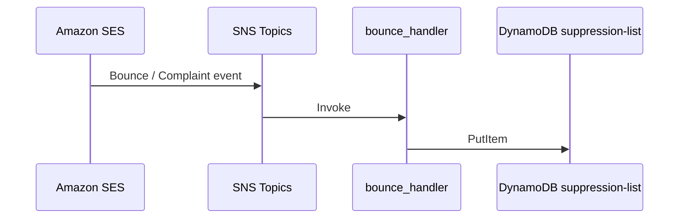
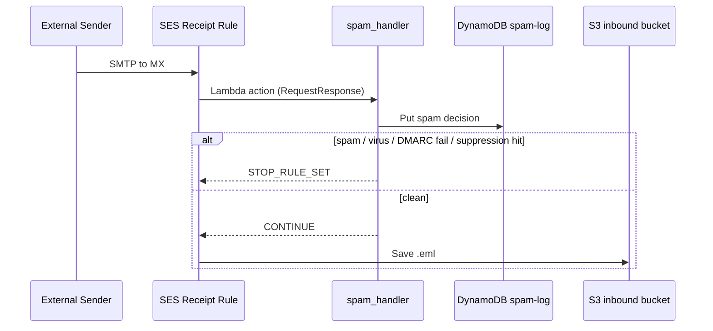
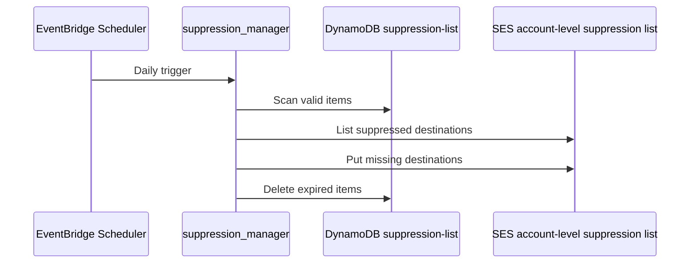

# ARCHITECTURE

`mail-infra-handson` が Terraform で何を作り、各コンポーネントがどう連携し、どこを人手で運用するのかを一枚で追えるようにした全体解説です。README が「学習の進め方」を示す文書だとすると、このファイルは「完成したシステムの設計書」です。

---

## 1. このプロジェクトが作るもの

このプロジェクトは、AWS 上に次の 5 つをまとめて構築します。

1. Route 53 によるメール向け DNS 基盤
2. SES の送信・受信基盤
3. バウンス/苦情を自動記録するサプレッション管理パイプライン
4. 受信メールをスパム判定して保存可否を決める受信パイプライン
5. CloudWatch / SNS / EventBridge による監視と定期同期

特徴は、単に「メールを送れる」だけでなく、以下まで含めている点です。

- SPF / DKIM / DMARC の認証
- バウンス率・苦情率の監視
- 送信停止すべき宛先の自動管理
- 受信メールの保存とスパム遮断
- SES SMTP を PrivateLink で閉域化する構成

---

## 2. 全体像

---

## 3. Terraform 構成

ルートモジュールは [terraform/main.tf](/home/takuya/terraform-lab/mail-infra-handson/terraform/main.tf) です。ここで 8 つの子モジュールを組み合わせ、入力変数と出力値で依存関係をつないでいます。

### 3.1 ルート変数

[terraform/variables.tf](/home/takuya/terraform-lab/mail-infra-handson/terraform/variables.tf) で定義される主な入力は次のとおりです。

| 変数 | 役割 |
|---|---|
| `domain_name` | 構築対象ドメイン |
| `admin_email` | 監視アラーム通知先 |
| `aws_region` | AWS リージョン。既定値は `ap-northeast-1` |
| `spf_policy` | SPF を `~all` / `-all` のどちらにするか |
| `dmarc_policy` | DMARC を `none` / `quarantine` / `reject` のどれにするか |
| `dmarc_pct` | DMARC の段階適用率 |
| `powertools_layer_version` | 各 Lambda が使う Powertools Layer の版 |
| `ec2_iam_role_arn` | VPC Endpoint を EC2 ロールで制限したい場合の ARN |

### 3.2 ルート出力

[terraform/outputs.tf](/home/takuya/terraform-lab/mail-infra-handson/terraform/outputs.tf) は、実運用や後続確認で必要な値をまとめています。

- `name_servers`: レジストラに設定する Route 53 NS
- `ses_verification_status`: SES ドメイン検証状態
- `ses_configuration_set_name`: 送信時に指定する Configuration Set
- `inbound_bucket_name`: 受信メール保存バケット
- `dashboard_name`: CloudWatch ダッシュボード名
- `vpc_endpoint_id`: SES SMTP 用 VPC Endpoint

---

## 4. モジュール別の責務

### 4.1 `dns`

対象: [terraform/modules/dns/main.tf](/home/takuya/terraform-lab/mail-infra-handson/terraform/modules/dns/main.tf)

作るもの:

- Route 53 Hosted Zone
- MX レコード
- SPF TXT レコード
- DMARC TXT レコード

要点:

- MX は `inbound-smtp.{region}.amazonaws.com` を向け、SES Inbound を受信口にする
- SPF は `include:amazonses.com` を含め、SES 経由送信を正当化する
- DMARC は `_dmarc.<domain>` に作成し、`rua` / `ruf` を自ドメインの受信用アドレスへ向ける

このモジュールは DNS の起点であり、後続の `ses_identity` はここで作られた `hosted_zone_id` に DKIM CNAME を追加します。

### 4.2 `ses_identity`

対象: [terraform/modules/ses-identity/main.tf](/home/takuya/terraform-lab/mail-infra-handson/terraform/modules/ses-identity/main.tf)

作るもの:

- `aws_sesv2_email_identity`
- DKIM CNAME 3 本
- `_amazonses.<domain>` の TXT

要点:

- SES 側で Easy DKIM を有効化し、秘密鍵管理を SES に任せる
- DKIM CNAME が 3 本あるのはキーローテーション対応のため
- 検証完了後、`no-reply@domain` のような任意のローカル部から送信できる

### 4.3 `bounce_pipeline`

対象: [terraform/modules/bounce-pipeline/main.tf](/home/takuya/terraform-lab/mail-infra-handson/terraform/modules/bounce-pipeline/main.tf)

作るもの:

- SNS Topic `bounce` / `complaint`
- DynamoDB `mail-handson-suppression-list`
- Lambda `mail-handson-bounce-handler`

要点:

- SES のイベントを SNS に出しているため、将来的に Slack 通知などへ分岐しやすい
- DynamoDB は `email` + `reason` の複合キーで、同一アドレスでも `bounce` と `complaint` を分けて保持できる
- TTL 属性 `expires_at` はソフトバウンス解除に使う

### 4.4 `ses_config`

対象: [terraform/modules/ses-config/main.tf](/home/takuya/terraform-lab/mail-infra-handson/terraform/modules/ses-config/main.tf)

作るもの:

- SES Configuration Set
- Bounce / Complaint の SNS 送信先
- CloudWatch メトリクス送信先

要点:

- `tls_policy = "REQUIRE"` で平文配送を許さない
- Reputation metrics を有効化し、`AWS/SES` 名前空間でレピュテーション監視できる
- 実際にメトリクスを活かすには、送信時に `ConfigurationSetName` を指定する必要がある

### 4.5 `inbound_pipeline`

対象: [terraform/modules/inbound-pipeline/main.tf](/home/takuya/terraform-lab/mail-infra-handson/terraform/modules/inbound-pipeline/main.tf)

作るもの:

- 受信メール保存用 S3 バケット
- スパムログ用 DynamoDB
- Lambda `mail-handson-spam-handler`
- SES Receipt Rule Set と 3 本の Receipt Rule

要点:

- S3 はバージョニング有効、SSE-S3、有効期限 90 日、30 日で Glacier 移行
- `with-spam-check` ルールが先頭で、Lambda 判定後にクリーンメールのみ S3 保存
- `dmarc-reports@domain` と `dmarc-forensic@domain` 宛メールは別プレフィックスへ保存

### 4.6 `suppression_sync`

対象: [terraform/modules/suppression-sync/main.tf](/home/takuya/terraform-lab/mail-infra-handson/terraform/modules/suppression-sync/main.tf)

作るもの:

- Lambda `mail-handson-suppression-mgr`
- EventBridge Scheduler
- Scheduler 用 IAM Role

要点:

- DynamoDB 側のリストを正として SES のアカウントレベル suppression list へ反映する
- 毎日 AM2:00 JST に自動実行
- TTL 切れレコードの明示削除も行い、DynamoDB TTL の遅延を補完する

### 4.7 `monitoring`

対象: [terraform/modules/monitoring/main.tf](/home/takuya/terraform-lab/mail-infra-handson/terraform/modules/monitoring/main.tf)

作るもの:

- SNS `mail-handson-alarm-topic`
- Bounce rate / Complaint rate の CloudWatch Alarm
- `mail-handson-dashboard`

要点:

- バウンス率は 3% 超、苦情率は 0.05% 超で通知
- どちらも SES 停止ラインより手前で検知する早期警戒設計
- ダッシュボードは SES 指標と Lambda の Invocations / Errors をまとめて可視化する

### 4.8 `vpc_endpoint`

対象: [terraform/modules/vpc-endpoint/main.tf](/home/takuya/terraform-lab/mail-infra-handson/terraform/modules/vpc-endpoint/main.tf)

作るもの:

- Default VPC 上の Interface VPC Endpoint for SES SMTP
- Endpoint 用 Security Group

要点:

- `private_dns_enabled = true` のため `email-smtp.<region>.amazonaws.com` が VPC 内で PrivateLink に解決される
- 追加の Postfix 設定変更なしで閉域化できる
- `ec2_iam_role_arn` を渡せば Endpoint policy で送信元を EC2 ロールに絞れる

---

## 5. 実行時フロー

### 5.1 送信フロー

補足:

- アプリが SES API を使ってもよいし、Postfix から SMTP relay してもよい
- SMTP で送る場合は `relayhost = [email-smtp.ap-northeast-1.amazonaws.com]:587`
- Configuration Set を指定した送信のみ、イベント転送と詳細メトリクスの対象になる

### 5.2 バウンス・苦情フロー

`bounce_handler` の実装対象は [bounce_handler.py](/home/takuya/terraform-lab/mail-infra-handson/terraform/modules/bounce-pipeline/lambda/bounce_handler.py) です。

処理の意味:

- `Bounce` は `Permanent` と `Transient` を分ける
- `Permanent` は TTL なしで永続抑止
- `Transient` は 30 日 TTL を付けて一時抑止
- `Complaint` は TTL なしで永続抑止
- 1 通知で複数宛先があれば、各宛先ごとにレコードを作る

### 5.3 受信フロー

`spam_handler` の実装対象は [spam_handler.py](/home/takuya/terraform-lab/mail-infra-handson/terraform/modules/inbound-pipeline/lambda/spam_handler.py) です。

判定順:

1. SES 組み込みの `virusVerdict`
2. SES 組み込みの `spamVerdict`
3. `dmarcVerdict`
4. 送信元アドレスがサプレッションリストにあるか

設計意図:

- 強いシグナルから先に判定し、早く `STOP_RULE_SET` できるようにしている
- ログ記録失敗時はメールを落とさず、運用継続を優先している
- サプレッション確認失敗時はフォールセーフで通過させる

### 5.4 サプレッション同期フロー

`suppression_manager` の実装対象は [suppression_manager.py](/home/takuya/terraform-lab/mail-infra-handson/terraform/modules/suppression-sync/lambda/suppression_manager.py) です。

この同期がある理由:

- DynamoDB はアプリケーション内ロジックで使う「即時参照用」の正データ
- SES アカウントレベル suppression list は SES 自身の再送防止装置
- 両方をそろえることで、アプリ側でも SES 側でも危険宛先を止められる

---

## 6. データストア設計

### 6.1 `mail-handson-suppression-list`

用途:

- 送信停止すべき宛先の永続/一時記録

キー設計:

- Partition key: `email`
- Sort key: `reason`

保持データの例:

| 属性 | 意味 |
|---|---|
| `email` | 対象メールアドレス |
| `reason` | `bounce` または `complaint` |
| `recorded_at` | 記録時刻 |
| `expires_at` | ソフトバウンス時のみ設定 |
| `bounce_type` など | 調査用メタデータ |

### 6.2 `mail-handson-spam-log`

用途:

- 受信判定の監査ログ

キー設計:

- Partition key: `message_id`
- Sort key: `received_at`

保持データ:

- `source`
- `is_spam`
- `reason`
- `disposition`
- `verdicts`
- `expires_at` 30 日 TTL

### 6.3 S3 inbound bucket

用途:

- `.eml` 原本保存
- DMARC 集計レポート、フォレンジックレポート保存

保護:

- Public Access Block 全面有効
- SSE-S3
- Versioning 有効
- 30 日で Glacier、90 日で削除

---

## 7. セキュリティ設計

### 7.1 IAM の分離

この構成では Lambda ごとに専用ロールを分けています。

| 関数 | 主な権限 | 意図 |
|---|---|---|
| `bounce_handler` | DynamoDB 書き込み、Logs、X-Ray | バウンス記録に限定 |
| `spam_handler` | spam-log 書き込み、suppression-list 読み取り、CloudWatch metrics | 受信判定に必要な最小権限 |
| `suppression_manager` | suppression-list 読み取り/削除、SES suppression list 管理、CloudWatch metrics | 定期同期専用 |

共通して付与していないもの:

- IAM 変更権限
- S3 全権限
- SES 送信権限

### 7.2 ネットワーク保護

- SES SMTP は Interface VPC Endpoint で閉域化可能
- Endpoint SG は VPC 内からの TCP/587 のみ許可
- `ec2_iam_role_arn` を指定すれば Endpoint policy でも制限できる

### 7.3 データ保護

- SNS は `alias/aws/sns` で暗号化
- S3 はサーバー側暗号化
- DynamoDB は TTL で不要データを自動削除

---

## 8. 監視としきい値

対象: [terraform/modules/monitoring/main.tf](/home/takuya/terraform-lab/mail-infra-handson/terraform/modules/monitoring/main.tf)

### 8.1 アラーム

| 指標 | 名前空間 | 閾値 | 意味 |
|---|---|---|---|
| `Reputation.BounceRate` | `AWS/SES` | `> 0.03` | 3% 超で警告 |
| `Reputation.ComplaintRate` | `AWS/SES` | `> 0.0005` | 0.05% 超で警告 |

設計理由:

- SES 停止ラインより前で検知し、手動対応の余地を残す
- `treat_missing_data = "notBreaching"` により、送信が少ない日でも誤警報を抑える

### 8.2 ダッシュボードで見るべきもの

1. `Send` が想定どおり出ているか
2. `Bounce` と `Reputation.BounceRate` が上がっていないか
3. `Complaint` と `Reputation.ComplaintRate` が上がっていないか
4. `bounce_handler` / `spam_handler` の Errors が増えていないか

---

## 9. フェーズとの対応

README の学習フェーズと、今の Terraform 実装の対応は次のとおりです。

| フェーズ | 学習テーマ | 対応モジュール |
|---|---|---|
| Phase 1 | DNS 基盤 | `dns` |
| Phase 3 | SES Identity / Bounce Pipeline / Receipt Rule | `ses_identity`, `bounce_pipeline`, `ses_config`, `inbound_pipeline` |
| Phase 4 | DKIM / DMARC 強化 | 主に `dns`, `ses_identity` の変数変更と検証 |
| Phase 5 | 監視 / スパム判定 / 同期 / PrivateLink | `monitoring`, `suppression_sync`, `vpc_endpoint`, `inbound_pipeline` |

補足:

- Phase 2 の Postfix EC2 は、この Terraform ルートには含まれていません
- README はハンズオン全体を説明し、現行 Terraform は SES 中心の完成系を表しています

---

## 10. 初回デプロイ後に人が確認すること

Terraform だけでは完結しない確認があります。

1. `terraform output name_servers` を見て、ドメインレジストラへ NS を反映する
2. SES コンソールでドメイン Identity が `Verified` になるのを待つ
3. `admin_email` に届く SNS subscription 確認メールを承認する
4. Receipt Rule Set が意図どおりアクティブか確認する
5. テスト送信し、ヘッダーで `spf=pass` `dkim=pass` `dmarc=pass` を確認する
6. バウンスシミュレーターで suppression-list に項目が入るか確認する

---

## 11. この設計の読みどころ

このプロジェクトを理解するうえで特に重要なのは次の 4 点です。

1. DNS、SES、受信ルール、監視が別々ではなく一つの運用系としてつながっていること
2. DynamoDB の suppression list を「アプリ都合の表」ではなく、レピュテーション保護の中核として使っていること
3. `spam_handler` が受信可否をリアルタイムに返し、S3 保存前に遮断していること
4. `suppression_manager` により、アプリ内部の判断と SES 自体の安全装置を同期していること

---

## 12. 関連ファイル

- [README.md](/home/takuya/terraform-lab/mail-infra-handson/README.md)
- [docs/architecture.md](/home/takuya/terraform-lab/mail-infra-handson/docs/architecture.md)
- [terraform/main.tf](/home/takuya/terraform-lab/mail-infra-handson/terraform/main.tf)
- [terraform/modules/bounce-pipeline/lambda/bounce_handler.py](/home/takuya/terraform-lab/mail-infra-handson/terraform/modules/bounce-pipeline/lambda/bounce_handler.py)
- [terraform/modules/inbound-pipeline/lambda/spam_handler.py](/home/takuya/terraform-lab/mail-infra-handson/terraform/modules/inbound-pipeline/lambda/spam_handler.py)
- [terraform/modules/suppression-sync/lambda/suppression_manager.py](/home/takuya/terraform-lab/mail-infra-handson/terraform/modules/suppression-sync/lambda/suppression_manager.py)
