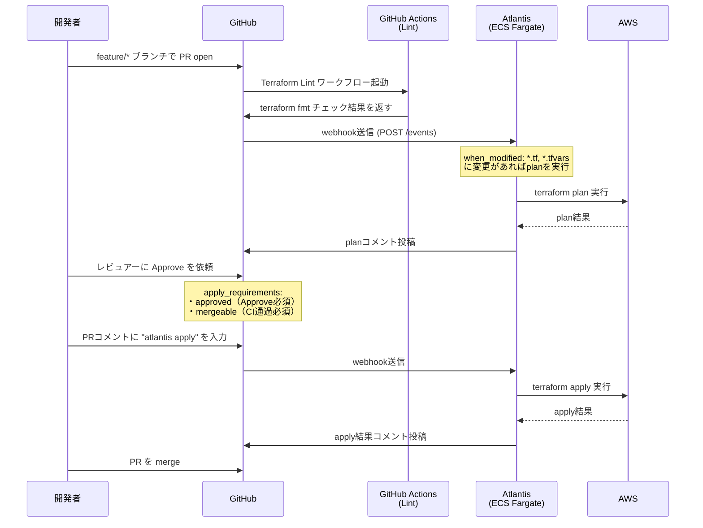
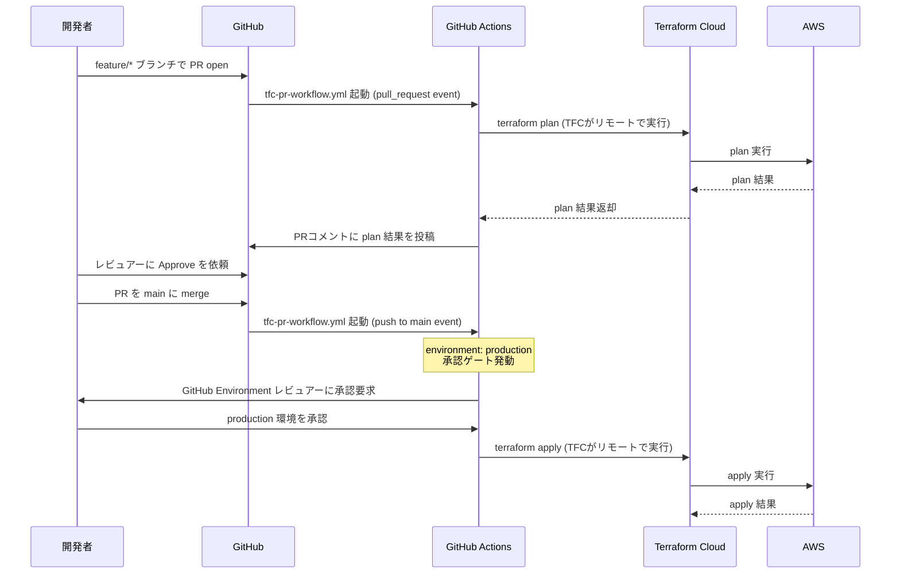

# PR-driven IaC Lab — アーキテクチャ完全解説

## 目次

1. [プロジェクト概要](#1-プロジェクト概要)
2. [ディレクトリ構成](#2-ディレクトリ構成)
3. [全体アーキテクチャ](#3-全体アーキテクチャ)
4. [Terraform 状態管理の進化](#4-terraform-状態管理の進化)
5. [Atlantis ワークフロー詳解](#5-atlantis-ワークフロー詳解)
6. [Terraform Cloud ワークフロー詳解](#6-terraform-cloud-ワークフロー詳解)
7. [ネットワーク設計](#7-ネットワーク設計)
8. [IAM 設計](#8-iam-設計)
9. [セキュリティ設計](#9-セキュリティ設計)
10. [コスト設計](#10-コスト設計)
11. [AtlantisとTFCの比較](#11-atlantisとtfcの比較)

---

## 1. プロジェクト概要

このラボは **PR-driven IaCワークフロー** を 2 つの異なるアプローチで実装・比較するハンズオン環境です。

| 項目 | 内容 |
|---|---|
| **目的** | `terraform apply` を手元で叩かず、PRレビュー経由でインフラを変更する体制を構築する |
| **対象リージョン** | `ap-northeast-1`（東京） |
| **Terraform バージョン** | `>= 1.6` |
| **AWS プロバイダー** | `~> 5.0` |

### なぜ PR-driven が必要か

```
❌ 手元でのapply（before）          ✅ PR-driven（after）
────────────────────────────────────────────────────────
誰がいつ何を変更したか不明          PRで変更内容が可視化される
applyミスが即本番に影響              planの確認→レビュー承認→apply
State競合による破損リスク            Stateロックで直列化される
レビューなしでリソース削除可能       apply_requirementsで承認必須
```

---

## 2. ディレクトリ構成

```
pr-driven-iac-lab/
│
├── terraform/
│   ├── bootstrap/          # [フェーズ1] Stateバックエンド基盤（手動apply）
│   │   ├── main.tf         #   S3バケット + DynamoDBテーブル
│   │   ├── variables.tf
│   │   └── outputs.tf
│   │
│   ├── atlantis-infra/     # [フェーズ2] Atlantis本体のECS Fargate環境
│   │   ├── main.tf         #   VPC・サブネット・VPC Endpoints
│   │   ├── alb.tf          #   ALB・セキュリティグループ
│   │   ├── ecs.tf          #   ECSクラスター・タスク定義・サービス
│   │   ├── iam.tf          #   Task Execution Role / Task Role
│   │   ├── variables.tf
│   │   ├── outputs.tf
│   │   └── backend.tf      #   S3バックエンド参照
│   │
│   └── sample-infra/       # [フェーズ3-4] AtlantisとTFCが管理する対象インフラ
│       ├── main.tf         #   S3バケット・IAMロール・IAMポリシー
│       ├── variables.tf
│       ├── outputs.tf
│       └── backend.tf      #   Phase3: S3 / Phase4: Terraform Cloud
│
├── .github/workflows/
│   ├── atlantis-status-check.yml  # terraform fmt チェック（Atlantis連携）
│   └── tfc-pr-workflow.yml        # TFC PR-driven ワークフロー
│
├── atlantis.yaml            # Atlantisプロジェクト定義・apply_requirements
├── docs/
│   ├── architecture.md      # フロー図・比較表（学習用）
│   ├── runbook.md           # 運用手順書
│   ├── adr/                 # アーキテクチャ決定記録
│   └── zenn-article-outline.md
└── interview/
    └── star-answers.md      # 面接回答テンプレート
```

---

## 3. 全体アーキテクチャ

このラボは **3 層のインフラ** が積み重なっています。

```
┌─────────────────────────────────────────────────────────────────┐
│  Layer 3: sample-infra（管理対象）                               │
│  ┌──────────────────┐  ┌─────────────────────────────────────┐  │
│  │   S3 バケット     │  │  IAMロール + IAMポリシー（S3読み取り）│  │
│  └──────────────────┘  └─────────────────────────────────────┘  │
│           ↑ AtlantisまたはTFCがplan/applyする対象               │
├─────────────────────────────────────────────────────────────────┤
│  Layer 2: atlantis-infra（Atlantis本体）                         │
│  ┌────────────────────────────────────────────────────────────┐  │
│  │  VPC (10.0.0.0/16)                                         │  │
│  │  ┌──────────────────┐    ┌───────────────────────────────┐ │  │
│  │  │ パブリックサブネット│    │ プライベートサブネット          │ │  │
│  │  │ 10.0.1.0/24 (AZ-a)│   │ 10.0.10.0/24 (AZ-a)          │ │  │
│  │  │ 10.0.2.0/24 (AZ-c)│   │ 10.0.11.0/24 (AZ-c)          │ │  │
│  │  │                  │    │                               │ │  │
│  │  │  [ALB]           │    │  [ECS Fargate]                │ │  │
│  │  │  atlantis-alb    │───▶│  Atlantis コンテナ (arm64)    │ │  │
│  │  └──────────────────┘    │  ポート: 4141                 │ │  │
│  │                          └───────────────────────────────┘ │  │
│  └────────────────────────────────────────────────────────────┘  │
├─────────────────────────────────────────────────────────────────┤
│  Layer 1: bootstrap（Stateバックエンド）                         │
│  ┌─────────────────────┐    ┌────────────────────────────────┐  │
│  │  S3 バケット          │    │  DynamoDB テーブル              │  │
│  │  tfstate-pr-driven-  │    │  tfstate-lock-pr-driven-iac-lab│  │
│  │  iac-lab-{account_id}│    │  （Stateロック用）              │  │
│  └─────────────────────┘    └────────────────────────────────┘  │
└─────────────────────────────────────────────────────────────────┘
```

---

## 4. Terraform 状態管理の進化

このラボでは State 管理が **フェーズをまたいで変化** します。

```
Phase 1-3: S3 + DynamoDB                Phase 4: Terraform Cloud
──────────────────────────────────       ──────────────────────────────────
terraform {                              terraform {
  backend "s3" {                           cloud {
    bucket         = "tfstate-..."           organization = "takuya-iac-lab"
    key            = "sample-infra/..."      workspaces {
    region         = "ap-northeast-1"          name = "sample-infra-dev"
    dynamodb_table = "tfstate-lock-..."      }
  }                                        }
}                                        }

  AtlantisのTask Role が                   TFC が State を内蔵管理
  S3に直接read/write                       AtlantisのTask Roleは不要

移行コマンド:
  terraform login
  terraform init -migrate-state
```

### State フロー図（Phase 3: Atlantis）

```
Atlantisコンテナ（ECSタスク）
         │
         │ GetObject/PutObject (VPC Endpoint経由)
         ▼
S3バケット: tfstate-pr-driven-iac-lab-{account_id}
  └── sample-infra/terraform.tfstate

         │ GetItem/PutItem/DeleteItem (VPC Endpoint経由)
         ▼
DynamoDB: tfstate-lock-pr-driven-iac-lab
  └── LockID: "sample-infra/terraform.tfstate"
              （apply中はここにロックが入る）
```

---

## 5. Atlantis ワークフロー詳解

### 全体フロー



### atlantis.yaml の設計

```yaml
projects:
  - name: sample-infra-dev
    dir: terraform/sample-infra
    workspace: default
    terraform_version: v1.6.0
    autoplan:
      when_modified:
        - "*.tf"       # .tf ファイルの変更でplan自動実行
        - "*.tfvars"   # 変数ファイルの変更も対象
      enabled: true
    apply_requirements:
      - approved    # PRに1名以上のApproveが必要
      - mergeable   # fmt CIが通過していること
```

`apply_requirements` の 2 段構えが重要です：

```
approved ─────── GitHub の PR Approve（人間のレビュー）
                  ↓
mergeable ─────── atlantis-status-check.yml の fmt チェック通過
                  ↓
              はじめて "atlantis apply" が受け付けられる
```

### Atlantis のシークレット管理

```
GitHub で設定するシークレット
  ├── GitHub Token (Personal Access Token)
  │     → SSM: /atlantis/github-token
  └── Webhook Secret
        → SSM: /atlantis/webhook-secret

ECS Task Definition の secrets セクション
  → Fargate エージェントが起動時に SSM から取得
  → コンテナの環境変数として注入（ATLANTIS_GH_TOKEN 等）
  → Dockerfile や .tf ファイルに直接書かれることはない
```

---

## 6. Terraform Cloud ワークフロー詳解

### 全体フロー



### GitHub Actions ワークフローの構造

```
tfc-pr-workflow.yml
│
├── terraform-plan ジョブ (pull_request イベント)
│   ├── actions/checkout@v4
│   ├── hashicorp/setup-terraform@v3  ← TF_API_TOKEN でTFC認証
│   ├── terraform init                ← TFC バックエンドに接続
│   ├── terraform fmt -check          ← フォーマットチェック
│   ├── terraform plan -no-color      ← TFCリモートで実行
│   └── actions/github-script         ← PRコメントにplan結果を投稿
│
└── terraform-apply ジョブ (push to main イベント)
    ├── environment: production        ← 承認ゲート（必須）
    ├── actions/checkout@v4
    ├── hashicorp/setup-terraform@v3
    ├── terraform init
    └── terraform apply -auto-approve  ← TFCリモートで実行
```

### TFC の認証フロー

```
GitHub Actions Runner
      │
      │ TF_API_TOKEN (GitHub Secret)
      ▼
setup-terraform action
      │
      │ ~/.terraform.d/credentials.tfrc.json に書き込み
      ▼
terraform init
      │
      │ HTTPS (app.terraform.io)
      ▼
Terraform Cloud
      │
      │ AWS credentials（TFC Workspace の Environment Variables）
      │   AWS_ACCESS_KEY_ID / AWS_SECRET_ACCESS_KEY
      │   または Dynamic Credentials (OIDC) ← 推奨
      ▼
AWS ap-northeast-1
```

---

## 7. ネットワーク設計

### 設計原則：NAT Gateway を使わない

**コスト比較：**

```
NAT Gateway         VPC Endpoints（このラボの選択）
────────────────    ─────────────────────────────
約 $45/月 固定      Gateway 型（S3, DynamoDB）: 無料
+ データ転送費用    Interface 型（ECR, Logs, SSM）: 約 $7/月

→ 月 $38 以上の削減
```

### VPC 構成図

```
Internet
    │
    │ (GitHubからのwebhook)
    ▼
Internet Gateway (atlantis-igw)
    │
    ▼
パブリックサブネット                    プライベートサブネット
──────────────────────                 ──────────────────────────────────
10.0.1.0/24 (AZ-a)                    10.0.10.0/24 (AZ-a)
10.0.2.0/24 (AZ-c)                    10.0.11.0/24 (AZ-c)

[ALB: atlantis-alb]                   [ECS Fargate Task]
 SG: alb-sg                            SG: ecs-sg
 ・80/443 → 0.0.0.0/0 許可             ・4141 → alb-sg のみ許可
                │                      ・デフォルトルートなし（IGW不要）
                │ :4141                          │
                └──────────────────────────────▶│
                                                 │
                                    VPC Endpoints（↓全てプライベートサブネット）
                                    ┌────────────────────────────────────┐
                                    │ Gateway型（無料）                   │
                                    │  ・S3       (Stateの読み書き)       │
                                    │  ・DynamoDB (Stateロック)           │
                                    │                                    │
                                    │ Interface型（有料）                 │
                                    │  ・ecr.api  (イメージメタデータ)    │
                                    │  ・ecr.dkr  (イメージPull)         │
                                    │  ・logs     (CloudWatch Logs書き込み)│
                                    │  ・ssm      (シークレット取得)      │
                                    └────────────────────────────────────┘
```

### ルートテーブル設計

```
パブリックRT (atlantis-public-rt)
  0.0.0.0/0 → Internet Gateway    ← ALBのインターネット疎通に必要

プライベートRT (atlantis-private-rt)
  デフォルトルートなし（= インターネットへ出られない）
  S3/DynamoDB へのルート → Gateway Endpoint 経由（自動追加）
  Interface Endpoint は Private DNS で名前解決 → VPC 内通信
```

---

## 8. IAM 設計

### IAM ロールの全体像

```
ECS Fargate
    │
    ├─[Task Execution Role] atlantis-task-execution-role
    │   役割: AWS インフラ側がコンテナを「起動する」ための権限
    │   ├── AmazonECSTaskExecutionRolePolicy (managed)
    │   │     └── ECR Pull, CloudWatch Logs 書き込み
    │   └── atlantis-execution-ssm-policy (inline)
    │         └── ssm:GetParameter(/atlantis/* のみ)
    │             → Fargate エージェントがシークレットを取得
    │
    └─[Task Role] atlantis-task-role
        役割: コンテナ内の Atlantis プロセスが「使う」権限
        ├── atlantis-task-tfstate-s3-policy
        │     └── S3: tfstate バケットの sample-infra/* に読み書き
        ├── atlantis-task-tfstate-dynamo-policy
        │     └── DynamoDB: tfstate-lock テーブルにロック操作
        ├── atlantis-task-sample-s3-policy
        │     └── S3: sample-infra-*-{account_id} に CRUD
        ├── atlantis-task-sample-iam-policy-policy
        │     └── IAM: sample-infra-* ポリシーに CRUD
        └── atlantis-task-sample-iam-role-policy
              └── IAM: sample-infra-* ロールに CRUD
```

### なぜ 2 つのロールに分けるのか

```
              Task Execution Role          Task Role
              ─────────────────────────    ─────────────────────────
使われる主体   AWS コントロールプレーン      Atlantis プロセス（アプリ）
タイミング     コンテナ起動時               コンテナ動作中（plan/apply時）
権限の性質     インフラ起動系               ビジネスロジック系
              ECR, Logs, SSM              S3, DynamoDB, IAM（管理対象分）

→ 混在させると Atlantis プロセスが ECR や SSM に直接アクセス可能になる
→ 役割分離で最小権限を実現し、攻撃面積を減らす
```

### IAM 最小権限の実践

```
❌ NG パターン
Statement = [{
  Effect   = "Allow"
  Action   = "*"
  Resource = "*"
}]

✅ このラボの実装（S3 State 操作の例）
Statement = [{
  Effect = "Allow"
  Action = ["s3:GetObject", "s3:PutObject", "s3:DeleteObject"]
  Resource = "arn:aws:s3:::tfstate-pr-driven-iac-lab-{account_id}/sample-infra/*"
  #                                                               ↑ サブパスまで限定
}]
```

### GitHub Actions の IAM（TFC ワークフロー）

TFC ワークフローでは GitHub Actions から AWS へ直接アクセスしません。  
AWS 認証情報は **Terraform Cloud の Workspace Environment Variables** に設定し、  
GitHub Actions は TFC へ `TF_API_TOKEN` でアクセスするだけです。

```
GitHub Actions
      │ TF_API_TOKEN
      ▼
Terraform Cloud Workspace
      │ AWS_ACCESS_KEY_ID / AWS_SECRET_ACCESS_KEY
      │ （または OIDC Dynamic Credentials）
      ▼
AWS
```

---

## 9. セキュリティ設計

### シークレットの流れ（Atlantis）

```
Terraform ファイル (.tf)
  → シークレットの直接記述: 禁止

SSM Parameter Store
  /atlantis/github-token      ← GitHub PAT（Atlantis が GitHub API を叩く用）
  /atlantis/webhook-secret    ← Webhook の HMAC 署名検証用

ECS Task Definition (secrets セクション)
  ATLANTIS_GH_TOKEN         ← SSM から取得
  ATLANTIS_GH_WEBHOOK_SECRET ← SSM から取得

→ Fargate エージェントが Task Execution Role を使って SSM から取得
→ コンテナ起動時に環境変数として注入
→ Git 履歴・Terraform state に残らない
```

### Webhook の検証フロー

```
GitHub → POST http://{alb_dns}/events
             │
             │ Header: X-Hub-Signature-256
             │ Body: webhook payload
             ▼
          Atlantis
             │
             │ HMAC-SHA256(payload, ATLANTIS_GH_WEBHOOK_SECRET)
             │ == X-Hub-Signature-256 ?
             ├── YES → リクエスト処理
             └── NO  → 403 Forbidden（悪意あるリクエストを弾く）
```

### ネットワークレベルのセキュリティ

```
インターネット
      │
      │ HTTP/HTTPS (0.0.0.0/0)
      ▼
   ALB-SG ←─── 誰でもアクセス可能（GitHub のIPからwebhookが来るため）
      │
      │ :4141（atlantis-alb-sg のみ）
      ▼
   ECS-SG ←─── ALBからのみ受付（直接インターネット到達不可）
      │
      │ VPC Endpoints 経由のみ
      ▼
AWS サービス ←─── プライベートネットワーク内で完結
```

---

## 10. コスト設計

### コスト最適化の施策

| 施策 | 節約額（目安） | 詳細 |
|---|---|---|
| NAT Gateway 不使用 | **-$45/月** | VPC Endpoints（S3/DynamoDB: 無料）で代替 |
| FARGATE_SPOT 使用 | **-70%** | オンデマンド比。spot中断時は自動置き換え |
| ARM64/Graviton2 | **-20%** | x86_64 比。ECS Task Definition で指定 |
| DynamoDB PAY_PER_REQUEST | ほぼ無料 | ラボ環境のアクセス頻度は低い |
| TFC Free Tier | 無料 | 500リソースまで無料 |

### 月額コスト概算

```
atlantis-infra 起動中
  ECS Fargate (SPOT, arm64, 0.5vCPU, 1GB)  約 $5〜8/月
  ALB                                        約 $20/月
  VPC Interface Endpoints (×4)               約 $28/月
  ─────────────────────────────────────────────────
  合計                                       約 $55/月

→ ラボ不使用時はAtlantisをスケールダウンして ALB 以外のコストを削減
  aws ecs update-service --desired-count 0 ...

→ 完全停止時は terraform destroy で $0 に
```

---

## 11. AtlantisとTFCの比較

### アーキテクチャ上の本質的な違い

```
Atlantis（Self-hosted）                Terraform Cloud（SaaS）
──────────────────────────────────     ──────────────────────────────────
GitHub ─webhook─▶ Atlantis (ECS)       GitHub ─event─▶ GitHub Actions
                       │                                      │
                  terraform                              TF_API_TOKEN
                  plan/apply                                  │
                       │                              Terraform Cloud
                       │                                      │
                      AWS                              terraform plan/apply
                                                              │
                                                             AWS

"Atlantis が AWS の鍵を持つ"           "TFC が AWS の鍵を持つ"
（Task Role で制御）                   （Workspace 変数で制御）
```

### apply 承認の仕組みの違い

```
Atlantis
  PRへの GitHub Approve
       +
  atlantis.yaml: apply_requirements: [approved, mergeable]
       +
  PRコメント: "atlantis apply" (手動入力)
  → Atlantis がコメントを検知して apply 実行

Terraform Cloud
  PRへの GitHub Approve
       +
  PR merge to main
       +
  GitHub Environment: production の承認ゲート
  → 承認後に GitHub Actions が "terraform apply" を実行
    （TFC がリモートで受け取って apply）
```

### 判断フレームワーク

```
以下の条件に多く当てはまる場合 → Atlantis
  ✓ AWSシングルクラウド・シングルアカウント
  ✓ VPC内でplan/applyを完結させたい（セキュリティ要件）
  ✓ atlantis.yaml で細かくワークフローをカスタマイズしたい
  ✓ OSS を自社インフラで管理することに抵抗がない
  ✓ ECS 運用の経験がある

以下の条件に多く当てはまる場合 → Terraform Cloud
  ✓ マルチクラウド・マルチアカウント
  ✓ インフラ管理のオーバーヘッドを最小化したい
  ✓ Sentinel ポリシー・監査ログが必要（チーム・エンタープライズ）
  ✓ セットアップ速度を優先したい
  ✓ 500リソース以内に収まる（Free Tier）
```

---

## フェーズ実行順序（再掲）

```
Phase 1: bootstrap apply（手動）
  → S3バケット・DynamoDBテーブルを作成

Phase 2: atlantis-infra apply（手動）
  → VPC・ALB・ECS・IAM を構築
  → SSM にシークレットを登録
  → GitHub Webhook を設定

Phase 3: sample-infra を PR で変更
  → Atlantis の PR-driven フローを体験

Phase 4: sample-infra の backend を TFC に移行
  → terraform login → terraform init -migrate-state
  → TFC の PR-driven フローを体験

Phase 5: 比較・ADR・クリーンアップ
  → terraform destroy（逆順: sample-infra → atlantis-infra → bootstrap）
```
