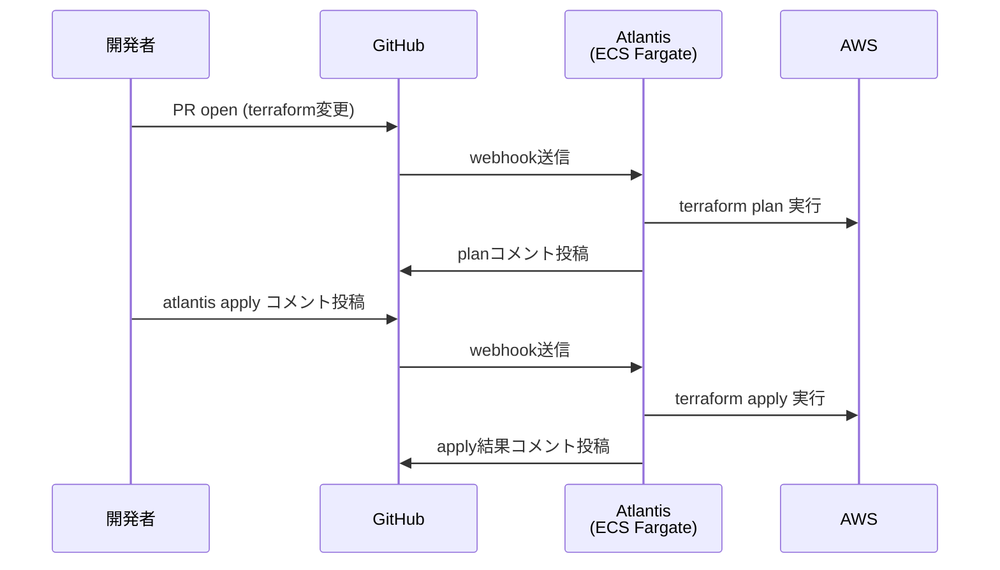
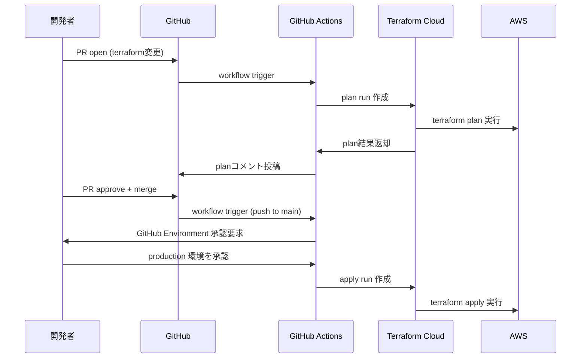

# アーキテクチャ概要

## 図1: Atlantis フロー（Self-hosted on ECS Fargate）

## 図2: Terraform Cloud フロー

## コンポーネント説明

| コンポーネント | 役割 |
|---|---|
| GitHub | PRレビュー・承認・マージの起点 |
| Atlantis (ECS Fargate) | Self-hosted PR automation。webhookを受けてplan/applyを実行 |
| Terraform Cloud | SaaS型PR automation。State管理・UI・監査ログが付属 |
| S3 + DynamoDB | Terraformリモートステートの保存とロック |

---

## Atlantis vs Terraform Cloud 比較

> この表はTakuya本人が体験に基づいて記述すること。AIによる補完禁止。

| 観点 | Atlantis | Terraform Cloud |
|------|----------|-----------------|
| ホスティング | | |
| セットアップ難易度 | | |
| IAM権限管理 | | |
| State管理 | | |
| ワークフローのトリガー | | |
| apply の承認フロー | | |
| 監査ログ | | |
| コスト | | |
| カスタマイズ性 | | |
| チーム向け機能 | | |
| 学習コスト | | |
| 自社導入のしやすさ | | |
