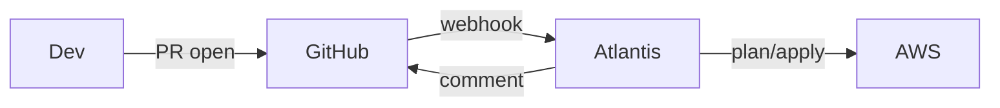

# Zenn記事: AtlantisとTerraform Cloudで学ぶPR-driven IaC

## ターゲット読者
- Terraformは使っているが、チームワークフローを構築したことがない人
- AtlantisかTFCの導入を検討しているインフラエンジニア

---

## 記事構成案

### はじめに
- PR-driven IaCとは何か（1段落）
- なぜ `terraform apply` を手元で叩いてはいけないのか
  - State の競合リスク
  - 誰がいつ何を適用したか追跡できない
  - レビューなしの変更がインフラに入る危険性

### Atlantis編

#### アーキテクチャ（Mermaid図）

#### ECS Fargateへのデプロイのポイント
- FARGATE_SPOT + arm64 でコスト最適化
- NAT Gateway 禁止 → VPC Endpoints のみ
- ALB でヘルスチェックエンドポイント `/healthz` を公開

#### atlantis.yaml の設計
- `when_modified` でplan対象を限定する方法
- `apply_requirements: [approved]` の意味と設定方法

#### apply_requirements の意味
- `approved`: PRのGitHub Approveが必要
- `mergeable`: PRがマージ可能な状態（CI通過）が必要
- 組み合わせることで承認フローを強制できる

### Terraform Cloud編

#### VCS-drivenワークフローの設定
- Workspace を VCS に接続する手順
- Trigger Patterns でplan対象ディレクトリを絞る方法

#### ステートをTFCに移行した手順
- `backend "remote"` への切り替え
- `terraform init -migrate-state` の実行

#### GitHub Environmentとの組み合わせ
- `environment: production` で承認ゲートを設置
- OIDC トークンのスコープを Environment に限定

### 比較表

| 観点 | Atlantis | Terraform Cloud |
|------|----------|-----------------|
| 構築コスト | 高（ECS/ALB/VPC設計が必要） | 低（SaaSのため即利用可） |
| State管理 | S3+DynamoDB（自前） | TFCが内蔵 |
| カスタマイズ | atlantis.yamlで柔軟 | HCL設定に制約あり |
| 監査ログ | CloudWatch Logs | TFC UIで確認可 |
| コスト | ECS Fargate + ALB 実費 | 500リソースまで無料 |

### どちらを選ぶべきか

> この節の結論はTakuya本人が体験から記述すること

- 小〜中規模チーム、AWSシングルアカウント → ?
- 大規模チーム、マルチクラウド → ?
- セキュリティ要件が厳しい（VPC内でplan/apply完結） → ?

### おわりに・参考リンク
- [Atlantis 公式ドキュメント](https://www.runatlantis.io/)
- [Terraform Cloud ドキュメント](https://developer.hashicorp.com/terraform/cloud-docs)
- [このラボのGitHubリポジトリ]() ← 公開後にURL追記
