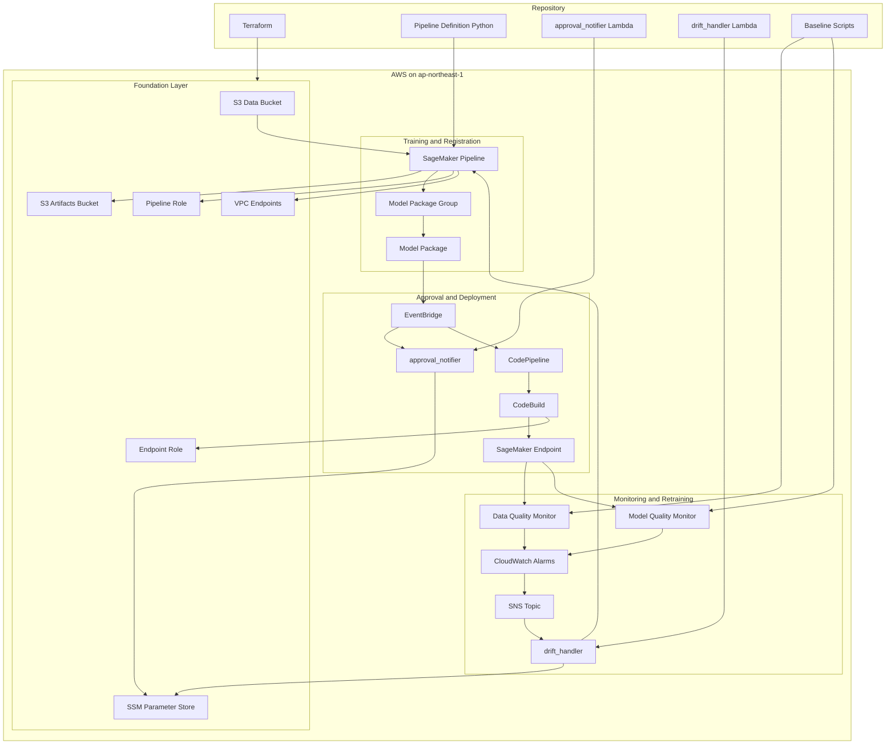
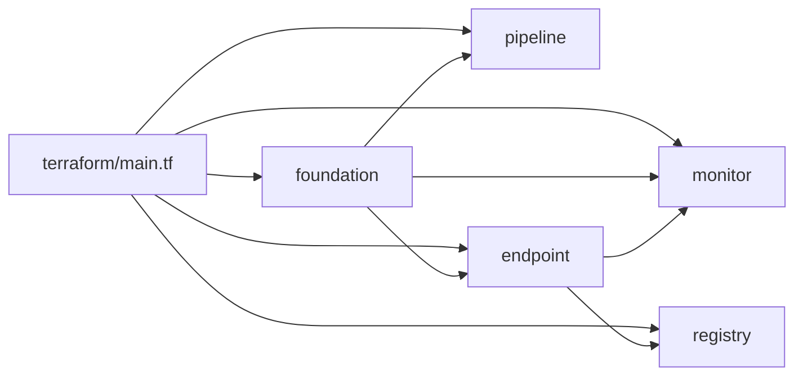
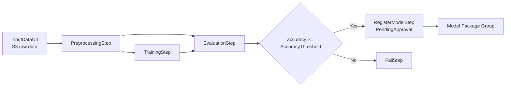
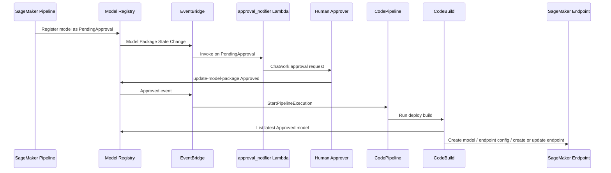
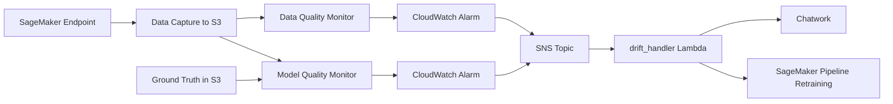

# SageMaker MLOps Pipeline Architecture

## このドキュメントの目的

この `ARCHITECTURE.md` は、このリポジトリの「何が、どこで、どうつながっているか」を実装ベースで理解するための全体解説です。

- Terraform がどの AWS リソースを作るのか
- SageMaker Pipeline がどのように学習を進めるのか
- 承認後にどのようにデプロイされるのか
- モデル劣化をどう検知し、どう再学習へ戻すのか
- どこに設計上の前提や注意点があるのか

README は概要、`docs/adr/` は設計判断、そしてこのファイルは「全体像と実装の対応表」を担います。

## 1. システム全体像



## 2. アーキテクチャの要点

このプロジェクトは、SageMaker を中心にした 5 層構成です。

1. 基盤層
   `foundation` モジュールが S3、IAM、SSM、VPC Endpoint、ECR を作成します。
2. 学習層
   `pipeline/pipeline_definition.py` が Processing → Training → Evaluation → Register の SageMaker Pipeline を定義します。
3. 承認層
   Model Registry に `PendingApproval` で登録し、Lambda が Chatwork に承認依頼を送ります。
4. デプロイ層
   モデルが `Approved` になると EventBridge が CodePipeline を起動し、CodeBuild が SageMaker Endpoint を更新します。
5. 監視層
   Model Monitor がドリフトを監視し、CloudWatch Alarm と Lambda で通知および再学習を行います。

## 3. リポジトリと責務の対応

| パス | 役割 | 主な責務 |
|---|---|---|
| `terraform/` | AWS リソース定義 | モジュール構成、IAM、S3、EventBridge、CodePipeline、Monitor |
| `pipeline/` | 学習パイプライン定義 | SageMaker Pipeline の Python 定義と各ステップビルダー |
| `pipeline/scripts/` | ジョブ実体 | 前処理、学習、評価スクリプト |
| `lambda/approval_notifier/` | 承認通知 | Model Package 状態変化を Chatwork に通知 |
| `lambda/drift_handler/` | 再学習トリガー | ドリフト通知と Pipeline 再実行 |
| `monitor/` | ベースライン生成 | Data Quality / Model Quality の baseline 作成 |
| `docs/adr/` | 設計判断 | SageMaker Pipelines 採用理由や IAM 方針 |
| `tests/unit/` | 単体テスト | 評価 JSON 形式や step builder の期待値確認 |

## 4. Terraform モジュール構成



### 4.1 `foundation`

共通基盤を担当するモジュールです。

- S3
  - `smp-artifacts-{account_id}`: パイプライン成果物、モデル、監視出力
  - `smp-data-{account_id}`: 学習データ、推論用データ、ground truth
- IAM
  - `smp-pipeline-role`: Processing / Training / Evaluation / Register / Monitor 用
  - `smp-endpoint-role`: Endpoint 実行用
  - `smp-lambda-base-role`: SSM 読み取りの共通ベース
- SSM Parameter
  - `/smp/chatwork/room_id`
  - `/smp/chatwork/api_token`
  - `/smp/config/model_approval_threshold`
  - `/smp/config/pipeline_role_arn`
- VPC Endpoint
  - SageMaker API
  - SageMaker Runtime
  - S3
- ECR
  いまの実装はビルトインイメージ中心ですが、将来のカスタムコンテナ対応のためにリポジトリを先に持っています。

### 4.2 `pipeline`

SageMaker Pipeline 本体と Model Package Group を作ります。

- `aws_sagemaker_model_package_group.main`
  `smp-model-group`
- `aws_sagemaker_pipeline.main`
  `terraform/modules/pipeline/pipeline_definition.json` をそのまま AWS に登録

重要なのは、Terraform 自身が Python を解釈しているのではなく、事前生成された JSON を読み込んでいる点です。つまり、実際の設計の源泉は `pipeline/pipeline_definition.py` 側にあります。

### 4.3 `endpoint`

承認済みモデルを推論 Endpoint へ届けるためのモジュールです。

- 初回用の `aws_sagemaker_endpoint_configuration.main`
- 初回用の `aws_sagemaker_endpoint.main`
- 自動デプロイ用 CodePipeline
- 実デプロイを行う CodeBuild
- EventBridge が CodePipeline を起動するための IAM ロール

`endpoint_model_name` が空文字なら Endpoint は作られません。これは「最初のモデルがまだ存在しない」段階でも Terraform を apply できるようにするためです。

### 4.4 `registry`

Model Registry の状態変化をイベント化し、通知とデプロイの接続を作ります。

- `PendingApproval` / `Approved` / `Rejected` を拾う EventBridge Rule
- Chatwork 通知 Lambda
- `Approved` 時に CodePipeline を開始する EventBridge Target

このモジュールは `endpoint` の CodePipeline ARN を参照するため、`terraform/main.tf` では `endpoint` より後に配置されています。

### 4.5 `monitor`

本番運用フェーズの監視と自動再学習をまとめています。

- Data Quality Job Definition
- Model Quality Job Definition
- 1 時間ごとの Monitoring Schedule
- CloudWatch Alarm
- SNS Topic
- `drift_handler` Lambda
- Data Capture 付きの Endpoint Configuration

監視はあくまで「異常を見つけて再学習まで戻す」役割です。新モデルの本番反映は必ず承認フローを経由します。

## 5. 学習パイプラインの実行フロー



### 5.1 パラメータ

`pipeline/pipeline_definition.py` では、以下の実行時パラメータを持ちます。

- `AccuracyThreshold`
  既定値 `0.8`
- `InputDataUri`
  既定値 `s3://{data_bucket}/raw/`

この形にしてあるため、同じパイプライン定義で「データだけ差し替えて再学習」「しきい値だけ変更して評価」などが可能です。

### 5.2 PreprocessingStep

`pipeline/steps/processing.py` と `pipeline/scripts/preprocess.py` が担当します。

- `SKLearnProcessor`
- `ml.m5.large`
- 入力: `raw/` 配下の CSV
- 処理:
  - CSV 連結
  - 欠損値除去
  - 数値列標準化
  - train / test 分割
- 出力:
  - `s3://{artifacts_bucket}/pipeline-artifacts/train`
  - `s3://{artifacts_bucket}/pipeline-artifacts/test`

### 5.3 TrainingStep

`pipeline/steps/training.py` と `pipeline/scripts/train.py` が担当します。

- `XGBoost`
- `ml.m5.xlarge`
- Spot Instance 使用
- `max_run=3600`
- `max_wait=7200`

実装上の重要ポイントは 2 つあります。

- コスト最適化のため `use_spot_instances=True`
- 学習メトリクスを `train:accuracy: <value>` 形式で標準出力し、SageMaker のメトリクス取り込みに合わせている

### 5.4 EvaluationStep

`pipeline/steps/evaluation.py` と `pipeline/scripts/evaluate.py` が担当します。

- 学習済みモデルと test データを使って評価
- `evaluation.json` を出力
- `PropertyFile` 経由で ConditionStep に値を渡す

ConditionStep が読む JSON パスは次です。

```json
classification_metrics.accuracy.value
```

このフォーマットは `tests/unit/test_evaluate.py` でも検証される前提です。つまり、評価 JSON の構造はパイプライン制御の契約そのものです。

### 5.5 ConditionStep と RegisterModelStep

`pipeline/steps/register.py` が担当します。

- `accuracy >= threshold`
  - 合格なら `RegisterModelStep`
  - 不合格なら `FailStep`
- 合格時の登録先
  - `smp-model-group`
- 初期承認状態
  - 必ず `PendingApproval`

ここで自動承認しないことが、このプロジェクトの安全弁です。

## 6. 承認とデプロイの流れ



### 6.1 `approval_notifier` Lambda

`lambda/approval_notifier/handler.py` の役割です。

- EventBridge から Model Package 状態変化イベントを受信
- SSM から Chatwork の room ID と API token を取得
- `PendingApproval` の場合
  - 承認コマンド
  - 却下コマンド
  をメッセージに含めて通知
- `Approved` の場合
  デプロイ開始通知を送信

この Lambda は通知専用です。承認そのものは AWS Console または CLI で人間が行います。

### 6.2 CodePipeline / CodeBuild による自動デプロイ

`terraform/modules/endpoint/codepipeline.tf` の実装では、CodeBuild が以下を行います。

1. Model Registry から最新の `Approved` モデルを取得
2. その Model Package を参照する SageMaker Model を新規作成
3. 新しい Endpoint Configuration を作成
4. Endpoint がなければ `create-endpoint`
5. Endpoint があれば `update-endpoint`

この方式のポイントは、SageMaker の「承認済みモデル」を配布物の起点にしていることです。Git のコミットではなく、Model Registry 上の承認状態がデプロイ条件になります。

## 7. 監視と再学習の流れ



### 7.1 Data Quality Monitor

目的は「入力分布の変化」を検知することです。

- メトリクス
  `feature_baseline_drift_max`
- 閾値
  `0.5`
- スケジュール
  1 時間ごと

baseline は `monitor/data_quality_baseline.py` で生成し、統計値と制約を S3 に置きます。

### 7.2 Model Quality Monitor

目的は「予測精度の劣化」を検知することです。

- 問題タイプ
  `BinaryClassification`
- 閾値
  accuracy が `0.75` 未満
- ground truth 入力
  `s3://{data_bucket}/ground-truth/`

baseline は `monitor/model_quality_baseline.py` で生成します。

### 7.3 `drift_handler` Lambda

`lambda/drift_handler/handler.py` の役割です。

- SNS 経由で Alarm メッセージを受信
- `ALARM` 状態のみ処理
- Chatwork に異常内容を通知
- `smp-training-pipeline` を再実行

重要なのは、この Lambda ができるのは「再学習開始」までで、デプロイはできないことです。IAM も `StartPipelineExecution` に限定されており、承認フローをバイパスできません。

## 8. データの流れ

### 8.1 主要な S3 プレフィックス

| バケット | 主なプレフィックス | 内容 |
|---|---|---|
| Artifacts Bucket | `pipeline-artifacts/train/` | 前処理済み train データ |
| Artifacts Bucket | `pipeline-artifacts/test/` | 前処理済み test データ |
| Artifacts Bucket | `pipeline-artifacts/evaluation/` | `evaluation.json` |
| Artifacts Bucket | `model-artifacts/` | 学習済みモデル |
| Artifacts Bucket | `monitor/data-quality/` | baseline と実行結果 |
| Artifacts Bucket | `monitor/model-quality/` | baseline と実行結果 |
| Artifacts Bucket | `monitor/data-capture/` | Endpoint 入出力キャプチャ |
| Data Bucket | `raw/` | パイプライン入力データ |
| Data Bucket | `ground-truth/` | 監視用の正解ラベル |

### 8.2 データ契約

このプロジェクトはサンプル実装として、次を前提にしています。

- 入力データは CSV
- 目的変数カラム名は `target`
- Model Quality 用 ground truth は別経路で `ground-truth/` に入る

別ユースケースへ転用する場合、最初に見直すべきは `preprocess.py` と `evaluate.py` のデータ契約です。

## 9. IAM とセキュリティ設計

### 9.1 基本方針

- リージョン固定: `ap-northeast-1`
- 認証情報は SSM SecureString に置く
- S3 は public access block 有効
- バケットは SSE-S3 で暗号化
- Lambda は Powertools + X-Ray 前提
- SageMaker 通信は VPC Endpoint を利用

### 9.2 ロールごとの責務分離

| ロール | 主な責務 | 制限意図 |
|---|---|---|
| `smp-pipeline-role` | Processing / Training / Evaluation / Register / Monitor | 学習系に限定 |
| `smp-endpoint-role` | Endpoint 実行 | 推論時の S3 読み取り中心 |
| `smp-approval-notifier-role` | SSM 読み取り、Model Package 参照 | 承認はしない |
| `smp-drift-handler-role` | SSM 読み取り、Pipeline 再実行 | デプロイはしない |
| `smp-codebuild-deploy-role` | Model / Endpoint 作成更新 | 承認済みモデルの配布に限定 |
| `smp-eventbridge-codepipeline-role` | CodePipeline 起動 | 単機能 |

### 9.3 ADR との関係

`docs/adr/ADR-002-sagemaker-role-scoping.md` では Phase 1 時点の暫定方針として `AmazonSageMakerFullAccess` を採用する判断が記録されていますが、現在の Terraform 実装はそこから進み、`foundation/iam.tf` で最小権限寄りのインラインポリシーへ置き換えられています。

これは「ADR は経緯」「コードが現状態」という読み方をすると理解しやすいです。

## 10. 運用上のライフサイクル

### 10.1 初回構築

1. Terraform で foundation / pipeline / registry / endpoint / monitor を作成
2. サンプルデータを `raw/` に配置
3. Pipeline を実行
4. 合格モデルが Model Registry に `PendingApproval` で登録
5. 人間が承認
6. Endpoint が作成または更新
7. baseline を作成して監視を開始

### 10.2 通常の再学習

1. 新データで Pipeline 実行
2. 評価合格なら Registry 登録
3. 人間承認
4. 自動デプロイ

### 10.3 劣化検知後

1. Monitor がアラーム
2. `drift_handler` が通知
3. Pipeline を再実行
4. 新モデルは再び承認待ち
5. 承認後に自動デプロイ

## 11. この実装の設計上の前提と注意点

### 11.1 Endpoint は条件付きでしか作られない

`endpoint_model_name` が空の間は Endpoint が存在しません。これは初回デプロイ前の循環依存を避けるための設計です。

### 11.2 Monitor は baseline がないと十分に機能しない

Terraform だけで Monitor リソースは作れますが、実際の精度ある監視には `monitor/*.py` で baseline を先に生成する必要があります。

### 11.3 Model Quality 監視には ground truth 供給が必要

`ground-truth/` が継続的に更新されないと、Model Quality Monitor は想定どおり機能しません。これはアプリケーション外部の運用設計も必要であることを意味します。

### 11.4 Data Capture 付き Endpoint Config と自動デプロイ経路は分かれている

`monitor` モジュールは Data Capture を有効にした `aws_sagemaker_endpoint_configuration.with_data_capture` を持っています。一方で、`endpoint` モジュールの CodeBuild はデプロイ時に別の Endpoint Configuration を都度 `create-endpoint-config` しています。

そのため、実運用では「デプロイ後の Endpoint に Data Capture 設定が確実に反映されること」を別途確認する必要があります。アーキテクチャ理解としては、監視前提の設定とデプロイ実経路が完全には一本化されていない点を知っておくと安全です。

## 12. このプロジェクトを理解する最短ルート

最初に読むなら次の順がおすすめです。

1. `README.md`
   全体の目的をつかむ
2. `terraform/main.tf`
   モジュール境界と依存をつかむ
3. `pipeline/pipeline_definition.py`
   学習パイプラインの骨格をつかむ
4. `terraform/modules/registry/` と `terraform/modules/endpoint/`
   承認から自動デプロイまでをつかむ
5. `terraform/modules/monitor/` と `lambda/drift_handler/handler.py`
   運用時の自動再学習をつかむ

## 13. まとめ

このリポジトリは、単なる学習パイプラインではなく、以下を一貫してつなぐ MLOps 基盤です。

- データ処理
- モデル学習
- 品質評価
- 人間承認
- 自動デプロイ
- 本番監視
- 劣化時の再学習

特に重要なのは、次の 2 点です。

- 学習と配布の境界が Model Registry の承認で明確に分離されていること
- 監視が再学習を自動化しても、最終デプロイは人間承認を維持していること

この 2 つが、スピードと安全性を両立するこのプロジェクトの中核設計です。
