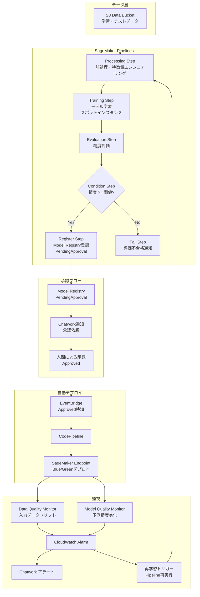

# SageMaker MLOps Pipeline

モデル非依存の汎用MLOpsパイプライン基盤。
データ前処理→学習→評価→承認→デプロイ→監視を完全自動化。

## アーキテクチャ



## 技術スタック

| カテゴリ | 技術 |
|---|---|
| MLパイプライン | Amazon SageMaker Pipelines |
| モデル管理 | SageMaker Model Registry |
| デプロイ | CodePipeline + SageMaker Endpoint (Blue/Green) |
| 監視 | SageMaker Model Monitor (Data Quality / Model Quality) |
| IaC | Terraform >= 1.7 |
| 通知 | Chatwork API |
| CI/CD | GitHub Actions (OIDC認証) |
| Lambda Runtime | Python 3.12 + AWS Lambda Powertools (arm64) |

## パイプラインのフロー

1. **Processing**: データ前処理・特徴量エンジニアリング（`ml.m5.large`）
2. **Training**: XGBoost学習・スポットインスタンスで最大70%コスト削減（`ml.m5.xlarge`）
3. **Evaluation**: 精度評価・accuracy >= 0.8でModel Registryへ登録
4. **Approval**: Chatwork通知 → 人間による承認（`PendingApproval` → `Approved`）
5. **Deploy**: 承認後にCodePipelineが自動起動・Blue/Greenデプロイ（ダウンタイムゼロ）
6. **Monitor**: Data Drift / Model Quality を1時間ごとに監視・劣化で自動再学習トリガー

## セットアップ

### 前提条件

- Terraform >= 1.7
- Python 3.12
- AWS CLI（ap-northeast-1 リージョンへのアクセス権）

### 1. Chatworkパラメータを設定

```bash
aws ssm put-parameter \
  --name /smp/chatwork/room_id \
  --value YOUR_ROOM_ID \
  --type SecureString \
  --region ap-northeast-1

aws ssm put-parameter \
  --name /smp/chatwork/api_token \
  --value YOUR_API_TOKEN \
  --type SecureString \
  --region ap-northeast-1
```

### 2. Terraformデプロイ

```bash
bash scripts/deploy.sh
```

### 3. パイプライン実行・E2Eテスト

```bash
bash scripts/run_pipeline.sh
```

### 4. モデル承認（Chatwork通知確認後）

```bash
aws sagemaker update-model-package \
  --model-package-arn <MODEL_PACKAGE_ARN> \
  --model-approval-status Approved
```

### 5. テスト後のEndpoint削除（コスト節約）

```bash
aws sagemaker delete-endpoint \
  --endpoint-name smp-inference-endpoint \
  --region ap-northeast-1
```

## ディレクトリ構造

```
sagemaker-mlops-pipeline/
├── terraform/
│   └── modules/
│       ├── foundation/   # S3, IAM, ECR, VPC endpoints, SSM
│       ├── pipeline/     # SageMaker Pipeline定義
│       ├── registry/     # Model Registry + 承認フロー + Lambda
│       ├── endpoint/     # SageMaker Endpoint + CodePipeline
│       └── monitor/      # Model Monitor + Lambda + CloudWatch Alarm
├── pipeline/
│   ├── pipeline_definition.py   # SageMaker Pipelines定義
│   └── scripts/                 # Processing/Training/Evaluationスクリプト
├── lambda/
│   ├── approval_notifier/       # 承認依頼Chatwork通知
│   └── drift_handler/           # ドリフト検知 → 再学習トリガー
├── monitor/                     # ベースライン生成スクリプト
├── scripts/
│   ├── deploy.sh                # Terraformデプロイ
│   ├── run_pipeline.sh          # E2Eパイプライン実行
│   └── generate_sample_data.py  # テスト用データ生成
└── docs/
    ├── architecture.md
    └── adr/                     # Architecture Decision Records
```

## コスト設計

| 項目 | 目安 |
|---|---|
| 月額上限 | $15 |
| Training Job | スポットインスタンスで最大70%削減 |
| Endpoint | テスト後に削除（常時起動禁止） |
| Model Monitor | 1時間スケジュール（最小課金単位） |

## セキュリティ

- SageMaker実行ロール: `AmazonSageMakerFullAccess` を廃止し最小権限インラインポリシーに置き換え（[ADR-002](docs/adr/ADR-002-sagemaker-role-scoping.md)）
- S3バケット: パブリックアクセスブロック有効・SSE-S3暗号化
- VPC Endpoint: SageMaker通信をインターネット経由から遮断
- GitHub Actions: OIDC認証（長期クレデンシャル不使用）
