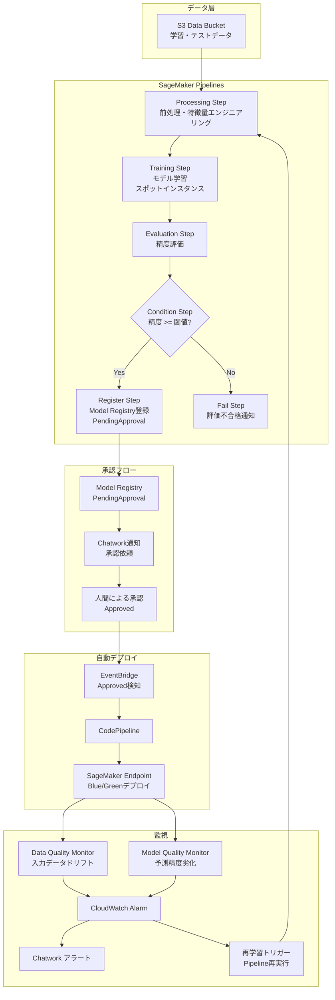

# SageMaker MLOps Pipeline

モデル非依存の汎用 MLOps パイプライン基盤です。  
このハンズオンでは、単にモデルを学習するだけでなく、以下を一通り体験できます。

- SageMaker Pipelines による前処理、学習、評価
- Model Registry への登録
- 人間承認を挟んだ自動デプロイ
- Model Monitor による監視
- ドリフト検知時の再学習トリガー

詳しい全体像は [ARCHITECTURE.md](./ARCHITECTURE.md) を参照してください。

## このハンズオンで得られること

このハンズオンの価値は、「モデルを 1 回学習して終わり」ではなく、ML を運用に乗せる流れをまとめて理解し、実務につながる形で身につけられることです。

- 学習後に何が必要かが分かる
  前処理、学習、評価だけでなく、登録、承認、デプロイ、監視、再学習までの全体像をつかめます。
- MLOps の会話が具体的にできる
  SageMaker Pipeline、Model Registry、承認フロー、Model Monitor などを、概念ではなく実装として説明できるようになります。
- 「安全に本番へ出す」設計を学べる
  精度が基準を満たしたモデルだけを登録し、さらに人間承認を挟んでから本番反映する流れを体験できます。
- ポートフォリオとして説明しやすい
  「モデルを作れます」ではなく、「ML システムを継続運用する基盤を設計できます」と話しやすくなります。

つまりこのハンズオンは、精度の高いモデルを作る練習というより、ML を業務で安全に回す仕組みを学ぶハンズオンです。

## このハンズオンでできること

このプロジェクトの価値は、ML モデルを 1 回作って終わりではなく、「本番運用の流れ」まで通して確認できる点です。

1. 学習データを S3 に置く
2. SageMaker Pipeline が前処理、学習、評価を実行する
3. 精度が閾値を超えたモデルだけを Model Registry に登録する
4. 人が承認したモデルだけを Endpoint にデプロイする
5. 本番運用中のドリフトや精度劣化を監視する
6. 劣化時は自動で再学習を開始し、再び承認フローへ戻す

## アーキテクチャ



## 技術スタック

| カテゴリ | 技術 |
|---|---|
| ML パイプライン | Amazon SageMaker Pipelines |
| モデル管理 | SageMaker Model Registry |
| デプロイ | CodePipeline + SageMaker Endpoint |
| 監視 | SageMaker Model Monitor |
| IaC | Terraform >= 1.7 |
| 通知 | Chatwork API |
| CI/CD | GitHub Actions + OIDC |
| Lambda Runtime | Python 3.12 + AWS Lambda Powertools |

## ディレクトリ構造

```text
sagemaker-mlops-pipeline/
├── terraform/
│   └── modules/
│       ├── foundation/   # S3, IAM, ECR, VPC endpoints, SSM
│       ├── pipeline/     # SageMaker Pipeline定義
│       ├── registry/     # Model Registry + 承認フロー + Lambda
│       ├── endpoint/     # SageMaker Endpoint + CodePipeline
│       └── monitor/      # Model Monitor + Lambda + CloudWatch Alarm
├── pipeline/
│   ├── pipeline_definition.py   # SageMaker Pipelines定義
│   ├── steps/                   # Step builder群
│   └── scripts/                 # Processing/Training/Evaluationスクリプト
├── lambda/
│   ├── approval_notifier/       # 承認依頼Chatwork通知
│   └── drift_handler/           # ドリフト検知 → 再学習トリガー
├── monitor/                     # ベースライン生成スクリプト
├── scripts/
│   ├── deploy.sh                # Terraformデプロイ
│   ├── run_pipeline.sh          # E2Eパイプライン実行
│   └── generate_sample_data.py  # テスト用データ生成
├── docs/
│   └── adr/
└── ARCHITECTURE.md
```

## ハンズオン全体の流れ

この README では、次の順番で進めます。

1. 開発環境を整える
2. AWS と Chatwork の前提を準備する
3. Terraform を初期化、検証する
4. インフラをデプロイする
5. サンプルデータでパイプラインを実行する
6. Model Registry 上のモデルを承認する
7. Endpoint にデプロイされたことを確認する
8. 推論テストを行う
9. 監視用 baseline を生成する
10. 後片付けをする

## 前提条件

- AWS アカウント
- `ap-northeast-1` を利用できる権限
- Terraform `>= 1.7`
- Python `3.12`
- AWS CLI
- Chatwork の `room_id` と API token

補足:

- このハンズオンでは Terraform の `apply` はユーザー自身が実行してください
- `scripts/deploy.sh` は内部で `terraform apply` を実行します
- Endpoint は課金対象なので、検証後は削除を推奨します

## 0. 作業前チェック

このリポジトリでは venv の使用が前提です。

```bash
cd /home/takuya/terraform-lab/sagemaker-mlops-pipeline

python3 -m venv .venv
source .venv/bin/activate

which python
ls .venv
```

期待する状態:

- `which python` が `.venv/bin/python` を指す
- `.venv/` が存在する

必要な Python パッケージを入れます。

```bash
pip install -r pipeline/requirements.txt
pip install -r monitor/requirements.txt
pip install -r lambda/approval_notifier/requirements.txt
pip install -r lambda/drift_handler/requirements.txt
pip install terraform-compliance || true
```

補足:

- ルート直下の `requirements.txt` は現在存在しないため、ここではディレクトリごとの requirements を使います
- `terraform-compliance` はこのハンズオンの必須ではありません

## 1. AWS 認証とリージョンを確認する

```bash
aws sts get-caller-identity
aws configure get region
```

リージョンが `ap-northeast-1` でない場合は、コマンドごとに `--region ap-northeast-1` を付けるか、環境変数を設定してください。

```bash
export AWS_DEFAULT_REGION=ap-northeast-1
```

## 2. Chatwork 用 SSM パラメータを準備する

通知 Lambda は以下の SSM Parameter を参照します。

- `/smp/chatwork/room_id`
- `/smp/chatwork/api_token`

初回は次を実行してください。

```bash
aws ssm put-parameter \
  --name /smp/chatwork/room_id \
  --value YOUR_ROOM_ID \
  --type SecureString \
  --overwrite \
  --region ap-northeast-1

aws ssm put-parameter \
  --name /smp/chatwork/api_token \
  --value YOUR_API_TOKEN \
  --type SecureString \
  --overwrite \
  --region ap-northeast-1
```

確認:

```bash
aws ssm get-parameters \
  --names /smp/chatwork/room_id /smp/chatwork/api_token \
  --with-decryption \
  --region ap-northeast-1 \
  --query 'Parameters[].Name'
```

何がうれしいか:

- パラメータを Terraform やコードに直書きしなくてよい
- 通知 Lambda がデプロイ後すぐに参照できる

## 3. Terraform を初期化して検証する

まずは `terraform init` と `terraform validate` を行います。

```bash
cd terraform
terraform init
terraform validate
terraform fmt -check -recursive
cd ..
```

補足:

- CI でも `terraform init -backend=false` と `terraform validate` を実行します
- ローカルでは通常の `terraform init` で問題ありません

## 4. Terraform 変数の前提を把握する

このハンズオンでは、主に次の変数が重要です。

| 変数 | 既定値 | 意味 |
|---|---|---|
| `environment` | `dev` | 環境名 |
| `model_approval_threshold` | `0.8` | 評価合格しきい値 |
| `endpoint_instance_type` | `ml.t2.medium` | 推論 Endpoint のサイズ |
| `endpoint_model_name` | `""` | 初回作成時に空なら Endpoint 未作成 |
| `powertools_layer_version` | `79` | Lambda Powertools layer |

特に `endpoint_model_name` が空文字の間は Endpoint は作られません。これは初回学習前にまだデプロイ対象モデルが存在しないためです。

## 5. インフラをデプロイする

このプロジェクトでは、ユーザー自身が Terraform 実行を行います。最も簡単なのは補助スクリプトを使う方法です。

```bash
bash scripts/deploy.sh
```

このスクリプトは内部で次を段階的に実行します。

1. `module.foundation`
2. `module.pipeline`
3. `module.registry` と `module.endpoint`
4. `module.monitor`
5. 残り全体
6. Chatwork 用 SSM パラメータ確認

成功時の見どころ:

- S3 バケット
  - `smp-artifacts-{account_id}`
  - `smp-data-{account_id}`
- SageMaker Pipeline
  - `smp-training-pipeline`
- Model Package Group
  - `smp-model-group`
- Lambda
  - `smp-approval-notifier`
  - `smp-drift-handler`

補足:

- `scripts/deploy.sh` は `terraform apply -auto-approve` を実行します
- まず中身を確認したい場合は、`terraform/` 配下で `terraform plan` を先に実行してください

## 6. Terraform 出力値を確認する

デプロイ後は、後続手順で使う値を確認します。

```bash
cd terraform
terraform output
terraform output -raw pipeline_role_arn
terraform output -raw pipeline_name
cd ..
```

特によく使う出力:

- `pipeline_role_arn`
- `pipeline_name`
- `artifacts_bucket_name`
- `data_bucket_name`

## 7. サンプルデータでパイプラインを実行する

E2E 実行は補助スクリプトで進められます。

```bash
bash scripts/run_pipeline.sh
```

このスクリプトがやっていること:

1. `scripts/generate_sample_data.py` で分類データを生成
2. `s3://smp-data-{account_id}/raw/sample_data.csv` にアップロード
3. `pipeline/pipeline_definition.py --action upsert` で Pipeline 定義を AWS に反映
4. `smp-training-pipeline` を起動
5. 完了までポーリング

期待する結果:

- `Succeeded` で完了する
- Model Registry に新しい Model Package が作成される
- Chatwork に承認依頼が届く

失敗時の見方:

```bash
aws sagemaker list-pipeline-execution-steps \
  --pipeline-execution-arn <EXECUTION_ARN> \
  --query 'PipelineExecutionSteps[?StepStatus==`Failed`]' \
  --output json \
  --region ap-northeast-1
```

## 8. Model Registry の新モデルを確認する

パイプライン成功後、最新の Model Package ARN を取得します。

```bash
aws sagemaker list-model-packages \
  --model-package-group-name smp-model-group \
  --sort-by CreationTime \
  --sort-order Descending \
  --max-results 1 \
  --query 'ModelPackageSummaryList[0].ModelPackageArn' \
  --output text \
  --region ap-northeast-1
```

状態確認:

```bash
aws sagemaker list-model-packages \
  --model-package-group-name smp-model-group \
  --query 'ModelPackageSummaryList[].{Arn:ModelPackageArn,Status:ModelApprovalStatus}' \
  --output table \
  --region ap-northeast-1
```

ここで最初は `PendingApproval` になっているはずです。

## 9. モデルを承認して自動デプロイを起動する

Chatwork 通知の内容を確認したうえで、ユーザー自身で承認します。

```bash
aws sagemaker update-model-package \
  --model-package-arn <MODEL_PACKAGE_ARN> \
  --model-approval-status Approved \
  --region ap-northeast-1
```

何が起きるか:

1. Model Package の状態が `Approved` になる
2. EventBridge がそのイベントを検知する
3. CodePipeline が自動起動する
4. CodeBuild が最新 Approved モデルを使って Endpoint を作成または更新する

## 10. Endpoint デプロイ完了を確認する

```bash
aws sagemaker describe-endpoint \
  --endpoint-name smp-inference-endpoint \
  --query 'EndpointStatus' \
  --output text \
  --region ap-northeast-1
```

期待する状態:

- `Creating`
- `Updating`
- 最終的に `InService`

うまくいかない場合:

```bash
aws sagemaker describe-endpoint \
  --endpoint-name smp-inference-endpoint \
  --region ap-northeast-1 \
  --query '{Status:EndpointStatus,FailureReason:FailureReason}'
```

CodePipeline 側も確認できます。

```bash
aws codepipeline get-pipeline-state \
  --name smp-deploy-pipeline \
  --region ap-northeast-1
```

## 11. 推論テストを行う

Endpoint が `InService` になったら、簡単な推論を実行します。

```bash
aws sagemaker-runtime invoke-endpoint \
  --endpoint-name smp-inference-endpoint \
  --content-type text/csv \
  --body "1.0,0.5,-0.3,1.2,0.8,0.1,-0.5,1.1,0.3,-0.2" \
  --region ap-northeast-1 \
  /tmp/response.json

cat /tmp/response.json
```

これで「学習済みモデルが本当に公開され、推論できる」と確認できます。

## 12. Model Monitor の baseline を生成する

監視を実用的にするには baseline が必要です。まず必要な値を取り出します。

```bash
ROLE_ARN=$(cd terraform && terraform output -raw pipeline_role_arn)
ACCOUNT_ID=$(aws sts get-caller-identity --query Account --output text)
ARTIFACTS_BUCKET="smp-artifacts-${ACCOUNT_ID}"
DATA_BUCKET="smp-data-${ACCOUNT_ID}"
```

### 12-1. Data Quality baseline

```bash
python monitor/data_quality_baseline.py \
  --role-arn "$ROLE_ARN" \
  --artifacts-bucket "$ARTIFACTS_BUCKET" \
  --data-bucket "$DATA_BUCKET"
```

### 12-2. Model Quality baseline

```bash
python monitor/model_quality_baseline.py \
  --role-arn "$ROLE_ARN" \
  --artifacts-bucket "$ARTIFACTS_BUCKET" \
  --endpoint-name smp-inference-endpoint
```

何が起きるか:

- Data Quality baseline は入力データ分布の基準を作る
- Model Quality baseline は予測精度の基準を作る

## 13. 監視状態を確認する

### Monitoring Schedule

```bash
aws sagemaker list-monitoring-schedules \
  --query 'MonitoringScheduleSummaries[].{Name:MonitoringScheduleName,Status:MonitoringScheduleStatus}' \
  --output table \
  --region ap-northeast-1
```

### CloudWatch Alarm

```bash
aws cloudwatch describe-alarms \
  --alarm-name-prefix smp- \
  --query 'MetricAlarms[].{Name:AlarmName,State:StateValue}' \
  --output table \
  --region ap-northeast-1
```

## 14. よくあるハマりどころ

### Chatwork 通知が来ない

確認ポイント:

- `/smp/chatwork/room_id`
- `/smp/chatwork/api_token`
- Lambda ログ

```bash
aws logs tail /aws/lambda/smp-approval-notifier --follow --region ap-northeast-1
aws logs tail /aws/lambda/smp-drift-handler --follow --region ap-northeast-1
```

### Pipeline が失敗する

よくある原因:

- `sample_data.csv` がアップロードされていない
- Spot capacity 不足で学習が遅延または失敗
- 精度が閾値 `0.8` に届かず `FailStep` に入る

### Endpoint が作られない

考えられる理由:

- モデル承認をまだ行っていない
- CodePipeline が失敗している
- CodeBuild の IAM または SageMaker API 呼び出しで失敗している

## 15. コストに関する注意

| 項目 | 注意点 |
|---|---|
| Training Job | Spot 利用でコスト最適化 |
| Endpoint | 常時課金されるため検証後は削除推奨 |
| Model Monitor | 1 時間ごとに監視ジョブが走る |
| S3 | モデルと成果物を継続保存する |

とくに Endpoint は放置するとコストが積み上がりやすいので注意してください。

## 16. クリーンアップ

最小限の後片付けは Endpoint 削除です。

```bash
aws sagemaker delete-endpoint \
  --endpoint-name smp-inference-endpoint \
  --region ap-northeast-1
```

全体を片付ける場合は、ユーザー自身で Terraform を実行してください。

```bash
cd terraform
terraform destroy -var="environment=dev"
cd ..
```

補足:

- S3 バケット内のデータが残っていると destroy に失敗することがあります
- 学習済みモデルや成果物を残したい場合は事前に退避してください

## 17. 次に読むと理解が深まる資料

- [ARCHITECTURE.md](./ARCHITECTURE.md)
- [docs/adr/ADR-001-pipeline-over-stepfunctions.md](./docs/adr/ADR-001-pipeline-over-stepfunctions.md)
- [docs/adr/ADR-002-sagemaker-role-scoping.md](./docs/adr/ADR-002-sagemaker-role-scoping.md)
