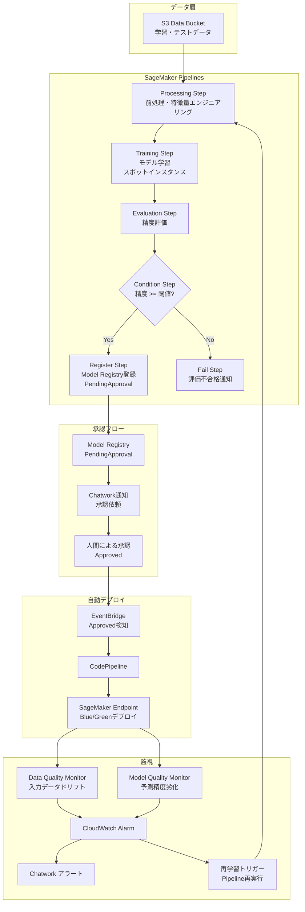

# SageMaker MLOps Pipeline アーキテクチャ

## 全体構成図

## コンポーネント説明

| コンポーネント | 役割 |
|---|---|
| S3 Data Bucket | 学習・テスト・ベースラインデータの格納 |
| S3 Artifacts Bucket | モデルアーティファクト・Pipeline中間成果物の格納 |
| SageMaker Pipelines | ML workflowのオーケストレーション |
| Model Registry | モデルバージョン管理・承認フロー |
| EventBridge | 承認イベントのトリガー |
| CodePipeline | Endpointへの自動デプロイ |
| Model Monitor | データドリフト・モデル品質の継続監視 |
| Lambda | Chatwork通知・再学習トリガー |
| SSM Parameter Store | シークレット・設定値の一元管理 |
