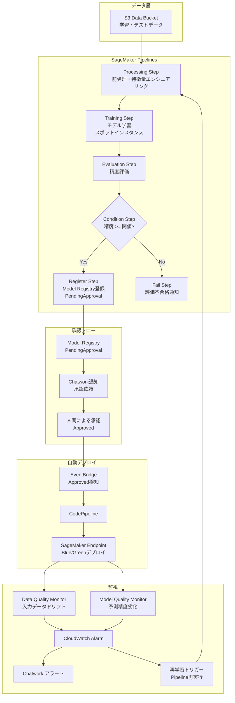

# ✅Phase 1: 基盤インフラ構築

## このフェーズで作成するもの

SageMaker MLOpsパイプラインの基盤となるAWSリソースをTerraformで実装する。
S3・IAM・ECR・VPC Endpoint・SSMを整備し、後続フェーズの土台を作る。

---

## 前提確認

- プロジェクトルート: `sagemaker-mlops-pipeline/`
- CLAUDE.mdをすでに読み込んでいること
- リージョン: `ap-northeast-1`
- Terraformバージョン: >= 1.7

---

## タスク一覧

### 1. ディレクトリ構造の作成

CLAUDE.mdに記載のディレクトリ構造をすべて作成すること。
空ディレクトリには `.gitkeep` を配置。

### 2. terraform/locals.tf の作成

```hcl
locals {
  prefix      = "smp"
  environment = var.environment
  region      = "ap-northeast-1"
  account_id  = data.aws_caller_identity.current.account_id

  common_tags = {
    Project     = "sagemaker-mlops-pipeline"
    Environment = var.environment
    ManagedBy   = "terraform"
    Owner       = "takuya"
  }
}
```

### 3. terraform/variables.tf の作成

以下の変数を定義:
- `environment`: string, default = "dev"
- `model_approval_threshold`: number, default = 0.8（評価精度の合格閾値）
- `training_spot_instance`: bool, default = true（スポットインスタンス使用フラグ）

### 4. terraform/modules/foundation/ の実装

#### S3バケット（2種）

**アーティファクトバケット**:
- バケット名: `${local.prefix}-artifacts-${local.account_id}`
- 用途: モデルアーティファクト・Pipeline定義・評価レポートの保存
- パブリックアクセスブロック: すべて有効
- バージョニング: 有効
- SSE-S3暗号化
- ライフサイクル:
  - `pipeline-artifacts/` プレフィックス: 90日後に削除
  - `model-artifacts/` プレフィックス: 365日後に削除
- 日本語コメント: 「SageMaker Pipelinesのすべての中間成果物とモデルを保存するバケット」

**データバケット**:
- バケット名: `${local.prefix}-data-${local.account_id}`
- 用途: 学習データ・テストデータ・ベースラインデータの保存
- パブリックアクセスブロック: すべて有効
- SSE-S3暗号化
- 日本語コメント: 「学習・推論・Model Monitor用データを格納。本番では別アカウントからのクロスアカウントアクセスを想定」

#### ECRリポジトリ（2種）

**Processingコンテナ**:
- リポジトリ名: `${local.prefix}-processing`
- イメージスキャン: `scan_on_push = true`
- イメージタグ不変性: `IMMUTABLE`
- ライフサイクルポリシー: 最新10イメージのみ保持
- 日本語コメント: 「カスタム前処理ロジックを含むコンテナ。ビルトインイメージで対応できない場合に使用」

**Trainingコンテナ**:
- リポジトリ名: `${local.prefix}-training`
- 同様の設定

#### IAM: SageMaker Pipeline実行ロール

- ロール名: `${local.prefix}-pipeline-role`
- 信頼ポリシー: `sagemaker.amazonaws.com`
- アタッチするマネージドポリシー:
  - `AmazonSageMakerFullAccess`（後続フェーズで段階的に絞る方針。ADRに記録）
- インラインポリシー（追加権限）:
  - S3: `GetObject`, `PutObject`, `ListBucket` on `smp-artifacts-*`, `smp-data-*`
  - ECR: `GetAuthorizationToken`, `BatchGetImage`, `GetDownloadUrlForLayer`
  - CloudWatch: `PutMetricData`, `CreateLogGroup`, `CreateLogStream`, `PutLogEvents`
  - 日本語コメント: 「SageMaker PipelinesがProcessing/Training/Evaluationジョブを実行するための権限。AmazonSageMakerFullAccessは初期段階の便宜上の付与で、ADR-002に絞り込み計画を記録」

#### IAM: SageMaker Endpoint実行ロール

- ロール名: `${local.prefix}-endpoint-role`
- 信頼ポリシー: `sagemaker.amazonaws.com`
- インラインポリシー:
  - S3: `GetObject` on `smp-artifacts-*`（モデルアーティファクト読み取り）
  - CloudWatch: メトリクス・ログ書き込み
  - 日本語コメント: 「推論エンドポイントがモデルアーティファクトを読み込むための最小権限ロール」

#### IAM: Lambda実行ロール（通知・ハンドラー共通ベース）

- ロール名: `${local.prefix}-lambda-base-role`
- 信頼ポリシー: `lambda.amazonaws.com`
- マネージドポリシー: `AWSLambdaBasicExecutionRole`, `AWSXRayDaemonWriteAccess`
- インラインポリシー:
  - SSM: `GetParameter`, `GetParameters` on `/smp/*`
  - 日本語コメント: 「全LambdaのベースロールChatwork通知に必要なSSMアクセスを付与」

#### VPC Endpoints

- `com.amazonaws.ap-northeast-1.sagemaker.api`
- `com.amazonaws.ap-northeast-1.sagemaker.runtime`
- `com.amazonaws.ap-northeast-1.s3`（Gatewayタイプ）
- 日本語コメント: 「SageMakerとS3の通信をAWSネットワーク内に閉じるためのVPCエンドポイント。本番環境でのデータ漏洩リスクを低減」
- **注意**: VPCエンドポイントはデフォルトVPCへのアタッチで実装。専用VPCが必要な場合はコメントで提示。

#### SSM Parameter Store

以下のパラメータを作成（値はダミー）:
- `/smp/chatwork/room_id`: SecureString, value = "REPLACE_ME"
- `/smp/chatwork/api_token`: SecureString, value = "REPLACE_ME"
- `/smp/config/model_approval_threshold`: String, value = "0.8"
- `/smp/config/pipeline_role_arn`: String, value = "WILL_BE_SET_BY_TERRAFORM"（apply後に自動更新）

#### CloudWatch Logs ロググループ

以下を事前作成（保持期間14日）:
- `/aws/lambda/smp-approval-notifier`
- `/aws/lambda/smp-drift-handler`
- `/aws/sagemaker/pipelines/smp-training-pipeline`

### 5. terraform/main.tf の作成

```hcl
terraform {
  required_version = ">= 1.7"
  required_providers {
    aws = {
      source  = "hashicorp/aws"
      version = ">= 5.0"
    }
  }
  # S3バックエンド（本番環境では有効化）
  # backend "s3" {
  #   bucket = "tfstate-smp-{account_id}"
  #   key    = "sagemaker-mlops-pipeline/terraform.tfstate"
  #   region = "ap-northeast-1"
  # }
}

provider "aws" {
  region = "ap-northeast-1"
  default_tags {
    tags = local.common_tags
  }
}

data "aws_caller_identity" "current" {}
data "aws_region" "current" {}
```

### 6. terraform/outputs.tf の作成

以下をアウトプット:
- `artifacts_bucket_name`
- `data_bucket_name`
- `pipeline_role_arn`
- `endpoint_role_arn`
- `lambda_base_role_arn`
- `processing_ecr_uri`
- `training_ecr_uri`

### 7. docs/architecture.md の作成

以下のMermaidアーキテクチャ図を含むドキュメントを作成:



### 8. docs/adr/ の作成

**ADR-001-pipeline-over-stepfunctions.md**:
- タイトル: SageMaker PipelinesをStep Functionsより優先した理由
- 決定: SageMaker Pipelines採用
- 理由: ML専用のステップタイプ（ProcessingStep/TrainingStep/RegisterModel）が組み込み。実験追跡・モデルリネージュがネイティブに管理される
- トレードオフ: Step Functionsより柔軟性は低いが、MLOpsに必要な機能の網羅性が高い

**ADR-002-sagemaker-role-scoping.md**:
- タイトル: SageMaker実行ロールのAmazonSageMakerFullAccess一時採用
- 決定: Phase 1では便宜上 `AmazonSageMakerFullAccess` を使用、Phase 5で最小権限ポリシーに置き換える
- 理由: 初期段階で必要な権限を洗い出すため。本番化前に必ず絞り込む

### 9. .gitignore の作成

```
.terraform/
*.tfstate
*.tfstate.backup
*.tfvars
__pycache__/
*.pyc
.env
.venv/
dist/
*.egg-info/
.sagemaker/
```

---

## 完了条件

- [ ] `terraform validate` が通ること
- [ ] `terraform plan` でエラーが出ないこと
- [ ] ディレクトリ構造がCLAUDE.mdと一致すること
- [ ] すべてのTerraformリソースに `tags = local.common_tags` が付与されていること
- [ ] ADR 2本が作成されていること

---

## 実装後の確認コマンド

```bash
cd terraform
terraform init
terraform validate
terraform fmt -check
terraform plan -var="environment=dev"
```

---

## 次フェーズの予告

Phase 2では以下を実装する:
- SageMaker Pipeline定義（Python SDK）: Processing → Training → Evaluation → Condition → Register
- 各ステップのスクリプト（preprocess.py / train.py / evaluate.py）
- スポットインスタンスによるコスト最適化設定
- Pipeline定義のTerraform管理（aws_sagemaker_pipeline リソース）