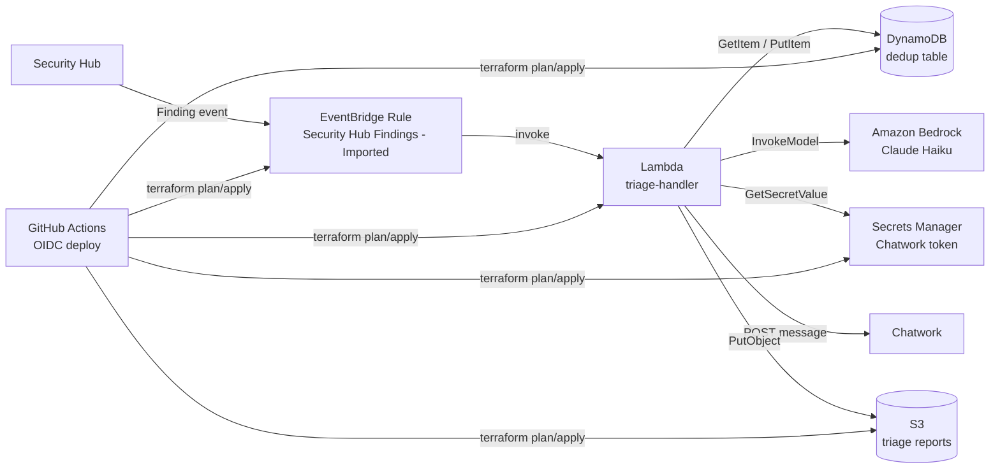
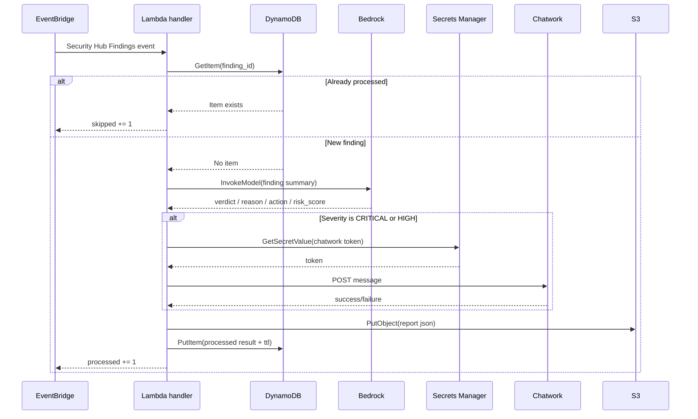
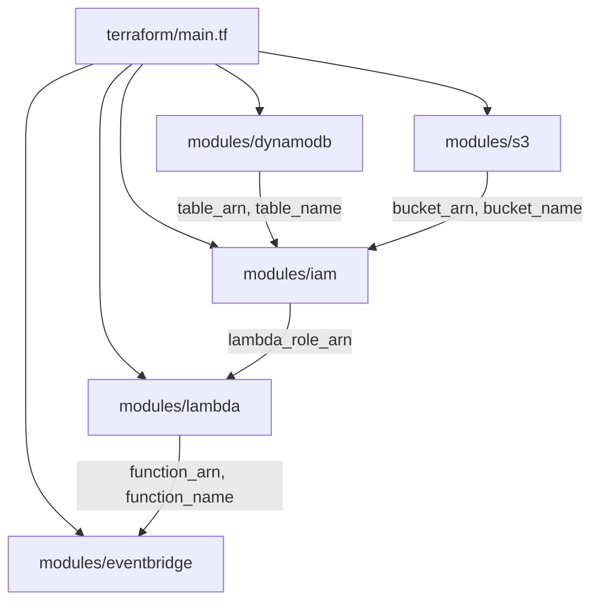
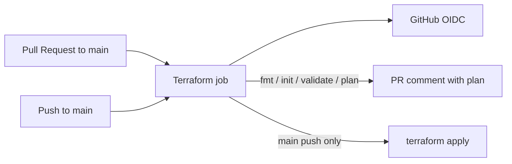

# ARCHITECTURE

## 1. このドキュメントの目的

このドキュメントは `security-hub-ai-triage` プロジェクトを、実装ベースで完全に理解するための設計書です。  
README のセットアップ手順を補完し、以下を一つの場所にまとめます。

- 何を解決するシステムか
- AWS 上でどのリソースがどう連携するか
- Lambda が 1 件の Finding をどう処理するか
- Terraform のモジュール分割と依存関係
- セキュリティ設計と運用上の注意点
- 現在の実装上の制約や、README とコードの差分

このドキュメントは主に次の実装を参照しています。

- `terraform/`
- `lambda/triage_handler/`
- `.github/workflows/deploy.yml`

---

## 2. システム概要

このプロジェクトは、AWS Security Hub の Finding をイベント駆動で受け取り、Amazon Bedrock で自動トリアージし、重要なものだけを Chatwork に通知しつつ、全件を S3 に保存するサーバレスシステムです。

### 解決したい課題

Security Hub は継続的に多数の Finding を出力します。すべてを人手で確認すると、次の問題が起きます。

- 高頻度の通知で運用者が疲弊する
- 同一 Finding の再通知が多く、優先度判断がぶれる
- 後から監査や振り返りをしたいときに履歴が散らばる

このシステムはそれに対して、次の方針を取っています。

- EventBridge で Findings を自動受信する
- DynamoDB で重複処理を防ぐ
- Bedrock で日本語の運用判断を補助する
- Chatwork 通知は `CRITICAL` / `HIGH` に絞る
- 全件の詳細レポートは S3 に残す

---

## 3. 全体アーキテクチャ



### 一言でいうと

- 実行面は「`Security Hub -> EventBridge -> Lambda`」の一直線なイベント処理です
- 判定補助は Bedrock、状態管理は DynamoDB、証跡保管は S3、外部通知は Chatwork が担います
- 構築面は Terraform と GitHub Actions による自動化です

---

## 4. 実行時データフロー

### 4.1 イベント起点

Security Hub から `Security Hub Findings - Imported` イベントが EventBridge に流れます。  
EventBridge ルールは重大度 `CRITICAL / HIGH / MEDIUM / LOW` の Findings を対象に Lambda を起動します。

対象実装:

- `terraform/modules/eventbridge/main.tf`

### 4.2 Lambda の責務

Lambda `triage-handler` は以下を順番に行います。

1. EventBridge イベントから `detail.findings` を取得
2. Finding ID ごとに DynamoDB を見て重複確認
3. 未処理なら Bedrock にトリアージ依頼
4. `CRITICAL` / `HIGH` のみ Chatwork 通知
5. Finding 原文 + AI 判定結果を S3 に保存
6. 処理済みメタデータを DynamoDB に記録

対象実装:

- `lambda/triage_handler/handler.py`

### 4.3 1 Finding のシーケンス図



### 4.4 返却値

Lambda は最後に集計結果を返します。

```json
{
  "processed": 1,
  "skipped": 0,
  "notified": 1
}
```

これは主にログや手動テストで確認するためのサマリで、後続サービスに渡すためのものではありません。

---

## 5. コンポーネント別の詳細設計

## 5.1 EventBridge

役割:

- Security Hub の Finding イベントを受ける入口
- 重大度フィルタを行う
- Lambda 起動トリガーになる

設計ポイント:

- イベント種別は `Security Hub Findings - Imported`
- フィルタ対象は `Severity.Label`
- Lambda への invoke 権限は `aws_lambda_permission` で明示付与

対象実装:

- `terraform/modules/eventbridge/main.tf`

注意点:

- `INFORMATIONAL` は対象外です
- フィルタは EventBridge 側なので、Lambda 実行回数そのものも抑えられます

## 5.2 Lambda: triage-handler

役割:

- オーケストレーター
- 各サブモジュールの呼び出し順序を管理
- 集計とログ出力を担当

内部依存:

- `BedrockClient`
- `ChatworkNotifier`
- `DedupChecker`
- `ReportSaver`

処理の特徴:

- `detail.findings` の配列を順番に処理する
- 例外で全体停止しないよう、外部通知や AI 判定はなるべく吸収する設計
- 重複 Finding は早期 return ではなく `continue` でスキップ

対象実装:

- `lambda/triage_handler/handler.py`

## 5.3 BedrockClient

役割:

- Security Hub の生 Finding を LLM に渡し、運用向け判断へ変換する

入出力:

- 入力: タイトル、重大度、リソース種別、リソース ID、説明、リージョン
- 出力: `verdict`, `reason`, `action`, `risk_score`

判定フォーマット:

```json
{
  "verdict": "即対応 | 監視継続 | 無視可能",
  "reason": "日本語の理由",
  "action": "推奨アクション",
  "risk_score": 1
}
```

設計ポイント:

- `invoke_model` で Bedrock Runtime を直接呼び出す
- `ThrottlingException` のみ指数バックオフで最大 3 回再試行
- JSON パース失敗時は安全なデフォルト値を返して処理継続
- デフォルト判定は `監視継続 / risk_score=5`

対象実装:

- `lambda/triage_handler/bedrock_client.py`

重要な実装上の事実:

- README では「Claude Haiku」と説明されており、コードでもデフォルトモデルは `anthropic.claude-haiku-4-5`
- Terraform 変数 `bedrock_model_id` から Lambda 環境変数へ注入されるため、モデル差し替えはコード変更なしで可能

## 5.4 DedupChecker

役割:

- 同じ Finding の再処理防止

保存内容:

- `finding_id`
- `processed_at`
- `verdict`
- `risk_score`
- `ttl`

設計ポイント:

- DynamoDB の hash key は `finding_id`
- `GetItem` で存在確認
- `PutItem` で処理済み記録
- TTL は日本時間基準で「処理時刻 + 7 日」

対象実装:

- `lambda/triage_handler/dedup_checker.py`
- `terraform/modules/dynamodb/main.tf`

意図:

- EventBridge の再配信や同一 Finding の再流入に対して冪等性を持たせる

制約:

- 条件付き書き込みではなく単純な `PutItem` なので、完全な同時実行競合回避まではしていません
- ただし一般的な単発イベント処理では十分実用的です

## 5.5 ChatworkNotifier

役割:

- 高優先度 Finding のみ Chatwork へ送る

設計ポイント:

- トークンは環境変数に直書きせず Secrets Manager から取得
- 同一 Lambda 実行中はトークンをインスタンス内キャッシュ
- 通知失敗時も Lambda 全体を失敗させない
- 通知文面は日本語で、AI 判定と推奨アクションまで含める

対象実装:

- `lambda/triage_handler/chatwork_notifier.py`

通知条件:

- `Severity.Label` が `CRITICAL` または `HIGH`

つまり:

- `MEDIUM` / `LOW` は AI 判定と S3 保存までは行う
- ただし Chatwork には送らない

## 5.6 ReportSaver

役割:

- 全 Finding の完全な証跡を S3 に残す

保存内容:

- 元の Security Hub Finding
- AI トリアージ結果
- 処理時刻
- 使用モデル ID

オブジェクトキー形式:

```text
findings/YYYY/MM/DD/<safe_finding_id>.json
```

設計ポイント:

- Finding ID の `/` と `:` を `-` に変換して安全なキー名にする
- `ensure_ascii=False` で日本語をそのまま保存
- Content-Type は `application/json`

対象実装:

- `lambda/triage_handler/report_saver.py`

価値:

- 後から AI 判断の妥当性を見直せる
- Chatwork 通知に出なかった `MEDIUM` / `LOW` も監査可能

## 5.7 IAM

役割:

- Lambda 実行ロールとインラインポリシーを定義する

許可される主な操作:

- `bedrock:InvokeModel`
- `dynamodb:GetItem`
- `dynamodb:PutItem`
- `s3:PutObject`
- `logs:CreateLogGroup`
- `logs:CreateLogStream`
- `logs:PutLogEvents`
- `secretsmanager:GetSecretValue`

設計ポイント:

- Bedrock は指定モデル ARN のみに制限
- DynamoDB は dedup テーブル ARN のみに制限
- S3 は対象バケット配下のオブジェクト書き込みのみに制限
- Secrets Manager は Chatwork 用シークレット ARN のみに制限

対象実装:

- `terraform/modules/iam/main.tf`

評価:

- このプロジェクトで最も重要なセキュリティ設計の一つです
- `*` 権限を避け、用途単位でかなり絞り込まれています

## 5.8 S3

役割:

- トリアージレポートの永続保管

保護設定:

- Public Access Block 有効
- バージョニング有効
- SSE-S3 (`AES256`) 有効

対象実装:

- `terraform/modules/s3/main.tf`

補足:

- バケット名には AWS アカウント ID が入り、アカウント内で一意になります

---

## 6. Terraform 構成

Terraform はルートモジュール 1 つと、機能単位の子モジュール群で構成されています。



### 6.1 ルートモジュールの責務

`terraform/main.tf` は次を行います。

- provider 定義
- 共通タグ設定
- 各子モジュールへの変数受け渡し
- モジュール間依存の接続

### 6.2 モジュール一覧

| モジュール | 役割 | 主な出力 |
|---|---|---|
| `modules/dynamodb` | 重複排除テーブル | `table_name`, `table_arn` |
| `modules/s3` | レポート保管バケット | `bucket_name`, `bucket_arn` |
| `modules/iam` | Lambda 実行ロール | `lambda_role_arn` |
| `modules/lambda` | triage-handler 本体 | `function_name`, `function_arn` |
| `modules/eventbridge` | Security Hub 起動ルール | `rule_name`, `rule_arn` |

### 6.3 変数の流れ

主な入力変数:

- `project_name`
- `environment`
- `aws_region`
- `chatwork_secret_arn`
- `chatwork_room_id`
- `bedrock_model_id`

このうち `chatwork_secret_arn`, `chatwork_room_id`, `bedrock_model_id` は最終的に Lambda の環境変数へ流れます。

### 6.4 Lambda パッケージング

`modules/lambda/main.tf` は `archive_file` データソースを使って、`lambda/triage_handler/` を ZIP 化します。

実装上のポイント:

- ソースディレクトリ全体を ZIP 化する
- 出力先は `lambda/triage_handler.zip`
- `source_code_hash` を設定して変更検知を Terraform に伝える

注意:

- CI では `terraform validate/plan` の前に手動で ZIP ビルドも行っています
- 一方で Terraform 側も `archive_file` を使っているため、ビルド方式が二重化しています

---

## 7. GitHub Actions / デプロイ構成



### 実施内容

`deploy.yml` は次の順で処理します。

1. ソースコード checkout
2. OIDC で AWS 認証
3. Terraform セットアップ
4. `terraform fmt -check -recursive`
5. `terraform init`
6. `terraform validate`
7. Lambda ZIP 作成
8. `terraform plan`
9. PR の場合は plan 結果をコメント
10. `main` への push の場合は `terraform apply`

対象実装:

- `.github/workflows/deploy.yml`

### このプロジェクトにおける意味

- インフラ変更の見える化
- PR 時点での事前検証
- `main` マージ後の自動反映

### 注意点

- 現在のリポジトリ実装は `main` push 時に `terraform apply` まで自動実行します
- これは運用方針としては強力ですが、変更管理を厳密にしたい場合は手動承認ステップを追加する余地があります

---

## 8. セキュリティ設計

## 8.1 良い点

- IAM 権限が用途別に絞られている
- Chatwork トークンを Secrets Manager に置いている
- S3 バケットは公開ブロック + 暗号化 + バージョニング
- Finding 原文を保持するため、判断根拠の監査がしやすい
- Bedrock エラー時に処理停止せず、安全側のデフォルト判定へフォールバックする

## 8.2 重要な設計判断

### 通知対象を `CRITICAL/HIGH` に限定

これはノイズ抑制のための判断です。  
すべて通知すると運用疲れが起きるため、`MEDIUM/LOW` は証跡保存だけ行い、人間の割り込みを減らしています。

### AI 判定は補助、最終ソースは S3 の原文

AI の出力は便利ですが誤判定の可能性は残ります。  
そのため、元の Finding を丸ごと S3 に保存し、後から人が再確認できる設計になっています。

### トークンは Secrets Manager から遅延取得

Lambda の環境変数に直接 API トークンを置かないため、漏えいリスクを下げています。

---

## 9. 可観測性と運用

### ログ

CloudWatch Logs に以下が出ます。

- 処理対象 Finding の開始ログ
- 重複スキップログ
- Bedrock リトライ警告
- Chatwork 通知失敗ログ
- S3 保存ログ
- 最終サマリログ

### 保存される運用データ

| 保存先 | 内容 | 目的 |
|---|---|---|
| DynamoDB | 処理済み記録、判定、TTL | 重複排除 |
| S3 | 元 Finding + AI 判定結果 | 監査、後追い分析 |
| CloudWatch Logs | 実行ログ | 障害解析 |
| Chatwork | 高優先度通知 | 即応 |

### 運用者が追うべき観点

- Chatwork 通知失敗が増えていないか
- Bedrock のスロットリングが多発していないか
- Lambda タイムアウトが起きていないか
- S3 レポートが継続保存されているか
- DynamoDB TTL で dedup レコードが適切に消えているか

---

## 10. 実装ベースで見た制約・注意点

## 10.1 Lambda 依存ライブラリの扱い

`requirements.txt` には `boto3>=1.34.0` のみ記載されています。  
CI では `pip install -t ./package` を使って同梱しています。

意味すること:

- AWS 管理ランタイム付属の `boto3` に完全依存していない
- 実行時バージョン差異を減らす意図がある

## 10.2 重複排除は厳密なロックではない

`GetItem` のあと `PutItem` する構造なので、完全同時に同じ Finding が走った場合の競合制御はありません。  
必要なら将来的に `ConditionExpression attribute_not_exists(finding_id)` を使う改善余地があります。

## 10.3 Lambda ZIP ビルドが二重化している

- Terraform: `archive_file`
- GitHub Actions: `pip install` + `zip`

このため、どちらを正とするか運用ルールを揃えると理解しやすくなります。

## 10.4 README とコードの差分に注意

実装を確認すると、少なくとも次の点は「README を読むだけでは見落としやすい」部分です。

- EventBridge ルール名は README の記述と完全一致ではなく、実装では `-findings-rule-` を含む
- Lambda 関数は README 説明どおり Chatwork を `CRITICAL/HIGH` のみに限定している
- CI は plan だけでなく `main` push 時に apply まで自動実行する

この `ARCHITECTURE.md` は、README より実装を優先して説明しています。

---

## 11. 典型的な処理シナリオ

### シナリオ A: `HIGH` の新規 Finding

1. Security Hub が Finding を発行
2. EventBridge が Lambda を起動
3. DynamoDB に記録がない
4. Bedrock が `即対応` を返す
5. Chatwork に通知
6. S3 に詳細レポート保存
7. DynamoDB に 7 日 TTL 付きで記録

結果:

- `processed=1`
- `notified=1`

### シナリオ B: 同じ Finding の再流入

1. EventBridge が再度 Lambda を起動
2. DynamoDB に `finding_id` が存在
3. その Finding は即スキップ

結果:

- Bedrock も Chatwork も S3 保存も実行されない
- `skipped=1`

### シナリオ C: Bedrock 失敗

1. Bedrock 呼び出しで例外、または JSON パース失敗
2. デフォルト結果 `監視継続 / risk_score=5` を返す
3. 重大度が `HIGH` 以上ならその結果で Chatwork 通知
4. S3 と DynamoDB には処理記録を残す

結果:

- AI 失敗でもパイプライン全体は止まらない

---

## 12. ディレクトリマップ

```text
.
├── .github/workflows/deploy.yml         # Terraform CI/CD
├── lambda/triage_handler/
│   ├── handler.py                       # オーケストレーター
│   ├── bedrock_client.py                # AI トリアージ
│   ├── chatwork_notifier.py             # Chatwork 通知
│   ├── dedup_checker.py                 # 重複排除
│   ├── report_saver.py                  # S3 保存
│   └── requirements.txt                 # Lambda 依存
└── terraform/
    ├── main.tf                          # ルートモジュール
    ├── variables.tf                     # 入力変数
    ├── outputs.tf                       # 出力値
    └── modules/
        ├── dynamodb/                    # dedup テーブル
        ├── eventbridge/                 # 受信ルール
        ├── iam/                         # Lambda 実行権限
        ├── lambda/                      # 関数デプロイ
        └── s3/                          # レポート保管
```

---

## 13. 将来の改善候補

- DynamoDB の条件付き書き込みで重複排除をさらに厳密にする
- CloudWatch Metrics / Alarm を追加して通知失敗や Bedrock 異常を検知する
- S3 ライフサイクルで古いレポートの保管コストを最適化する
- Lambda Powertools を導入して構造化ログ・メトリクス・トレースを強化する
- `terraform apply` に承認ゲートを入れて本番変更管理を強化する
- Lambda パッケージング方式を一本化して CI と Terraform の責務を明確にする

---

## 14. まとめ

このプロジェクトは、Security Hub の検出結果を AI で要約・判断補助しつつ、通知ノイズを抑え、証跡も残すことに重点を置いたサーバレス構成です。

設計の芯は次の 3 点です。

- EventBridge + Lambda によるシンプルなイベント駆動
- DynamoDB による実用的な重複排除
- Bedrock による日本語トリアージと S3 への完全保存

実装は小さくまとまっていますが、通知、証跡、冪等性、最小権限 IAM、CI/CD まで一通り揃っており、セキュリティ運用自動化の最小構成として理解しやすい構造になっています。
