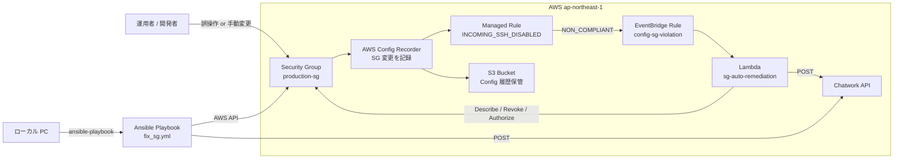
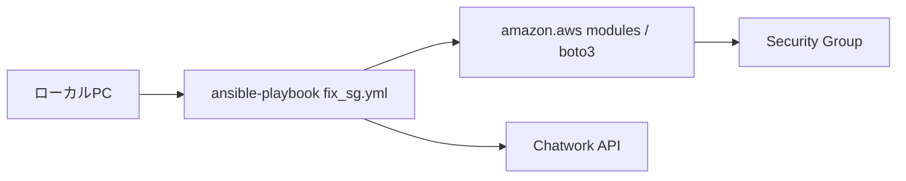
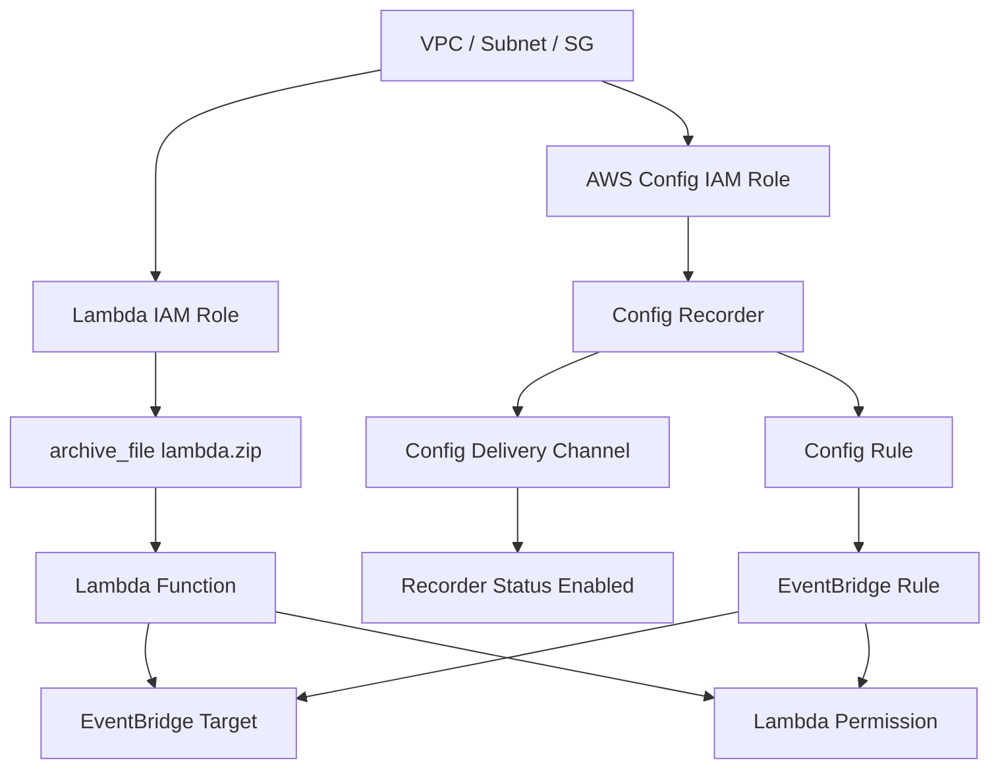

# ARCHITECTURE

## 1. このドキュメントの目的

この `self-healing-infra` プロジェクトは、AWS Config を使って Security Group の設定ドリフトを検知し、Lambda が自動修復し、Chatwork に通知する「自己修復インフラ」の最小構成を学ぶためのハンズオンです。

README は手順中心ですが、このドキュメントは以下を目的にしています。

- どのコンポーネントが何を担当しているかを一目で理解する
- Terraform / Lambda / Ansible の責務分担を整理する
- 自動修復と手動修復の違いを明確にする
- 依存関係、イベントの流れ、設計上の意図と制約を残す

---

## 2. 一言でいうと

このプロジェクトは、`production-sg` に対して誤って `0.0.0.0/0:22` が追加されたときに、

1. AWS Config が違反を検知し
2. EventBridge が Lambda を起動し
3. Lambda が SG のインバウンドルールを全削除して
4. 正しい SSH ルール `10.0.0.0/8 -> tcp/22` だけを再適用し
5. Chatwork に修復完了を通知する

という閉ループを作っています。

Ansible は自動修復の本体ではなく、ローカル PC から同じ修復ポリシーを手動で再適用するための補助経路です。

---

## 3. 全体像

### 3.1 システム構成図



### 3.2 自動経路と手動経路

| 経路 | 主役 | 実行場所 | 役割 |
|---|---|---|---|
| 自動修復 | Lambda | AWS | Config 違反イベントに即応して修復する本番経路 |
| 手動修復 | Ansible | ローカル PC | 動作確認、検証、強制再適用を行う運用補助経路 |

重要なのは、**修復ポリシー自体は Lambda と Ansible で揃っている**ことです。どちらも「今あるルールを信頼せず、一度全削除してから正しい状態だけを書き戻す」という考え方を採用しています。

---

## 4. リポジトリ構成と責務

```text
self-healing-infra/
├── README.md
├── ARCHITECTURE.md
├── CLAUDE.md
├── terraform/
│   ├── main.tf
│   ├── config.tf
│   └── lambda.tf
├── lambda/
│   └── handler.py
├── ansible/
│   ├── ansible.cfg
│   └── playbooks/
│       └── fix_sg.yml
└── self-healing-infra-handson.html
```

### 4.1 `terraform/main.tf`

基盤となる AWS リソースを定義しています。

- VPC `10.0.0.0/16`
- Private Subnet `10.0.1.0/24`
- 監視対象 SG `production-sg`
- Lambda 実行ロール
- AWS Config 実行ロール
- EventBridge から Lambda を呼ぶ権限

### 4.2 `terraform/config.tf`

ドリフト検知とイベント連携を定義しています。

- AWS Config Recorder
- Config 履歴保管用 S3 バケット
- Delivery Channel
- Config Rule `no-unrestricted-ssh`
- EventBridge Rule / Target

### 4.3 `terraform/lambda.tf`

Lambda デプロイを定義しています。

- `lambda/` ディレクトリを zip 化
- Lambda 関数 `sg-auto-remediation`
- Chatwork 通知用の環境変数注入

### 4.4 `lambda/handler.py`

自動修復の本体です。

- Config イベントから `resourceId` を取得
- SG の現在ルールを取得
- インバウンドルールを全削除
- 正しい SSH ルールのみ再適用
- Chatwork に結果通知

### 4.5 `ansible/playbooks/fix_sg.yml`

ローカルからの手動修復経路です。

- `hosts: localhost`
- `connection: local`
- `amazon.aws.ec2_security_group` で SG を再構成
- Chatwork に通知

---

## 5. インフラ構成の詳細

### 5.1 ネットワーク

このハンズオンでは EC2 は存在せず、VPC と Subnet は「Security Group を載せる土台」として登場します。

| リソース | 値 | 役割 |
|---|---|---|
| VPC CIDR | `10.0.0.0/16` | サンプル環境の論理ネットワーク |
| Subnet CIDR | `10.0.1.0/24` | Private Subnet の例 |
| 準拠 SSH ルール | `10.0.0.0/8 -> tcp/22` | SG のあるべき状態 |
| Egress | `0.0.0.0/0` all | 外向き通信を許可 |

### 5.2 監視対象 Security Group

`aws_security_group.production` はこのプロジェクトの中心です。

- 名前: `production-sg`
- 初期状態では SSH は `10.0.0.0/8` のみ許可
- ここに `0.0.0.0/0 -> 22` を追加すると違反として検知される

この SG は「実際に守りたい本番 SG の縮図」として扱われます。

---

## 6. ドリフト検知の仕組み

### 6.1 Config Recorder

`aws_config_configuration_recorder.main` は、全リソースではなく **Security Group だけ** を記録対象にしています。

```hcl
recording_group {
  all_supported  = false
  resource_types = ["AWS::EC2::SecurityGroup"]
}
```

この設計には 2 つの意図があります。

- 学習対象を SG に絞ってわかりやすくする
- Config の課金対象を必要最小限に抑える

### 6.2 Config Rule

`aws_config_config_rule.no_unrestricted_ssh` は、AWS Managed Rule `INCOMING_SSH_DISABLED` を使っています。

このルールは、SSH ポート 22 が広く公開されていないかを判定します。つまり、このプロジェクトでは「あるべき状態」を Lambda の中だけでなく、**AWS Config の準拠判定ルールとしても明文化している**ことになります。

### 6.3 履歴保存

Config Recorder が収集した構成履歴は、`config-remediation-<account_id>` という S3 バケットに配送されます。

- バケットはアカウント ID 付きで一意化
- `force_destroy = true`
- AWS Config サービスプリンシパルだけが必要な `GetBucketAcl` / `PutObject` を持つ

---

## 7. 自動修復フロー

### 7.1 イベントシーケンス図

```mermaid
sequenceDiagram
    participant Actor as 操作者
    participant SG as Security Group
    participant Config as AWS Config
    participant Rule as Config Rule
    participant EB as EventBridge
    participant Lambda as Lambda
    participant CW as Chatwork

    Actor->>SG: 0.0.0.0/0 -> tcp/22 を追加
    SG-->>Config: 変更イベント
    Config->>Rule: 準拠評価
    Rule-->>EB: NON_COMPLIANT
    EB->>Lambda: イベント送信
    Lambda->>SG: DescribeSecurityGroups
    Lambda->>SG: RevokeSecurityGroupIngress(全削除)
    Lambda->>SG: AuthorizeSecurityGroupIngress(10.0.0.0/8 のみ)
    Lambda->>CW: 修復完了通知
```

### 7.2 Lambda の処理内容

Lambda は次の 3 関数に責務分割されています。

| 関数 | 役割 |
|---|---|
| `lambda_handler` | EventBridge/Config イベントの受信と全体制御 |
| `remediate_sg` | SG のルール全削除と準拠ルール再適用 |
| `notify_chatwork` | Chatwork API への通知 |

### 7.3 修復アルゴリズム

Lambda の修復戦略は「差分修正」ではなく「全消しして正解を書き戻す」です。

```text
1. SG の現在の IpPermissions を取得
2. 既存インバウンドルールをすべて revoke
3. ALLOWED_SSH_CIDRS に定義した CIDR だけで 22/tcp を authorize
```

この方式のメリット:

- 想定外ルールが何個あっても最終状態を一定にできる
- ロジックが単純で検証しやすい
- Ansible 側の `purge_rules: true` と同じ思想で揃えられる

この方式の注意点:

- 正常な追加ルールが別途存在していても消える
- 現状は「22/tcp を internal CIDR のみ許可する 1 ルール」に強く固定されている

つまりこのプロジェクトは、汎用 SG 修復エンジンではなく、**単一ポリシーを強く維持するためのハンズオン構成**です。

---

## 8. 手動修復フロー

### 8.1 位置づけ

Ansible は Lambda の代替ではなく、以下のための補助経路です。

- 自動修復前の dry-run 検証
- 手元からの再適用
- Lambda 不調時の手動オペレーション

### 8.2 実行モデル



### 8.3 Playbook の特徴

- `hosts: localhost`
- `connection: local`
- SSH 接続先ホストなし
- AWS API を直接呼ぶ
- `purge_rules: true` でインバウンドルールを完全リセット

ここでも「対象サーバーに入って設定変更する Ansible」ではなく、「ローカル PC 自体が AWS API クライアントとして動く Ansible」になっています。

---

## 9. Terraform 上の依存関係

### 9.1 構築順のイメージ



### 9.2 依存関係のポイント

- Config Recorder は Delivery Channel がないと有効化できない
- そのため `aws_config_configuration_recorder_status.main` は `depends_on = [aws_config_delivery_channel.main]`
- EventBridge Target は Lambda ARN に依存する
- EventBridge から Lambda 呼び出しには `aws_lambda_permission.allow_eventbridge` が必要
- Lambda の zip は `archive_file` によって `lambda/` ディレクトリから生成される

この依存関係を明示しているため、Terraform apply 後に Config が記録開始できない、あるいは EventBridge から Lambda が呼べない、といった初期化ミスを減らしています。

---

## 10. IAM 設計

### 10.1 Lambda 実行ロール

Lambda 実行ロール `sg-remediation-lambda-role` には次の権限が付与されています。

- `AWSLambdaBasicExecutionRole`
- インラインポリシー:
  - `ec2:DescribeSecurityGroups`
  - `ec2:AuthorizeSecurityGroupIngress`
  - `ec2:RevokeSecurityGroupIngress`

これは「修復に必要な最小限」にかなり近い設計です。ただし `Resource = "*"` のため、現状は特定 SG に限定されていません。ハンズオンとしては十分ですが、実運用なら対象 SG や VPC を絞る余地があります。

### 10.2 AWS Config ロール

`aws-config-role` には AWS 管理ポリシー `AWS_ConfigRole` を付与しています。Config Recorder が対象リソースを評価し、履歴を配送するためのロールです。

### 10.3 EventBridge からの実行権限

`aws_lambda_permission.allow_eventbridge` によって、`config-sg-violation` ルールだけが `sg-auto-remediation` を呼べるようにしています。

---

## 11. 通知設計

通知先は Chatwork です。Lambda と Ansible の両方が同じ通知チャネルを使います。

| 実装 | 方法 |
|---|---|
| Lambda | `urllib.request` で Chatwork API に POST |
| Ansible | `uri` モジュールで Chatwork API に POST |

環境変数:

- `CHATWORK_API_TOKEN`
- `CHATWORK_ROOM_ID`

Lambda では Terraform の変数から環境変数に注入し、Ansible ではローカルシェルの環境変数を `lookup('env', ...)` で参照しています。

この差分は重要です。

- Lambda は AWS 側にデプロイされた時点の設定を使う
- Ansible は実行者のローカル環境に依存する

---

## 12. 設計判断

### 12.1 Lambda で修復する理由

自動修復の本体を Lambda にした理由は次の通りです。

- 常時待機のサーバーが不要
- EventBridge と自然に接続できる
- boto3 で SG の修復が単純に書ける
- ハンズオンとして理解しやすい

### 12.2 Ansible を残している理由

Ansible は必須ではありませんが、教育的価値があります。

- IaC とは別の運用自動化レイヤーを示せる
- 手動検証の導線を用意できる
- 「同じ desired state を別の経路から再適用する」という考え方を学べる

### 12.3 SG の全リセット方式を採用する理由

差分ベースの修正よりも、状態強制型の方がこのテーマに向いています。

- ドリフトを確実に取り除ける
- 実装が短く、誤解が少ない
- ハンズオン参加者が挙動を追いやすい

---

## 13. 制約と限界

この構成は学習用として非常に良い一方で、実運用では次の制約があります。

### 13.1 単一ユースケースに固定

- 監視対象は `INCOMING_SSH_DISABLED` のみ
- 修復対象は `tcp/22` のみ
- 許可 CIDR は `10.0.0.0/8` 固定

### 13.2 正常な追加ルールも消える

修復時にインバウンドルールを全削除するため、仮に別用途の正当なルールが存在しても消えます。

### 13.3 Config 依存の遅延

「秒単位」で修復できる設計ではあるものの、厳密には AWS Config の評価タイミングに依存します。リアルタイムではなく、イベント反映まで数秒のラグがあります。

### 13.4 Chatwork 通知失敗時の再試行なし

Lambda の通知処理には明示的な retry 制御や dead-letter queue がありません。SG 修復後に通知だけ失敗する可能性があります。

---

## 14. セキュリティと運用上の観点

### 14.1 良い点

- Lambda 実行ロールの権限は比較的絞られている
- Config Recorder は SG のみに限定している
- EventBridge の起動元は特定ルールに限定している
- 外部ライブラリを追加せずシンプルな実装にしている

### 14.2 今後強化できる点

- Lambda IAM を対象 SG 単位にさらに絞る
- Chatwork API トークンを Terraform 変数直渡しではなく Secrets Manager / SSM に寄せる
- Lambda に失敗通知や DLQ を追加する
- 修復前後の差分を CloudWatch Logs や DynamoDB に残す
- SSH 以外の禁止ルールにも展開する

---

## 15. 典型的な運用シナリオ

### 15.1 想定フロー

1. 誰かが `production-sg` に一時対応のつもりで `0.0.0.0/0:22` を追加する
2. AWS Config が違反を検知する
3. EventBridge が Lambda を起動する
4. Lambda が不正ルールを含む全インバウンドルールを削除する
5. Lambda が `10.0.0.0/8 -> 22/tcp` のみを再投入する
6. Chatwork に「自己修復完了」が投稿される

### 15.2 障害時の代替フロー

Lambda が失敗した場合でも、運用者はローカルから次を実行して同じ desired state を再適用できます。

```bash
ansible-playbook ansible/playbooks/fix_sg.yml -e "sg_id=<sg-id>"
```

---

## 16. このプロジェクトで学べる設計原則

- **Detect**: AWS Config でドリフトを検知する
- **Route**: EventBridge で違反イベントだけを流す
- **Remediate**: Lambda で機械的に正しい状態へ戻す
- **Notify**: Chatwork で人間に透明性を持たせる
- **Reapply**: Ansible で手動でも同じ desired state を再適用できる

つまりこれは、単なる SG 修復サンプルではなく、**「宣言した正しい状態を守り続ける」ための最小 self-healing loop** を学ぶ教材です。

---

## 17. 実装ファイル対応表

| ファイル | 内容 | このドキュメントで対応する章 |
|---|---|---|
| `terraform/main.tf` | VPC / SG / IAM / Lambda Permission | 4, 5, 9, 10 |
| `terraform/config.tf` | Config Recorder / Rule / EventBridge / S3 | 4, 6, 9 |
| `terraform/lambda.tf` | Lambda パッケージングとデプロイ | 4, 9, 11 |
| `lambda/handler.py` | 自動修復ロジック | 7, 11, 13 |
| `ansible/playbooks/fix_sg.yml` | 手動修復ロジック | 8, 11 |
| `README.md` | ハンズオン手順 | 補助資料 |

---

## 18. まとめ

このプロジェクトは、Security Group という単一の設定対象に対して、

- **Terraform** で土台を作り
- **AWS Config** で違反を検知し
- **EventBridge** でイベントをつなぎ
- **Lambda** で自動修復し
- **Ansible** で手動再適用経路も持ち
- **Chatwork** で人間に通知する

という、非常に理解しやすい自己修復アーキテクチャになっています。

実装は小さいですが、SRE / IaC / Event-Driven Remediation の重要な考え方がコンパクトに詰まっています。
