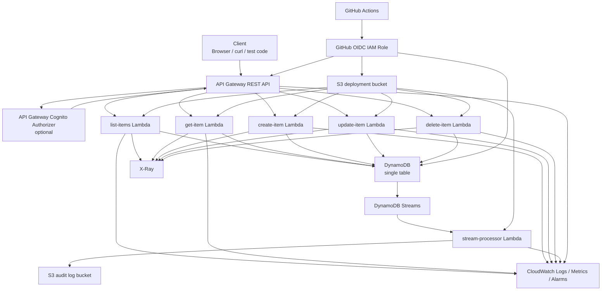
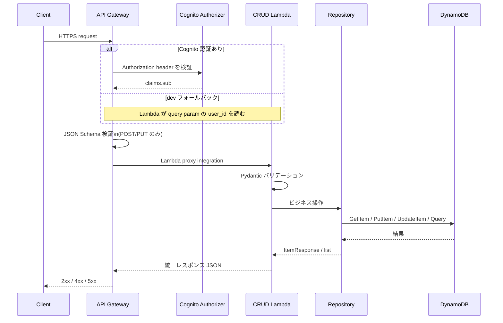
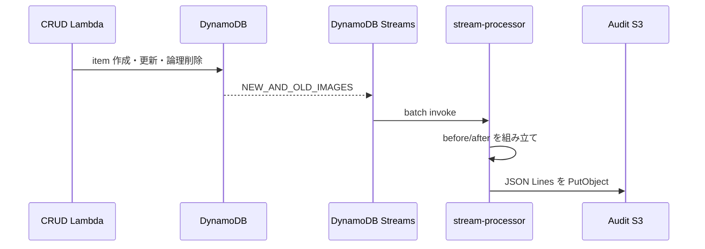
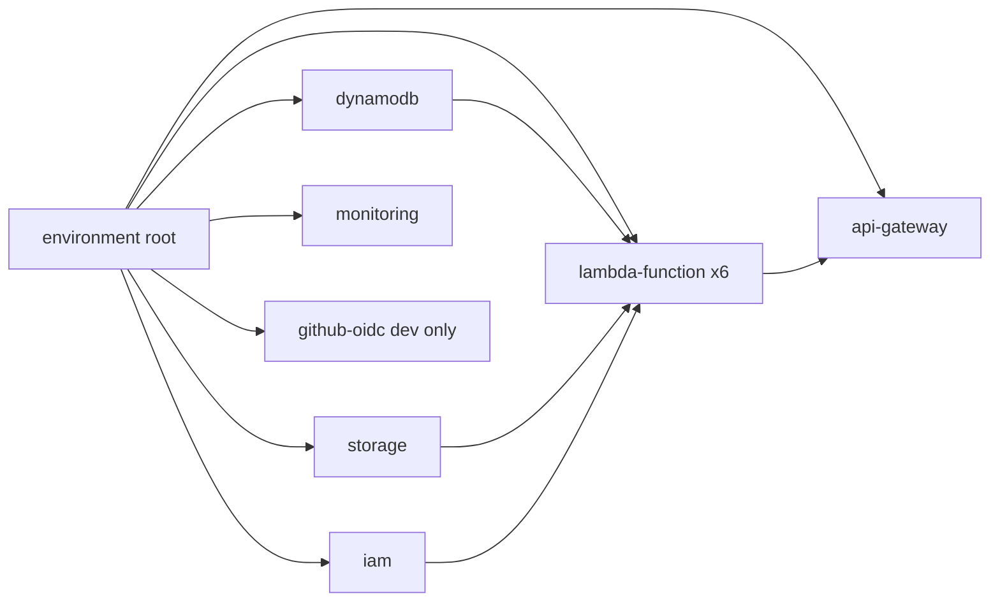
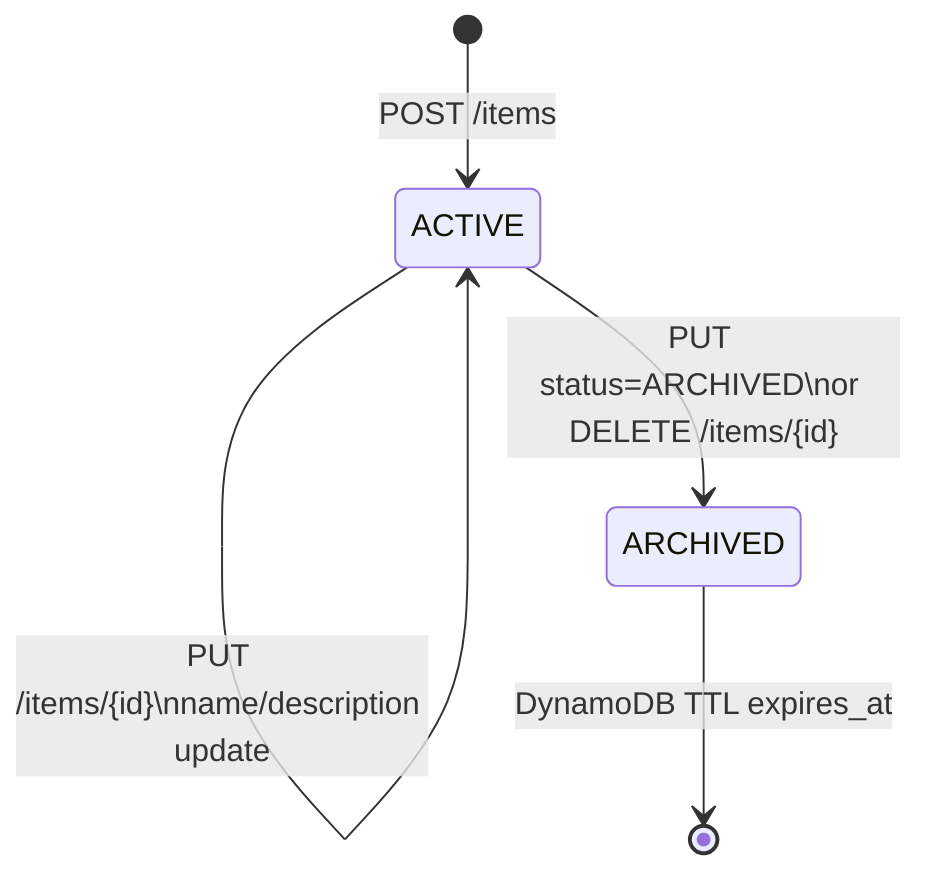
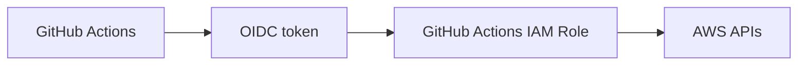
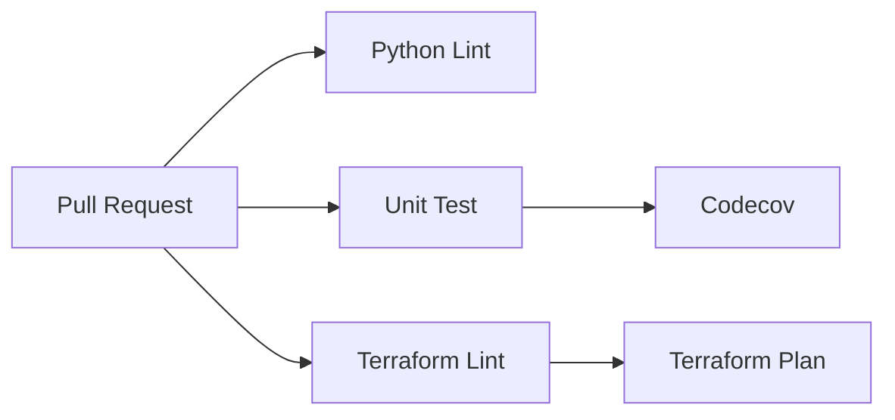
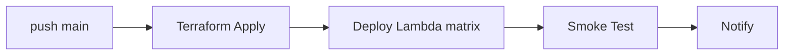

# ARCHITECTURE

このドキュメントは、`serverless-api-platform` の実装をコードベースから読み解いた「現状のアーキテクチャ解説」です。README の要約版ではなく、Terraform・Lambda・テスト・GitHub Actions をまたいで、何がどうつながっているかを一気通貫で理解するための資料として作成しています。

## 1. このプロジェクトは何を作るのか

このリポジトリは、AWS 上に構築するサーバーレスなアイテム管理 API 基盤です。中核のユースケースはシンプルな CRUD ですが、実装テーマは CRUD そのものではなく、以下を一つの構成で揃えることにあります。

- API Gateway + Lambda + DynamoDB によるサーバーレス API
- Terraform による環境別 IaC
- DynamoDB Streams を使った監査ログの非同期保存
- CloudWatch / X-Ray / Powertools を使った可観測性
- GitHub Actions OIDC を使ったキーレス CI/CD
- ユニットテストと E2E テストを含む品質担保

扱う API は次の 5 本です。

- `GET /items`
- `GET /items/{id}`
- `POST /items`
- `PUT /items/{id}`
- `DELETE /items/{id}`

`DELETE` は物理削除ではなく論理削除です。`status=ARCHIVED` に更新し、30 日後に TTL で自動削除されます。

## 2. 全体像



レイヤごとの責務は次の通りです。

| レイヤ | 主な実装 | 役割 |
|---|---|---|
| エントリポイント | API Gateway REST API | ルーティング、JSON Schema バリデーション、スロットリング、アクセスログ |
| 認証 | Cognito Authorizer または dev フォールバック | JWT 検証、または開発時の `?user_id=` 簡易指定 |
| 実行層 | 6 つの Lambda | CRUD と監査ログ書き出し |
| データ層 | DynamoDB | 本体データ保存、TTL、Streams |
| 監査層 | DynamoDB Streams + stream-processor + S3 | 変更履歴の長期保管 |
| 可観測性 | CloudWatch / X-Ray / Powertools | ログ、メトリクス、アラーム、トレース |
| Delivery | GitHub Actions + OIDC | Terraform plan/apply、Lambda デプロイ、スモークテスト |

## 3. リクエスト処理の流れ

### 3.1 読み書き API の基本フロー



### 3.2 監査ログの非同期フロー



この監査フローによって、アプリケーションの主経路と監査保存を疎結合にしています。書き込み API は S3 保存の完了を待たず、監査は Streams 側で追従します。

### 3.3 `POST /items` の詳細フロー

```text
クライアント
  │
  ├─ Authorization ヘッダーまたは dev 用 ?user_id=
  ├─ Body: {"name": "...", "expires_days": 30}
  │
  ▼
API Gateway
  ├─ Cognito Authorizer（有効時のみ）
  ├─ JSON Schema バリデーション
  ▼
create-item Lambda
  ├─ user_id 抽出
  ├─ Pydantic ItemCreate で再検証
  ├─ UUID v4 で item_id 発行
  ├─ DynamoDB PutItem
  ▼
DynamoDB Streams
  ▼
stream-processor Lambda
  ▼
S3 監査ログ保存
```

このとき API Gateway 側で弾けるものは Lambda に到達しません。たとえば JSON Schema 違反や、将来的に Cognito を有効化した場合の JWT 不正は、この段階で 4xx として返ります。

### 3.4 `GET /items` の詳細フロー

```text
Client
  GET /items?limit=20&cursor=...

API Gateway
  ▼
list-items Lambda
  ├─ user_id 抽出
  ├─ limit を 1..100 に正規化
  ├─ cursor を Base64 decode
  ├─ DynamoDB Query(Index=user-index)
  └─ LastEvaluatedKey を next_cursor に再エンコード
```

このページネーション設計は「DynamoDB の内部キー形式をそのままクライアントに見せない」ために、`LastEvaluatedKey` を Base64(JSON(...)) でラップしています。

## 4. リポジトリ構造と責務分担

| パス | 役割 |
|---|---|
| [`terraform/environments/dev`](terraform/environments/dev) | dev 環境のルートモジュール |
| [`terraform/environments/prod`](terraform/environments/prod) | prod 環境のルートモジュール |
| [`terraform/modules`](terraform/modules) | API Gateway、DynamoDB、IAM、S3、Monitoring などの再利用モジュール |
| [`src/create_item`](src/create_item) ほか | エンドポイントごとの Lambda |
| [`src/shared`](src/shared) | Pydantic モデル、Repository、例外、レスポンス整形 |
| [`tests/unit`](tests/unit) | moto ベースのユニットテスト |
| [`tests/integration`](tests/integration) | 実環境を前提にした E2E テスト |
| [`.github/workflows`](.github/workflows) | CI/CD パイプライン |
| [`docs/adr`](docs/adr) | 採用判断の背景 |

設計として大きいのは、「Lambda ごとに handler を分けつつ、`shared` に共通ロジックを集約している」点です。各 Lambda は薄いエンドポイント層で、データ整形や DynamoDB アクセスは共通化されています。

## 5. Terraform から見た構成

### 5.1 ルートモジュールの組み立て

`dev` と `prod` の root module は、ほぼ同じ部品を組み合わせています。



`dev` の実装は [`terraform/environments/dev/main.tf`](terraform/environments/dev/main.tf) が中心です。`prod` は [`terraform/environments/prod/main.tf`](terraform/environments/prod/main.tf) です。

### 5.2 モジュール一覧

| モジュール | 何を作るか | このプロジェクトでの意味 |
|---|---|---|
| [`terraform/modules/dynamodb`](terraform/modules/dynamodb) | DynamoDB テーブル、GSI、TTL、Streams、PITR、DAX | データの中核 |
| [`terraform/modules/lambda-function`](terraform/modules/lambda-function) | Lambda 本体、Log Group、zip 作成、Event Source Mapping | 関数の共通化 |
| [`terraform/modules/api-gateway`](terraform/modules/api-gateway) | REST API、リソース、メソッド、バリデーション、ログ、スロットリング | 公開 API 層 |
| [`terraform/modules/iam`](terraform/modules/iam) | Lambda 実行ロール | 最小権限の実行基盤 |
| [`terraform/modules/storage`](terraform/modules/storage) | 監査ログ用 S3、デプロイ用 S3、KMS | 永続保管と配布 |
| [`terraform/modules/monitoring`](terraform/modules/monitoring) | SNS、CloudWatch Alarm、Dashboard | 運用監視 |
| [`terraform/modules/cognito`](terraform/modules/cognito) | User Pool / Client / Domain | 認証基盤候補 |

### 5.3 環境差分

コード上の意図としては次の差分があります。

| 項目 | dev | prod |
|---|---|---|
| DynamoDB PITR | 無効 | 有効 |
| DAX | 無効 | 有効 |
| API Gateway WAF | 無効 | 有効にしたい設計 |
| API 認証 | Lambda 側 `?user_id=` フォールバック | Cognito を有効にしたい設計 |
| Lambda ログ保持 | モジュール既定 | 90 日 |

ただし、ここは「意図」と「現在実装」に差があります。現状のコードをそのまま読むと以下です。

- `prod` でも `cognito_user_pool_arn = null` で、API Gateway Cognito Authorizer は未接続
- `terraform/modules/cognito` は存在するが、`dev`/`prod` の root module から呼ばれていない
- WAF は `enable_waf` 変数と TODO コメントはあるが、`aws_wafv2_*` リソース実装はまだない

このため、現時点での実装は「Cognito/WAF を導入しやすい形にしてあるが、完全には配線されていない」段階です。

## 6. API Gateway 層

API Gateway は [`terraform/modules/api-gateway/main.tf`](terraform/modules/api-gateway/main.tf) に集約されています。

### 6.1 REST API を選んでいる理由

このプロジェクトは HTTP API ではなく REST API v1 を採用しています。理由は主に次の 3 つです。

- `POST /items` と `PUT /items/{id}` に対する JSON Schema バリデーションを API Gateway で行いたい
- Cognito Authorizer の制御を明示的に持ちたい
- アクセスログやメソッド設定を細かく持ちたい

これは [`docs/adr/003-rest-vs-http-api.md`](docs/adr/003-rest-vs-http-api.md) の判断とも一致します。

### 6.2 実装されていること

- `/items` と `/items/{id}` のリソース作成
- `GET/POST/PUT/DELETE/OPTIONS` のメソッド定義
- `POST` と `PUT` の JSON Schema モデル定義
- Lambda proxy integration
- ステージ単位のアクセスログ
- 全メソッド共通のスロットリング
- X-Ray 有効化

### 6.3 バリデーションの二段構え

入力検証は二層です。

1. API Gateway の JSON Schema
2. Lambda 内の Pydantic

役割分担は次の通りです。

| 層 | 何を防ぐか |
|---|---|
| API Gateway | 明らかに不正な JSON 形状、未定義フィールド、文字数超過など |
| Pydantic | 空白だけの `name`、更新項目ゼロの `PUT` などアプリ固有ルール |

これにより、Lambda を起動させずに弾けるものは手前で弾き、それ以外の業務ルールはアプリで明示的に返しています。

## 7. Lambda アプリケーション設計

### 7.1 関数一覧

| 関数 | パス | 役割 |
|---|---|---|
| list-items | [`src/list_items/handler.py`](src/list_items/handler.py) | 一覧取得、cursor ページネーション |
| get-item | [`src/get_item/handler.py`](src/get_item/handler.py) | 単体取得、所有者チェック |
| create-item | [`src/create_item/handler.py`](src/create_item/handler.py) | 作成、UUID 採番 |
| update-item | [`src/update_item/handler.py`](src/update_item/handler.py) | 部分更新、`ARCHIVED` 化 |
| delete-item | [`src/delete_item/handler.py`](src/delete_item/handler.py) | 論理削除 |
| stream-processor | [`src/stream_processor/handler.py`](src/stream_processor/handler.py) | Streams から監査ログ生成 |

### 7.2 共通実装パターン

CRUD Lambda はほぼ共通の構造です。

- `APIGatewayRestResolver` でルーティング
- `Logger`, `Tracer`, `Metrics` を Powertools で利用
- `_get_user_id()` で認証済みユーザー判定
- `ItemRepository` に処理委譲
- `shared.response` でレスポンス統一

この構成によって、エンドポイントごとの差は「何を検証し、Repository のどのメソッドを呼ぶか」にかなり限定されています。

### 7.3 認証の実際

各 Lambda の `_get_user_id()` は 2 段の取得方法を持ちます。

1. `requestContext.authorizer.claims.sub`
2. `queryStringParameters.user_id`

1 は Cognito Authorizer を前提とした本来のルートです。2 は dev 向けフォールバックです。つまり、アプリコード自体は「Cognito が接続されたときの形」を持ちながら、今の dev 実装でも動くようになっています。

### 7.4 エラー設計

エラーは [`src/shared/exceptions.py`](src/shared/exceptions.py) の例外に寄せています。

| 例外 | HTTP | 使いどころ |
|---|---|---|
| `UnauthorizedError` | 401 | 認証情報なし |
| `ForbiddenError` | 403 | 他人のアイテム操作 |
| `ItemNotFoundError` | 404 | 該当アイテムなし |
| `ItemAlreadyExistsError` | 409 | 重複作成 |

レスポンス形式は [`src/shared/response.py`](src/shared/response.py) で統一され、成功時・失敗時・ページネーション時の JSON 形が揃っています。

## 8. データ設計

### 8.1 DynamoDB テーブル設計

データの中心は [`terraform/modules/dynamodb/main.tf`](terraform/modules/dynamodb/main.tf) で作られる単一テーブルです。

```mermaid
erDiagram
    ITEMS {
        string PK
        string SK
        string item_id
        string user_id
        string name
        string description
        string status
        string created_at
        string updated_at
        number expires_at
    }

    USER_INDEX {
        string user_id
        string created_at
    }

    STATUS_INDEX {
        string status
        string created_at
    }

    ITEMS ||--o{ USER_INDEX : query by owner
    ITEMS ||--o{ STATUS_INDEX : query by status
```

### 8.2 キー設計

- `PK = ITEM#{item_id}`
- `SK = ITEM#{item_id}`

この設計だと、1 アイテム 1 レコードの単純な形を維持しつつ、将来 `USER#...` や別エンティティを同居させる拡張余地があります。

### 8.3 GSI の用途

| GSI | キー | 用途 |
|---|---|---|
| `user-index` | `user_id`, `created_at` | `GET /items` の一覧取得 |
| `status-index` | `status`, `created_at` | 管理・運用用途 |

重要なのは、一覧取得が `Scan` ではなく `Query` で完結することです。`src/shared/repository.py` にも Scan 禁止の意図が明記されています。

### 8.4 アイテムのライフサイクル



`DELETE` が `ARCHIVED` 化であることは、この設計の理解ポイントです。削除済みでも `GET /items/{id}` は 404 ではなく `status=ARCHIVED` のアイテムを返します。

## 9. Repository 層の責務

[`src/shared/repository.py`](src/shared/repository.py) は、Lambda から直接 boto3 を散らさず、データアクセスを 1 箇所にまとめる役割を持っています。

主なメソッドは次の通りです。

- `get(item_id)`
- `list_by_user(user_id, limit, last_evaluated_key)`
- `create(item)`
- `update(item_id, ...)`
- `delete(item_id)`

設計上のポイントは以下です。

- 所有者チェックは Repository ではなく handler 側で行う
- `update` は更新項目に応じて `UpdateExpression` を動的構築する
- `status=ARCHIVED` で `expires_at` を 30 日後に設定する
- `delete` は物理削除ではなく `UpdateItem` で論理削除する

この責務分離により、「データの取得に失敗した」のか「権限がない」のかを Lambda 側で明確に分岐できます。

## 10. 監査ログ設計

監査ログはこのリポジトリの特徴的な部分です。

### 10.1 何を保存するか

`stream-processor` は DynamoDB Streams の `INSERT` / `MODIFY` / `REMOVE` を受け取り、以下のようなイベントを S3 に保存します。

- `ITEM_CREATED`
- `ITEM_UPDATED`
- `ITEM_DELETED`

`MODIFY` は `before` と `after` の両方を残すので、差分追跡ができます。

### 10.2 保存先の形

- バケット: 監査ログ専用 S3
- 形式: JSON Lines
- キー形式: `audit-logs/YYYY/MM/DD/<item_id>-<timestamp>.jsonl`

この形式は Athena などで後から分析しやすいのが利点です。

### 10.3 ストレージ保護

[`terraform/modules/storage/main.tf`](terraform/modules/storage/main.tf) では、監査ログバケットに次の保護をかけています。

- KMS 暗号化
- Public Access Block
- Versioning
- `DeleteObject` 明示拒否
- HTTPS 強制
- 7 年ライフサイクル保管

このため、監査ログは「保存する」だけでなく「消されにくく、長く持つ」設計になっています。

## 11. セキュリティ設計

### 11.1 IAM

Terraform 上は、Lambda ごとに専用実行ロールを用意する前提で、最小権限を持たせる構成です。GitHub Actions 用には OIDC フェデレーションロールを別に持ちます。

### 11.2 GitHub Actions OIDC

[`terraform/environments/dev/github-oidc.tf`](terraform/environments/dev/github-oidc.tf) で GitHub OIDC provider と Actions 用 IAM ロールを定義しています。

これにより、CI/CD は長期 AWS アクセスキーなしで AWS を操作します。



### 11.3 API 保護の現状

現状コード基準では、保護の成熟度は次のように理解すると正確です。

| 項目 | 状態 |
|---|---|
| API Gateway request body validation | 実装済み |
| 所有者チェック | 実装済み |
| API スロットリング | 実装済み |
| Cognito Authorizer | モジュール対応あり、環境配線は未完 |
| WAF | 変数/TODO のみ、リソース未実装 |

### 11.4 レイヤ別の防御整理

| レイヤ | 主な対策 | 現状 |
|---|---|---|
| ネットワーク | WAF / レート制御 | スロットリングは実装済み、WAF は未配線 |
| 認証 | Cognito JWT | module はあるが root への配線は未完 |
| 認可 | オーナーシップ確認 | Lambda で実装済み |
| 入力検証 | JSON Schema + Pydantic | 実装済み |
| 保存時暗号化 | DynamoDB SSE / S3 SSE-KMS | 実装済み |
| 実行権限 | Lambda ごとの IAM ロール | 実装済み |
| 監査 | Streams -> S3 | 実装済み |

## 12. モジュール依存関係

Terraform の組み立て順をざっくり書くと次の関係です。

```text
environments/dev/main.tf
  ├── modules/dynamodb
  ├── modules/storage
  ├── modules/iam              ← dynamodb, storage を参照
  ├── modules/lambda-function  ← iam, storage, dynamodb を参照
  ├── modules/api-gateway      ← lambda-function を参照
  ├── modules/monitoring       ← lambda-function, api-gateway を参照
  └── github-oidc.tf           ← CI/CD 用 IAM
```

重要なのは、`iam` と `storage` が Lambda 群の基盤、`api-gateway` が Lambda 群の公開面、`monitoring` がその横断監視という役割分担になっている点です。

## 13. 可観測性

このプロジェクトは「ログを出している」だけでなく、運用の観点で最低限まとまっています。

### 12.1 ログ

- Lambda は JSON ログ
- API Gateway はアクセスログを CloudWatch Logs へ送信
- `requestId` や `cognitoUserId` をログ文脈に含める

### 12.2 メトリクス

アプリ側は Powertools Metrics を使い、例えば次のメトリクスを出しています。

- `CreateItemSuccess`
- `CreateItemLatency`
- `ListItemsSuccess`
- `AuditEventsProcessed`

加えて AWS 標準メトリクスも監視します。

### 12.3 アラーム

[`terraform/modules/monitoring/main.tf`](terraform/modules/monitoring/main.tf) で以下を作成します。

- Lambda Errors
- Lambda Throttles
- API Gateway 5XX
- SNS 通知
- CloudWatch Dashboard

## 14. テスト戦略

### 13.1 ユニットテスト

[`tests/unit`](tests/unit) は moto を使い、DynamoDB をモックして検証しています。

主な確認内容は次の通りです。

- Single Table のキー形
- `user-index` を使ったページネーション
- `ARCHIVED` と `expires_at` の付与
- ハンドラーの 401/403/404/409/400 分岐

### 13.2 E2E テスト

[`tests/integration/test_api_e2e.py`](tests/integration/test_api_e2e.py) は、実際の API に対して CRUD を最後まで流します。

ただしここも、README と現状実装の差分に注意が必要です。テストは Cognito の User Pool ID と Client ID を前提にしていますが、現状の Terraform outputs にはそれが出ておらず、root module でも cognito module が組み込まれていません。つまり、E2E テストの一部は「将来の理想形」を前提にしている状態です。

## 15. CI/CD パイプライン

### 14.1 CI

[` .github/workflows/ci.yml`](.github/workflows/ci.yml) では、PR に対して次を実行します。

- Python lint
- unit test
- Terraform fmt / tflint / checkov
- Terraform plan



### 14.2 CD

[` .github/workflows/cd.yml`](.github/workflows/cd.yml) では main push を契機に次を実行します。

- Terraform apply
- Lambda 6 関数の並列デプロイ
- Smoke test
- SNS 通知



ここで特徴的なのは、Terraform で Lambda リソース自体は管理しつつ、関数コード更新は S3 経由の別フローで行っている点です。IaC とアプリ配布を分離しています。

## 16. 現状の理解で重要なギャップ

このドキュメントを書くうえで特に重要だったのは、「README の説明」と「コードで今すぐ再現される状態」が完全一致ではないことです。現時点では次のように理解するのが正確です。

### 15.1 実装済み

- CRUD API 本体
- 単一テーブル DynamoDB
- GSI を使った一覧取得
- 論理削除 + TTL
- DynamoDB Streams 監査ログ
- CloudWatch / X-Ray
- GitHub Actions OIDC

### 15.2 仕込み済みだが未配線または未完成

- Cognito module 自体
- API Gateway Cognito Authorizer の本番接続
- WAF 実装
- README/Integration test が想定する Cognito outputs

### 15.3 読み方のコツ

この repo は「完成済みの本番構成」よりも、「本番品質を意識して拡張可能に設計されたサーバーレス API の骨格」として読むと理解しやすいです。つまり、骨組みはかなりよく整理されていて、認証や WAF の最後の配線を今後載せる前提の形になっています。

## 17. 最短で理解する読む順番

初見で追うなら次の順がいちばん分かりやすいです。

1. [`terraform/environments/dev/main.tf`](terraform/environments/dev/main.tf)
2. [`terraform/modules/api-gateway/main.tf`](terraform/modules/api-gateway/main.tf)
3. [`terraform/modules/dynamodb/main.tf`](terraform/modules/dynamodb/main.tf)
4. [`src/shared/repository.py`](src/shared/repository.py)
5. [`src/create_item/handler.py`](src/create_item/handler.py)
6. [`src/update_item/handler.py`](src/update_item/handler.py)
7. [`src/stream_processor/handler.py`](src/stream_processor/handler.py)
8. [`tests/unit`](tests/unit)
9. [`.github/workflows/ci.yml`](.github/workflows/ci.yml) と [`.github/workflows/cd.yml`](.github/workflows/cd.yml)

この順で読むと、「インフラの外枠 → API の入口 → データ構造 → アプリロジック → 運用」の順に頭に入ります。

## 18. 要約

このプロジェクトの本質は、Lambda CRUD サンプルではなく、次の 3 層を一体で作っている点にあります。

- サーバーレス API の本体
- 監査と運用を見据えた周辺設計
- Terraform と GitHub Actions まで含めた提供基盤

特に強いのは、DynamoDB Streams を使った監査ログ設計、API Gateway と Pydantic の二段バリデーション、そして OIDC ベースのデプロイ導線です。逆に、Cognito/WAF は「構造上の準備はあるが配線は未完」というのが現状です。
