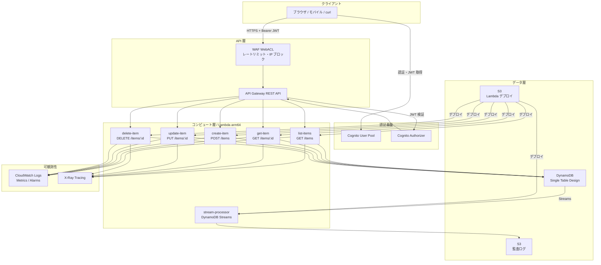
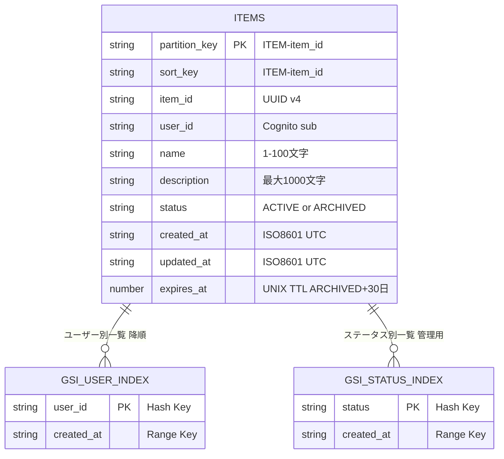
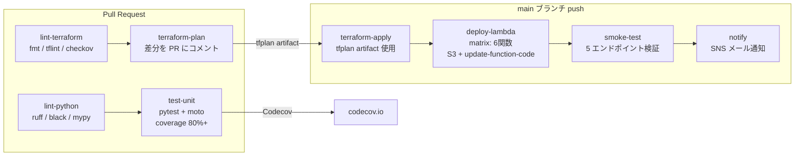

# serverless-api-platform

[](https://github.com/your-org/serverless-api-platform/actions/workflows/ci.yml)
[](https://github.com/your-org/serverless-api-platform/actions/workflows/cd.yml)
[](https://codecov.io/gh/your-org/serverless-api-platform)
[](https://www.terraform.io/)
[](https://www.python.org/)
[](LICENSE)

---

## このプロジェクトについて

### 何をするプロジェクトか

**アイテムを管理する REST API** を、AWS のサーバーレス構成でゼロから構築するプロジェクト。

ユーザーはログイン後、アイテムの作成・取得・更新・削除ができる。アイテムを「ARCHIVED」にすると 30 日後に自動削除される。すべての変更操作は S3 に監査ログとして記録される。

```
POST   /items          # アイテムを作成する
GET    /items          # 自分のアイテム一覧を取得する（ページネーション付き）
GET    /items/{id}     # アイテムを1件取得する
PUT    /items/{id}     # アイテムを更新する
DELETE /items/{id}     # アイテムを論理削除する（ARCHIVED → 30日後に自動削除）
```

### なぜ作ったか

「バックエンド API をプロダクション品質で設計・構築・運用できる」ことを証明するポートフォリオ。

単なる CRUD サンプルではなく、**実際の現場で求められる要素を一通り網羅**している。

| 要素 | 実装内容 |
|---|---|
| 認証・認可 | Cognito JWT 認証 + アイテムのオーナーシップ確認 |
| 入力バリデーション | API Gateway JSON スキーマ + Pydantic v2 による二重チェック |
| エラーハンドリング | カスタム例外クラス + 統一レスポンスフォーマット |
| 可観測性 | Lambda Powertools による構造化ログ・X-Ray トレース・CloudWatch メトリクス |
| 監査ログ | DynamoDB Streams → Lambda → S3 によるすべての変更記録 |
| IaC | Terraform モジュール分割（dev/prod 環境を変数で切り替え） |
| CI/CD | GitHub Actions OIDC によるキーレスデプロイ（AWS アクセスキー不要） |
| テスト | moto モックによるユニットテスト（カバレッジ 80%+）+ E2E インテグレーションテスト |

---

## システムアーキテクチャ



> WAF は prod 環境のみ。dev 環境はコスト削減のため無効。

---

## DynamoDB Single Table Design

すべてのアイテムを 1 テーブルに格納する DynamoDB ネイティブな設計を採用。
GSI を使ってフルスキャン（Scan API）ゼロを実現している。



- **GSI_USER_INDEX**: `GET /items` で使用。`user_id` でフィルタリングし `created_at` の降順で返す
- **GSI_STATUS_INDEX**: 管理用途。`status=ACTIVE` のアイテムを日付順に取得
- **TTL**: `status=ARCHIVED` に変更した時点で `expires_at = 現在時刻 + 30日` をセット。DynamoDB が自動削除

---

## CI/CD フロー



**認証**: GitHub Actions の OIDC トークンで AWS に AssumeRole。AWS アクセスキーを Secrets に保存しない。

---

## 技術スタック

| カテゴリ | 技術 | バージョン | 採用理由 |
|---|---|---|---|
| コンピュート | AWS Lambda | Python 3.12 / arm64 | arm64 で x86 比 ~20% コスト削減。Cold start も高速 |
| バリデーション | Pydantic v2 | >= 2.0 | Rust 実装で高速。`model_validator` で複雑なビジネスルールを型安全に表現 |
| 可観測性 | AWS Lambda Powertools | >= 2.0 | 構造化ログ・X-Ray トレース・メトリクスを 3 デコレータで完結 |
| 認証 | Amazon Cognito | - | JWT 検証を API Gateway Authorizer に委譲し、Lambda ロジックをシンプルに保つ |
| DB | Amazon DynamoDB | - | Single Table Design で PAY_PER_REQUEST。GSI によりフルスキャンゼロを実現 |
| IaC | Terraform | ~> 1.7 | 宣言的で可読性が高く、モジュール分割によりコード再利用が容易 |
| CI/CD | GitHub Actions + OIDC | - | AWS アクセスキー不要のキーレス認証。Secrets に長期クレデンシャルを保存しない |
| テスト | moto v4 | >= 4.0 | AWS サービスをローカルでモック。実 AWS 通信ゼロで高速なユニットテスト |
| セキュリティ | checkov | - | IaC の設定ミス・セキュリティリスクを PR 段階で検出 |

---

## ディレクトリ構成

```
serverless-api-platform/
├── .github/workflows/
│   ├── ci.yml              # PR: lint・test・terraform plan
│   └── cd.yml              # main: apply → deploy → smoke test
├── terraform/
│   ├── environments/
│   │   ├── dev/            # dev 環境 (WAF なし・DAX なし・Cognito 無効)
│   │   └── prod/           # prod 環境 (WAF・DAX・Cognito 有効)
│   └── modules/
│       ├── lambda-function/ # Lambda 共通モジュール
│       ├── api-gateway/     # REST API・ステージ・WAF
│       ├── cognito/         # User Pool・App Client
│       ├── dynamodb/        # テーブル・GSI・Streams・DAX
│       ├── iam/             # 実行ロール（最小権限）
│       ├── storage/         # S3 (監査ログ・デプロイ)
│       └── monitoring/      # CloudWatch・アラーム・ダッシュボード
├── src/
│   ├── list_items/          # GET /items
│   ├── get_item/            # GET /items/{id}
│   ├── create_item/         # POST /items
│   ├── update_item/         # PUT /items/{id}
│   ├── delete_item/         # DELETE /items/{id}
│   ├── stream_processor/    # DynamoDB Streams → S3 監査ログ
│   └── shared/
│       ├── models.py        # Pydantic データモデル
│       ├── repository.py    # DynamoDB アクセス層
│       ├── exceptions.py    # カスタム例外クラス
│       └── response.py      # APIレスポンス共通フォーマット
├── tests/
│   ├── unit/                # moto モック・カバレッジ 80%+
│   └── integration/         # 実 AWS (dev 環境) E2E テスト
└── docs/
    ├── architecture.md      # アーキテクチャ詳細・フロー図
    ├── api-spec.yaml        # OpenAPI 3.0 仕様書
    ├── adr/
    │   ├── 001-single-table-design.md    # DynamoDB 設計の意思決定
    │   ├── 002-cognito-vs-custom-auth.md # 認証方式の意思決定
    │   └── 003-rest-vs-http-api.md       # API Gateway v1 vs v2 の意思決定
    └── runbook.md           # 障害対応手順書
```

---

## セットアップ手順

### 全体の流れ

```
[1] ツールのインストール・AWS認証設定
    ↓
[2] リポジトリのクローン
    ↓
[3] Terraform バックエンドの作成  ← 初回のみ
    ↓
[4] インフラのデプロイ（terraform apply）
    ↓
[5] Lambda コードのデプロイ（make deploy）
    ↓
[6] 動作確認（curl）
```

---

### STEP 1: 前提ツールの確認

以下がインストールされていることを確認する。

```bash
terraform --version   # >= 1.7
aws --version         # AWS CLI v2
python3 --version     # >= 3.12
zip --version         # Lambda zip ビルドに使用
jq --version          # レスポンス整形に使用（任意）
```

続いて AWS の認証情報とリージョンを設定する。

```bash
export AWS_PROFILE=your-profile    # 使用する AWS CLI プロファイル名
export AWS_REGION=ap-northeast-1   # デプロイ先リージョン

# 正しく設定されているか確認
aws sts get-caller-identity
```

---

### STEP 2: リポジトリのクローン

```bash
git clone https://github.com/your-org/serverless-api-platform.git
cd serverless-api-platform
```

---

### STEP 3: Terraform バックエンドの作成（初回のみ）

Terraform の tfstate ファイルを保存する S3 バケットと、同時編集を防ぐ DynamoDB テーブルを作成する。

```bash
make bootstrap
```

作成されるリソース:
- S3: `sap-tfstate-<account_id>`（KMS 暗号化・バージョニング有効）
- DynamoDB: `sap-tfstate-lock`

**実行後**: `terraform/environments/dev/backend.tf` の `<ACCOUNT_ID>` を実際のアカウント ID に書き換える。

```hcl
# terraform/environments/dev/backend.tf
terraform {
  backend "s3" {
    bucket = "sap-tfstate-123456789012"  # ← 実際のアカウント ID に変更
    ...
  }
}
```

---

### STEP 4: インフラのデプロイ

```bash
# 初期化（初回・モジュール追加時に実行）
make init ENV=dev

# 変更内容の確認（必ず apply 前に実行）
make plan ENV=dev

# リソースの作成
make apply ENV=dev
```

`apply` が完了すると API Gateway の URL など出力される。

```bash
# 出力値を確認する
cd terraform/environments/dev && terraform output
```

---

### STEP 5: Lambda コードのデプロイ

`terraform apply` はインフラ（Lambda 関数の定義）を作成するが、コードは別途デプロイが必要。

```bash
# アカウント ID を指定して 6 関数を一括デプロイ
make deploy ENV=dev ACCOUNT_ID=$(aws sts get-caller-identity --query Account --output text)
```

内部では `src/` の各関数を zip 化して S3 にアップロードし、`update-function-code` で反映する。

---

### STEP 6: 動作確認

まずエンドポイントを変数にセットする。

```bash
export API_ENDPOINT=$(cd terraform/environments/dev && terraform output -raw api_endpoint)
echo $API_ENDPOINT  # https://xxxxxxxxxx.execute-api.ap-northeast-1.amazonaws.com/dev
```

**dev 環境は Cognito 認証が無効**のため、`?user_id=` パラメータでユーザーを指定するだけで動作確認できる。

```bash
# アイテムを作成
curl -s -X POST "$API_ENDPOINT/items?user_id=testuser" \
  -H "Content-Type: application/json" \
  -d '{"name": "テストアイテム", "description": "動作確認用"}' | jq .

# 作成したアイテムの item_id を控える
ITEM_ID="<上のレスポンスの item_id>"

# 一覧を取得
curl -s "$API_ENDPOINT/items?user_id=testuser" | jq .

# 1件取得
curl -s "$API_ENDPOINT/items/$ITEM_ID?user_id=testuser" | jq .

# 更新
curl -s -X PUT "$API_ENDPOINT/items/$ITEM_ID?user_id=testuser" \
  -H "Content-Type: application/json" \
  -d '{"name": "更新後の名前"}' | jq .

# 削除（204 No Content が返る）
curl -s -X DELETE "$API_ENDPOINT/items/$ITEM_ID?user_id=testuser" \
  -o /dev/null -w "HTTP %{http_code}\n"
```

---

### Cognito 認証を試す場合（prod 環境 または dev でも試したい場合）

prod 環境では Cognito が有効になるため、JWT トークンが必要。

```bash
# 1. テストユーザーを作成
USER_POOL_ID=$(cd terraform/environments/dev && terraform output -raw cognito_user_pool_id)
CLIENT_ID=$(cd terraform/environments/dev && terraform output -raw cognito_client_id)

aws cognito-idp admin-create-user \
  --user-pool-id "$USER_POOL_ID" \
  --username "testuser@example.com" \
  --message-action SUPPRESS

aws cognito-idp admin-set-user-password \
  --user-pool-id "$USER_POOL_ID" \
  --username "testuser@example.com" \
  --password "MyPassword123!" \
  --permanent

# 2. JWT トークンを取得
TOKEN=$(aws cognito-idp initiate-auth \
  --auth-flow USER_PASSWORD_AUTH \
  --auth-parameters USERNAME=testuser@example.com,PASSWORD=MyPassword123! \
  --client-id "$CLIENT_ID" \
  --query 'AuthenticationResult.IdToken' \
  --output text)

echo $TOKEN  # eyJra... のような長い文字列が出れば成功

# 3. Authorization ヘッダーを付けてリクエスト
curl -s "$API_ENDPOINT/items" \
  -H "Authorization: Bearer $TOKEN" | jq .
```

---

## API 使用例（curl）

### アイテムの作成 `POST /items`

```bash
curl -s -X POST "$API_ENDPOINT/items" \
  -H "Authorization: Bearer $TOKEN" \
  -H "Content-Type: application/json" \
  -d '{"name": "サンプルアイテム", "description": "説明文（任意）", "expires_days": 30}' | jq .
```

```json
{
  "success": true,
  "data": {
    "item_id": "550e8400-e29b-41d4-a716-446655440000",
    "user_id": "cognito-sub-xxxx",
    "name": "サンプルアイテム",
    "description": "説明文（任意）",
    "status": "ACTIVE",
    "created_at": "2024-01-15T12:00:00+00:00",
    "updated_at": "2024-01-15T12:00:00+00:00",
    "expires_at": 1708000000
  },
  "meta": { "request_id": "abc123", "timestamp": "2024-01-15T12:00:00Z" }
}
```

### アイテム一覧の取得 `GET /items`

```bash
# limit・cursor によるページネーション
curl -s "$API_ENDPOINT/items?limit=10" \
  -H "Authorization: Bearer $TOKEN" | jq .

# 次ページ（レスポンスの next_cursor を cursor に渡す）
curl -s "$API_ENDPOINT/items?limit=10&cursor=eyJQSyI6..." \
  -H "Authorization: Bearer $TOKEN" | jq .
```

```json
{
  "success": true,
  "data": [{ "item_id": "...", "name": "...", "status": "ACTIVE", "created_at": "..." }],
  "pagination": { "next_cursor": "eyJQSyI6...", "has_more": true, "count": 10 },
  "meta": { "request_id": "def456", "timestamp": "2024-01-15T12:00:01Z" }
}
```

### アイテムの取得・更新・削除

```bash
ITEM_ID="550e8400-e29b-41d4-a716-446655440000"

# 取得
curl -s "$API_ENDPOINT/items/$ITEM_ID" -H "Authorization: Bearer $TOKEN" | jq .

# 更新
curl -s -X PUT "$API_ENDPOINT/items/$ITEM_ID" \
  -H "Authorization: Bearer $TOKEN" \
  -H "Content-Type: application/json" \
  -d '{"name": "更新後の名前", "status": "ARCHIVED"}' | jq .

# 削除（204 No Content）
curl -s -X DELETE "$API_ENDPOINT/items/$ITEM_ID" \
  -H "Authorization: Bearer $TOKEN" -o /dev/null -w "%{http_code}\n"
# → 204
```

### エラーレスポンス例

```bash
# 認証なし → 401
curl -s "$API_ENDPOINT/items"
```

```json
{
  "success": false,
  "error": { "code": "UNAUTHORIZED", "message": "認証が必要です", "request_id": "ghi789" }
}
```

---

## テスト

### ユニットテスト（moto モック・外部 AWS 通信なし）

```bash
make test-unit
# pytest tests/unit/ --cov=src --cov-fail-under=80
```

### インテグレーションテスト（実 dev 環境を使用）

```bash
export API_ENDPOINT=$(cd terraform/environments/dev && terraform output -raw api_endpoint)
export COGNITO_USER_POOL_ID=$(cd terraform/environments/dev && terraform output -raw cognito_user_pool_id)
export COGNITO_CLIENT_ID=$(cd terraform/environments/dev && terraform output -raw cognito_client_id)

make test-integration
```

---

## コスト試算（dev 環境・月額）

| サービス | 前提 | 月額概算 |
|---|---|---|
| Lambda | 100万リクエスト/月・平均100ms・arm64 | ~$0.00（無料枠内） |
| API Gateway | 100万リクエスト/月 | ~$3.50 |
| DynamoDB | PAY_PER_REQUEST・読み書き各100万/月 | ~$1.25 |
| Cognito | MAU 50人以下 | $0（無料枠） |
| S3 | 監査ログ・デプロイ資材 ~1GB | ~$0.02 |
| CloudWatch | ログ保存 5GB・メトリクス5個 | ~$0.50 |
| **合計** | | **~$5 / 月** |

> WAF・DAX・カスタムドメインは prod 環境のみ。dev は最小コスト構成。

---

## 環境比較

| 項目 | dev | prod |
|---|---|---|
| WAF | なし（コスト削減） | あり |
| DAX | なし | あり |
| DynamoDB PITR | なし | あり |
| Cognito Authorizer | なし（開発効率優先） | あり |
| CloudWatch ログ保持 | 14 日 | 90 日 |
| Lambda 同時実行数上限 | 未設定 | 設定あり |
| カスタムドメイン | なし | あり（Route53 + ACM） |

---

## 今後の拡張案

| 拡張 | 概要 | 難易度 |
|---|---|---|
| WAF + カスタムドメイン | Rate limiting + ACM + Route53 で本番 URL | ★★ |
| DAX (DynamoDB Accelerator) | μs レイテンシ。prod 環境への追加は変数1つ | ★★ |
| GraphQL (AppSync) | REST → GraphQL への移行・型安全なスキーマ | ★★★ |
| OpenSearch | 全文検索。DynamoDB Streams → Lambda → OpenSearch | ★★★ |
| SQS + 非同期処理 | 重い処理をキューイング。Lambda x SQS トリガー | ★★ |
| Multi-Region | Route53 フェイルオーバー + DynamoDB Global Tables | ★★★ |

---

## ドキュメント

| ドキュメント | 内容 |
|---|---|
| [docs/architecture.md](docs/architecture.md) | アーキテクチャ詳細・リクエストフロー・セキュリティ設計 |
| [docs/api-spec.yaml](docs/api-spec.yaml) | OpenAPI 3.0 仕様書（全エンドポイント・スキーマ・認証） |
| [docs/adr/001-single-table-design.md](docs/adr/001-single-table-design.md) | DynamoDB Single Table Design 採用理由とアクセスパターン |
| [docs/adr/002-cognito-vs-custom-auth.md](docs/adr/002-cognito-vs-custom-auth.md) | Cognito vs カスタム JWT 認証の意思決定 |
| [docs/adr/003-rest-vs-http-api.md](docs/adr/003-rest-vs-http-api.md) | REST API (v1) vs HTTP API (v2) の意思決定 |
| [docs/runbook.md](docs/runbook.md) | 障害対応手順書（5xx 急増・DynamoDB 過負荷・Lambda スロットル） |

---

## License

MIT License — see [LICENSE](LICENSE)
