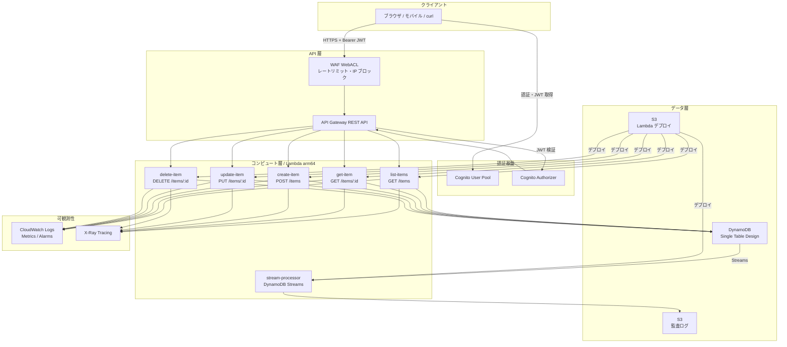
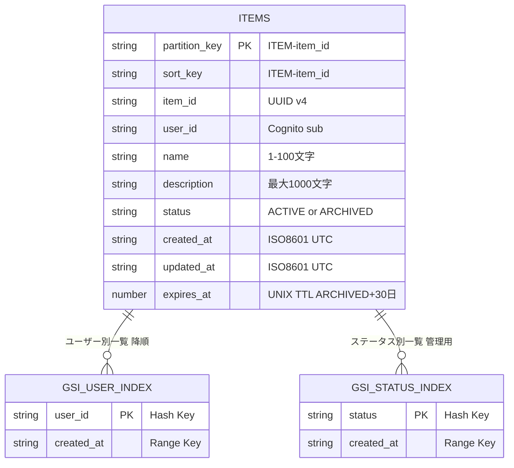
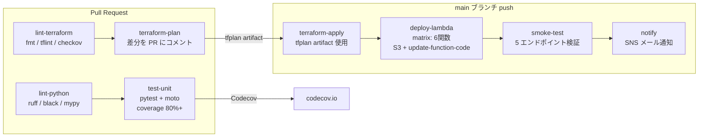

# serverless-api-platform

[](https://github.com/your-org/serverless-api-platform/actions/workflows/ci.yml)
[](https://github.com/your-org/serverless-api-platform/actions/workflows/cd.yml)
[](https://codecov.io/gh/your-org/serverless-api-platform)
[](https://www.terraform.io/)
[](https://www.python.org/)
[](LICENSE)

---

## このハンズオンで得られること

この README に沿って最後まで進めると、単に API を 1 本動かすだけでなく、サーバーレス API 基盤を「作る・載せる・試す・追う」一連の流れを実践できます。

- Terraform backend を含む AWS インフラの立ち上げ方
- API Gateway + Lambda + DynamoDB による CRUD API の組み立て方
- Lambda コードを S3 経由で配布し、関数へ反映する流れ
- DynamoDB Streams を使って監査ログを S3 に残す構成
- CloudWatch / X-Ray を使った最低限の運用確認のやり方
- ローカルでの unit test、AWS 上での動作確認まで含めた進め方

このハンズオンのゴールは、「サーバーレス API のサンプルを読むこと」ではなく、「自分の AWS アカウント上で一式を再現し、構成の意味まで説明できる状態になること」です。

---

## このプロジェクトについて

### 何をするプロジェクトか

**アイテムを管理する REST API** を、AWS のサーバーレス構成でゼロから構築するプロジェクト。

ユーザーはログイン後、アイテムの作成・取得・更新・削除ができる。アイテムを「ARCHIVED」にすると 30 日後に自動削除される。すべての変更操作は S3 に監査ログとして記録される。

```
POST   /items          # アイテムを作成する
GET    /items          # 自分のアイテム一覧を取得する（ページネーション付き）
GET    /items/{id}     # アイテムを1件取得する
PUT    /items/{id}     # アイテムを更新する
DELETE /items/{id}     # アイテムを論理削除する（ARCHIVED → 30日後に自動削除）
```

### なぜ作ったか

「バックエンド API をプロダクション品質で設計・構築・運用できる」ことを証明するポートフォリオ。

単なる CRUD サンプルではなく、**実際の現場で求められる要素を一通り網羅**している。

| 要素 | 実装内容 |
|---|---|
| 認証・認可 | Cognito JWT 認証 + アイテムのオーナーシップ確認 |
| 入力バリデーション | API Gateway JSON スキーマ + Pydantic v2 による二重チェック |
| エラーハンドリング | カスタム例外クラス + 統一レスポンスフォーマット |
| 可観測性 | Lambda Powertools による構造化ログ・X-Ray トレース・CloudWatch メトリクス |
| 監査ログ | DynamoDB Streams → Lambda → S3 によるすべての変更記録 |
| IaC | Terraform モジュール分割（dev/prod 環境を変数で切り替え） |
| CI/CD | GitHub Actions OIDC によるキーレスデプロイ（AWS アクセスキー不要） |
| テスト | moto モックによるユニットテスト（カバレッジ 80%+）+ E2E インテグレーションテスト |

---

## システムアーキテクチャ



> WAF は prod 環境のみ。dev 環境はコスト削減のため無効。

---

## DynamoDB Single Table Design

すべてのアイテムを 1 テーブルに格納する DynamoDB ネイティブな設計を採用。
GSI を使ってフルスキャン（Scan API）ゼロを実現している。



- **GSI_USER_INDEX**: `GET /items` で使用。`user_id` でフィルタリングし `created_at` の降順で返す
- **GSI_STATUS_INDEX**: 管理用途。`status=ACTIVE` のアイテムを日付順に取得
- **TTL**: `status=ARCHIVED` に変更した時点で `expires_at = 現在時刻 + 30日` をセット。DynamoDB が自動削除

---

## CI/CD フロー



**認証**: GitHub Actions の OIDC トークンで AWS に AssumeRole。AWS アクセスキーを Secrets に保存しない。

---

## 技術スタック

| カテゴリ | 技術 | バージョン | 採用理由 |
|---|---|---|---|
| コンピュート | AWS Lambda | Python 3.12 / arm64 | arm64 で x86 比 ~20% コスト削減。Cold start も高速 |
| バリデーション | Pydantic v2 | >= 2.0 | Rust 実装で高速。`model_validator` で複雑なビジネスルールを型安全に表現 |
| 可観測性 | AWS Lambda Powertools | >= 2.0 | 構造化ログ・X-Ray トレース・メトリクスを 3 デコレータで完結 |
| 認証 | Amazon Cognito | - | JWT 検証を API Gateway Authorizer に委譲し、Lambda ロジックをシンプルに保つ |
| DB | Amazon DynamoDB | - | Single Table Design で PAY_PER_REQUEST。GSI によりフルスキャンゼロを実現 |
| IaC | Terraform | ~> 1.7 | 宣言的で可読性が高く、モジュール分割によりコード再利用が容易 |
| CI/CD | GitHub Actions + OIDC | - | AWS アクセスキー不要のキーレス認証。Secrets に長期クレデンシャルを保存しない |
| テスト | moto v4 | >= 4.0 | AWS サービスをローカルでモック。実 AWS 通信ゼロで高速なユニットテスト |
| セキュリティ | checkov | - | IaC の設定ミス・セキュリティリスクを PR 段階で検出 |

---

## ディレクトリ構成

```
serverless-api-platform/
├── .github/workflows/
│   ├── ci.yml              # PR: lint・test・terraform plan
│   └── cd.yml              # main: apply → deploy → smoke test
├── terraform/
│   ├── environments/
│   │   ├── dev/            # dev 環境 (WAF なし・DAX なし・Cognito 無効)
│   │   └── prod/           # prod 環境 (WAF・DAX・Cognito 有効)
│   └── modules/
│       ├── lambda-function/ # Lambda 共通モジュール
│       ├── api-gateway/     # REST API・ステージ・WAF
│       ├── cognito/         # User Pool・App Client
│       ├── dynamodb/        # テーブル・GSI・Streams・DAX
│       ├── iam/             # 実行ロール（最小権限）
│       ├── storage/         # S3 (監査ログ・デプロイ)
│       └── monitoring/      # CloudWatch・アラーム・ダッシュボード
├── src/
│   ├── list_items/          # GET /items
│   ├── get_item/            # GET /items/{id}
│   ├── create_item/         # POST /items
│   ├── update_item/         # PUT /items/{id}
│   ├── delete_item/         # DELETE /items/{id}
│   ├── stream_processor/    # DynamoDB Streams → S3 監査ログ
│   └── shared/
│       ├── models.py        # Pydantic データモデル
│       ├── repository.py    # DynamoDB アクセス層
│       ├── exceptions.py    # カスタム例外クラス
│       └── response.py      # APIレスポンス共通フォーマット
├── tests/
│   ├── unit/                # moto モック・カバレッジ 80%+
│   └── integration/         # 実 AWS (dev 環境) E2E テスト
└── docs/
    ├── api-spec.yaml        # OpenAPI 3.0 仕様書
    ├── adr/
    │   ├── 001-single-table-design.md    # DynamoDB 設計の意思決定
    │   ├── 002-cognito-vs-custom-auth.md # 認証方式の意思決定
    │   └── 003-rest-vs-http-api.md       # API Gateway v1 vs v2 の意思決定
```

---

## ハンズオン実行手順

この章は、「このリポジトリをクローンして dev 環境を立ち上げ、実際に CRUD まで確認する」ための手順を、実装の現状に合わせて順番にまとめたものです。

### 最初に押さえておくこと

- まずは `dev` 環境を対象に進める
- Terraform はインフラ定義まで作成するが、Lambda コードは `make deploy` で別途反映する
- 現在の `dev` は Cognito Authorizer を使わず、`?user_id=` で簡易的にユーザーを指定して動作確認する
- 現在のリポジトリでは Cognito モジュールは root module に未配線のため、`cognito_user_pool_id` / `cognito_client_id` の output はそのままでは取得できない

### 全体の流れ

```text
[1] 前提ツールと AWS 認証を確認
    ↓
[2] リポジトリをクローン
    ↓
[3] Python 仮想環境 (.venv) を作成
    ↓
[4] Terraform backend 用の S3 / DynamoDB を作成
    ↓
[5] backend.tf の account_id プレースホルダを置換
    ↓
[6] Terraform 用の環境変数を設定
    ↓
[7] terraform init / plan / apply
    ↓
[8] Lambda コードをデプロイ
    ↓
[9] curl で CRUD 動作確認
    ↓
[10] 必要に応じて unit test / lint を実行
```

---

### STEP 1: 前提ツールの確認

以下のツールが必要です。

```bash
terraform --version   # ~> 1.7
aws --version         # AWS CLI v2
python3 --version     # >= 3.12
zip --version         # Lambda パッケージ作成に使用
jq --version          # 任意: JSON を見やすく整形
```

`tflint` と `checkov` はローカルで `make lint` を使う場合に追加で必要です。

---

### STEP 2: AWS 認証を確認

デプロイ先はデフォルトで `ap-northeast-1` です。最初に AWS CLI の認証状態を確認します。

```bash
export AWS_PROFILE=your-profile
export AWS_REGION=ap-northeast-1

aws sts get-caller-identity
```

期待すること:

- `Account` に 12 桁の AWS アカウント ID が出る
- `Arn` に今回使う IAM User / IAM Role が出る

ここで失敗する場合は、先に AWS CLI のプロファイル設定を見直してください。

---

### STEP 3: リポジトリをクローン

```bash
git clone https://github.com/your-org/serverless-api-platform.git
cd serverless-api-platform
```

以後のコマンドは、このプロジェクトルートで実行します。

---

### STEP 4: Python 仮想環境 `.venv` を作成

このプロジェクトでは、Python を使う作業は `.venv` 前提です。まず仮想環境を作成して有効化します。

```bash
python3 -m venv .venv
source .venv/bin/activate
which python
```

`which python` の出力が `.../serverless-api-platform/.venv/bin/python` になっていれば OK です。

補足:

- ルート直下に `requirements.txt` はまだないため、この段階では追加の `pip install -r requirements.txt` は不要です
- `make test-unit` や `make deploy` は内部で `pip install` を行います

---

### STEP 5: Terraform backend 用リソースを作成

Terraform state を S3 に保存し、ロックを DynamoDB で管理するため、最初に backend 用リソースを作成します。

```bash
make bootstrap
```

このコマンドで作成されるもの:

- S3 バケット: `sap-tfstate-<account_id>`
- DynamoDB テーブル: `sap-tfstate-lock`

`scripts/bootstrap.sh` は AWS CLI でこれらを直接作成します。完了時に、実際の `account_id` が表示されます。

---

### STEP 6: `backend.tf` の `<account_id>` を置き換える

bootstrap 完了後、`terraform/environments/dev/backend.tf` のプレースホルダを実際のアカウント ID に置き換えます。

対象ファイル:

- [terraform/environments/dev/backend.tf](/home/takuya/terraform-lab/serverless-api-platform/terraform/environments/dev/backend.tf)

変更前:

```hcl
bucket = "sap-tfstate-<account_id>"
```

変更後の例:

```hcl
bucket = "sap-tfstate-123456789012"
```

`123456789012` は自分の AWS アカウント ID に置き換えてください。

---

### STEP 7: Terraform 用の環境変数を設定

このリポジトリの `dev` 環境は、少なくとも `account_id` と `alert_email` の 2 つを Terraform 変数として受け取ります。`make plan` / `make apply` の前に export します。

```bash
export TF_VAR_account_id=$(aws sts get-caller-identity --query Account --output text)
export TF_VAR_alert_email=your-email@example.com
```

補足:

- `TF_VAR_account_id` は S3 バケット名などの一意性に使われます
- `TF_VAR_alert_email` は CloudWatch Alarm の通知先 SNS subscription に使われます
- 初回 `apply` 後、通知メールが届いたらサブスクリプション承認が必要です

確認:

```bash
echo "$TF_VAR_account_id"
echo "$TF_VAR_alert_email"
```

---

### STEP 8: Terraform を実行してインフラを作成

まず初期化し、その後 plan、最後に apply の順で進めます。

```bash
make init ENV=dev
make plan ENV=dev
make apply ENV=dev
```

それぞれの意味:

- `make init`: backend と provider を初期化
- `make plan`: 差分を確認し、`tfplan` を作成
- `make apply`: 直前に作られた `tfplan` を使ってリソースを作成

完了後、出力値を確認します。

```bash
cd terraform/environments/dev
terraform output
cd ../../..
```

特に使う出力値:

- `api_endpoint`
- `dynamodb_table_name`
- `audit_bucket_name`
- `lambda_function_names`

---

### STEP 9: 任意で Terraform の静的チェックを実行

インフラ作成前後に、HCL の整形や静的検査をしておくと安心です。

```bash
make fmt
make lint ENV=dev
```

`make lint` では次を使います。

- `tflint`
- `checkov`

ローカルに未導入なら先にインストールしてください。

---

### STEP 10: Lambda コードをデプロイ

Terraform で作られるのは Lambda 関数リソース本体です。実際の Python コードは別途アップロードする必要があります。

```bash
make deploy ENV=dev ACCOUNT_ID=$(aws sts get-caller-identity --query Account --output text)
```

この処理で行われること:

1. `src/<function>` ごとに zip を作成
2. `src/shared` を各関数パッケージに同梱
3. 依存ライブラリを zip に含める
4. S3 の Lambda deployment bucket にアップロード
5. `aws lambda update-function-code` で各関数を更新
6. `aws lambda wait function-updated` で反映完了を待機

対象の 6 関数:

- `list_items`
- `get_item`
- `create_item`
- `update_item`
- `delete_item`
- `stream_processor`

---

### STEP 11: API エンドポイントを取得

Terraform output から API Gateway の URL を環境変数に入れます。

```bash
export API_ENDPOINT=$(cd terraform/environments/dev && terraform output -raw api_endpoint)
echo "$API_ENDPOINT"
```

期待する形式:

```text
https://xxxxxxxxxx.execute-api.ap-northeast-1.amazonaws.com/dev
```

---

### STEP 12: CRUD を順番に動かしてみる

現在の `dev` 環境では Cognito Authorizer は無効です。そのため `?user_id=` を付けてリクエストします。

#### 12-1. アイテムを作成する

```bash
curl -s -X POST "$API_ENDPOINT/items?user_id=testuser" \
  -H "Content-Type: application/json" \
  -d '{"name":"テストアイテム","description":"README ハンズオン"}' | jq .
```

成功時は `201` 相当のレスポンスボディで、`data.item_id` が返ります。

```bash
ITEM_ID="<上のレスポンスの item_id を貼る>"
```

#### 12-2. 一覧を取得する

```bash
curl -s "$API_ENDPOINT/items?user_id=testuser" | jq .
```

確認ポイント:

- `success: true`
- `data` が配列
- `pagination.count` が含まれる

#### 12-3. 1 件取得する

```bash
curl -s "$API_ENDPOINT/items/$ITEM_ID?user_id=testuser" | jq .
```

確認ポイント:

- `data.item_id` が作成した ID と一致
- `data.status` が `ACTIVE`

#### 12-4. 更新する

```bash
curl -s -X PUT "$API_ENDPOINT/items/$ITEM_ID?user_id=testuser" \
  -H "Content-Type: application/json" \
  -d '{"name":"更新後の名前","description":"更新後の説明"}' | jq .
```

確認ポイント:

- `data.name` が更新されている
- `updated_at` が変わっている

#### 12-5. 論理削除する

```bash
curl -s -X DELETE "$API_ENDPOINT/items/$ITEM_ID?user_id=testuser" \
  -o /dev/null -w "HTTP %{http_code}\n"
```

期待値:

```text
HTTP 204
```

#### 12-6. 削除後に再取得する

このプロジェクトの `DELETE` は物理削除ではなく論理削除です。再取得すると `404` ではなく、`status=ARCHIVED` のまま返るのが正しい挙動です。

```bash
curl -s "$API_ENDPOINT/items/$ITEM_ID?user_id=testuser" | jq .
```

確認ポイント:

- `data.status` が `ARCHIVED`
- `data.expires_at` が入っている

---

### STEP 13: 監査ログを確認する

変更操作は DynamoDB Streams 経由で S3 に保存されます。バケット名を Terraform output から取得して確認できます。

```bash
export AUDIT_BUCKET=$(cd terraform/environments/dev && terraform output -raw audit_bucket_name)
aws s3 ls "s3://$AUDIT_BUCKET/audit-logs/" --recursive
```

`POST` / `PUT` / `DELETE` を実行していれば、`audit-logs/YYYY/MM/DD/...jsonl` 形式のファイルが出てくるはずです。

必要なら中身も確認できます。

```bash
aws s3 cp "s3://$AUDIT_BUCKET/<確認したいキー>" -
```

---

### STEP 14: CloudWatch ダッシュボードを確認する

ダッシュボード URL も output されています。

```bash
cd terraform/environments/dev
terraform output -raw cloudwatch_dashboard_url
cd ../../..
```

ここから以下を確認できます。

- Lambda Invocations
- Lambda Errors
- API Gateway Requests
- API Gateway 4xx / 5xx

---

### STEP 15: ユニットテストを実行する

ローカルでアプリケーションの最低限の健全性を確認したい場合はユニットテストを実行します。

```bash
source .venv/bin/activate
make test-unit
```

内容:

- `moto` による DynamoDB モック
- `pytest --cov=src`
- カバレッジ 80% 未満なら失敗

---

### STEP 16: インテグレーションテストについて

README の元の記述では `COGNITO_USER_POOL_ID` / `COGNITO_CLIENT_ID` を使った E2E テスト手順がありましたが、現状の root module は Cognito module を組み込んでいないため、そのままでは必要 output が出ません。

つまり現時点では:

- `make test-unit` はそのまま実行可能
- `tests/integration` は「Cognito が配線された環境」を前提としているため、そのままでは実行準備が不足

将来 Cognito を root module に組み込んだら、次のような流れで使う想定です。

```bash
export API_ENDPOINT=...
export COGNITO_USER_POOL_ID=...
export COGNITO_CLIENT_ID=...
make test-integration
```

---

### STEP 17: よくあるハマりどころ

#### `terraform init` が失敗する

確認ポイント:

- `backend.tf` の `sap-tfstate-<account_id>` が置換済みか
- `make bootstrap` を先に実行したか
- `AWS_PROFILE` / `AWS_REGION` が正しいか

#### `make plan` で変数不足エラーになる

次を export しているか確認してください。

```bash
export TF_VAR_account_id=123456789012
export TF_VAR_alert_email=your-email@example.com
```

#### `make deploy` が失敗する

確認ポイント:

- 先に `make apply ENV=dev` を実行したか
- deployment bucket が作成済みか
- `.venv` を有効化しているか
- `zip` コマンドが入っているか

#### API は作れたのに 500 が返る

まず以下を確認します。

```bash
cd terraform/environments/dev && terraform output
aws lambda list-functions --query 'Functions[?contains(FunctionName, `sap-dev`)].FunctionName'
```

そのうえで CloudWatch Logs の Lambda ログを確認すると原因を追いやすいです。

---

### STEP 18: ここまで終わったら

ここまで完了すれば、少なくとも次の一連を自分の AWS アカウント上で再現できています。

- Terraform backend の作成
- dev 環境インフラの作成
- Lambda コードの配布
- CRUD API の動作確認
- 監査ログの S3 保存確認
- CloudWatch ダッシュボード確認

次に読むと理解が深まる資料:

- [ARCHITECTURE.md](ARCHITECTURE.md)
- [docs/adr/001-single-table-design.md](docs/adr/001-single-table-design.md)

---

## API 使用例（curl）

> この章の `Authorization: Bearer $TOKEN` 付きサンプルは、Cognito Authorizer を有効化した将来構成または prod 想定の例です。現状の `dev` ハンズオンでは、上の手順どおり `?user_id=` を付けて実行してください。

### アイテムの作成 `POST /items`

```bash
curl -s -X POST "$API_ENDPOINT/items" \
  -H "Authorization: Bearer $TOKEN" \
  -H "Content-Type: application/json" \
  -d '{"name": "サンプルアイテム", "description": "説明文（任意）", "expires_days": 30}' | jq .
```

```json
{
  "success": true,
  "data": {
    "item_id": "550e8400-e29b-41d4-a716-446655440000",
    "user_id": "cognito-sub-xxxx",
    "name": "サンプルアイテム",
    "description": "説明文（任意）",
    "status": "ACTIVE",
    "created_at": "2024-01-15T12:00:00+00:00",
    "updated_at": "2024-01-15T12:00:00+00:00",
    "expires_at": 1708000000
  },
  "meta": { "request_id": "abc123", "timestamp": "2024-01-15T12:00:00Z" }
}
```

### アイテム一覧の取得 `GET /items`

```bash
# limit・cursor によるページネーション
curl -s "$API_ENDPOINT/items?limit=10" \
  -H "Authorization: Bearer $TOKEN" | jq .

# 次ページ（レスポンスの next_cursor を cursor に渡す）
curl -s "$API_ENDPOINT/items?limit=10&cursor=eyJQSyI6..." \
  -H "Authorization: Bearer $TOKEN" | jq .
```

```json
{
  "success": true,
  "data": [{ "item_id": "...", "name": "...", "status": "ACTIVE", "created_at": "..." }],
  "pagination": { "next_cursor": "eyJQSyI6...", "has_more": true, "count": 10 },
  "meta": { "request_id": "def456", "timestamp": "2024-01-15T12:00:01Z" }
}
```

### アイテムの取得・更新・削除

```bash
ITEM_ID="550e8400-e29b-41d4-a716-446655440000"

# 取得
curl -s "$API_ENDPOINT/items/$ITEM_ID" -H "Authorization: Bearer $TOKEN" | jq .

# 更新
curl -s -X PUT "$API_ENDPOINT/items/$ITEM_ID" \
  -H "Authorization: Bearer $TOKEN" \
  -H "Content-Type: application/json" \
  -d '{"name": "更新後の名前", "status": "ARCHIVED"}' | jq .

# 削除（204 No Content）
curl -s -X DELETE "$API_ENDPOINT/items/$ITEM_ID" \
  -H "Authorization: Bearer $TOKEN" -o /dev/null -w "%{http_code}\n"
# → 204
```

### エラーレスポンス例

```bash
# 認証なし → 401
curl -s "$API_ENDPOINT/items"
```

```json
{
  "success": false,
  "error": { "code": "UNAUTHORIZED", "message": "認証が必要です", "request_id": "ghi789" }
}
```

---

## テスト

### ユニットテスト（moto モック・外部 AWS 通信なし）

```bash
make test-unit
# pytest tests/unit/ --cov=src --cov-fail-under=80
```

### インテグレーションテスト（実 dev 環境を使用）

> 注意: 現在の root module では Cognito module が未配線のため、この手順はそのままでは実行できません。Cognito の output を追加して環境を整えた後に使用する想定です。

```bash
export API_ENDPOINT=$(cd terraform/environments/dev && terraform output -raw api_endpoint)
export COGNITO_USER_POOL_ID=$(cd terraform/environments/dev && terraform output -raw cognito_user_pool_id)
export COGNITO_CLIENT_ID=$(cd terraform/environments/dev && terraform output -raw cognito_client_id)

make test-integration
```

---

## 運用・障害対応

この章は、従来 `docs/runbook.md` にあった初動対応メモを README に統合したものです。対象は主に `dev` 環境ですが、見方自体は `prod` でも同様です。

### 1. API で 5xx が急増したとき

症状の例:

- API Gateway の `5XXError` が急増
- 利用者から「500 が返る」と報告が来る
- CloudWatch Alarm が発火する

まず API Gateway の 5xx を確認します。

```bash
aws cloudwatch get-metric-statistics \
  --namespace AWS/ApiGateway \
  --metric-name 5XXError \
  --dimensions Name=ApiName,Value=sap-dev-api \
  --start-time $(date -u -d '1 hour ago' +%Y-%m-%dT%H:%M:%SZ) \
  --end-time $(date -u +%Y-%m-%dT%H:%M:%SZ) \
  --period 300 \
  --statistics Sum \
  --output table
```

次に Lambda ログからどの関数で落ちているかを見ます。

```bash
aws logs tail /aws/lambda/sap-dev-create-item --follow
```

Logs Insights を使う場合のクエリ例:

```text
fields @timestamp, level, message, function_name
| filter level = "ERROR"
| stats count(*) as error_count by function_name, message
| sort error_count desc
| limit 20
```

よくある原因:

- `Task timed out after 25 seconds`
- 依存ライブラリ不足や import error
- DynamoDB 側エラー
- デプロイ直後のコード不整合

### 2. DynamoDB 関連エラーが出たとき

`ProvisionedThroughputExceededException` や `RequestThrottled` がログに出る場合は、まずメトリクスを見ます。

```bash
aws cloudwatch get-metric-statistics \
  --namespace AWS/DynamoDB \
  --metric-name ThrottledRequests \
  --dimensions Name=TableName,Value=sap-dev-items \
  --start-time $(date -u -d '1 hour ago' +%Y-%m-%dT%H:%M:%SZ) \
  --end-time $(date -u +%Y-%m-%dT%H:%M:%SZ) \
  --period 60 \
  --statistics Sum \
  --output table
```

このプロジェクトは `PAY_PER_REQUEST` なので、単純なキャパシティ設定不足よりも、次を疑うことが多いです。

- 特定 `user_id` へのアクセス集中
- `status-index` への偏り
- アプリ側の想定外リトライ
- クロールや大量アクセス

### 3. Lambda スロットリングが起きたとき

各関数の `Throttles` を確認します。

```bash
for func in list-items get-item create-item update-item delete-item; do
  echo "=== sap-dev-$func ==="
  aws cloudwatch get-metric-statistics \
    --namespace AWS/Lambda \
    --metric-name Throttles \
    --dimensions Name=FunctionName,Value="sap-dev-$func" \
    --start-time $(date -u -d '1 hour ago' +%Y-%m-%dT%H:%M:%SZ) \
    --end-time $(date -u +%Y-%m-%dT%H:%M:%SZ) \
    --period 300 \
    --statistics Sum \
    --output text
done
```

必要ならアカウント全体の上限も確認します。

```bash
aws lambda get-account-settings --query 'AccountLimit'
```

短期的な確認ポイント:

- 特定 API にアクセスが偏っていないか
- デプロイ直後に一時的な再試行が増えていないか
- API Gateway 側のスロットリングと Lambda 側の同時実行制限のどちらが先に当たっているか

### 4. 監査ログが出てこないとき

まず監査ログバケット名を確認します。

```bash
export AUDIT_BUCKET=$(cd terraform/environments/dev && terraform output -raw audit_bucket_name)
aws s3 ls "s3://$AUDIT_BUCKET/audit-logs/" --recursive
```

出てこない場合は次を確認します。

- `stream_processor` Lambda がデプロイ済みか
- DynamoDB Streams が有効か
- `stream_processor` の CloudWatch Logs にエラーが出ていないか

### 5. デプロイが怪しいとき

関数の更新時刻をまとめて確認できます。

```bash
for func in list-items get-item create-item update-item delete-item stream-processor; do
  echo -n "sap-dev-$func: "
  aws lambda get-function-configuration \
    --function-name "sap-dev-$func" \
    --query 'LastModified' \
    --output text
done
```

S3 にアップされた旧パッケージを見たい場合:

```bash
aws s3api list-object-versions \
  --bucket "sap-dev-lambda-deployment-$TF_VAR_account_id" \
  --prefix "lambda/create-item/" \
  --query 'Versions[].{Key:Key,LastModified:LastModified}' \
  --output table
```

### 6. まず確認すると早いもの

障害時に最初に見る場所はこの 4 つです。

1. API Gateway 5xx / 4xx メトリクス
2. 失敗していそうな Lambda の CloudWatch Logs
3. CloudWatch ダッシュボード
4. 直近の deploy 実行有無

---

## コスト試算（dev 環境・月額）

| サービス | 前提 | 月額概算 |
|---|---|---|
| Lambda | 100万リクエスト/月・平均100ms・arm64 | ~$0.00（無料枠内） |
| API Gateway | 100万リクエスト/月 | ~$3.50 |
| DynamoDB | PAY_PER_REQUEST・読み書き各100万/月 | ~$1.25 |
| Cognito | MAU 50人以下 | $0（無料枠） |
| S3 | 監査ログ・デプロイ資材 ~1GB | ~$0.02 |
| CloudWatch | ログ保存 5GB・メトリクス5個 | ~$0.50 |
| **合計** | | **~$5 / 月** |

> WAF・DAX・カスタムドメインは prod 環境のみ。dev は最小コスト構成。

---

## 環境比較

| 項目 | dev | prod |
|---|---|---|
| WAF | なし（コスト削減） | あり |
| DAX | なし | あり |
| DynamoDB PITR | なし | あり |
| Cognito Authorizer | なし（開発効率優先） | あり |
| CloudWatch ログ保持 | 14 日 | 90 日 |
| Lambda 同時実行数上限 | 未設定 | 設定あり |
| カスタムドメイン | なし | あり（Route53 + ACM） |

---

## 今後の拡張案

| 拡張 | 概要 | 難易度 |
|---|---|---|
| WAF + カスタムドメイン | Rate limiting + ACM + Route53 で本番 URL | ★★ |
| DAX (DynamoDB Accelerator) | μs レイテンシ。prod 環境への追加は変数1つ | ★★ |
| GraphQL (AppSync) | REST → GraphQL への移行・型安全なスキーマ | ★★★ |
| OpenSearch | 全文検索。DynamoDB Streams → Lambda → OpenSearch | ★★★ |
| SQS + 非同期処理 | 重い処理をキューイング。Lambda x SQS トリガー | ★★ |
| Multi-Region | Route53 フェイルオーバー + DynamoDB Global Tables | ★★★ |

---

## ドキュメント

| ドキュメント | 内容 |
|---|---|
| [ARCHITECTURE.md](ARCHITECTURE.md) | このリポジトリ全体の包括的な理解ドキュメント（実装ベースの全体像・構成図・責務分解・現状ギャップ） |
| [docs/api-spec.yaml](docs/api-spec.yaml) | OpenAPI 3.0 仕様書（全エンドポイント・スキーマ・認証） |
| [docs/adr/001-single-table-design.md](docs/adr/001-single-table-design.md) | DynamoDB Single Table Design 採用理由とアクセスパターン |
| [docs/adr/002-cognito-vs-custom-auth.md](docs/adr/002-cognito-vs-custom-auth.md) | Cognito vs カスタム JWT 認証の意思決定 |
| [docs/adr/003-rest-vs-http-api.md](docs/adr/003-rest-vs-http-api.md) | REST API (v1) vs HTTP API (v2) の意思決定 |

---

## License

MIT License — see [LICENSE](LICENSE)
