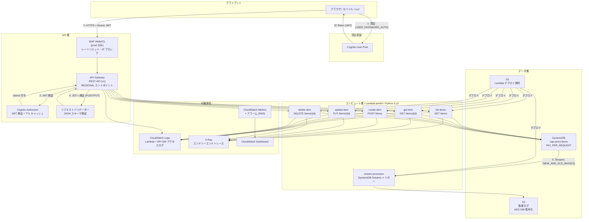
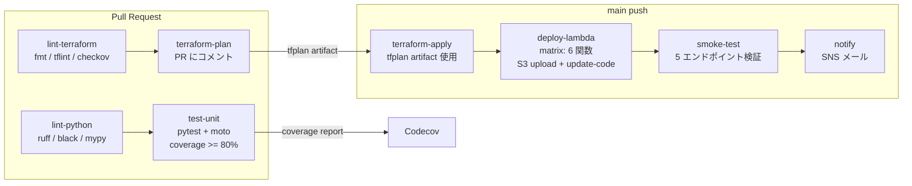

# アーキテクチャ詳細

## 全体構成図



---

## DynamoDB テーブル設計

```mermaid
erDiagram
    ITEMS {
        string PK "ITEM#item_id (Hash Key)"
        string SK "ITEM#item_id (Range Key)"
        string item_id "UUID v4"
        string user_id "Cognito sub (所有者)"
        string name "1〜100文字"
        string description "最大1000文字 (任意)"
        string status "ACTIVE or ARCHIVED"
        string created_at "ISO8601 UTC"
        string updated_at "ISO8601 UTC"
        number expires_at "UNIX TTL (任意)"
    }

    GSI_USER_INDEX {
        string PK "user_id (Hash Key)"
        string SK "created_at (Range Key)"
        note "ユーザー別アイテム一覧 (降順ページネーション)"
    }

    GSI_STATUS_INDEX {
        string PK "status (Hash Key)"
        string SK "created_at (Range Key)"
        note "ステータス別一覧 (管理用途)"
    }

    ITEMS ||--o{ GSI_USER_INDEX : "AP-03: GET /items"
    ITEMS ||--o{ GSI_STATUS_INDEX : "AP-06: 管理クエリ"
```

---

## リクエストフロー詳細

### POST /items（アイテム作成）

```
クライアント
  │
  ├─[1] Authorization: Bearer <ID Token>
  │     Body: {"name": "...", "expires_days": 30}
  │
  ▼
WAF (prod のみ)
  │  レートリミット・IP フィルタリング
  │
  ▼
API Gateway REST API
  ├─[2] Cognito Authorizer: JWT 署名・有効期限・issuer を検証
  │     → 失敗: 401 Unauthorized（Lambda は呼ばれない）
  ├─[3] リクエストバリデーター: JSON スキーマ検証
  │     → 失敗: 400 Bad Request（Lambda は呼ばれない）
  │
  ▼
Lambda: create-item (arm64 / Python 3.12)
  ├─[4] requestContext.authorizer.claims.sub から user_id を取得
  ├─[5] Pydantic ItemCreate でボディを再バリデーション
  ├─[6] UUID v4 で item_id を生成
  ├─[7] DynamoDB PutItem (ConditionExpression: attribute_not_exists(PK))
  └─[8] 201 Created + ItemResponse を返す

DynamoDB Streams
  │  NEW_IMAGE が stream-processor Lambda をトリガー
  ▼
Lambda: stream-processor
  └─[9] S3 に監査ログ (JSON) を保存
         s3://sap-{env}-audit-logs-{account_id}/items/YYYY/MM/DD/{event_id}.json
```

### GET /items（ページネーション付き一覧）

```
クライアント
  GET /items?limit=20&cursor=eyJQSyI6...

API Gateway → Lambda: list-items

  ├─ user_id = requestContext.authorizer.claims.sub
  ├─ DynamoDB Query (GSI: user-index)
  │    KeyConditionExpression: user_id = :uid
  │    ScanIndexForward: False  (作成日時降順)
  │    Limit: 20
  │    ExclusiveStartKey: Base64Decode(cursor)
  │
  └─ レスポンス:
       {
         "data": [...],
         "pagination": {
           "next_cursor": "Base64Encode(LastEvaluatedKey)",
           "has_more": true,
           "count": 20
         }
       }
```

---

## セキュリティ設計

| レイヤー | 対策 | 実装 |
|---|---|---|
| ネットワーク | IP ブロック・レートリミット | WAF WebACL (prod のみ) |
| 認証 | JWT 検証 | API Gateway Cognito Authorizer |
| 認可 | リソースオーナーシップ確認 | Lambda: `item.user_id == user_id` |
| 入力検証 | JSON スキーマ検証 | API Gateway + Pydantic |
| 暗号化 (転送中) | TLS 1.2+ | API Gateway (デフォルト) |
| 暗号化 (保存時) | AES-256 | DynamoDB (デフォルト) / S3 KMS |
| 最小権限 | Lambda ごとに専用 IAM ロール | modules/iam |
| 監査ログ | 全変更イベントを S3 に保存 | DynamoDB Streams → stream-processor |
| シークレット管理 | SSM Parameter Store 経由 | 環境変数へのハードコード禁止 |

---

## CI/CD パイプライン



**認証方式**: GitHub Actions OIDC → AWS AssumeRoleWithWebIdentity（長期クレデンシャル不要）

---

## 環境差分

| 設定項目 | dev | prod |
|---|---|---|
| WAF | 無効（コスト削減） | 有効 |
| DAX (DynamoDB Accelerator) | 無効 | 有効 |
| DynamoDB PITR | 無効 | 有効 |
| Cognito Authorizer | 無効（user_id クエリパラメータで代替） | 有効 |
| Lambda 同時実行数上限 | 未設定 | 設定あり |
| CloudWatch ログ保持期間 | 14 日 | 90 日 |
| カスタムドメイン | なし | あり（Route53 + ACM） |

---

## モジュール依存関係

```
environments/dev/main.tf
  ├── modules/dynamodb      ← テーブル・GSI・Streams・TTL
  ├── modules/storage       ← S3 (監査ログ・デプロイ資材)
  ├── modules/iam           ← Lambda 実行ロール (dynamodb, storage に依存)
  ├── modules/lambda-function (×6)  ← iam, storage に依存
  ├── modules/api-gateway   ← lambda-function に依存
  ├── modules/cognito       ← (prod で api-gateway に渡す)
  └── modules/monitoring    ← lambda-function, api-gateway に依存
```
