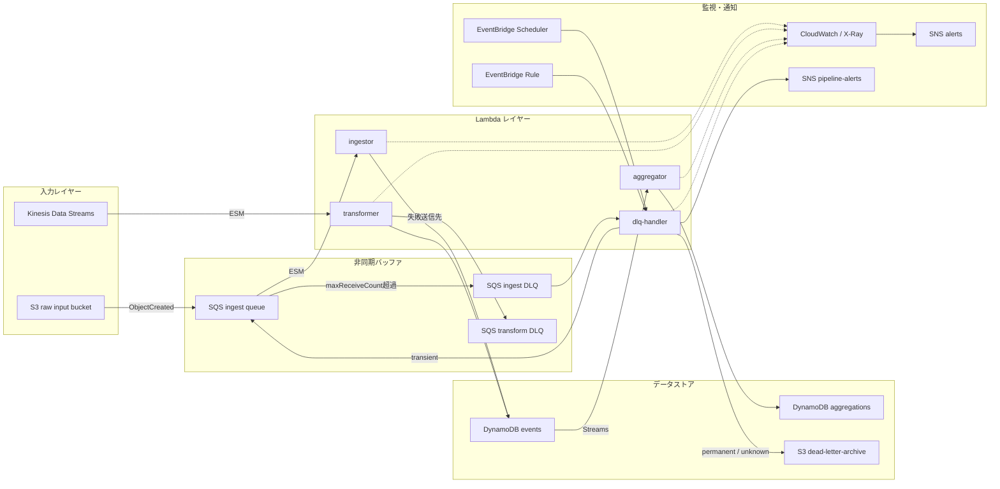
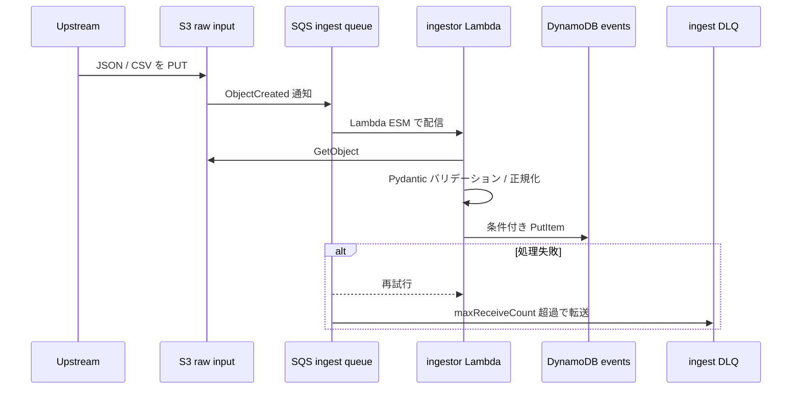
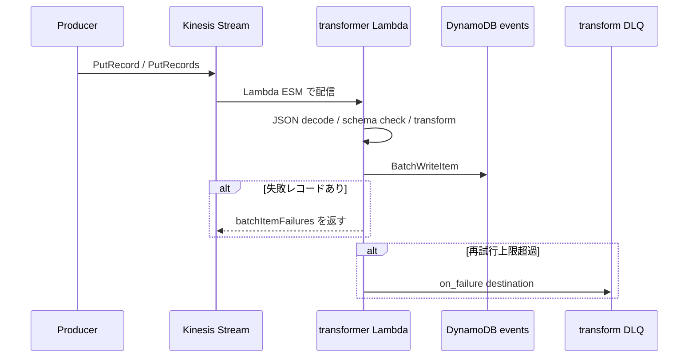
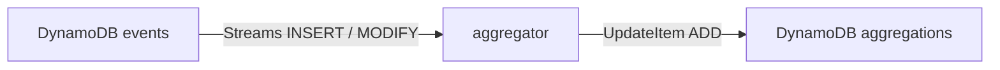
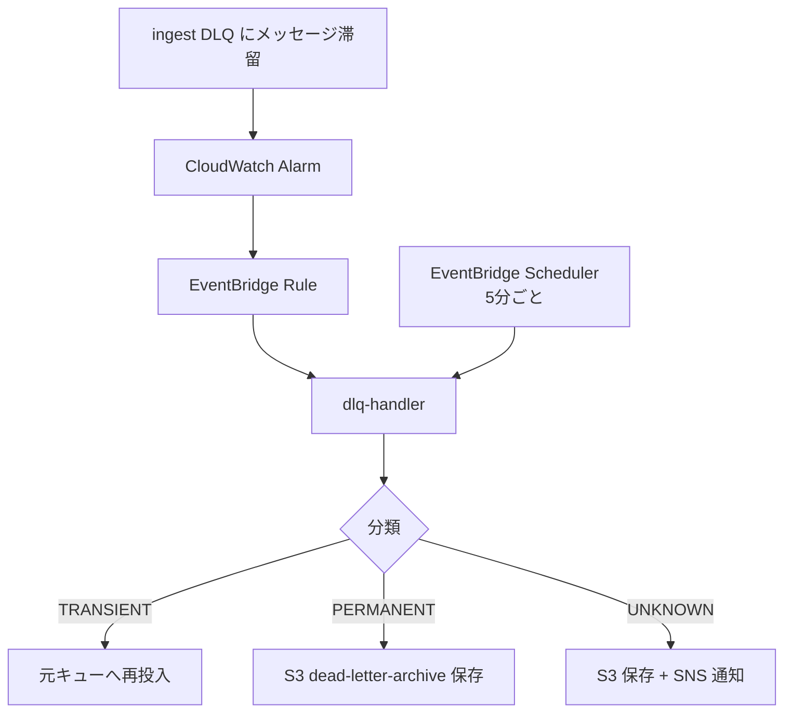
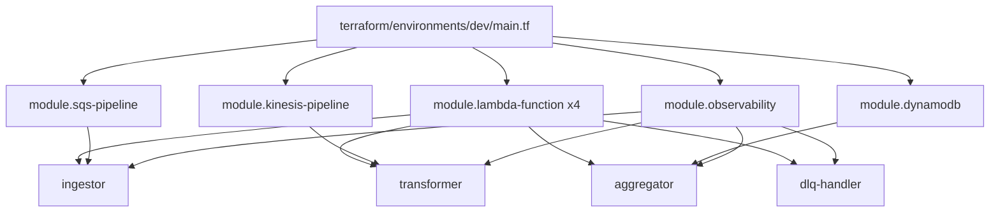

# ARCHITECTURE

## このドキュメントの目的

この `ARCHITECTURE.md` は、`serverless-event-pipeline` の全体像を「実装ベース」で理解するための中核ドキュメントです。

- 何を作ろうとしているプロジェクトか
- 現在どこまで実装されているか
- AWS リソースがどう接続されているか
- Lambda ごとの責務とデータの流れ
- Terraform モジュールの分割意図
- 運用・監視・CI/CD まで含めた構造

を、コードと Terraform 定義を読み解いた内容で整理しています。

> 重要: `README.md` と `docs/architecture.md` には将来像を含む記述があります。  
> このドキュメントは **2026-05-06 時点のリポジトリ実装を優先** してまとめています。

---

## 1. エグゼクティブサマリー

このプロジェクトは、AWS 上に構築するイベント駆動サーバーレス基盤の実践例です。現在の実装は、主に次の 4 本の Lambda を中心に成り立っています。

1. `ingestor`
   S3 に置かれた JSON / CSV を SQS 経由で受け取り、Pydantic で検証して DynamoDB に保存する
2. `transformer`
   Kinesis Data Streams のイベントを受け取り、ビジネスロジック変換後に DynamoDB へ一括書き込みする
3. `aggregator`
   events テーブルの DynamoDB Streams を受け取り、日次集計を aggregations テーブルへ反映する
4. `dlq-handler`
   ingest DLQ に滞留したメッセージを分類し、再投入または S3 アーカイブする

つまりこのシステムは、**入力経路が 2 本あるイベント基盤**です。

- S3 ファイル投入系: `S3 -> SQS -> ingestor -> DynamoDB`
- ストリーム投入系: `Kinesis -> transformer -> DynamoDB`

その後、両者が書き込む `events` テーブルを起点に、

- `DynamoDB Streams -> aggregator -> aggregations`

という集計レイヤーが続きます。

---

## 2. 現在の全体アーキテクチャ



### ひとことで言うと

- `ingestor` は「ファイル投入の入口」
- `transformer` は「リアルタイムストリーム変換」
- `aggregator` は「DynamoDB Streams 集計」
- `dlq-handler` は「失敗イベントの後始末」

です。

---

## 3. 実装上の重要ポイント

### 3.1 「設計目標」と「現状実装」は少し違う

このリポジトリには将来構想も含まれており、現状の実装と差がある箇所があります。理解の上ではここがとても大事です。

| 項目 | README / 既存 docs の記述 | 現状実装 |
|---|---|---|
| API Gateway | 入力経路として登場 | 未実装 |
| transformer の S3 Parquet 出力 | 記載あり | 未実装 |
| archive 用 S3 バケット | 記載あり | 未実装 |
| prod 環境 | 存在する前提 | `terraform/environments/prod/main.tf` は未実装 |
| dlq-handler の対象 DLQ | 複数 DLQ を想定 | 現在は ingest DLQ のみマッピング済み |

このため、このドキュメントでは **「今あるコード」** を主語に説明しています。

### 3.2 実際に動く中心は dev 環境

Terraform の実装は `terraform/environments/dev/main.tf` に集中しています。  
このファイルが実質的なシステム構成図そのものです。

### 3.3 イベントソースマッピングをエイリアスに向けている

SQS / Kinesis / DynamoDB Streams の各トリガーは、Lambda 関数そのものではなく **`live` エイリアス ARN** に接続されています。  
これは将来的なカナリアデプロイをしやすくする良い設計です。

---

## 4. データフロー詳細

## 4.1 S3 ファイル投入フロー



### `ingestor` の責務

- SQS メッセージの中にある S3 通知 JSON を解析
- S3 オブジェクトをダウンロード
- `.json` / `.csv` を拡張子で判定
- `InputPayload` モデルで検証
- DynamoDB に重複防止付きで保存
- `ProcessedRecords` / `ValidationErrors` / `ProcessingLatencyMs` を記録

### 特徴

- Powertools の `BatchProcessor` を使い、SQS バッチの部分失敗に対応
- `ConditionExpression` によって重複書き込みを抑制
- バリデーションエラーは行単位でスキップし、システム障害にはしない

---

## 4.2 Kinesis ストリーム投入フロー



### `transformer` の責務

- Kinesis レコードをデコード
- `PURCHASE` / `VIEW` / `CLICK` をビジネス変換
- `entity_id` 正規化、TTL 計算、DynamoDB アイテム生成
- 25 件単位で `BatchWriteItem`
- `UnprocessedItems` を指数バックオフ再試行

### 特徴

- 変換ロジックは `src/transformer/transform.py` に純粋関数として分離
- `TransformedRecords` をイベントタイプ別ディメンションで記録
- `RecordAgeSeconds` で Kinesis 側の滞留を可視化
- Kinesis の順序保証はシャード内のみ

### 現時点で未実装のもの

- S3 Parquet への出力
- archive 用 S3 バケットへの保存

---

## 4.3 集計フロー



### `aggregator` の責務

- `events` テーブルの Streams を受信
- `INSERT` / `MODIFY` のみ処理
- `entity_id + 日付` で集計キーを組み立て
- `PURCHASE` は `TOTAL_AMOUNT`
- `VIEW` は `VIEW_COUNT`
- `ADD` 式でアトミック加算

### 重要な設計意図

- DynamoDB Streams は at-least-once 配信
- `MODIFY` は `OldImage` と `NewImage` の差分を使って二重集計影響を抑える
- 完全な冪等性ではなく、「現実的な運用に耐える近似」を採用している

---

## 4.4 DLQ 処理フロー



### `dlq-handler` の責務

- DLQ をポーリングしてメッセージを取得
- MessageAttributes や本文から失敗理由を分類
- 一時エラーなら再キューイング
- 恒久エラー / 不明エラーなら gzip 圧縮して S3 保存
- 処理サマリーを SNS 通知

### 現在の制約

`DLQ_QUEUE_MAPPING` は今のところ以下の 1 本だけです。

- ingest DLQ -> ingest queue

つまり **transform DLQ は存在するが、dlq-handler の自動再処理対象にはまだ入っていません。**

---

## 5. コンポーネント一覧

## 5.1 Lambda

| 名前 | トリガー | 入力 | 主な責務 | 出力 |
|---|---|---|---|---|
| `sep-dev-ingestor` | SQS ESM | S3 通知 | S3 読み取り、検証、正規化、重複防止書き込み | `events` |
| `sep-dev-transformer` | Kinesis ESM | Kinesis イベント | 変換、メトリクス記録、一括書き込み | `events` |
| `sep-dev-aggregator` | DynamoDB Streams ESM | `events` の変更 | 日次集計、ADD 更新 | `aggregations` |
| `sep-dev-dlq-handler` | Scheduler / EventBridge | DLQ メッセージ | 分類、再投入、アーカイブ、通知 | SQS / S3 / SNS |

## 5.2 DynamoDB

| テーブル | キー | 用途 |
|---|---|---|
| `sep-dev-events` | `entity_id` + `event_ts` | 正規化済みイベントの保存 |
| `sep-dev-aggregations` | `aggregate_key` + `metric_type` | 日次集計結果 |

### `events` テーブルの特徴

- `PAY_PER_REQUEST`
- GSI `status-index`
- TTL `expires_at`
- Streams `NEW_AND_OLD_IMAGES`
- dev では PITR 無効

## 5.3 キュー / ストリーム

| リソース | 用途 |
|---|---|
| `ingest queue` | S3 通知のバッファ |
| `ingest DLQ` | ingestor 処理失敗の隔離 |
| `events stream` | リアルタイムイベント取り込み |
| `transform DLQ` | transformer の失敗送信先 |

## 5.4 S3 バケット

| バケット | 用途 |
|---|---|
| `raw-input` | ingestor の入力 |
| `dead-letter-archive` | 恒久エラー / 不明エラーの保存 |
| `artifacts` | Lambda zip 配置先 |

---

## 6. Terraform 構造

## 6.1 俯瞰



## 6.2 モジュールごとの役割

| モジュール | 役割 |
|---|---|
| `lambda-function` | Lambda 共通化。zip 化、S3 配置、IAM ロール、ロググループ、`live` エイリアス、X-Ray |
| `sqs-pipeline` | raw-input バケット、SQS、DLQ、S3 通知、SQS ESM |
| `kinesis-pipeline` | Kinesis ストリーム、transform DLQ、Kinesis ESM、iterator age アラーム |
| `dynamodb` | `events` / `aggregations` テーブル |
| `observability` | X-Ray、CloudWatch Dashboard、Alarm、Log Insights、Lambda Insights |

## 6.3 設計としてうまい点

- Lambda モジュールがかなりよく共通化されている
- `live` エイリアス前提のため運用拡張しやすい
- 監視基盤がモジュール分離されている
- IAM が用途別にかなり絞られている

## 6.4 注意点

- `prod` 環境の本体がまだない
- `docs/architecture.md` は現状とずれている
- モジュール `iam/` はほぼ空で、実際の IAM 定義は `dev/main.tf` と `lambda-function` にある

---

## 7. アプリケーションコード構造

## 7.1 ディレクトリ

```text
src/
├── ingestor/
├── transformer/
├── aggregator/
├── dlq_handler/
└── shared/
```

## 7.2 各パッケージの役割

| パッケージ | 内容 |
|---|---|
| `src/ingestor` | S3/SQS 入力処理、バリデーション、DynamoDB 保存 |
| `src/transformer` | Kinesis イベント変換、BatchWrite |
| `src/aggregator` | Streams 集計 |
| `src/dlq_handler` | DLQ ドレインと分類 |
| `src/shared` | Pydantic モデル、環境変数、TTL、Tracer 補助 |

## 7.3 shared の意味

`shared` は単なる共通関数集ではなく、設計ルールの中心でもあります。

- `InputPayload`
- `EventRecord`
- `EventStatus`
- TTL 計算
- DynamoDB 互換変換
- Tracer の no-op 切り替え

がここに集まっています。

---

## 8. 監視・運用設計

## 8.1 可観測性の考え方

このプロジェクトは、単に Lambda が動くだけでなく、**「壊れたときに追えること」** まで意識して設計されています。

主な仕組み:

- Powertools Logger
- Powertools Metrics
- Powertools Tracer
- X-Ray
- CloudWatch Dashboard
- Alarm
- Log Insights 保存クエリ

## 8.2 監視している主要シグナル

| 種類 | 例 |
|---|---|
| Lambda 健全性 | Errors, Duration, Throttles, ConcurrentExecutions |
| ingest 品質 | ProcessedRecords, ValidationErrors |
| transform 品質 | TransformedRecords, BatchWriteErrors, RecordAgeSeconds |
| 集計品質 | AggregatedEvents, AggregationErrors |
| キュー異常 | ingest DLQ depth, transform DLQ depth |
| ストリーム遅延 | Kinesis IteratorAge |
| 実行特性 | ColdStart rate |

## 8.3 dlq-handler の運用上の価値

多くのサンプル実装は DLQ を置いて終わりですが、このプロジェクトはさらに一歩進んでいます。

- DLQ を見に行く Lambda がある
- transient / permanent / unknown を分ける
- 永続保存先がある
- 通知まで行う

この部分は「本番運用を意識したポートフォリオ」としてかなり強いです。

---

## 9. CI/CD とテスト戦略

## 9.1 CI

`ci.yml` は PR 時に以下を並列実行します。

1. Python lint
2. unit test + coverage
3. Terraform lint / fmt / checkov
4. Terraform plan + PR コメント

この構成により、アプリコードと IaC を同じ重みで品質管理しています。

## 9.2 CD

`cd.yml` は main マージ後に以下を直列実行します。

1. Terraform apply
2. Lambda デプロイ
3. integration test
4. promote or rollback

OIDC 前提になっており、アクセスキーを長期保存しない設計です。

## 9.3 テストの層

| 層 | 内容 |
|---|---|
| Unit | moto を使ったローカル AWS モック |
| Integration | 実 AWS の dev 環境を叩く E2E |
| Terraform 静的検査 | fmt / tflint / checkov |

---

## 10. このプロジェクトの強み

### 強み 1: 入口が複数あっても責務が分離されている

ファイル投入とストリーム投入が別 Lambda で分かれているため、複雑さを局所化できています。

### 強み 2: Terraform モジュール分割が明確

「Lambda 共通」「SQS パイプライン」「Kinesis パイプライン」「監視」が分かれており、読みやすいです。

### 強み 3: 監視と障害系がちゃんと設計されている

DLQ、アラーム、X-Ray、Log Insights まであるので、実運用を意識した構成になっています。

### 強み 4: Python 実装がテストしやすい

`transform.py` の純粋関数分離や `validator.py` の切り出しは、保守性の高い設計です。

---

## 11. 現時点のギャップと今後の拡張候補

## 11.1 実装ギャップ

| 項目 | 状態 |
|---|---|
| API Gateway 入力 | 未実装 |
| transformer の S3 archive 出力 | 未実装 |
| transform DLQ の自動再処理 | 未接続 |
| prod 環境 | 未実装 |
| 現状に合った architecture doc | このファイルで補完 |

## 11.2 次に着手すると価値が高いもの

1. `transform DLQ` を `dlq-handler` の対象へ追加する
2. `transformer` の S3 archive 出力を実装する
3. `prod/main.tf` を dev から昇格させる
4. `README.md` と `docs/architecture.md` を現状に合わせる
5. API Gateway または EventBridge を正式な入力経路として追加する

---

## 12. 読み進める順番

このプロジェクトを最短で理解するなら、次の順で読むのがおすすめです。

1. `terraform/environments/dev/main.tf`
2. `terraform/modules/lambda-function/main.tf`
3. `terraform/modules/sqs-pipeline/main.tf`
4. `terraform/modules/kinesis-pipeline/main.tf`
5. `terraform/modules/dynamodb/main.tf`
6. `src/ingestor/handler.py`
7. `src/transformer/handler.py`
8. `src/aggregator/handler.py`
9. `src/dlq_handler/handler.py`
10. `.github/workflows/ci.yml` と `.github/workflows/cd.yml`

---

## 13. 最終まとめ

このリポジトリは、単なる Lambda サンプルではなく、

- 複数入力経路
- 非同期バッファ
- ホットストレージ
- ストリーム集計
- DLQ 再処理
- Terraform モジュール化
- OIDC ベース CI/CD
- 監視と障害対応

まで含んだ、かなり本格的なサーバーレス基盤の学習・実践プロジェクトです。

一方で、ドキュメント上の将来像と実装済み範囲には差があるため、今後は

- 現状との差分整理
- prod 実装
- archive 出力実装
- transform DLQ の自動処理

を進めると、さらに完成度が上がります。
