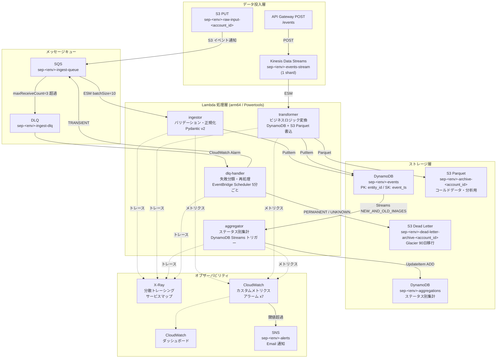
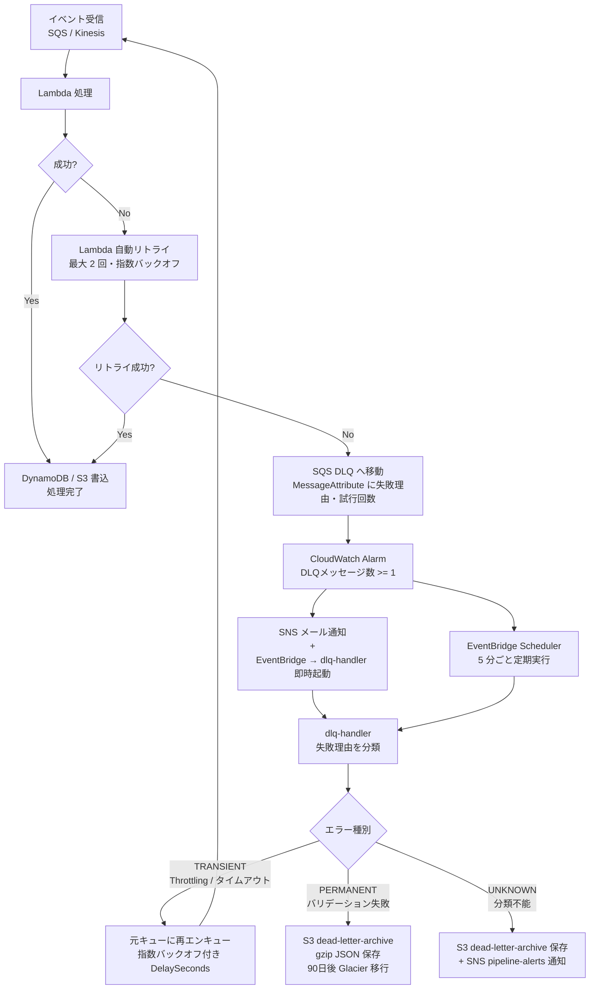

# Serverless Event Pipeline

> **「設計できる・コードに落とせる・運用まで考えられる」を証明するプロダクションレベルのポートフォリオ**
>
> S3 / Kinesis / SQS x Lambda x DynamoDB / S3 で構築するイベント駆動サーバーレスデータパイプライン

[](https://github.com/your-username/serverless-event-pipeline/actions/workflows/ci.yml)
[](https://github.com/your-username/serverless-event-pipeline/actions/workflows/cd.yml)
[](https://github.com/your-username/serverless-event-pipeline/actions)
[](https://www.terraform.io/)
[](https://www.python.org/)
[](LICENSE)

---

## アーキテクチャ図

### イベントフロー全体図



### エラーハンドリングフロー図



---

## 技術スタック

| カテゴリ | 技術 | 採用理由 |
|---|---|---|
| IaC | Terraform ~> 1.7 | 宣言的インフラ管理・モジュール再利用・State によるドリフト検知 |
| Runtime | Python 3.12 / arm64 (Graviton2) | コスト ~20% 削減・パフォーマンス向上・最新ランタイムサポート |
| Observability | AWS Lambda Powertools v3 | 構造化 JSON ログ・X-Ray トレース・カスタムメトリクスの統合実装 |
| データバリデーション | Pydantic v2 | 高速スキーマ検証（Rust コア）・型安全なモデル定義 |
| Streaming | Kinesis Data Streams | シャード内順序保証・最大 365 日保持・ESM による並列処理 |
| キュー | SQS + DLQ | 高スループット非同期処理・maxReceiveCount によるリトライ制御 |
| ストレージ (Hot) | DynamoDB PAY_PER_REQUEST | サーバーレス・自動スケール・GSI によるフレキシブルクエリ |
| ストレージ (Cold) | S3 + Parquet | 列指向圧縮・Athena/Glue 連携・コスト最適ライフサイクル |
| テスト | pytest + moto + Terratest | Unit / Integration / IaC の 3 層テスト・AWS モックで高速実行 |
| CI/CD | GitHub Actions + OIDC | アクセスキーレスの安全なデプロイ・PR へ terraform plan 自動コメント |
| デプロイ戦略 | Lambda Alias + Weighted Routing | カナリアデプロイ (10%) → 統合テスト合格 → 100% 昇格・自動ロールバック |
| セキュリティ | IAM 最小権限 + SSM Parameter Store | 実行ロールに `*` リソース指定禁止・秘匿情報のハードコード禁止 |

---

## ディレクトリ構成

```
serverless-event-pipeline/
├── CLAUDE.md                   # AI コーディング向け設計方針
├── README.md
├── Makefile
├── pytest.ini
├── requirements-dev.txt
├── scripts/
│   └── bootstrap.sh            # tfstate バックエンド初期化スクリプト
├── docs/
│   ├── architecture.md         # アーキテクチャ詳細・コンポーネント説明
│   ├── adr/                    # Architecture Decision Records
│   │   ├── 001-kinesis-vs-sqs.md
│   │   ├── 002-dynamodb-design.md
│   │   └── 003-error-handling-strategy.md
│   └── runbook.md              # 障害対応手順書
├── terraform/
│   ├── environments/
│   │   ├── dev/                # dev 環境ルートモジュール
│   │   │   ├── main.tf         # 全モジュールの組み合わせ・IAM ポリシー
│   │   │   ├── variables.tf
│   │   │   ├── outputs.tf
│   │   │   ├── providers.tf
│   │   │   ├── backend.tf
│   │   │   └── github-oidc.tf  # GitHub Actions OIDC ロール
│   │   └── prod/
│   └── modules/
│       ├── lambda-function/    # Lambda 共通設定（arm64 / Powertools / X-Ray / Alias）
│       ├── kinesis-pipeline/   # Kinesis Data Streams + Lambda ESM + アラーム
│       ├── sqs-pipeline/       # SQS + Lambda ESM + DLQ + アラーム
│       ├── dynamodb/           # テーブル / GSI / Streams / TTL / PITR
│       ├── observability/      # X-Ray / CloudWatch ダッシュボード / アラーム x7
│       └── iam/                # Lambda 実行ロール基盤
├── src/
│   ├── ingestor/               # バリデーション・正規化 Lambda
│   ├── transformer/            # ビジネスロジック変換 Lambda
│   ├── aggregator/             # DynamoDB Streams 集計 Lambda
│   ├── dlq_handler/            # DLQ 再処理 Lambda
│   └── shared/                 # 共通モデル (Pydantic) / ユーティリティ
├── tests/
│   ├── unit/                   # pytest + moto（AWS モック）
│   └── integration/            # E2E テスト（実 AWS リソース使用）
└── .github/
    └── workflows/
        ├── ci.yml              # PR: lint / test / terraform plan
        └── cd.yml              # main: apply / canary deploy / promote-or-rollback
```

---

## セットアップ手順

### 前提条件の確認

以下のツールが必要です。バージョンが合わない場合は動作しないことがあるため、必ず確認してください。

```bash
terraform -version   # 1.7.x 以上であること（~> 1.7）
aws --version        # AWS CLI v2（v1 は非推奨）
python3 --version    # 3.12 以上であること
make --version       # GNU Make が使えること
```

**AWS 認証の確認**: 操作対象の AWS アカウントに接続できているか確認します。

```bash
aws sts get-caller-identity
# 出力例:
# {
#     "UserId": "AIXXXXXXXXXXXXXXXX",
#     "Account": "123456789012",    ← このアカウントにリソースが作成されます
#     "Arn": "arn:aws:iam::123456789012:user/your-name"
# }
```

> プロファイルを使い分ける場合は `export AWS_PROFILE=your-profile` を先に実行してください。

---

### Step 1: リポジトリのクローン

```bash
git clone https://github.com/your-username/serverless-event-pipeline.git
cd serverless-event-pipeline
```

クローン後、以下の構成になっていることを確認します。

```bash
ls
# CLAUDE.md  Makefile  README.md  docs/  scripts/  src/  terraform/  tests/
```

主要なディレクトリの役割:
- `terraform/` — インフラ定義（Terraform）
- `src/` — Lambda 関数のソースコード（Python）
- `tests/` — テストコード（pytest + moto）
- `scripts/` — 初期セットアップ用スクリプト
- `docs/` — 設計ドキュメント・ADR・障害対応手順

---

### Step 2: Terraform リモートステートバックエンドの初期化（初回のみ）

#### なぜこの手順が必要か？

Terraform は「どのリソースを作ったか」を **State ファイル**（`.tfstate`）で管理します。
State ファイルをローカルに置くとチーム共有が難しく、複数人が同時に `terraform apply` すると壊れます。
そのため以下の 3 つのリソースを事前に手動で作成し、State をクラウド管理します。

| リソース | 役割 |
|---|---|
| S3 バケット | State ファイルの保存先（バージョニング有効） |
| DynamoDB テーブル | 同時実行ロック（2人が同時に apply するのを防ぐ） |
| KMS キー | State ファイルの暗号化（秘匿情報を平文保存しない） |

#### 実行

```bash
# bootstrap スクリプトを実行（べき等設計のため既存リソースはスキップされます）
chmod +x scripts/bootstrap.sh
bash scripts/bootstrap.sh
```

実行後の出力例（Account ID は自動取得されます）:

```
===================================================
 serverless-event-pipeline tfstate bootstrap
===================================================
  Region     : ap-northeast-1
  Account ID : 123456789012
  S3 Bucket  : sep-tfstate-123456789012
  DynamoDB   : sep-tfstate-lock
===================================================
[1/4] KMS キーを作成します...
[2/4] S3 バケットを作成します...
[3/4] DynamoDB テーブルを作成します...
[4/4] backend.tf を更新します...
 bootstrap 完了！
```

#### 成功確認

```bash
# S3 バケットが作成されたか
aws s3 ls | grep sep-tfstate
# sep-tfstate-123456789012

# DynamoDB テーブルが作成されたか
aws dynamodb describe-table --table-name sep-tfstate-lock \
  --query "Table.TableStatus" --output text
# ACTIVE
```

> **よくあるエラー**: `BucketAlreadyOwnedByYou` — すでに存在するバケットです。スキップされるので問題ありません。
> **よくあるエラー**: `AccessDeniedException` — IAM 権限が不足しています。`s3:CreateBucket`, `dynamodb:CreateTable`, `kms:CreateKey` が必要です。

---

### Step 3: GitHub Actions OIDC ロールの作成（CI/CD を使う場合）

#### なぜ OIDC か？

GitHub Actions から AWS を操作するには認証が必要です。
従来は IAM ユーザーのアクセスキーを GitHub Secrets に保存する方法が一般的でしたが、
**キーの漏洩リスク**と**ローテーション管理の手間**がありました。

OIDC（OpenID Connect）を使うと、GitHub Actions が一時的なトークンを取得して AWS に認証できます。
**長期有効なアクセスキーをどこにも保存しない**のがメリットです。

#### 実行

Terraform で OIDC ロールを作成します（`github-oidc.tf` に定義済み）。
まず一度だけ**ローカルの IAM 権限で**デプロイが必要です。

```bash
# GitHub リポジトリ名を変数として渡す
terraform -chdir=terraform/environments/dev apply \
  -target=aws_iam_openid_connect_provider.github \
  -target=aws_iam_role.github_actions \
  -var="account_id=$(aws sts get-caller-identity --query Account --output text)" \
  -var="github_repo=your-username/serverless-event-pipeline"
```

#### GitHub Secrets の設定

GitHub リポジトリの **Settings → Secrets and variables → Actions** で以下を設定してください。

| 種別 | 名前 | 値 |
|---|---|---|
| Secret | `AWS_ACCOUNT_ID` | AWS アカウント ID（12桁の数字）|
| Variable | `ALERT_EMAIL` | アラート通知先メールアドレス |

> CI/CD を使わずローカルのみで検証する場合はこの Step をスキップできます。

---

### Step 4: Terraform 初期化

#### `terraform init` が何をするか

`init` コマンドは以下を行います。
1. `required_providers` に書かれた AWS プロバイダをダウンロード（`.terraform/` に保存）
2. S3 バックエンドに接続して State を読み込む準備
3. 子モジュール（`modules/` 以下）の参照を解決

```bash
make init
```

成功時の出力例:

```
Initializing the backend...
Successfully configured the backend "s3"!   ← S3 バックエンドに接続成功

Initializing provider plugins...
- Finding hashicorp/aws versions matching "~> 5.50"...
- Installing hashicorp/aws v5.50.0...

Terraform has been successfully initialized!
```

> **よくあるエラー**: `Failed to get existing workspaces: S3 bucket does not exist` → Step 2 が完了していません。先に `bash scripts/bootstrap.sh` を実行してください。

#### 現在の State 状況を確認

```bash
terraform -chdir=terraform/environments/dev state list
# 初回は何も出力されません（State が空）
# デプロイ後は管理対象リソースが一覧表示されます
```

---

### Step 5: Python テスト環境のセットアップ

#### moto とは？

テストコードは **moto** という AWS モックライブラリを使います。
moto を使うと、**実際の AWS にアクセスせずに** DynamoDB・SQS・Kinesis・S3 などを
Python プロセス内で完全シミュレートできます。
→ テストが高速（秒単位）・コストゼロ・インターネット不要

```bash
# .venv（仮想環境）を作成して依存パッケージをインストール
make setup-python

# 仮想環境を有効化（以降のコマンドはこれが必要）
source .venv/bin/activate

# プロンプトの先頭に (.venv) が付いていれば有効化されています
# (.venv) $ ...
```

#### テスト実行

```bash
make test
```

出力例（全テスト合格・カバレッジ 80% 以上）:

```
tests/unit/test_ingestor.py::test_valid_event_stored_to_dynamodb PASSED
tests/unit/test_ingestor.py::test_invalid_event_returns_batch_failure PASSED
tests/unit/test_transformer.py::test_transform_writes_parquet_to_s3 PASSED
tests/unit/test_aggregator.py::test_aggregation_increments_count PASSED

---------- coverage: platform linux, python 3.12 ----------
Name                          Stmts   Miss  Cover
-------------------------------------------------
src/ingestor/handler.py          42      4    90%
src/transformer/handler.py       55      8    85%
src/aggregator/handler.py        38      5    87%
src/shared/models.py             28      0   100%
-------------------------------------------------
TOTAL                           163     17    90%

Required test coverage of 80% reached. Total coverage: 90.00%
```

> **よくあるエラー**: `ModuleNotFoundError: No module named 'aws_lambda_powertools'` → `source .venv/bin/activate` を忘れています。
> **よくあるエラー**: `FAILED - Coverage 75% < 80%` → テストが足りません。`tests/unit/` を確認してください。

---

### Step 6: インフラのデプロイ

#### まず plan で変更内容を確認する（必須）

`terraform plan` は**実際には何も変更しません**。
「これから何を作成・変更・削除するか」を事前に確認するためのコマンドです。
本番環境でも必ず plan を確認してから apply するのが鉄則です。

```bash
make plan
```

出力の見方:

```
Terraform will perform the following actions:

  # module.kinesis_pipeline.aws_kinesis_stream.events will be created
  + resource "aws_kinesis_stream" "events" {
      + name        = "sep-dev-events-stream"
      + shard_count = 1
      ...
    }

Plan: 47 to add, 0 to change, 0 to destroy.
# ↑ 47 個のリソースを新規作成する（変更・削除はなし）
```

記号の意味:
- `+` — 新規作成される
- `~` — 変更される（インプレース更新）
- `-` — 削除される ⚠️ 削除が含まれる場合は慎重に確認
- `-/+` — 一度削除して再作成される（ダウンタイムが発生する場合あり）

#### デプロイ実行

```bash
make apply
# 内部では: terraform apply -var="account_id=..." -auto-approve は使わないので確認プロンプトが出ます
```

```
Do you want to perform these actions?
  Terraform will perform the actions described above.
  Only 'yes' will be accepted to approve.

  Enter a value: yes   ← "yes" と入力して Enter
```

完了メッセージ:

```
Apply complete! Resources: 47 added, 0 changed, 0 destroyed.

Outputs:

kinesis_stream_name    = "sep-dev-events-stream"
ingestor_function_name = "sep-dev-ingestor"
events_table_name      = "sep-dev-events"
api_gateway_url        = "https://xxxxxxxxxx.execute-api.ap-northeast-1.amazonaws.com/dev"
```

#### デプロイ後の確認

```bash
# 作成されたリソースの一覧（State で管理中のリソース）
terraform -chdir=terraform/environments/dev state list | head -20

# Lambda 関数が作成されたか
aws lambda list-functions --query "Functions[?starts_with(FunctionName, 'sep-dev')].[FunctionName]" --output table

# Kinesis Stream の状態確認
aws kinesis describe-stream-summary --stream-name sep-dev-events-stream \
  --query "StreamDescriptionSummary.StreamStatus" --output text
# ACTIVE と表示されれば正常
```

---

### Step 7: 動作確認

デプロイ完了後、実際にイベントを投入してパイプラインを動作させます。

```bash
ACCOUNT_ID=$(aws sts get-caller-identity --query Account --output text)
```

#### 7-1. Kinesis 経由（リアルタイムストリーム処理）

```bash
# テストイベントを Kinesis に投入
# --partition-key: 同一ユーザーのイベントを同一シャードに割り当てる（順序保証）
# --data: JSON を base64 エンコードして渡す
aws kinesis put-record \
  --stream-name sep-dev-events-stream \
  --partition-key "USER#u001" \
  --data "$(echo '{"entity_id":"USER#u001","event_type":"click","payload":{"page":"top"}}' | base64)"

# 成功時の出力例:
# {
#     "ShardId": "shardId-000000000000",
#     "SequenceNumber": "49653..."
# }
```

transformer Lambda が 5〜10 秒後に起動します。DynamoDB に書き込まれたか確認します。

```bash
# DynamoDB から該当ユーザーのイベントを取得
aws dynamodb query \
  --table-name sep-dev-events \
  --key-condition-expression "entity_id = :eid" \
  --expression-attribute-values '{":eid": {"S": "USER#u001"}}' \
  --query "Items"
```

#### 7-2. SQS 経由（S3 ファイル投入）

```bash
# テスト用 JSON ファイルを S3 に PUT（S3 イベント通知 → SQS → ingestor Lambda が起動）
echo '{"entity_id":"USER#u002","event_type":"purchase","payload":{"item_id":"P001","amount":1500}}' \
  > /tmp/test-event.json

aws s3 cp /tmp/test-event.json \
  s3://sep-dev-raw-input-${ACCOUNT_ID}/events/test-event.json

# ingestor Lambda が 5〜10 秒後に起動して DynamoDB に書き込む
aws dynamodb query \
  --table-name sep-dev-events \
  --key-condition-expression "entity_id = :eid" \
  --expression-attribute-values '{":eid": {"S": "USER#u002"}}' \
  --query "Items"
```

#### 7-3. Lambda ログの確認（CloudWatch Logs）

Lambda の実行ログは CloudWatch Logs に構造化 JSON 形式で出力されます。

```bash
# transformer の最新ログを確認（PowertoolsのJSONログ）
aws logs tail /aws/lambda/sep-dev-transformer --follow
# Ctrl+C で終了

# ingestor の最新ログを確認
aws logs tail /aws/lambda/sep-dev-ingestor --follow
```

ログ出力例（Powertools の構造化 JSON）:

```json
{
  "level": "INFO",
  "location": "handler:42",
  "message": "Event processed successfully",
  "entity_id": "USER#u001",
  "event_type": "click",
  "correlation_id": "abc-123",
  "cold_start": true,
  "function_name": "sep-dev-transformer",
  "timestamp": "2024-01-15T12:00:00.000Z"
}
```

#### 7-4. S3 Parquet 出力の確認

transformer Lambda は DynamoDB 書き込みと同時に S3 に Parquet 形式でデータを保存します。

```bash
aws s3 ls s3://sep-dev-archive-${ACCOUNT_ID}/ --recursive
# 出力例:
# 2024-01-15 12:00:05    1234 events/year=2024/month=01/day=15/part-00001.parquet
```

#### 7-5. X-Ray トレースの確認

```bash
# 過去 5 分のトレースを取得
aws xray get-trace-summaries \
  --start-time $(date -d '5 minutes ago' +%s) \
  --end-time $(date +%s) \
  --filter-expression 'service("sep-dev-transformer")' \
  --query "TraceSummaries[0].{Duration:Duration,Status:ResponseTime}"
```

AWS コンソールの **X-Ray → サービスマップ** でパイプライン全体の依存関係と遅延をグラフィカルに確認できます。

---

### Step 8: リソースの削除

検証が終わったら必ずリソースを削除してコストを止めてください。
Kinesis Data Streams は 1 シャードで **月額 ~$15** 発生するため、使わない期間は必ず削除します。

```bash
make destroy
```

```
Do you really want to destroy all resources?
  Terraform will destroy all your managed infrastructure, as shown above.
  There is no undo. Only 'yes' will be accepted to confirm.

  Enter a value: yes   ← "yes" と入力
```

```
Destroy complete! Resources: 47 destroyed.
```

> **注意**: `terraform destroy` は **tfstate バックエンド**（S3 バケット・DynamoDB テーブル・KMS キー）は削除しません。
> これらは Terraform の管理外（bootstrap スクリプトで作成）のため、不要になったら手動で削除してください。

```bash
# 削除確認（Lambda 関数が残っていないか）
aws lambda list-functions \
  --query "Functions[?starts_with(FunctionName, 'sep-dev')].[FunctionName]" \
  --output table
# 何も表示されなければ削除完了
```

---

## 主要 Make コマンド

```bash
make init              # terraform init（dev 環境）
make plan              # terraform plan
make apply             # terraform apply
make destroy           # terraform destroy
make fmt               # terraform fmt -recursive + black フォーマット
make lint              # ruff + mypy + tflint
make setup-python      # .venv 作成・依存インストール
make test              # pytest 単体テスト（moto モック）
make test-integration  # pytest 統合テスト（実 AWS リソース）
make bootstrap         # scripts/bootstrap.sh 実行
make help              # コマンド一覧表示

# 環境切り替え
make plan ENV=prod
make apply ENV=prod
```

---

## 各 STEP の解説と学習ポイント

### STEP 1: Kinesis Data Streams × Lambda ESM

**実装内容**: API Gateway POST → Kinesis → transformer Lambda

**学習ポイント**:
- シャード内順序保証の仕組み（PartitionKey によるルーティング）
- `maximum_batching_window_in_seconds` でバッチをまとめてコストを削減
- `bisect_on_function_error` で毒矢レコード（Poison Pill）対策
- `maximum_retry_attempts` で無限リトライを防ぎ DLQ へフォールバック

```hcl
# kinesis-pipeline/main.tf の ESM 設定
resource "aws_lambda_event_source_mapping" "kinesis" {
  bisect_on_function_error           = true   # 毒矢対策
  maximum_batching_window_in_seconds = 5      # コスト最適化
  maximum_retry_attempts             = 3      # 無限リトライ防止
}
```

### STEP 2: SQS + DLQ × Lambda ESM

**実装内容**: S3 PUT → SQS → ingestor Lambda → DLQ

**学習ポイント**:
- `visibility_timeout_seconds = lambda_timeout * 6` の理由（Lambda タイムアウト時の再処理猶予）
- `batchItemFailures` による部分バッチ失敗（成功済みメッセージの再処理防止）
- DLQ の `maxReceiveCount` によるリトライ上限管理
- `redrive_policy` と CloudWatch Alarm の組み合わせ

### STEP 3: DynamoDB 設計（Single Table Design）

**実装内容**: PK/SK 設計 + GSI + Streams + TTL + PITR

**学習ポイント**:
- `entity_id` を `USER#u123` 形式にする理由（型の衝突防止・前方一致クエリ）
- GSI で status による横断クエリを実現する設計
- DynamoDB Streams の `NEW_AND_OLD_IMAGES` と aggregator 連携
- PITR の本番のみ有効化によるコスト管理

### STEP 4: Lambda Powertools によるオブザーバビリティ

**実装内容**: 構造化ログ・X-Ray トレース・カスタムメトリクス

**学習ポイント**:
- `@logger.inject_lambda_context` で correlation_id を自動付与
- `@tracer.capture_lambda_handler` で X-Ray セグメントを自動生成
- `@metrics.log_metrics(capture_cold_start_metric=True)` でコールドスタート計測
- CloudWatch EMF（Embedded Metric Format）による高効率メトリクス送信

```python
# 全 Lambda 共通の Powertools デコレータパターン
@logger.inject_lambda_context(correlation_id_path="headers.x-correlation-id")
@tracer.capture_lambda_handler
@metrics.log_metrics(capture_cold_start_metric=True)
def handler(event: dict, context: LambdaContext) -> dict:
    ...
```

### STEP 5: カナリアデプロイ

**実装内容**: Lambda Alias Weighted Routing → 統合テスト → promote-or-rollback

**学習ポイント**:
- `live` エイリアスに 10% カナリアウェイトを設定する方法
- GitHub Actions の `needs` とジョブ依存関係の設計
- `if: always()` でロールバックジョブを必ず実行する理由
- SNS アラートと GitHub Step Summary による可視化

### STEP 6: IAM 最小権限設計

**実装内容**: Lambda ごとに必要な権限のみを付与

**学習ポイント**:
- `Resource: "*"` を避けた具体的 ARN 指定（CLAUDE.md 禁止事項）
- CloudWatch GetMetricStatistics のみ `*` が必要な理由（AWS の制約）
- `aws:SourceAccount` 条件による混乱した代理攻撃（Confused Deputy）対策
- Terraform での IAM ポリシーの `jsonencode()` 記述パターン

---

## コスト見積もり（月額・dev 環境）

| リソース | 仕様 | 概算コスト |
|---|---|---|
| Kinesis Data Streams | 1 shard x 24h 保持 | ~$15 |
| Lambda 実行 | arm64 / 256 MB / 低トラフィック | ~$0（無料枠内） |
| DynamoDB | PAY_PER_REQUEST / 低トラフィック | ~$0（無料枠内） |
| S3 ストレージ | archive + dead-letter + tfstate | ~$0.1 |
| CloudWatch | カスタムメトリクス / ダッシュボード / アラーム | ~$1 |
| X-Ray | 100% サンプリング / dev 環境 | ~$0.5 |
| SQS | 標準キュー / 低トラフィック | ~$0（無料枠内） |
| **合計** | | **~$17 / 月** |

> **コスト最適化 TIP**: 検証後は以下の変更で月額を削減できます。
> - Kinesis を使わない場合は `shard_count = 0` → Kinesis コストを削除
> - X-Ray サンプリングを `x_ray_sampling_rate = 10` に変更 → トレースコストを 90% 削減
> - dev 環境の検証後は `make destroy` でリソースを削除

---

## 今後の拡張案

### Amazon Bedrock 連携

dlq-handler に Bedrock を統合し、エラーメッセージを AI が分析・分類する機能を追加できます。

```
DLQ メッセージ
  → dlq-handler
  → Bedrock Claude (エラー分類・根本原因推定)
  → 分類結果を DynamoDB に保存
  → 詳細レポートを SNS で通知
```

### EventBridge Pipes

現在 Lambda を介して行っている SQS → DynamoDB 変換を、EventBridge Pipes でコード不要の直接統合に置き換えられます。

```
SQS → EventBridge Pipes (フィルタリング・変換) → DynamoDB
                                                → Kinesis
```

### Step Functions による複雑なワークフロー

複数ステップの順序制御が必要な処理を、Lambda チェーンから Step Functions に移行できます。

```
Step Functions Standard Workflow:
  ValidateEvent → EnrichData → StoreHot → StoreParquet → NotifyComplete
  (エラー時: → StoreDead → SendAlert)
```

### Athena + Glue によるデータ分析基盤

S3 の Parquet データを Glue Crawler でカタログ化し、Athena でアドホック分析できます。

```
S3 Parquet → Glue Crawler (スキーマ自動検出) → Glue Catalog → Athena クエリ
```

---

## CI/CD フロー

| イベント | ワークフロー | ジョブ |
|---|---|---|
| PR 作成・更新 | `ci.yml` | lint-python / test-unit / lint-terraform (並列) → terraform-plan → PR コメント |
| main マージ | `cd.yml` | terraform-apply → deploy-lambda (canary 10%) → integration-test → promote-or-rollback |

**OIDC 認証フロー**:
```
GitHub Actions
  → OIDC トークン取得（id-token: write）
  → AWS AssumeRoleWithWebIdentity
  → sep-dev-github-actions-role
  → AWS リソース操作（アクセスキー不要）
```

GitHub Secrets に以下を設定してください:
- `AWS_ACCOUNT_ID`: AWS アカウント ID
- `ALERT_EMAIL`（Variables）: アラート通知先メールアドレス

---

## Architecture Decision Records

| ADR | タイトル | ステータス |
|---|---|---|
| [ADR-001](docs/adr/001-kinesis-vs-sqs.md) | Kinesis vs SQS の選択基準 | Accepted |
| [ADR-002](docs/adr/002-dynamodb-design.md) | DynamoDB テーブル設計 | Accepted |
| [ADR-003](docs/adr/003-error-handling-strategy.md) | エラーハンドリング戦略 | Accepted |

---

## 障害対応

[docs/runbook.md](docs/runbook.md) を参照してください。

---

## 最終チェックリスト（PR マージ前）

- [ ] `terraform fmt -recursive` 完了・差分なし
- [ ] `tflint --recursive terraform/` エラーなし
- [ ] `checkov` 警告対応済み（許容除外は `.checkov.yml` に明記）
- [ ] `pytest --cov-fail-under=80` でカバレッジ 80% 以上
- [ ] README の手順を最初から辿れることを確認
- [ ] 実アカウント ID・ARN がコードに含まれていないことを確認（`<ACCOUNT_ID>` 表記）
- [ ] GitHub Actions CI が全ジョブ GREEN であることを確認
- [ ] `terraform destroy` で全リソースが削除できることを確認
