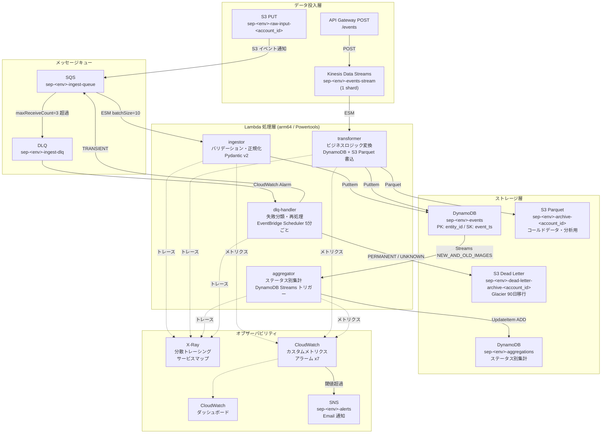
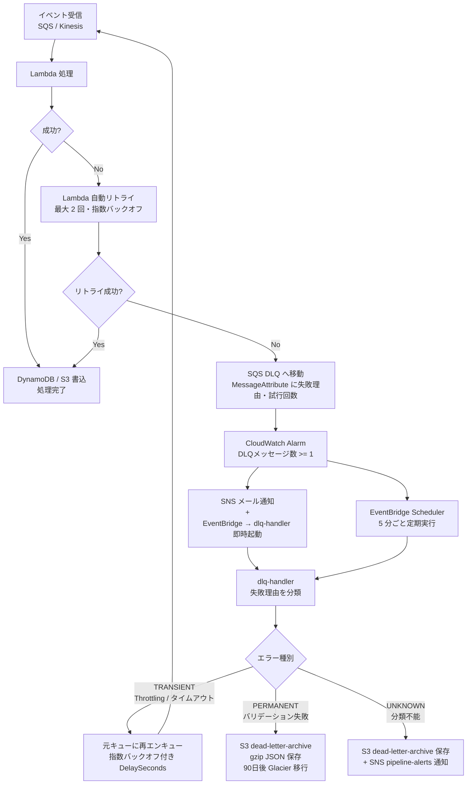

# Serverless Event Pipeline

> **「設計できる・コードに落とせる・運用まで考えられる」を証明するプロダクションレベルのポートフォリオ**
>
> S3 / Kinesis / SQS x Lambda x DynamoDB / S3 で構築するイベント駆動サーバーレスデータパイプライン

[](https://github.com/your-username/serverless-event-pipeline/actions/workflows/ci.yml)
[](https://github.com/your-username/serverless-event-pipeline/actions/workflows/cd.yml)
[](https://github.com/your-username/serverless-event-pipeline/actions)
[](https://www.terraform.io/)
[](https://www.python.org/)
[](LICENSE)

---

## アーキテクチャ図

### イベントフロー全体図



### エラーハンドリングフロー図



---

## 技術スタック

| カテゴリ | 技術 | 採用理由 |
|---|---|---|
| IaC | Terraform ~> 1.7 | 宣言的インフラ管理・モジュール再利用・State によるドリフト検知 |
| Runtime | Python 3.12 / arm64 (Graviton2) | コスト ~20% 削減・パフォーマンス向上・最新ランタイムサポート |
| Observability | AWS Lambda Powertools v3 | 構造化 JSON ログ・X-Ray トレース・カスタムメトリクスの統合実装 |
| データバリデーション | Pydantic v2 | 高速スキーマ検証（Rust コア）・型安全なモデル定義 |
| Streaming | Kinesis Data Streams | シャード内順序保証・最大 365 日保持・ESM による並列処理 |
| キュー | SQS + DLQ | 高スループット非同期処理・maxReceiveCount によるリトライ制御 |
| ストレージ (Hot) | DynamoDB PAY_PER_REQUEST | サーバーレス・自動スケール・GSI によるフレキシブルクエリ |
| ストレージ (Cold) | S3 + Parquet | 列指向圧縮・Athena/Glue 連携・コスト最適ライフサイクル |
| テスト | pytest + moto + Terratest | Unit / Integration / IaC の 3 層テスト・AWS モックで高速実行 |
| CI/CD | GitHub Actions + OIDC | アクセスキーレスの安全なデプロイ・PR へ terraform plan 自動コメント |
| デプロイ戦略 | Lambda Alias + Weighted Routing | カナリアデプロイ (10%) → 統合テスト合格 → 100% 昇格・自動ロールバック |
| セキュリティ | IAM 最小権限 + SSM Parameter Store | 実行ロールに `*` リソース指定禁止・秘匿情報のハードコード禁止 |

---

## ディレクトリ構成

```
serverless-event-pipeline/
├── CLAUDE.md                   # AI コーディング向け設計方針
├── README.md
├── Makefile
├── pytest.ini
├── requirements-dev.txt
├── scripts/
│   └── bootstrap.sh            # tfstate バックエンド初期化スクリプト
├── docs/
│   ├── architecture.md         # アーキテクチャ詳細・コンポーネント説明
│   ├── adr/                    # Architecture Decision Records
│   │   ├── 001-kinesis-vs-sqs.md
│   │   ├── 002-dynamodb-design.md
│   │   └── 003-error-handling-strategy.md
│   └── runbook.md              # 障害対応手順書
├── terraform/
│   ├── environments/
│   │   ├── dev/                # dev 環境ルートモジュール
│   │   │   ├── main.tf         # 全モジュールの組み合わせ・IAM ポリシー
│   │   │   ├── variables.tf
│   │   │   ├── outputs.tf
│   │   │   ├── providers.tf
│   │   │   ├── backend.tf
│   │   │   └── github-oidc.tf  # GitHub Actions OIDC ロール
│   │   └── prod/
│   └── modules/
│       ├── lambda-function/    # Lambda 共通設定（arm64 / Powertools / X-Ray / Alias）
│       ├── kinesis-pipeline/   # Kinesis Data Streams + Lambda ESM + アラーム
│       ├── sqs-pipeline/       # SQS + Lambda ESM + DLQ + アラーム
│       ├── dynamodb/           # テーブル / GSI / Streams / TTL / PITR
│       ├── observability/      # X-Ray / CloudWatch ダッシュボード / アラーム x7
│       └── iam/                # Lambda 実行ロール基盤
├── src/
│   ├── ingestor/               # バリデーション・正規化 Lambda
│   ├── transformer/            # ビジネスロジック変換 Lambda
│   ├── aggregator/             # DynamoDB Streams 集計 Lambda
│   ├── dlq_handler/            # DLQ 再処理 Lambda
│   └── shared/                 # 共通モデル (Pydantic) / ユーティリティ
├── tests/
│   ├── unit/                   # pytest + moto（AWS モック）
│   └── integration/            # E2E テスト（実 AWS リソース使用）
└── .github/
    └── workflows/
        ├── ci.yml              # PR: lint / test / terraform plan
        └── cd.yml              # main: apply / canary deploy / promote-or-rollback
```

---

## ハンズオン実行手順

このセクションは、**今のリポジトリ実装に沿って dev 環境を立ち上げ、S3 と Kinesis の両方からイベントを流し、DynamoDB / 集計 / ログ / 統合テストまで確認する**ための手順です。

> 注意 1: このリポジトリでは `terraform apply` / `terraform destroy` はユーザー自身が実行してください。  
> 注意 2: 現時点では `API Gateway` と `transformer` の `S3 Parquet 出力` は未実装です。ハンズオンは **S3 -> ingestor** と **Kinesis -> transformer** の 2 経路を対象にしています。

### ハンズオンで確認できること

1. ローカルの Python テストが通る
2. Terraform で dev 環境を作成できる
3. S3 に JSON / CSV を置くと `ingestor` が起動する
4. Kinesis にイベントを流すと `transformer` が起動する
5. `events` テーブルの更新で `aggregator` が集計を作る
6. 統合テストを実 AWS 上で流せる

---

### Step 0: 前提条件の確認

必要なツール:

```bash
terraform -version
aws --version
python3 --version
make --version
```

期待値:

- Terraform: `1.7.x`
- AWS CLI: `v2`
- Python: `3.12`

AWS 認証の確認:

```bash
aws sts get-caller-identity
```

出力に 12 桁の `Account` が出れば OK です。  
複数プロファイルを使い分ける場合は先に `export AWS_PROFILE=your-profile` を実行してください。

---

### Step 1: リポジトリを開く

```bash
git clone https://github.com/your-username/serverless-event-pipeline.git
cd serverless-event-pipeline
```

構成確認:

```bash
ls
# CLAUDE.md  Makefile  README.md  src/  terraform/  tests/  scripts/  docs/
```

---

### Step 2: Python 仮想環境を作る

このプロジェクトでは `.venv` の利用が前提です。

```bash
python3 -m venv .venv
source .venv/bin/activate
python -m pip install --upgrade pip
python -m pip install -r requirements-dev.txt
```

確認:

```bash
which python
# .../serverless-event-pipeline/.venv/bin/python
```

---

### Step 3: Terraform 変数ファイルを用意する

`terraform/environments/dev` では少なくとも以下の 3 つが必要です。

- `account_id`
- `github_repository`
- `alert_email`

`.gitignore` により `terraform.tfvars` はコミットされません。ローカルだけに置いて大丈夫です。

```bash
cat > terraform/environments/dev/terraform.tfvars <<'EOF'
account_id        = "123456789012"
github_repository = "your-username/serverless-event-pipeline"
alert_email       = "you@example.com"
EOF
```

`account_id` には `aws sts get-caller-identity` で確認した値を入れてください。

---

### Step 4: Terraform バックエンドを bootstrap する

初回のみ、tfstate 保存先の S3 バケットとロック用 DynamoDB を作成します。

```bash
chmod +x scripts/bootstrap.sh
./scripts/bootstrap.sh
```

このスクリプトが行うこと:

- `sep-tfstate-<account_id>` バケットの作成
- `sep-tfstate-lock` テーブルの作成
- `alias/sep-tfstate-key` KMS キーの作成
- `terraform/environments/dev/backend.tf` の bucket 名差し替え

確認:

```bash
aws s3 ls | grep sep-tfstate
aws dynamodb describe-table --table-name sep-tfstate-lock --query "Table.TableStatus" --output text
```

---

### Step 5: Terraform 初期化・静的チェック・ユニットテスト

まず Terraform を初期化します。

```bash
make init ENV=dev
```

次に、任意ですが実行前にフォーマットとユニットテストを通すのがおすすめです。

```bash
make fmt
make test
```

補足:

- `make test` は `tests/unit/` を実行します
- AWS 実リソースにはアクセスしません
- `moto` を使うため、ローカルで高速に回せます

---

### Step 6: Terraform plan を確認する

ここから先の Terraform 実行はユーザー自身が行ってください。

```bash
make plan ENV=dev
```

確認ポイント:

- `sep-dev-ingestor`
- `sep-dev-transformer`
- `sep-dev-aggregator`
- `sep-dev-dlq-handler`
- `sep-dev-events-stream`
- `sep-dev-events`
- `sep-dev-aggregations`
- `sep-dev-ingest-queue`
- `sep-dev-ingest-dlq`

が作成対象に含まれていることを確認します。

---

### Step 7: Terraform apply を実行する

以下はユーザー自身で実行してください。

```bash
make apply ENV=dev
```

apply 完了後、output を確認します。

```bash
terraform -chdir=terraform/environments/dev output
```

特に後続で使うもの:

- `ingestor_function_name`
- `raw_input_bucket_name`
- `ingest_queue_url`
- `ingest_dlq_url`
- `events_table_name`
- `aggregations_table_name`

---

### Step 8: ハンズオン用の環境変数を export する

以降の確認コマンドと統合テストで使うため、Terraform output から値を流し込みます。

```bash
export AWS_DEFAULT_REGION=ap-northeast-1
export EVENTS_TABLE_NAME=$(terraform -chdir=terraform/environments/dev output -raw events_table_name)
export AGGREGATIONS_TABLE_NAME=$(terraform -chdir=terraform/environments/dev output -raw aggregations_table_name)
export RAW_INPUT_BUCKET=$(terraform -chdir=terraform/environments/dev output -raw raw_input_bucket_name)
export INGEST_QUEUE_URL=$(terraform -chdir=terraform/environments/dev output -raw ingest_queue_url)
export INGEST_DLQ_URL=$(terraform -chdir=terraform/environments/dev output -raw ingest_dlq_url)
export INGESTOR_FUNCTION_NAME=$(terraform -chdir=terraform/environments/dev output -raw ingestor_function_name)
export ACCOUNT_ID=$(aws sts get-caller-identity --query Account --output text)
```

確認:

```bash
echo "$EVENTS_TABLE_NAME"
echo "$RAW_INPUT_BUCKET"
echo "$INGEST_QUEUE_URL"
```

---

### Step 9: S3 -> ingestor -> DynamoDB を確認する

まず、`ingestor` が期待する形式の JSON を作ります。  
ここで重要なのは、**`payload` ではなく `event_time` / `value` / `metadata` をトップレベルに置くこと**です。

```bash
cat > /tmp/ingestor-event.json <<'EOF'
[
  {
    "entity_id": "USER#u1001",
    "event_type": "purchase",
    "event_time": "2026-05-06T12:00:00Z",
    "value": 1500,
    "metadata": {
      "product_id": "P001",
      "category": "book"
    }
  }
]
EOF
```

S3 にアップロード:

```bash
aws s3 cp /tmp/ingestor-event.json "s3://${RAW_INPUT_BUCKET}/hands-on/ingestor-event.json"
```

数秒待ってから、DynamoDB を確認します。

```bash
aws dynamodb query \
  --table-name "$EVENTS_TABLE_NAME" \
  --key-condition-expression "entity_id = :eid" \
  --expression-attribute-values '{":eid":{"S":"USER#u1001"}}'
```

期待する見え方:

- `entity_id = USER#u1001`
- `event_ts = EVENT#2026-05-06T12:00:00Z`
- `status = PENDING`
- `source_bucket`
- `source_key`

---

### Step 10: 集計テーブルを確認する

`purchase` イベントが `events` に書き込まれると、DynamoDB Streams 経由で `aggregator` が集計を更新します。

```bash
aws dynamodb get-item \
  --table-name "$AGGREGATIONS_TABLE_NAME" \
  --key '{"aggregate_key":{"S":"USER#u1001#2026-05-06"},"metric_type":{"S":"TOTAL_AMOUNT"}}'
```

期待する見え方:

- `value = 1500`
- `count = 1`
- `updated_at` が入っている

もしすぐ見えない場合は 10〜20 秒ほど待って再実行してください。

---

### Step 11: Kinesis -> transformer -> DynamoDB を確認する

次は `transformer` 側の実行確認です。  
こちらも `payload` ではなくトップレベル JSON を使います。

```bash
aws kinesis put-record \
  --stream-name sep-dev-events-stream \
  --partition-key "USER#u2001" \
  --data "$(printf '%s' '{"entity_id":"USER#u2001","event_type":"click","event_time":"2026-05-06T12:10:00Z","metadata":{"element_id":"hero-button","page_path":"/top","click_x":120,"click_y":240}}' | base64 -w 0)"
```

書き込み後、`events` テーブルを確認します。

```bash
aws dynamodb query \
  --table-name "$EVENTS_TABLE_NAME" \
  --key-condition-expression "entity_id = :eid" \
  --expression-attribute-values '{":eid":{"S":"USER#u2001"}}'
```

期待する見え方:

- `entity_id = USER#u2001`
- `event_type = CLICK`
- `payload.element_id = hero-button`
- `payload.page_path = /top`

補足:

- `transformer` は `event_type` を大文字に正規化します
- `CLICK` / `VIEW` / `PURCHASE` のみ対応です

---

### Step 12: CloudWatch Logs で Lambda の動作を見る

`ingestor` と `transformer` のログを直接見ると、どこまで処理が進んだかが把握しやすいです。

```bash
aws logs tail /aws/lambda/sep-dev-ingestor --since 10m
aws logs tail /aws/lambda/sep-dev-transformer --since 10m
aws logs tail /aws/lambda/sep-dev-aggregator --since 10m
```

継続監視したい場合:

```bash
aws logs tail /aws/lambda/sep-dev-ingestor --follow
```

見るポイント:

- `ProcessedRecords`
- `ValidationErrors`
- `TransformedRecords`
- `AggregatedEvents`

---

### Step 13: 統合テストを流す

環境変数を export 済みなら、そのまま統合テストを実行できます。

```bash
make test-integration
```

このテストが確認すること:

- S3 -> SQS -> ingestor -> events
- events -> DynamoDB Streams -> aggregator -> aggregations
- CloudWatch カスタムメトリクスの記録

注意:

- 実 AWS リソースを使います
- 数十秒かかることがあります
- `DLQ` の E2E テストは skip されます

---

### Step 14: 監視リソースを確認する

ダッシュボード名は固定ルールで作られます。コンソールでも確認できますが、CLI なら次のように存在確認できます。

```bash
aws cloudwatch list-dashboards --query "DashboardEntries[?contains(DashboardName, 'sep-dev-pipeline-dashboard')].DashboardName"
```

アラーム確認:

```bash
aws cloudwatch describe-alarms --alarm-name-prefix sep-dev
```

X-Ray はコンソールのほうが見やすいです。

- AWS Console
- CloudWatch / X-Ray
- グループ `sep-dev-pipeline`

---

### Step 15: 後片付け

検証が終わったら、コストを止めるためにユーザー自身で破棄してください。

```bash
make destroy ENV=dev
```

destroy 後の確認:

```bash
aws lambda list-functions \
  --query "Functions[?starts_with(FunctionName, 'sep-dev')].[FunctionName]" \
  --output table
```

補足:

- `bootstrap.sh` で作成した tfstate 用 S3 / DynamoDB / KMS は destroy では消えません
- 不要なら手動削除してください

---

### つまずきやすいポイント

| 症状 | 原因 | 対処 |
|---|---|---|
| `make plan` で変数エラー | `terraform.tfvars` 未作成 | Step 3 を実施する |
| `terraform init` が失敗 | backend 用バケット未作成 | Step 4 を実施する |
| `make test` で import error | `.venv` 未有効化 | `source .venv/bin/activate` |
| S3 アップロードしても反応しない | JSON 形式が `payload` ベースになっている | Step 9 の形式に合わせる |
| `transformer` が失敗 | `event_time` や `event_type` が不足 | Step 11 の JSON をそのまま使う |
| 集計が見えない | Streams 反映待ち | 10〜20 秒待って再確認する |

---

### CI/CD を使いたい場合の追加セットアップ

ハンズオン自体には不要ですが、GitHub Actions の OIDC を有効にする場合は別途 `github-oidc.tf` の適用と GitHub Secrets 設定が必要です。  
この部分はローカル検証とは独立しているため、まずは上の dev ハンズオンを完走してから着手するのがおすすめです。

---

## 主要 Make コマンド

```bash
make init              # terraform init（dev 環境）
make plan              # terraform plan
make apply             # terraform apply
make destroy           # terraform destroy
make fmt               # terraform fmt -recursive + black フォーマット
make lint              # ruff + mypy + tflint
make setup-python      # .venv 作成・依存インストール
make test              # pytest 単体テスト（moto モック）
make test-integration  # pytest 統合テスト（実 AWS リソース）
make bootstrap         # scripts/bootstrap.sh 実行
make help              # コマンド一覧表示

# 環境切り替え
make plan ENV=prod
make apply ENV=prod
```

---

## 各 STEP の解説と学習ポイント

### STEP 1: Kinesis Data Streams × Lambda ESM

**実装内容**: API Gateway POST → Kinesis → transformer Lambda

**学習ポイント**:
- シャード内順序保証の仕組み（PartitionKey によるルーティング）
- `maximum_batching_window_in_seconds` でバッチをまとめてコストを削減
- `bisect_on_function_error` で毒矢レコード（Poison Pill）対策
- `maximum_retry_attempts` で無限リトライを防ぎ DLQ へフォールバック

```hcl
# kinesis-pipeline/main.tf の ESM 設定
resource "aws_lambda_event_source_mapping" "kinesis" {
  bisect_on_function_error           = true   # 毒矢対策
  maximum_batching_window_in_seconds = 5      # コスト最適化
  maximum_retry_attempts             = 3      # 無限リトライ防止
}
```

### STEP 2: SQS + DLQ × Lambda ESM

**実装内容**: S3 PUT → SQS → ingestor Lambda → DLQ

**学習ポイント**:
- `visibility_timeout_seconds = lambda_timeout * 6` の理由（Lambda タイムアウト時の再処理猶予）
- `batchItemFailures` による部分バッチ失敗（成功済みメッセージの再処理防止）
- DLQ の `maxReceiveCount` によるリトライ上限管理
- `redrive_policy` と CloudWatch Alarm の組み合わせ

### STEP 3: DynamoDB 設計（Single Table Design）

**実装内容**: PK/SK 設計 + GSI + Streams + TTL + PITR

**学習ポイント**:
- `entity_id` を `USER#u123` 形式にする理由（型の衝突防止・前方一致クエリ）
- GSI で status による横断クエリを実現する設計
- DynamoDB Streams の `NEW_AND_OLD_IMAGES` と aggregator 連携
- PITR の本番のみ有効化によるコスト管理

### STEP 4: Lambda Powertools によるオブザーバビリティ

**実装内容**: 構造化ログ・X-Ray トレース・カスタムメトリクス

**学習ポイント**:
- `@logger.inject_lambda_context` で correlation_id を自動付与
- `@tracer.capture_lambda_handler` で X-Ray セグメントを自動生成
- `@metrics.log_metrics(capture_cold_start_metric=True)` でコールドスタート計測
- CloudWatch EMF（Embedded Metric Format）による高効率メトリクス送信

```python
# 全 Lambda 共通の Powertools デコレータパターン
@logger.inject_lambda_context(correlation_id_path="headers.x-correlation-id")
@tracer.capture_lambda_handler
@metrics.log_metrics(capture_cold_start_metric=True)
def handler(event: dict, context: LambdaContext) -> dict:
    ...
```

### STEP 5: カナリアデプロイ

**実装内容**: Lambda Alias Weighted Routing → 統合テスト → promote-or-rollback

**学習ポイント**:
- `live` エイリアスに 10% カナリアウェイトを設定する方法
- GitHub Actions の `needs` とジョブ依存関係の設計
- `if: always()` でロールバックジョブを必ず実行する理由
- SNS アラートと GitHub Step Summary による可視化

### STEP 6: IAM 最小権限設計

**実装内容**: Lambda ごとに必要な権限のみを付与

**学習ポイント**:
- `Resource: "*"` を避けた具体的 ARN 指定（CLAUDE.md 禁止事項）
- CloudWatch GetMetricStatistics のみ `*` が必要な理由（AWS の制約）
- `aws:SourceAccount` 条件による混乱した代理攻撃（Confused Deputy）対策
- Terraform での IAM ポリシーの `jsonencode()` 記述パターン

---

## コスト見積もり（月額・dev 環境）

| リソース | 仕様 | 概算コスト |
|---|---|---|
| Kinesis Data Streams | 1 shard x 24h 保持 | ~$15 |
| Lambda 実行 | arm64 / 256 MB / 低トラフィック | ~$0（無料枠内） |
| DynamoDB | PAY_PER_REQUEST / 低トラフィック | ~$0（無料枠内） |
| S3 ストレージ | archive + dead-letter + tfstate | ~$0.1 |
| CloudWatch | カスタムメトリクス / ダッシュボード / アラーム | ~$1 |
| X-Ray | 100% サンプリング / dev 環境 | ~$0.5 |
| SQS | 標準キュー / 低トラフィック | ~$0（無料枠内） |
| **合計** | | **~$17 / 月** |

> **コスト最適化 TIP**: 検証後は以下の変更で月額を削減できます。
> - Kinesis を使わない場合は `shard_count = 0` → Kinesis コストを削除
> - X-Ray サンプリングを `x_ray_sampling_rate = 10` に変更 → トレースコストを 90% 削減
> - dev 環境の検証後は `make destroy` でリソースを削除

---

## 今後の拡張案

### Amazon Bedrock 連携

dlq-handler に Bedrock を統合し、エラーメッセージを AI が分析・分類する機能を追加できます。

```
DLQ メッセージ
  → dlq-handler
  → Bedrock Claude (エラー分類・根本原因推定)
  → 分類結果を DynamoDB に保存
  → 詳細レポートを SNS で通知
```

### EventBridge Pipes

現在 Lambda を介して行っている SQS → DynamoDB 変換を、EventBridge Pipes でコード不要の直接統合に置き換えられます。

```
SQS → EventBridge Pipes (フィルタリング・変換) → DynamoDB
                                                → Kinesis
```

### Step Functions による複雑なワークフロー

複数ステップの順序制御が必要な処理を、Lambda チェーンから Step Functions に移行できます。

```
Step Functions Standard Workflow:
  ValidateEvent → EnrichData → StoreHot → StoreParquet → NotifyComplete
  (エラー時: → StoreDead → SendAlert)
```

### Athena + Glue によるデータ分析基盤

S3 の Parquet データを Glue Crawler でカタログ化し、Athena でアドホック分析できます。

```
S3 Parquet → Glue Crawler (スキーマ自動検出) → Glue Catalog → Athena クエリ
```

---

## CI/CD フロー

| イベント | ワークフロー | ジョブ |
|---|---|---|
| PR 作成・更新 | `ci.yml` | lint-python / test-unit / lint-terraform (並列) → terraform-plan → PR コメント |
| main マージ | `cd.yml` | terraform-apply → deploy-lambda (canary 10%) → integration-test → promote-or-rollback |

**OIDC 認証フロー**:
```
GitHub Actions
  → OIDC トークン取得（id-token: write）
  → AWS AssumeRoleWithWebIdentity
  → sep-dev-github-actions-role
  → AWS リソース操作（アクセスキー不要）
```

GitHub Secrets に以下を設定してください:
- `AWS_ACCOUNT_ID`: AWS アカウント ID
- `ALERT_EMAIL`（Variables）: アラート通知先メールアドレス

---

## Architecture Decision Records

| ADR | タイトル | ステータス |
|---|---|---|
| [ADR-001](docs/adr/001-kinesis-vs-sqs.md) | Kinesis vs SQS の選択基準 | Accepted |
| [ADR-002](docs/adr/002-dynamodb-design.md) | DynamoDB テーブル設計 | Accepted |
| [ADR-003](docs/adr/003-error-handling-strategy.md) | エラーハンドリング戦略 | Accepted |

---

## 障害対応

[docs/runbook.md](docs/runbook.md) を参照してください。

---

## 最終チェックリスト（PR マージ前）

- [ ] `terraform fmt -recursive` 完了・差分なし
- [ ] `tflint --recursive terraform/` エラーなし
- [ ] `checkov` 警告対応済み（許容除外は `.checkov.yml` に明記）
- [ ] `pytest --cov-fail-under=80` でカバレッジ 80% 以上
- [ ] README の手順を最初から辿れることを確認
- [ ] 実アカウント ID・ARN がコードに含まれていないことを確認（`<ACCOUNT_ID>` 表記）
- [ ] GitHub Actions CI が全ジョブ GREEN であることを確認
- [ ] `terraform destroy` で全リソースが削除できることを確認
