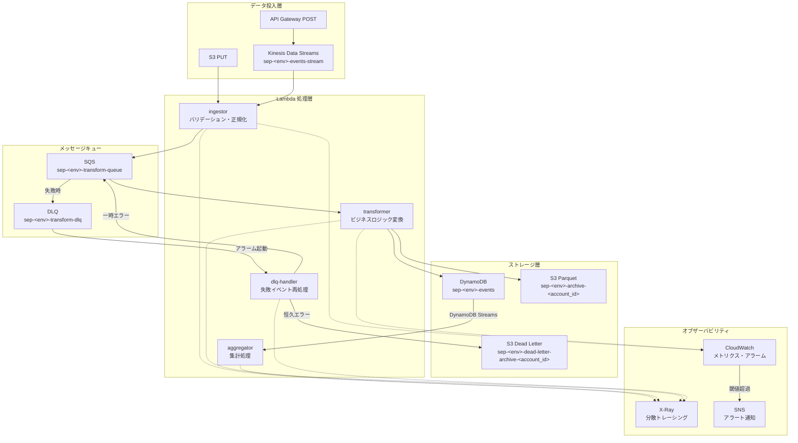

# アーキテクチャ概要

## システム全体図



## コンポーネント詳細

### Lambda 関数

| 関数名 | トリガー | 主な処理 | 出力先 |
|---|---|---|---|
| `sep-<env>-ingestor` | Kinesis / S3 / API GW | JSON バリデーション・正規化 | SQS transform-queue |
| `sep-<env>-transformer` | SQS transform-queue | ビジネスロジック変換 | DynamoDB / S3 Parquet |
| `sep-<env>-aggregator` | DynamoDB Streams | ステータス別集計 | DynamoDB（集計テーブル更新） |
| `sep-<env>-dlq-handler` | CloudWatch Alarm / スケジュール | 失敗分類・再エンキュー | SQS / S3 dead-letter-archive |

### データフロー

```
1. クライアントがイベントを投入（API GW POST / S3 PUT / Kinesis PUT）
2. ingestor が Pydantic v2 でバリデーション・正規化
3. 正規化済みイベントを SQS transform-queue に送信
4. transformer がビジネスロジック変換を適用
5. 変換済みデータを DynamoDB（ホット）と S3 Parquet（コールド）に書き込み
6. DynamoDB Streams が aggregator をトリガー
7. aggregator がステータス別集計メトリクスを更新
```

### エラーハンドリング

```
transformer 処理失敗
  → Lambda 自動リトライ（最大 2 回、指数バックオフ）
  → 全リトライ失敗 → SQS DLQ に移動
  → CloudWatch Alarm (DLQメッセージ数 >= 1)
  → SNS 通知 → dlq-handler 起動
  → 一時エラー: 元キューに再エンキュー（指数バックオフ付き）
  → 恒久エラー: S3 dead-letter-archive に保存
```

## インフラ構成

### Terraform モジュール構成

```
terraform/modules/
├── lambda-function/   # Lambda 関数共通設定（arm64, Powertools, X-Ray）
├── kinesis-pipeline/  # Kinesis Data Streams + Lambda ESM
├── sqs-pipeline/      # SQS + Lambda ESM（DLQ 必須）
├── dynamodb/          # テーブル・GSI・Streams・TTL・PITR
├── observability/     # X-Ray グループ・CloudWatch ダッシュボード・アラーム
└── iam/               # Lambda 実行ロール（最小権限）
```

### セキュリティ設計

- Lambda 実行ロール: 最小権限（`*` リソース指定禁止）
- 秘匿情報: SSM Parameter Store 経由（環境変数ハードコード禁止）
- S3 バケット: パブリックアクセスブロック有効・KMS 暗号化
- DynamoDB: 保管時暗号化（AWS マネージドキー）
- Kinesis: KMS サーバーサイド暗号化

### コスト見積もり（月額）

| リソース | 概算コスト |
|---|---|
| Kinesis Data Streams (1 shard) | ~$15 |
| Lambda 実行 | ~$0（無料枠内） |
| DynamoDB PAY_PER_REQUEST | ~$0（低トラフィック時） |
| S3 ストレージ | ~$0.1 |
| CloudWatch | ~$1 |
| **合計** | **~$16/月** |

> 検証後は Kinesis を 1 shard に削減して目標 $5 以下を目指す。
