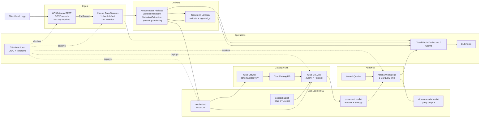
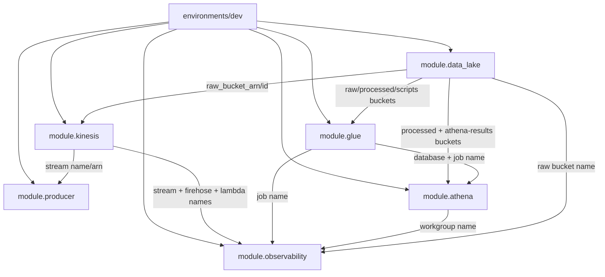
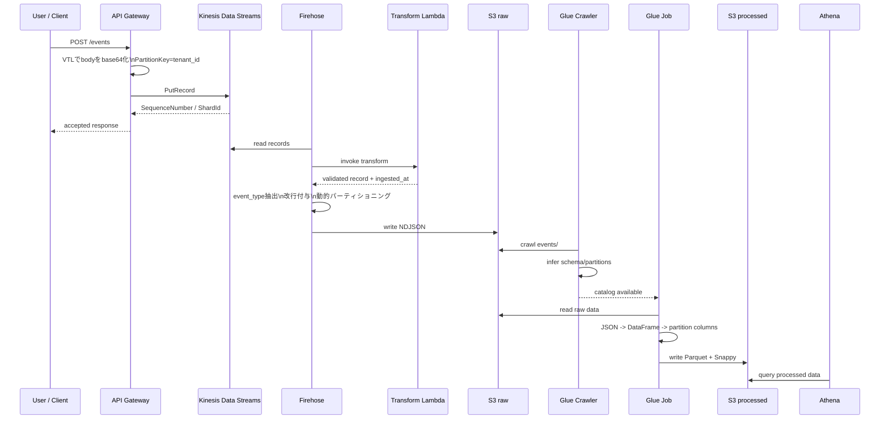
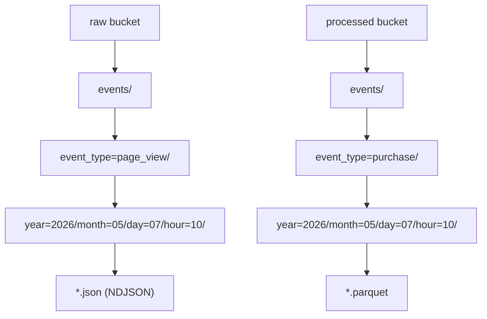
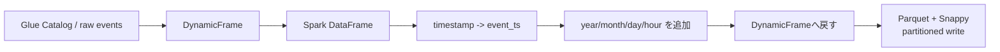

# Architecture

## 1. このプロジェクトは何を作るのか

`streaming-analytics-sandbox` は、イベントの受信から分析までを AWS のマネージドサービスで一貫して構築する Terraform プロジェクトです。

やっていることを一言で表すと、次のパイプラインです。

`Client -> API Gateway -> Kinesis Data Streams -> Firehose -> S3 raw -> Glue -> S3 processed -> Athena`

この構成により、以下を同時に学べます。

- API Gateway から Kinesis への直接統合
- Kinesis Data Streams と Firehose の役割分担
- S3 データレイクの raw / processed 分離
- Glue Crawler と Glue ETL Job によるスキーマ化と Parquet 変換
- Athena によるサーバレス分析
- CloudWatch による監視とアラート
- Terraform モジュール分割と環境構成

## 2. 全体像



## 3. 設計思想

### Lambda を増やさない

このプロジェクトでは、Lambda は Firehose の変換専用に 1 つだけ使われます。インジェストは `API Gateway -> Kinesis PutRecord` の直接統合です。これにより、学習対象が「イベント受信の本質」に寄り、余分な実装を増やしません。

### raw と processed を明確に分ける

- raw: 受信直後の NDJSON を保持する層
- processed: Athena 向けに最適化した Parquet 層

この分離によって、受信系と分析系の責務が混ざりません。

### マネージドサービス中心で組む

VPC や EC2 を使わず、Kinesis / Firehose / Glue / Athena / S3 / CloudWatch を中心に構成しています。学習コストをネットワーク設計ではなくデータパイプライン設計へ寄せています。

### コストを明示的に制御する

- Kinesis は `PROVISIONED` で 1 shard デフォルト
- Firehose はバッファリングあり
- Glue Job は `G.1X x 2`
- Athena は `bytes_scanned_cutoff_per_query` で 1 GB 上限
- S3 はライフサイクルで IA / expiration を設定

## 4. Terraform 構造



### 入口

環境の入口は [environments/dev/main.tf](/home/takuya/terraform-lab/streaming-analytics-sandbox/environments/dev/main.tf) です。ここで全モジュールを束ねています。

### 各モジュールの責務

| モジュール | 責務 |
|---|---|
| `data-lake` | S3 バケット群の作成とライフサイクル設定 |
| `kinesis` | Kinesis Data Streams、Firehose、変換 Lambda |
| `producer` | API Gateway REST API と Kinesis 直接統合 |
| `glue` | Glue Catalog DB、Crawler、ETL Job、ETL スクリプト配置 |
| `athena` | Athena Workgroup と Named Queries |
| `observability` | CloudWatch Dashboard、Alarms、SNS Topic |

## 5. リクエストから分析までの実行フロー



## 6. Ingest レイヤ

### API Gateway

`producer` モジュールは REST API に `POST /events` を定義しています。

特徴は次のとおりです。

- `api_key_required = true`
- 認可は `NONE`
- バックエンドは Lambda ではなく AWS 統合
- Kinesis `PutRecord` を直接呼び出す
- Access Log と X-Ray を有効化
- Usage Plan で `rate_limit=100`, `burst_limit=200`

実装の中心は [modules/producer/main.tf](/home/takuya/terraform-lab/streaming-analytics-sandbox/modules/producer/main.tf) の `aws_api_gateway_integration` です。

### VTL テンプレートで何をしているか

API Gateway は受信した JSON をそのまま Kinesis に送っているわけではありません。VTL によって Kinesis `PutRecord` 用の形式に変換しています。

- `Data`: リクエストボディ全体を base64 エンコード
- `PartitionKey`: `tenant_id`
- `StreamName`: Terraform で作成したストリーム名

この設計により、アプリケーションコードを挟まずに Kinesis へ投入できます。

### API のレスポンス

Kinesis のレスポンスを再び VTL で変換し、クライアントには次のような簡潔な形で返します。

```json
{
  "event_id": "SequenceNumber",
  "shard_id": "ShardId",
  "status": "accepted"
}
```

## 7. Stream レイヤ

### Kinesis Data Streams

`kinesis` モジュールで作成される Kinesis ストリームの特徴です。

- 名前: `${project}-${environment}-events`
- `PROVISIONED`
- デフォルト 1 shard
- 保持期間 24 時間
- SSE 有効
- AWS 管理 KMS キー `alias/aws/kinesis` を使用

PartitionKey に `tenant_id` を使うので、テナント単位での順序性や分散を考える学習題材になっています。

### Firehose

Firehose はこのプロジェクトの「配達と整形」の中心です。

役割は 3 つあります。

1. Kinesis からレコードを読む
2. Lambda とプロセッサでレコードを整える
3. S3 raw に動的パーティション付きで保存する

#### Firehose の処理パイプライン

```text
KDS
 -> Lambda processor
 -> MetadataExtraction (JQ)
 -> AppendDelimiterToRecord
 -> S3 raw
```

#### 動的パーティショニング

S3 prefix は固定ではなく、`event_type` と時刻から動的に作られます。

```text
events/event_type=!{partitionKeyFromQuery:event_type}/year=!{timestamp:yyyy}/month=!{timestamp:MM}/day=!{timestamp:dd}/hour=!{timestamp:HH}/
```

これにより `page_view` と `purchase` のデータは別パーティションに整理されます。

#### 変換 Lambda

[modules/kinesis/src/transform.py](/home/takuya/terraform-lab/streaming-analytics-sandbox/modules/kinesis/src/transform.py) が Firehose 変換関数です。

この関数は各レコードに対して以下を実行します。

1. base64 デコード
2. JSON パース
3. 必須フィールド検証
4. `ingested_at` 追加
5. 再度 base64 エンコードして返却

必須フィールドは次です。

- `event_id`
- `event_type`
- `user_id`
- `tenant_id`
- `timestamp`

失敗したレコードは `ProcessingFailed` になり、Firehose の `errors/` プレフィックスへ隔離されます。

## 8. Data Lake レイヤ

`data-lake` モジュールは 4 つの S3 バケットを作成します。

| バケット | 用途 |
|---|---|
| `raw` | Firehose の NDJSON 保存先 |
| `processed` | Glue Job が出力する Parquet 保存先 |
| `scripts` | Glue ETL スクリプトと一時領域 |
| `athena-results` | Athena クエリ結果 |

### S3 バケット設計

全バケットで次を共通採用しています。

- SSE-S3 (`AES256`)
- Public Access Block
- `force_destroy = true` の dev 前提設定

### ライフサイクル

| バケット | ライフサイクル |
|---|---|
| `raw` | `raw_retention_days` 後に `STANDARD_IA`、その 3 倍日数で削除 |
| `processed` | 60 日後に `STANDARD_IA`、180 日で削除 |
| `athena-results` | 7 日で削除 |

### パス構造



Hive スタイルのパーティションになっているため、Glue Crawler と Athena が扱いやすい形です。

## 9. Catalog / ETL レイヤ

### Glue Catalog Database

`glue` モジュールは `${project}-${environment}-db` をベースに、ハイフンをアンダースコアへ置き換えた Glue Catalog Database を作成します。

### Glue Crawler

Crawler は `s3://<raw_bucket>/events/` を走査し、以下を自動検出します。

- JSON スキーマ
- テーブル名 `events`
- パーティション列

スキーマ変更ポリシーは次です。

- `update_behavior = UPDATE_IN_DATABASE`
- `delete_behavior = LOG`

つまり新しい列は反映しつつ、消えた列は即削除せずログ扱いにします。

### ETL スクリプト配置

[modules/glue/scripts/etl_raw_to_processed.py](/home/takuya/terraform-lab/streaming-analytics-sandbox/modules/glue/scripts/etl_raw_to_processed.py) は Terraform の `aws_s3_object` で scripts バケットへアップロードされます。

### Glue Job

Glue Job の特徴です。

- Glue 4.0
- `glueetl`
- `G.1X x 2`
- timeout 60 分
- 同時実行 1
- ログを CloudWatch へ送信

### ETL でやっている変換



変換のポイントです。

- 入力は raw S3 ではなく Glue Catalog 経由
- `timestamp` から `year/month/day/hour` を導出
- `event_type/year/month/day/hour` でパーティション出力
- 出力は Parquet + Snappy

これによって Athena のスキャンコストを大きく下げられます。

## 10. Analytics レイヤ

### Athena Workgroup

`athena` モジュールは専用 Workgroup を作ります。

特徴は次です。

- Workgroup 設定を強制
- CloudWatch メトリクス公開
- 結果出力先は `athena-results` バケット
- SSE-S3 で暗号化
- `bytes_scanned_cutoff_per_query` によるスキャン制限

デフォルトの上限は `1 GB` です。これは誤って raw JSON を大きくスキャンしたときの安全装置です。

### Named Queries

登録されるクエリは次の 5 種類です。

| Query | 用途 |
|---|---|
| `count_by_event_type` | イベント種別ごとの件数 |
| `count_by_tenant` | テナント別件数 |
| `hourly_volume` | 直近 24 時間の時間別件数 |
| `purchase_funnel` | 購買ファネル集計 |
| `create_processed_table` | processed Parquet 用 DDL |

注意点として、Crawler が直接管理するのは raw 側の `events` テーブルです。processed 側は Named Query の DDL を実行してテーブル化する前提です。

## 11. 監視と運用

### CloudWatch Alarms

`observability` モジュールは 3 つの主要アラームを持ちます。

| アラーム | 意味 |
|---|---|
| `GetRecords.IteratorAgeMilliseconds` | Firehose が Kinesis を読み切れていない遅延 |
| `DeliveryToS3.DataFreshness` | Firehose から S3 への到達遅延 |
| `Lambda Errors` | 変換 Lambda の異常 |

### Dashboard

Dashboard は次の観測対象をまとめています。

- Kinesis IncomingRecords / PutRecord.Success / IteratorAge
- Firehose IncomingRecords / DeliveryToS3.Success / DataFreshness
- Lambda Invocations / Errors / Duration
- Athena ProcessedBytes / EngineExecutionTime

### SNS

`alert_email` が空でなければ SNS Topic にメール購読をつけます。空なら Topic のみ作成し、購読は作りません。

## 12. セキュリティ設計

### 認証

CI/CD では GitHub Actions OIDC を前提としています。アクセスキーをコードや Secrets に置かない設計です。

### IAM 最小権限

主な IAM 境界は次のとおりです。

- API Gateway ロール: `kinesis:PutRecord` のみ
- Firehose ロール: Kinesis 読み取り、S3 raw 書き込み、Lambda 呼び出し、ログ出力
- Glue ロール: raw 読み取り、processed 書き込み、scripts 読み取り、Glue サービスロール
- Lambda ロール: CloudWatch Logs 出力

### データ保護

- Kinesis SSE 有効
- S3 はすべて Public Access Block
- S3 は SSE-S3
- Athena 結果も暗号化

## 13. CI/CD

GitHub Actions ワークフローは [`.github/workflows/terraform.yml`](/home/takuya/terraform-lab/streaming-analytics-sandbox/.github/workflows/terraform.yml) にあります。

### 実行条件

- `pull_request` to `main`
- `push` to `main`
- 対象パスは `environments/**`, `modules/**`, workflow 自身

### 実行内容

1. Checkout
2. OIDC で AWS 認証
3. Terraform セットアップ
4. `terraform init`
5. `terraform fmt -check -recursive`
6. `terraform validate`
7. `terraform plan`
8. PR なら Plan をコメント
9. `push to main` なら `terraform apply`

### 補足

このリポジトリの運用ポリシー文書では「`terraform apply` はユーザー自身が実行する」とされていますが、実装上の GitHub Actions は `main` への push 時に自動 `apply` します。完全理解ドキュメントとしては、ポリシーと実装に差分がある点を認識しておくのが重要です。

## 14. 変数と環境設定

主要な環境変数相当の Terraform 変数は [environments/dev/variables.tf](/home/takuya/terraform-lab/streaming-analytics-sandbox/environments/dev/variables.tf) にあります。

| 変数 | 役割 | デフォルト |
|---|---|---|
| `aws_region` | 配置リージョン | `ap-northeast-1` |
| `project` | 命名とタグ | `streaming-analytics-sandbox` |
| `environment` | 環境名 | `dev` |
| `owner` | タグ用所有者 | 必須 |
| `alert_email` | 通知メール | 空 |
| `kinesis_shard_count` | KDS シャード数 | `1` |
| `firehose_buffer_size_mb` | Firehose バッファサイズ | `64` |
| `firehose_buffer_interval_seconds` | Firehose バッファ時間 | `60` |
| `raw_retention_days` | raw の IA 以降日数 | `30` |
| `athena_bytes_scanned_cutoff` | Athena スキャン上限 | `1073741824` |

## 15. 出力値で何が分かるか

[environments/dev/outputs.tf](/home/takuya/terraform-lab/streaming-analytics-sandbox/environments/dev/outputs.tf) では、運用や動作確認に必要な値が外へ出されます。

- API endpoint
- API key ID
- Kinesis / Firehose 名
- raw / processed バケット名
- Glue DB / Crawler / Job 名
- Athena Workgroup 名
- CloudWatch Dashboard 名

この出力設計のおかげで、構築後の手動検証フローを組みやすくなっています。

## 16. 命名規則

多くのモジュールで次のローカル変数が使われています。

```text
name_prefix = "${project}-${environment}"
```

このため主要リソースは概ね以下の形になります。

```text
streaming-analytics-sandbox-dev-<resource-role>
```

S3 だけはグローバル一意制約があるため、AWS アカウント ID を後ろにつけています。

## 17. データモデル

想定イベントは次のような形です。

```json
{
  "event_id": "uuid",
  "event_type": "page_view | add_to_cart | purchase | search",
  "user_id": "usr_001",
  "tenant_id": "tenant-a",
  "timestamp": "2026-05-07T10:30:00Z",
  "payload": {
    "product_id": "prod_001",
    "amount": 5800,
    "query": "terraform tutorial"
  }
}
```

Firehose 変換後は `ingested_at` が追加されます。

## 18. 依存関係をコードから読む順番

このプロジェクトを初見で読むなら、次の順番が分かりやすいです。

1. [README.md](/home/takuya/terraform-lab/streaming-analytics-sandbox/README.md)
2. [environments/dev/main.tf](/home/takuya/terraform-lab/streaming-analytics-sandbox/environments/dev/main.tf)
3. [modules/data-lake/main.tf](/home/takuya/terraform-lab/streaming-analytics-sandbox/modules/data-lake/main.tf)
4. [modules/kinesis/main.tf](/home/takuya/terraform-lab/streaming-analytics-sandbox/modules/kinesis/main.tf)
5. [modules/producer/main.tf](/home/takuya/terraform-lab/streaming-analytics-sandbox/modules/producer/main.tf)
6. [modules/glue/main.tf](/home/takuya/terraform-lab/streaming-analytics-sandbox/modules/glue/main.tf)
7. [modules/glue/scripts/etl_raw_to_processed.py](/home/takuya/terraform-lab/streaming-analytics-sandbox/modules/glue/scripts/etl_raw_to_processed.py)
8. [modules/athena/main.tf](/home/takuya/terraform-lab/streaming-analytics-sandbox/modules/athena/main.tf)
9. [modules/observability/main.tf](/home/takuya/terraform-lab/streaming-analytics-sandbox/modules/observability/main.tf)
10. [`.github/workflows/terraform.yml`](/home/takuya/terraform-lab/streaming-analytics-sandbox/.github/workflows/terraform.yml)

## 19. この構成の強み

- 学習対象が明確で、AWS のデータパイプラインを一通り触れる
- サーバレス中心で小さく始められる
- Terraform モジュール分割が素直で追いやすい
- raw と processed の責務分離がきれい
- Athena のコストガードが入っている
- 監視の観点が最初から含まれている

## 20. 理解しておくべき制約

- 環境は `dev` 1 つ前提
- `force_destroy = true` のため本番向け設定ではない
- processed テーブルは自動作成されず、Named Query の DDL 実行を前提
- Glue Crawler と Glue Job は自動連携ではなく、手動または別オーケストレーション前提
- API Gateway は入力スキーマの厳密検証をしていない
- Firehose 変換 Lambda のバリデーション失敗は S3 `errors/` 側へ流す設計

## 21. ひとことでまとめると

このプロジェクトは、Terraform で管理された AWS サーバレス分析基盤の教材としてかなり整理されています。特に価値が高いのは、`API Gateway -> Kinesis` の直接統合、`Firehose -> S3 raw` の動的パーティション、`Glue -> Parquet` の分析最適化、`Athena` のコスト制御が、独立したモジュールとして読みやすく実装されている点です。
