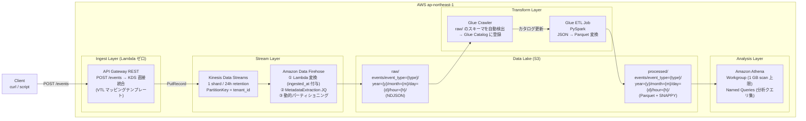

# AWS Streaming Analytics Sandbox

## このプロジェクトの目的

**「データが生まれてから分析できるまでの全工程を IaC で作る。」**

API に POST したイベントが、Kinesis → Firehose → S3（生データ）→ Glue ETL → S3（Parquet）→ Athena（SQL）という経路をたどる。この全パイプラインを Terraform で構築し、どのサービスが何をしているかを体感する。

| 場所 | 通常のやり方 | このプロジェクトでのやり方 |
|------|------------|------------------------|
| API → Kinesis | API Gateway → Lambda → KDS | API Gateway → KDS **直接統合**（Lambda ゼロ） |
| データ変換 | Lambda で自前実装 | **Firehose 変換 Lambda**（1 関数のみ） |
| スキーマ管理 | 手動 CREATE TABLE | **Glue Crawler が自動検出** |
| 分析 | 専用 DB / BI ツール | **Athena（S3 上の SQL）** |

---

## 技術スタック

| カテゴリ | 採用技術 |
|---------|---------|
| IaC | Terraform >= 1.5.0 / AWS Provider ~> 5.0 |
| クラウド | AWS ap-northeast-1 |
| インジェスト | API Gateway REST → Kinesis Data Streams 直接統合 |
| ストリーム処理 | Amazon Data Firehose（変換 Lambda + 動的パーティショニング） |
| データレイク | Amazon S3（raw / processed / scripts / athena-results） |
| ETL | AWS Glue Crawler + Glue ETL Job（PySpark） |
| 分析 | Amazon Athena（Workgroup + Named Queries） |
| 可観測性 | CloudWatch Dashboard + Alarms |
| 認証 | OIDC（アクセスキー禁止） |
| CI/CD | GitHub Actions |
| 言語 | Python 3.12（Firehose Lambda）/ PySpark（Glue ETL） |

---

## アーキテクチャ



---

## 学習ゴール

### A. Kinesis Data Streams の設計

- シャード数と書き込みスループット（1 MB/s / shard）の関係
- `PartitionKey` によるシャード分散（`tenant_id` を使う理由）
- `GetRecords.IteratorAgeMilliseconds` でコンシューマー遅延を観測する

### B. Amazon Data Firehose の応用

- **動的パーティショニング** — JQ でレコードから `event_type` を抽出し、S3 の保存パスを動的に決定
- **変換 Lambda** — Firehose が Lambda を呼び出してレコードを加工する仕組み（`Ok` / `ProcessingFailed` / `Dropped`）
- バッファリング（サイズ・時間の先着優先ルール）
- エラープレフィックス（変換失敗レコードの隔離）

### C. S3 データレイクの 3 ゾーン設計

- raw（生データ）→ processed（変換済み）→ curated（集計済み）の責務分離
- Hive スタイルのパーティション（`year=2024/month=01/...`）が Glue / Athena に与える効果
- S3 ライフサイクル（標準 → IA → 削除）でコストを自動管理

### D. AWS Glue の基礎

- **Crawler** — S3 を走査してスキーマを推測し、Glue Catalog（Hive Metastore 互換）に登録する仕組み
- **ETL Job（PySpark）** — DynamicFrame と DataFrame の変換、Parquet 出力、パーティションキーの指定
- Glue バージョン（4.0）とワーカータイプ（G.1X）の選び方

### E. Amazon Athena のコスト制御

- Workgroup で **スキャン上限（1 GB/クエリ）** を強制する理由と設定方法
- Parquet + Snappy 圧縮が Athena のコストを下げる仕組み（列指向 → 必要列のみ読む）
- Named Queries（事前定義クエリ）でチームの分析を標準化する

---

## モジュール構成

```
streaming-analytics-sandbox/
├── environments/dev/          ← 全モジュールの呼び出しと変数
└── modules/
    ├── data-lake/             ← S3 バケット（raw/processed/scripts/athena-results）
    ├── kinesis/               ← KDS + Firehose + 変換 Lambda
    ├── producer/              ← API Gateway REST（KDS 直接統合）
    ├── glue/                  ← Glue Database + Crawler + ETL Job
    ├── athena/                ← Athena Workgroup + Named Queries
    └── observability/         ← CloudWatch Dashboard + Alarms
```

---

## モジュール間依存関係

```
data-lake
  └──▶ kinesis  (raw_bucket_arn を渡す)
  └──▶ glue     (raw/processed/scripts バケット ID を渡す)
  └──▶ athena   (athena_results バケット ARN、processed バケット ID を渡す)
kinesis
  └──▶ producer (kinesis_stream_name, kinesis_stream_arn を渡す)
全モジュール ──▶ observability
```

---

## 構築スケジュール

| Week | モジュール | 学ぶこと |
|------|-----------|---------|
| 1 | data-lake | S3 3 ゾーン設計、ライフサイクル、SSE、public access block |
| 2 | kinesis | KDS シャード設計、Firehose 動的パーティショニング、変換 Lambda |
| 3 | producer | API Gateway → KDS 直接統合、VTL マッピングテンプレート |
| 4 | glue | Glue Crawler によるスキーマ検出、PySpark ETL（JSON → Parquet） |
| 5 | athena | Workgroup コスト制御、Named Queries、Parquet の効果 |
| 6 | observability + CI/CD | CloudWatch Dashboard、Kinesis アラーム、GitHub Actions OIDC |

---

## 成功の定義

### インフラ
- [ ] `terraform apply` がエラーなく完了する
- [ ] `terraform output` で API エンドポイントと Kinesis ストリーム名が出力される

### パイプライン疎通（E2E）
- [ ] `POST /events` でイベントが送信でき、`200 OK` と `event_id`（Sequence Number）が返る
- [ ] 60〜120 秒後に S3 raw ゾーンに NDJSON ファイルが作成される
- [ ] Glue Crawler を手動実行すると Glue Catalog にテーブルが登録される
- [ ] Glue ETL Job を手動実行すると S3 processed ゾーンに Parquet ファイルが作成される
- [ ] Athena でクエリを実行するとイベントデータが返る

### コスト制御
- [ ] Athena の 1 GB scan 上限が機能しており、大量スキャンが 400 エラーで停止する
- [ ] S3 ライフサイクルルールが設定されている

### 可観測性
- [ ] CloudWatch ダッシュボードに KDS / Firehose / Lambda のメトリクスが表示される
- [ ] `GetRecords.IteratorAgeMilliseconds` アラームが設定されている

---

## このプロジェクトで何が身につくか

このハンズオンを最後までやると、単に AWS サービス名を知るだけでなく、イベントデータを「受け取る -> 保存する -> 整形する -> 分析する」流れを一通り説明できるようになります。

特に、次の 4 点が実感を持って理解できるようになります。

### 1. リアルタイム取り込み基盤をどう組むか

API に届いたイベントを、どのように Kinesis へ流し、どこで保持し、どこで次の処理へ渡すのかが分かるようになります。

- **Kinesis Data Streams** はイベントを受け取って保持する役割
- **Firehose** はイベントを加工して S3 に届ける役割
- この 2 つを分けることで、受信と配信の責務を整理できる

言い換えると、

- 「まず受け止める場所はどこか」
- 「保存しやすい形に変える場所はどこか」
- 「後続の分析に渡す場所はどこか」

を、サービスごとに切り分けて考えられるようになります。

### 2. Lambda を減らした AWS 統合の作り方

このプロジェクトでは、`API Gateway -> Kinesis` を Lambda なしで直接つないでいます。これにより、AWS のマネージド統合を使う発想が身につきます。

具体的には次が理解できます。

- API Gateway の VTL テンプレートでリクエストを変換できる
- `tenant_id` を `PartitionKey` として使う意味
- Lambda を挟まなくても実現できる構成があること
- 逆に、複雑な認証や業務ロジックが必要なら Lambda が必要になること

「とりあえず Lambda を置く」のではなく、「本当に Lambda が必要か」を判断する視点が得られます。

### 3. データレイクを分析しやすい形に育てる考え方

raw の JSON をそのまま置いて終わりではなく、Glue を使って分析しやすい形へ整える流れが分かります。

- **Glue Crawler** が S3 上のデータからスキーマを見つける
- **Glue Catalog** にテーブル情報を登録する
- **Glue ETL Job** で JSON を Parquet に変換する
- `event_type/year/month/day/hour` のようなパーティションが分析効率を上げる

これによって、

- 生データは raw に保存
- 分析用データは processed に保存

という、データレイクの基本的な責務分離を理解できます。

### 4. Athena のコストを意識した分析方法

Athena は便利ですが、無計画に使うとスキャン量が増えてコストも増えます。このハンズオンでは、分析基盤を作るときにコストも設計対象だと分かります。

- JSON のままだと不要な列まで読みやすい
- Parquet は列指向なので必要な列だけ読みやすい
- Snappy 圧縮でスキャン量をさらに減らせる
- Workgroup のスキャン上限で事故を防げる

つまり、

- 「クエリを書ける」だけでなく
- 「安く安全にクエリできる構成を作れる」

ところまでが、このプロジェクトで身につくポイントです。

---

## ハンズオンの進め方

このハンズオンは、次の順番で進めると理解しやすいです。

1. ローカルと AWS の前提条件を確認する
2. Terraform のバックエンドを作る
3. Terraform で基盤を作る
4. API にイベントを送る
5. raw S3 に届いたことを確認する
6. Glue Crawler でスキーマを作る
7. Glue Job で Parquet に変換する
8. Athena でクエリする
9. CloudWatch で監視を見る
10. 不要になったら削除する

---

## 前提条件

### 必要なツール

| ツール | 用途 | 確認コマンド |
|-------|------|------------|
| Terraform >= 1.5.0 | IaC 実行 | `terraform -version` |
| AWS CLI >= 2.x | AWS 操作 | `aws --version` |
| jq | JSON 整形 | `jq --version` |
| uuidgen | テストイベント生成 | `uuidgen` |

### AWS 側の前提

- AWS アカウントを持っていること
- `ap-northeast-1` に作業してよいこと
- `aws sts get-caller-identity` が成功すること
- S3, DynamoDB, IAM, API Gateway, Kinesis, Firehose, Glue, Athena, CloudWatch を作成できる権限があること

### 最初に確認しておくこと

```bash
aws sts get-caller-identity
terraform -version
aws --version
jq --version
```

`aws sts get-caller-identity` が失敗する場合は、この先の手順を進めても途中で止まるので、先に認証状態を直してください。

---

## Step 0: リポジトリに入る

```bash
cd /path/to/streaming-analytics-sandbox
pwd
ls
```

期待すること:

- カレントディレクトリ直下に `README.md`, `ARCHITECTURE.md`, `environments/`, `modules/` が見える

---

## Step 1: Terraform バックエンドを作成する

このプロジェクトは `environments/dev/backend.tf` で、S3 + DynamoDB バックエンドを前提にしています。先に tfstate 保存先を手動で作ります。

### 1-1. S3 バケットを作成

```bash
aws s3 mb s3://tfstate-streaming-analytics-sandbox --region ap-northeast-1
```

### 1-2. バージョニングを有効化

```bash
aws s3api put-bucket-versioning \
  --bucket tfstate-streaming-analytics-sandbox \
  --versioning-configuration Status=Enabled
```

### 1-3. DynamoDB ロックテーブルを作成

```bash
aws dynamodb create-table \
  --table-name tfstate-lock-streaming-analytics \
  --attribute-definitions AttributeName=LockID,AttributeType=S \
  --key-schema AttributeName=LockID,KeyType=HASH \
  --billing-mode PAY_PER_REQUEST \
  --region ap-northeast-1
```

### 1-4. 作成確認

```bash
aws s3 ls | grep tfstate-streaming-analytics-sandbox

aws dynamodb describe-table \
  --table-name tfstate-lock-streaming-analytics \
  --region ap-northeast-1 \
  --query "Table.TableStatus"
```

期待すること:

- S3 バケットが見える
- DynamoDB の状態が `ACTIVE`

---

## Step 2: 変数を確認する

このプロジェクトのデフォルト値は `environments/dev/terraform.tfvars` に入っています。最低限、`owner` だけは自分が分かる値へ変えておくのがおすすめです。

```hcl
aws_region  = "ap-northeast-1"
project     = "streaming-analytics-sandbox"
environment = "dev"
owner       = "your-name"
```

手元の検証だけなら、コマンドライン引数で上書きしても問題ありません。

---

## Step 3: Terraform で基盤を作成する

```bash
cd environments/dev

terraform init
terraform fmt -check -recursive
terraform validate
terraform plan -var="owner=your-name"
```

ここで確認すること:

- `init` が成功する
- `validate` で構文エラーが出ない
- `plan` に Kinesis, Firehose, S3, Glue, Athena, CloudWatch, API Gateway が表示される

問題なければ、ユーザー自身で apply を実行します。

```bash
terraform apply -var="owner=your-name"
```

期待すること:

- 3〜5 分程度で完了する
- 最後に outputs が表示される

特に重要な output:

- `api_endpoint`
- `events_endpoint`
- `api_key_id`
- `kinesis_stream_name`
- `raw_bucket_id`
- `glue_crawler_name`
- `glue_job_name`
- `athena_workgroup_name`

---

## Step 4: 動作確認用の値を取得する

この後のハンズオンで何度も使うので、最初に環境変数へまとめて入れておくと楽です。

```bash
cd environments/dev

API_URL=$(terraform output -raw api_endpoint)
EVENTS_URL=$(terraform output -raw events_endpoint)
API_KEY_ID=$(terraform output -raw api_key_id)
API_KEY=$(aws apigateway get-api-key \
  --api-key "${API_KEY_ID}" \
  --include-value \
  --query value \
  --output text)

STREAM_NAME=$(terraform output -raw kinesis_stream_name)
RAW_BUCKET=$(terraform output -raw raw_bucket_id)
PROCESSED_BUCKET=$(terraform output -raw processed_bucket_id)
DB_NAME=$(terraform output -raw glue_database_name)
CRAWLER_NAME=$(terraform output -raw glue_crawler_name)
JOB_NAME=$(terraform output -raw glue_job_name)
WORKGROUP=$(terraform output -raw athena_workgroup_name)
DASHBOARD=$(terraform output -raw dashboard_name)

echo "EVENTS_URL      : ${EVENTS_URL}"
echo "STREAM_NAME     : ${STREAM_NAME}"
echo "RAW_BUCKET      : ${RAW_BUCKET}"
echo "PROCESSED_BUCKET: ${PROCESSED_BUCKET}"
echo "DB_NAME         : ${DB_NAME}"
echo "CRAWLER_NAME    : ${CRAWLER_NAME}"
echo "JOB_NAME        : ${JOB_NAME}"
echo "WORKGROUP       : ${WORKGROUP}"
```

期待すること:

- すべて空文字ではなく値が出る

---

## Step 5: API にイベントを送信する

まずは 2 種類のイベントを送って、`event_type` ごとの分岐と `tenant_id` による PartitionKey を確認しやすくします。

### 5-1. `page_view` を送る

```bash
curl -s -X POST "${EVENTS_URL}" \
  -H "Content-Type: application/json" \
  -H "x-api-key: ${API_KEY}" \
  -d '{
    "event_id":   "'$(uuidgen)'",
    "event_type": "page_view",
    "user_id":    "usr_001",
    "tenant_id":  "tenant-a",
    "timestamp":  "'$(date -u +%Y-%m-%dT%H:%M:%SZ)'",
    "payload": {
      "product_id": "prod_001"
    }
  }' | jq .
```

### 5-2. `purchase` を送る

```bash
curl -s -X POST "${EVENTS_URL}" \
  -H "Content-Type: application/json" \
  -H "x-api-key: ${API_KEY}" \
  -d '{
    "event_id":   "'$(uuidgen)'",
    "event_type": "purchase",
    "user_id":    "usr_002",
    "tenant_id":  "tenant-b",
    "timestamp":  "'$(date -u +%Y-%m-%dT%H:%M:%SZ)'",
    "payload": {
      "product_id": "prod_002",
      "amount": 5800
    }
  }' | jq .
```

期待するレスポンス例:

```json
{
  "event_id": "4962546102764...",
  "shard_id": "shardId-000000000000",
  "status": "accepted"
}
```

ここで失敗する場合の確認ポイント:

- `x-api-key` を付けているか
- `EVENTS_URL` に `/events` が含まれているか
- JSON の `tenant_id` が存在するか

---

## Step 6: Kinesis -> Firehose -> S3 raw を確認する

Firehose はすぐに S3 へ出さず、バッファリングしてから書き込みます。デフォルトでは 60 秒なので、少し待ちます。

```bash
sleep 90
```

### 6-1. raw バケットにファイルができたか確認

```bash
aws s3 ls "s3://${RAW_BUCKET}/events/" --recursive
```

期待すること:

- `events/event_type=page_view/...`
- `events/event_type=purchase/...`

のような Hive スタイルのパスが見える

### 6-2. 中身を確認

```bash
RAW_KEY=$(aws s3 ls "s3://${RAW_BUCKET}/events/" --recursive | head -1 | awk '{print $4}')

aws s3 cp "s3://${RAW_BUCKET}/${RAW_KEY}" - | head -5
```

期待すること:

- 1 行 1 JSON の NDJSON 形式
- `ingested_at` が追加されている

もし `ingested_at` が無ければ、Firehose 変換 Lambda が動いていない可能性があります。

---

## Step 7: Glue Crawler でスキーマを作る

raw S3 に JSON は置かれても、そのままでは Athena から扱いづらいです。まず Glue Crawler でテーブル定義を作ります。

### 7-1. Crawler を開始

```bash
aws glue start-crawler --name "${CRAWLER_NAME}"
```

### 7-2. 状態確認

```bash
aws glue get-crawler \
  --name "${CRAWLER_NAME}" \
  --query "Crawler.State" \
  --output text
```

`RUNNING` の間は待って、`READY` になったら次へ進みます。

### 7-3. Catalog にテーブルが登録されたか確認

```bash
aws glue get-tables \
  --database-name "${DB_NAME}" \
  --query "TableList[*].{Name:Name,Location:StorageDescriptor.Location}" \
  --output table
```

期待すること:

- `events` テーブルが見える
- Location が `s3://<raw-bucket>/events/` を指している

---

## Step 8: Glue ETL Job を実行して Parquet 化する

このステップで raw JSON を processed Parquet へ変換します。

### 8-1. Job を起動

```bash
JOB_RUN_ID=$(aws glue start-job-run \
  --job-name "${JOB_NAME}" \
  --query "JobRunId" \
  --output text)

echo "JOB_RUN_ID=${JOB_RUN_ID}"
```

### 8-2. 実行状態を確認

```bash
aws glue get-job-run \
  --job-name "${JOB_NAME}" \
  --run-id "${JOB_RUN_ID}" \
  --query "JobRun.{State:JobRunState,Error:ErrorMessage}" \
  --output json
```

期待すること:

- `State` が最終的に `SUCCEEDED`

`RUNNING` の場合は 30 秒ほど待って再確認してください。

### 8-3. processed バケットに Parquet ができたか確認

```bash
aws s3 ls "s3://${PROCESSED_BUCKET}/events/" --recursive
```

期待すること:

- `event_type=.../year=.../month=.../day=.../hour=.../`
- `.parquet` ファイル

---

## Step 9: Athena で分析する

### 9-1. raw テーブル `events` に対して件数クエリを投げる

```bash
QUERY_ID=$(aws athena start-query-execution \
  --query-string "SELECT event_type, COUNT(*) AS cnt FROM events GROUP BY event_type ORDER BY cnt DESC;" \
  --query-execution-context Database="${DB_NAME}" \
  --work-group "${WORKGROUP}" \
  --query "QueryExecutionId" \
  --output text)

echo "QUERY_ID=${QUERY_ID}"
```

### 9-2. 実行結果を確認

```bash
aws athena get-query-execution \
  --query-execution-id "${QUERY_ID}" \
  --query "QueryExecution.Status.{State:State,Reason:StateChangeReason}" \
  --output json
```

`SUCCEEDED` になったら結果を取得します。

```bash
aws athena get-query-results \
  --query-execution-id "${QUERY_ID}" \
  --output table
```

期待すること:

- `page_view`
- `purchase`

の 2 種類が集計結果に出る

### 9-3. processed 用テーブルを作りたい場合

このプロジェクトは Athena Named Query として `create_processed_table` を登録しています。Athena コンソールの Saved queries から開いて実行すると、processed Parquet を直接引けるテーブルを作れます。

---

## Step 10: CloudWatch ダッシュボードを見る

```bash
REGION="ap-northeast-1"
echo "https://${REGION}.console.aws.amazon.com/cloudwatch/home?region=${REGION}#dashboards:name=${DASHBOARD}"
```

見るポイント:

- Kinesis `IncomingRecords`
- Kinesis `GetRecords.IteratorAgeMilliseconds`
- Firehose `DeliveryToS3.Success`
- Firehose `DeliveryToS3.DataFreshness`
- Lambda `Invocations`
- Lambda `Errors`
- Athena `ProcessedBytes`

イベント送信直後にメトリクスがすぐ見えないことは普通です。数分待つと反映されます。

---

## Step 11: GitHub Actions で CI/CD を使う場合

任意ステップです。ローカルでのハンズオンには必須ではありません。

### 11-1. OIDC プロバイダとロールを作成

```bash
GITHUB_ORG="your-github-org"
GITHUB_REPO="your-repo-name"
AWS_ACCOUNT_ID=$(aws sts get-caller-identity --query Account --output text)

aws iam create-open-id-connect-provider \
  --url https://token.actions.githubusercontent.com \
  --client-id-list sts.amazonaws.com \
  --thumbprint-list 6938fd4d98bab03faadb97b34396831e3780aea1

cat > /tmp/trust-policy.json <<EOF
{
  "Version": "2012-10-17",
  "Statement": [{
    "Effect": "Allow",
    "Principal": {"Federated": "arn:aws:iam::${AWS_ACCOUNT_ID}:oidc-provider/token.actions.githubusercontent.com"},
    "Action": "sts:AssumeRoleWithWebIdentity",
    "Condition": {
      "StringEquals": {"token.actions.githubusercontent.com:aud": "sts.amazonaws.com"},
      "StringLike":  {"token.actions.githubusercontent.com:sub": "repo:${GITHUB_ORG}/${GITHUB_REPO}:*"}
    }
  }]
}
EOF

aws iam create-role \
  --role-name github-actions-terraform \
  --assume-role-policy-document file:///tmp/trust-policy.json

aws iam attach-role-policy \
  --role-name github-actions-terraform \
  --policy-arn arn:aws:iam::aws:policy/AdministratorAccess
```

### 11-2. GitHub Secrets に設定する

- `AWS_ROLE_ARN`
- `ALERT_EMAIL` 任意

---

## Step 12: クリーンアップ

検証が終わったら、課金を防ぐため削除します。

```bash
cd environments/dev
terraform destroy -var="owner=your-name"
```

最後にバックエンドも不要なら削除します。

```bash
aws s3 rb s3://tfstate-streaming-analytics-sandbox --force

aws dynamodb delete-table \
  --table-name tfstate-lock-streaming-analytics \
  --region ap-northeast-1
```

注意:

- `terraform destroy` は Athena results や S3 オブジェクト削除に少し時間がかかることがあります
- バックエンドを消すのは、今後この環境を再利用しないと決めてからにしてください

---

## よくあるつまずき

### `terraform init` が失敗する

- バックエンド S3 バケット名が既に他で使われていないか確認
- DynamoDB テーブルが存在するか確認
- AWS 認証先アカウントが想定どおりか確認

### `curl` が 403 / 4xx になる

- `x-api-key` を付けているか
- `events_endpoint` を使っているか
- `Content-Type: application/json` を付けているか

### raw S3 にファイルが来ない

- 90〜120 秒待ったか
- Firehose の `DeliveryToS3.DataFreshness` を確認
- 変換 Lambda の `Errors` を確認

### Glue Crawler でテーブルが出ない

- raw バケット配下に `events/` の実データが存在するか
- Crawler の状態が `READY` になるまで待ったか

### Glue Job が失敗する

- Crawler 実行前に Job を起動していないか
- `events` テーブルが Glue Catalog に存在するか
- CloudWatch Logs の Glue Job ログを確認

### Athena クエリが失敗する

- `DB_NAME` が正しいか
- Crawler 後に `events` テーブルが存在するか
- スキャン上限 1 GB に引っかかっていないか

---

## コスト見積もり（月額目安）

| リソース | 概算 | 備考 |
|---------|------|------|
| Kinesis Data Streams | ~$1 | 1 shard × 24h retention |
| Amazon Data Firehose | ~$0.5 | $0.029/GB（少量なら無視できる） |
| S3 | ~$0.5 | 3 ゾーン合計 |
| Glue Crawler | ~$0.1 | $0.44/DPU-h、短時間で完了 |
| Glue ETL Job | ~$0.5 | G.1X × 2 workers、手動実行のみ |
| Athena | ~$0.1 | $5/TB、Parquet なら数 MB のスキャン |
| CloudWatch | ~$1 | ダッシュボード + アラーム |
| API Gateway REST | ~$0.1 | |
| Lambda（変換） | ~$0.01 | Firehose 変換のみ |
| **合計** | **~$4/月** | |

> Glue ETL Job は手動実行のみ（スケジュール起動なし）なので、実験時のみコストが発生する。
> NAT Gateway なし（フルマネージドサービスのみ）。
