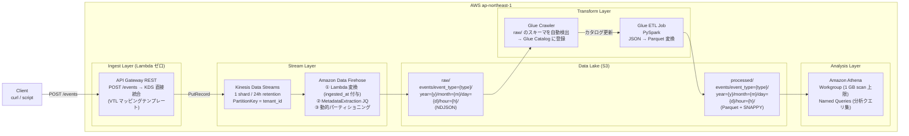

# AWS Streaming Analytics Sandbox

## このプロジェクトの目的

**「データが生まれてから分析できるまでの全工程を IaC で作る。」**

API に POST したイベントが、Kinesis → Firehose → S3（生データ）→ Glue ETL → S3（Parquet）→ Athena（SQL）という経路をたどる。この全パイプラインを Terraform で構築し、どのサービスが何をしているかを体感する。

| 場所 | 通常のやり方 | このプロジェクトでのやり方 |
|------|------------|------------------------|
| API → Kinesis | API Gateway → Lambda → KDS | API Gateway → KDS **直接統合**（Lambda ゼロ） |
| データ変換 | Lambda で自前実装 | **Firehose 変換 Lambda**（1 関数のみ） |
| スキーマ管理 | 手動 CREATE TABLE | **Glue Crawler が自動検出** |
| 分析 | 専用 DB / BI ツール | **Athena（S3 上の SQL）** |

---

## 技術スタック

| カテゴリ | 採用技術 |
|---------|---------|
| IaC | Terraform >= 1.5.0 / AWS Provider ~> 5.0 |
| クラウド | AWS ap-northeast-1 |
| インジェスト | API Gateway REST → Kinesis Data Streams 直接統合 |
| ストリーム処理 | Amazon Data Firehose（変換 Lambda + 動的パーティショニング） |
| データレイク | Amazon S3（raw / processed / scripts / athena-results） |
| ETL | AWS Glue Crawler + Glue ETL Job（PySpark） |
| 分析 | Amazon Athena（Workgroup + Named Queries） |
| 可観測性 | CloudWatch Dashboard + Alarms |
| 認証 | OIDC（アクセスキー禁止） |
| CI/CD | GitHub Actions |
| 言語 | Python 3.12（Firehose Lambda）/ PySpark（Glue ETL） |

---

## アーキテクチャ



---

## 学習ゴール

### A. Kinesis Data Streams の設計

- シャード数と書き込みスループット（1 MB/s / shard）の関係
- `PartitionKey` によるシャード分散（`tenant_id` を使う理由）
- `GetRecords.IteratorAgeMilliseconds` でコンシューマー遅延を観測する

### B. Amazon Data Firehose の応用

- **動的パーティショニング** — JQ でレコードから `event_type` を抽出し、S3 の保存パスを動的に決定
- **変換 Lambda** — Firehose が Lambda を呼び出してレコードを加工する仕組み（`Ok` / `ProcessingFailed` / `Dropped`）
- バッファリング（サイズ・時間の先着優先ルール）
- エラープレフィックス（変換失敗レコードの隔離）

### C. S3 データレイクの 3 ゾーン設計

- raw（生データ）→ processed（変換済み）→ curated（集計済み）の責務分離
- Hive スタイルのパーティション（`year=2024/month=01/...`）が Glue / Athena に与える効果
- S3 ライフサイクル（標準 → IA → 削除）でコストを自動管理

### D. AWS Glue の基礎

- **Crawler** — S3 を走査してスキーマを推測し、Glue Catalog（Hive Metastore 互換）に登録する仕組み
- **ETL Job（PySpark）** — DynamicFrame と DataFrame の変換、Parquet 出力、パーティションキーの指定
- Glue バージョン（4.0）とワーカータイプ（G.1X）の選び方

### E. Amazon Athena のコスト制御

- Workgroup で **スキャン上限（1 GB/クエリ）** を強制する理由と設定方法
- Parquet + Snappy 圧縮が Athena のコストを下げる仕組み（列指向 → 必要列のみ読む）
- Named Queries（事前定義クエリ）でチームの分析を標準化する

---

## モジュール構成

```
streaming-analytics-sandbox/
├── environments/dev/          ← 全モジュールの呼び出しと変数
└── modules/
    ├── data-lake/             ← S3 バケット（raw/processed/scripts/athena-results）
    ├── kinesis/               ← KDS + Firehose + 変換 Lambda
    ├── producer/              ← API Gateway REST（KDS 直接統合）
    ├── glue/                  ← Glue Database + Crawler + ETL Job
    ├── athena/                ← Athena Workgroup + Named Queries
    └── observability/         ← CloudWatch Dashboard + Alarms
```

---

## モジュール間依存関係

```
data-lake
  └──▶ kinesis  (raw_bucket_arn を渡す)
  └──▶ glue     (raw/processed/scripts バケット ID を渡す)
  └──▶ athena   (athena_results バケット ARN、processed バケット ID を渡す)
kinesis
  └──▶ producer (kinesis_stream_name, kinesis_stream_arn を渡す)
全モジュール ──▶ observability
```

---

## 構築スケジュール

| Week | モジュール | 学ぶこと |
|------|-----------|---------|
| 1 | data-lake | S3 3 ゾーン設計、ライフサイクル、SSE、public access block |
| 2 | kinesis | KDS シャード設計、Firehose 動的パーティショニング、変換 Lambda |
| 3 | producer | API Gateway → KDS 直接統合、VTL マッピングテンプレート |
| 4 | glue | Glue Crawler によるスキーマ検出、PySpark ETL（JSON → Parquet） |
| 5 | athena | Workgroup コスト制御、Named Queries、Parquet の効果 |
| 6 | observability + CI/CD | CloudWatch Dashboard、Kinesis アラーム、GitHub Actions OIDC |

---

## 成功の定義

### インフラ
- [ ] `terraform apply` がエラーなく完了する
- [ ] `terraform output` で API エンドポイントと Kinesis ストリーム名が出力される

### パイプライン疎通（E2E）
- [ ] `POST /events` でイベントが送信でき、`200 OK` と `event_id`（Sequence Number）が返る
- [ ] 60〜120 秒後に S3 raw ゾーンに NDJSON ファイルが作成される
- [ ] Glue Crawler を手動実行すると Glue Catalog にテーブルが登録される
- [ ] Glue ETL Job を手動実行すると S3 processed ゾーンに Parquet ファイルが作成される
- [ ] Athena でクエリを実行するとイベントデータが返る

### コスト制御
- [ ] Athena の 1 GB scan 上限が機能しており、大量スキャンが 400 エラーで停止する
- [ ] S3 ライフサイクルルールが設定されている

### 可観測性
- [ ] CloudWatch ダッシュボードに KDS / Firehose / Lambda のメトリクスが表示される
- [ ] `GetRecords.IteratorAgeMilliseconds` アラームが設定されている

---

## このプロジェクトで何が身につくか

### 1. ストリームとバッチの境界を理解する

> 「Kinesis は何をしていて、Firehose は何をしているか？」

- **KDS**: データを **受け取る・保持する** 層。コンシューマー（Firehose）が読み取るまで保持。
- **Firehose**: データを **変換して届ける** 層。KDS から読んで Lambda で加工し、S3 に書く。
- 両者を組み合わせることで、**Producer はシンプルな PutRecord だけ** でよくなる。

### 2. VTL マッピングテンプレートの実用

API Gateway → KDS の直接統合で、VTL テンプレートが：
- リクエスト Body を Base64 エンコードして `Data` に設定する
- `tenant_id` フィールドを `PartitionKey` として抽出する

Lambda を挟まずにこれができる理由と、逆に Lambda が必要になるケースを理解できる。

### 3. Glue Crawler のスキーマ推論の仕組み

- Crawler は S3 の JSON ファイルからフィールド名と型を推測して Glue Catalog に登録する
- パーティション（`event_type=page_view/year=2024/...`）も自動的に認識される
- Athena はこのカタログを参照するため、手動 DDL が不要になる

### 4. Parquet が Athena コストを下げる理由

- **行指向（JSON）**: 1 行ずつ読む → 不要列もスキャンされる
- **列指向（Parquet）**: `SELECT amount, tenant_id` なら 2 列分だけスキャン
- SNAPPY 圧縮で更にファイルサイズが小さくなり、スキャン量（= コスト）が減る

---

## 前提条件

| ツール | 確認コマンド |
|-------|------------|
| Terraform >= 1.5.0 | `terraform -version` |
| AWS CLI >= 2.x | `aws --version` |
| jq | `jq --version` |

---

## 事前準備

### 1. Terraform バックエンド用リソースを作成

```bash
aws s3 mb s3://tfstate-streaming-analytics-sandbox --region ap-northeast-1

aws s3api put-bucket-versioning \
  --bucket tfstate-streaming-analytics-sandbox \
  --versioning-configuration Status=Enabled

aws dynamodb create-table \
  --table-name tfstate-lock-streaming-analytics \
  --attribute-definitions AttributeName=LockID,AttributeType=S \
  --key-schema AttributeName=LockID,KeyType=HASH \
  --billing-mode PAY_PER_REQUEST \
  --region ap-northeast-1
```

### 2. GitHub Actions 用 OIDC ロールを作成（CI/CD を使う場合）

```bash
GITHUB_ORG="your-github-org"
GITHUB_REPO="your-repo-name"
AWS_ACCOUNT_ID=$(aws sts get-caller-identity --query Account --output text)

aws iam create-open-id-connect-provider \
  --url https://token.actions.githubusercontent.com \
  --client-id-list sts.amazonaws.com \
  --thumbprint-list 6938fd4d98bab03faadb97b34396831e3780aea1

cat > /tmp/trust-policy.json <<EOF
{
  "Version": "2012-10-17",
  "Statement": [{
    "Effect": "Allow",
    "Principal": {"Federated": "arn:aws:iam::${AWS_ACCOUNT_ID}:oidc-provider/token.actions.githubusercontent.com"},
    "Action": "sts:AssumeRoleWithWebIdentity",
    "Condition": {
      "StringEquals": {"token.actions.githubusercontent.com:aud": "sts.amazonaws.com"},
      "StringLike":  {"token.actions.githubusercontent.com:sub": "repo:${GITHUB_ORG}/${GITHUB_REPO}:*"}
    }
  }]
}
EOF

aws iam create-role \
  --role-name github-actions-terraform \
  --assume-role-policy-document file:///tmp/trust-policy.json

aws iam attach-role-policy \
  --role-name github-actions-terraform \
  --policy-arn arn:aws:iam::aws:policy/AdministratorAccess

echo "ARN: arn:aws:iam::${AWS_ACCOUNT_ID}:role/github-actions-terraform"
```

---

## デプロイ手順

```bash
cd streaming-analytics-sandbox/environments/dev

# terraform.tfvars の owner を自分の名前に変更してから実行
terraform init
terraform fmt -check -recursive
terraform validate
terraform plan -var="owner=your-name"
terraform apply -var="owner=your-name"

# 所要時間: 約 3〜5 分
```

---

## 動作確認

### Step 1: API エンドポイントと API Key を取得

```bash
cd streaming-analytics-sandbox/environments/dev

API_URL=$(terraform output -raw api_endpoint)
API_KEY_ID=$(terraform output -raw api_key_id)
API_KEY=$(aws apigateway get-api-key \
  --api-key "${API_KEY_ID}" \
  --include-value \
  --query value \
  --output text)
STREAM_NAME=$(terraform output -raw kinesis_stream_name)

echo "API_URL    : ${API_URL}"
echo "STREAM_NAME: ${STREAM_NAME}"
```

### Step 2: イベントを送信

```bash
# page_view イベント（tenant-a）
curl -s -X POST "${API_URL}/events" \
  -H "Content-Type: application/json" \
  -H "x-api-key: ${API_KEY}" \
  -d '{
    "event_id":   "'$(uuidgen)'",
    "event_type": "page_view",
    "user_id":    "usr_001",
    "tenant_id":  "tenant-a",
    "timestamp":  "'$(date -u +%Y-%m-%dT%H:%M:%SZ)'",
    "payload": {"product_id": "prod_001"}
  }' | jq .

# purchase イベント（tenant-b）
curl -s -X POST "${API_URL}/events" \
  -H "Content-Type: application/json" \
  -H "x-api-key: ${API_KEY}" \
  -d '{
    "event_id":   "'$(uuidgen)'",
    "event_type": "purchase",
    "user_id":    "usr_002",
    "tenant_id":  "tenant-b",
    "timestamp":  "'$(date -u +%Y-%m-%dT%H:%M:%SZ)'",
    "payload": {"product_id": "prod_002", "amount": 5800}
  }' | jq .
```

### Step 3: S3 raw ゾーンへの到達を確認（60〜120 秒後）

```bash
RAW_BUCKET=$(terraform output -raw raw_bucket_id)

# Firehose のバッファリング（60 秒）が終わるまで待機
sleep 90

aws s3 ls "s3://${RAW_BUCKET}/events/" --recursive | head -20

# ファイルの中身を確認（NDJSON）
aws s3 cp \
  "s3://${RAW_BUCKET}/$(aws s3 ls s3://${RAW_BUCKET}/events/ --recursive | head -1 | awk '{print $4}')" \
  - | head -5 | jq .
```

### Step 4: Glue Crawler を実行（スキーマ検出）

```bash
CRAWLER_NAME=$(terraform output -raw glue_crawler_name)

aws glue start-crawler --name "${CRAWLER_NAME}"

# 完了まで待機（1〜2 分）
aws glue get-crawler --name "${CRAWLER_NAME}" \
  --query "Crawler.State" --output text

# テーブルが登録されたか確認
DB_NAME=$(terraform output -raw glue_database_name)
aws glue get-tables --database-name "${DB_NAME}" \
  --query "TableList[*].{Name:Name,Location:StorageDescriptor.Location}" \
  --output table
```

### Step 5: Glue ETL Job を実行（JSON → Parquet 変換）

```bash
JOB_NAME=$(terraform output -raw glue_job_name)

JOB_RUN_ID=$(aws glue start-job-run \
  --job-name "${JOB_NAME}" \
  --query "JobRunId" \
  --output text)

echo "Job Run ID: ${JOB_RUN_ID}"

# 状態を確認（約 2〜4 分で完了）
aws glue get-job-run \
  --job-name "${JOB_NAME}" \
  --run-id "${JOB_RUN_ID}" \
  --query "JobRun.{State:JobRunState,Error:ErrorMessage}" \
  --output json
```

### Step 6: Athena でクエリ実行

```bash
WORKGROUP=$(terraform output -raw athena_workgroup_name)
DB_NAME=$(terraform output -raw glue_database_name)
RESULTS_BUCKET=$(terraform output -raw athena_results_bucket_id)

# イベント件数を event_type 別に集計
aws athena start-query-execution \
  --query-string "SELECT event_type, COUNT(*) AS cnt FROM events GROUP BY event_type ORDER BY cnt DESC;" \
  --query-execution-context Database="${DB_NAME}" \
  --work-group "${WORKGROUP}" \
  --query "QueryExecutionId" \
  --output text
```

### Step 7: CloudWatch ダッシュボードで監視

```bash
DASHBOARD=$(terraform output -raw dashboard_name)
REGION="ap-northeast-1"
echo "https://${REGION}.console.aws.amazon.com/cloudwatch/home?region=${REGION}#dashboards:name=${DASHBOARD}"
```

---

## クリーンアップ

```bash
cd streaming-analytics-sandbox/environments/dev
terraform destroy -var="owner=your-name"

# バックエンドリソースの手動削除（最後に実行）
aws s3 rb s3://tfstate-streaming-analytics-sandbox --force
aws dynamodb delete-table --table-name tfstate-lock-streaming-analytics --region ap-northeast-1
```

---

## コスト見積もり（月額目安）

| リソース | 概算 | 備考 |
|---------|------|------|
| Kinesis Data Streams | ~$1 | 1 shard × 24h retention |
| Amazon Data Firehose | ~$0.5 | $0.029/GB（少量なら無視できる） |
| S3 | ~$0.5 | 3 ゾーン合計 |
| Glue Crawler | ~$0.1 | $0.44/DPU-h、短時間で完了 |
| Glue ETL Job | ~$0.5 | G.1X × 2 workers、手動実行のみ |
| Athena | ~$0.1 | $5/TB、Parquet なら数 MB のスキャン |
| CloudWatch | ~$1 | ダッシュボード + アラーム |
| API Gateway REST | ~$0.1 | |
| Lambda（変換） | ~$0.01 | Firehose 変換のみ |
| **合計** | **~$4/月** | |

> Glue ETL Job は手動実行のみ（スケジュール起動なし）なので、実験時のみコストが発生する。
> NAT Gateway なし（フルマネージドサービスのみ）。
