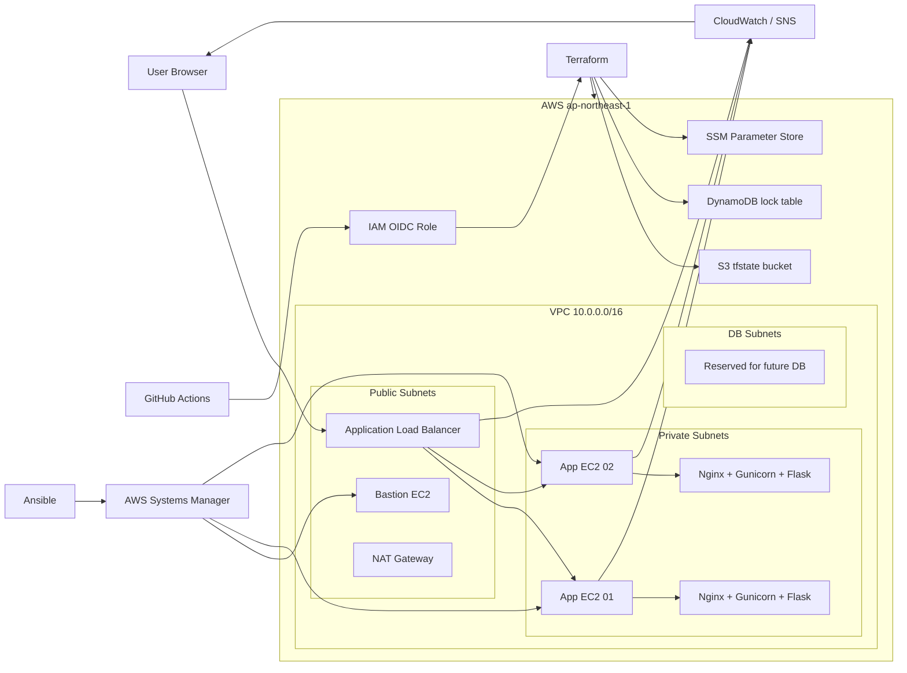
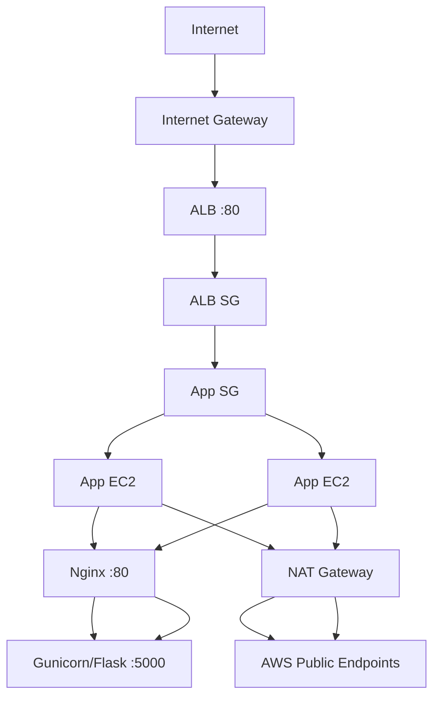
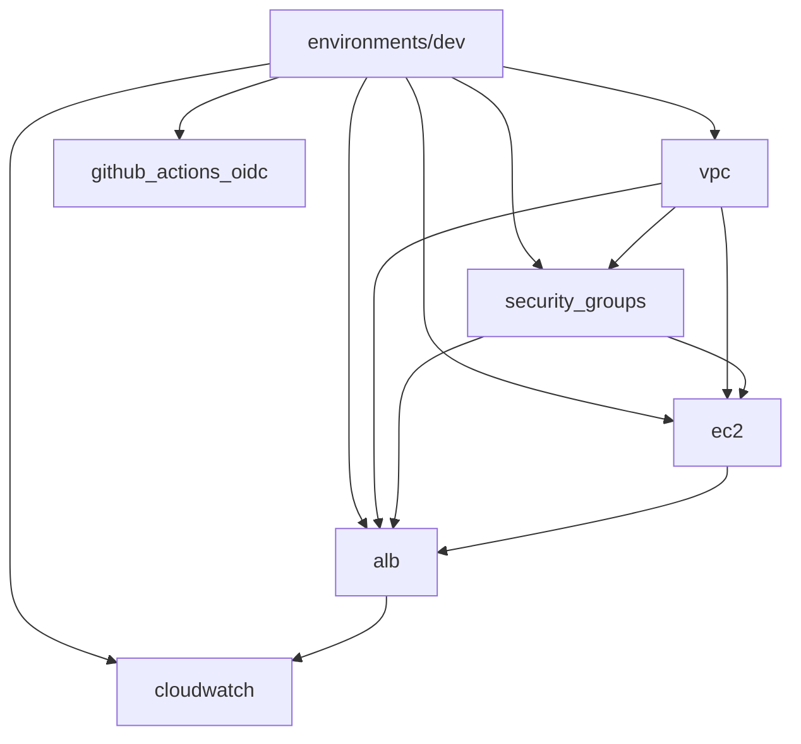
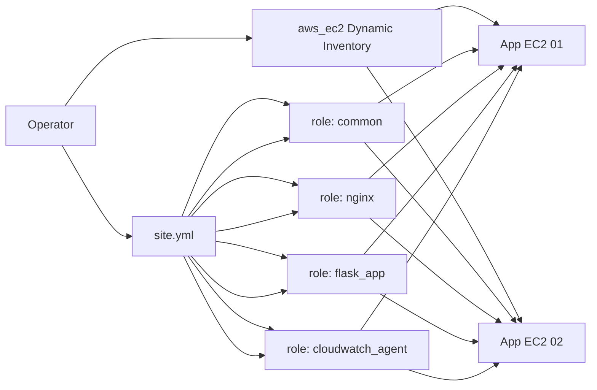
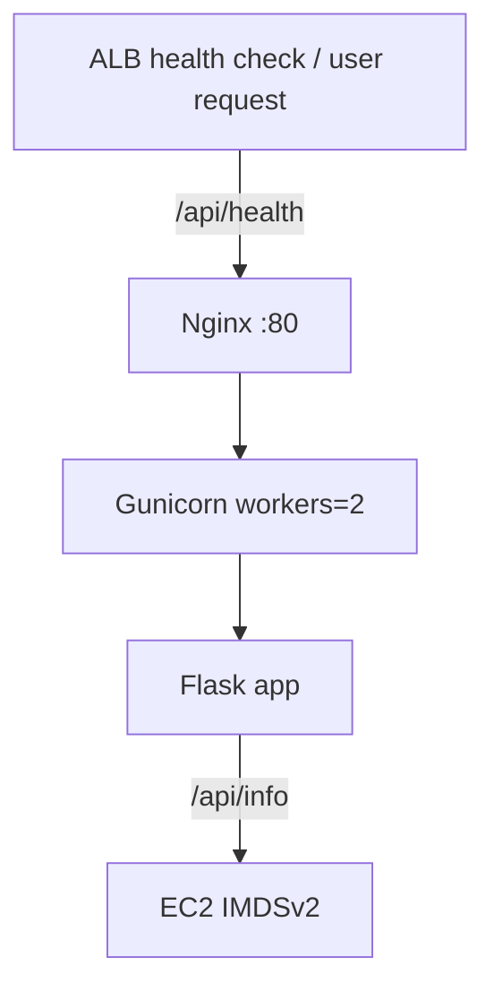
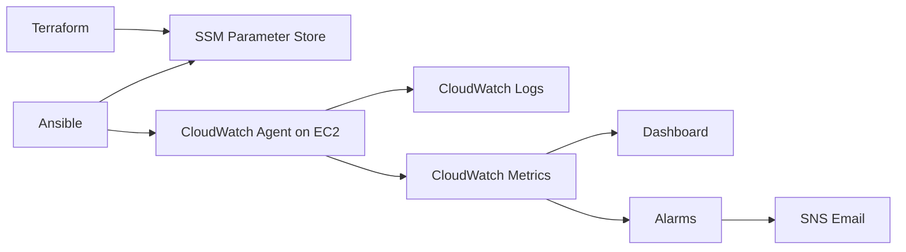
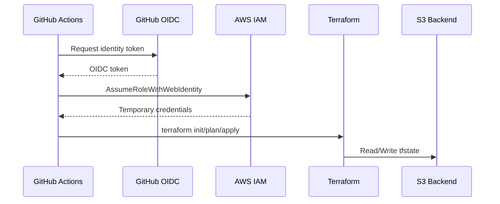

# ARCHITECTURE.md

## 概要

このプロジェクトは、`Terraform` で AWS インフラを構築し、`Ansible` で EC2 上のミドルウェアとアプリケーションを構成し、`GitHub Actions` で Terraform の CI/CD を回す、実践的な IaC ハンズオン兼ポートフォリオ構成です。

公開経路は `Internet -> ALB -> Nginx -> Gunicorn -> Flask`、運用経路は `GitHub Actions (OIDC) -> Terraform` と `Operator -> Ansible -> AWS Systems Manager` に分かれています。App EC2 は private subnet に閉じ、SSH を使わず `SSM Session Manager` 経由で管理するのが中核設計です。

## 1. 何を作るプロジェクトか

- 2AZ 構成の 3-tier VPC
- Public subnet 上の ALB
- Private subnet 上の App EC2 2台
- Public subnet 上の Bastion EC2 1台
- App EC2 上の Nginx + Gunicorn + Flask
- CloudWatch Agent / Dashboard / Alarm / SNS による監視
- GitHub Actions OIDC による Terraform 実行基盤
- S3 + DynamoDB による Terraform remote backend

## 2. 全体アーキテクチャ



## 3. レイヤー別の責務

| レイヤー | 主な技術 | 責務 |
|---|---|---|
| Infrastructure | Terraform | VPC, Subnet, SG, EC2, ALB, IAM, CloudWatch, OIDC, backend |
| Configuration | Ansible | OS設定、Nginx、Flask 配備、CloudWatch Agent 適用 |
| Application | Flask + Gunicorn | ヘルスチェックと IMDSv2 メタデータ返却 API |
| Delivery | GitHub Actions | Terraform plan/apply 自動化 |
| Operations | SSM, CloudWatch, SNS | SSHレス運用、監視、通知 |

## 4. ネットワーク設計

### CIDR とサブネット

| 種別 | AZ | CIDR | 用途 |
|---|---|---|---|
| Public | ap-northeast-1a | `10.0.0.0/24` | ALB, Bastion, NAT |
| Public | ap-northeast-1c | `10.0.1.0/24` | ALB |
| Private | ap-northeast-1a | `10.0.10.0/24` | App EC2 |
| Private | ap-northeast-1c | `10.0.11.0/24` | App EC2 |
| DB | ap-northeast-1a | `10.0.20.0/24` | 将来の DB 用予約 |
| DB | ap-northeast-1c | `10.0.21.0/24` | 将来の DB 用予約 |

### ルーティング

- Public subnet は `Internet Gateway` にデフォルトルート
- Private subnet は単一 `NAT Gateway` にデフォルトルート
- DB subnet は外向きルートを持たず、将来の閉域 DB 配置を想定

### 通信フロー



## 5. セキュリティ設計

### 採用している方針

- SSH ポート `22` は開放しない
- App EC2 は private subnet にのみ配置
- Bastion も SSH ではなく SSM 接続専用
- EC2 メタデータアクセスは `IMDSv2 required`
- App SG は CIDR ではなく `ALB SG` を参照
- GitHub Actions は IAM アクセスキーではなく `OIDC AssumeRoleWithWebIdentity`
- tfstate は `S3 + DynamoDB lock + encryption + versioning`

### Security Group の役割

| SG | Ingress | Egress | 意図 |
|---|---|---|---|
| ALB SG | `80/443` from `0.0.0.0/0` | all | 外部公開入口 |
| App SG | `80/443` from ALB SG | all | App を ALB 背後に限定 |
| Bastion SG | なし | all | SSM 専用の踏み台 |

### 実装上の補足

- 現在の ALB リスナーは `HTTP:80` のみで、`443` は SG では許可されているものの Listener は未作成です
- App SG は `443` も ALB から許可していますが、実際のアプリ配信経路は `Nginx:80 -> Gunicorn:5000` です

## 6. Terraform アーキテクチャ

### ディレクトリ構造

```text
terraform/
├── backend.tf
├── bootstrap/
│   ├── main.tf
│   ├── outputs.tf
│   └── versions.tf
├── environments/
│   └── dev/
│       ├── main.tf
│       ├── variables.tf
│       ├── outputs.tf
│       └── terraform.tfvars
└── modules/
    ├── vpc/
    ├── security_groups/
    ├── ec2/
    ├── alb/
    ├── cloudwatch/
    └── github_actions_oidc/
```

### モジュール依存関係



### モジュールごとの責務

| モジュール | 役割 | 主な出力 |
|---|---|---|
| `bootstrap` | tfstate 用 S3 と lock 用 DynamoDB を作成 | `state_bucket_name`, `lock_table_name` |
| `vpc` | VPC, subnet, IGW, NAT, route table | `vpc_id`, subnet IDs |
| `security_groups` | ALB/App/Bastion の SG | `alb_sg_id`, `app_sg_id`, `bastion_sg_id` |
| `ec2` | App EC2 2台、Bastion 1台、IAM Role/Profile | instance IDs, private/public IP |
| `alb` | ALB, target group, listener, attachments | `alb_dns_name`, ARN suffixes |
| `cloudwatch` | SSM Parameter, log groups, alarms, dashboard, SNS | `dashboard_name`, `sns_topic_arn`, `ssm_parameter_name` |
| `github_actions_oidc` | GitHub OIDC provider と Terraform 実行用 IAM role | `github_actions_role_arn` |

## 7. Ansible アーキテクチャ

### 実行モデル

Ansible は AWS Dynamic Inventory を使って `Role=app` タグの EC2 を自動検出し、`aws_ssm` 接続で private subnet 上の App EC2 に直接入ります。SSH 鍵や踏み台 SSH トンネルではなく、AWS API ベースで到達する設計です。



### Role の責務

| Role | 役割 |
|---|---|
| `common` | タイムゾーン、chrony、必須パッケージ、app ユーザー、firewalld 停止 |
| `nginx` | Nginx インストール、リバースプロキシ設定、systemd 起動 |
| `flask_app` | アプリ配置、`pip` 依存導入、systemd サービス配置、ヘルスチェック |
| `cloudwatch_agent` | Agent 導入、SSM Parameter から設定取得、Agent 起動 |

### アプリケーション配備の内部構造



## 8. アプリケーション設計

### エンドポイント

| パス | 役割 | 備考 |
|---|---|---|
| `/` | シンプルな疎通確認 | `{"message","status"}` を返す |
| `/api/health` | ALB ヘルスチェック | 200 を返す軽量 API |
| `/api/info` | EC2 メタデータ可視化 | IMDSv2 で instance-id, AZ, type, local-ipv4 を返す |

### 起動経路

- Nginx が `localhost:5000` に proxy
- Gunicorn は `0.0.0.0:5000` で待受
- systemd サービス名は `flask-app`
- アプリは `/opt/flask-app` に配置

## 9. 監視・可観測性

### 監視構成

- CloudWatch Agent 設定は Terraform 管理の `SSM Parameter Store` に保存
- Ansible が EC2 上で Parameter を取得し Agent 設定ファイル化
- 収集対象は CPU, Memory, Disk, Network, Nginx access/error, Flask ログ
- ダッシュボードは ALB メトリクスと EC2 カスタムメトリクスを統合表示
- アラームは CPU 高騰、ALB 5xx、UnhealthyHost を SNS 通知

### 監視データの流れ



## 10. CI/CD と認証モデル

### GitHub Actions の責務

| Workflow | Trigger | 処理 |
|---|---|---|
| `terraform-plan.yml` | PR to `main` with `terraform/**` changes | fmt, init, validate, plan, PR コメント |
| `terraform-apply.yml` | Push to `main` with `terraform/**` changes | init, plan, apply, ALB DNS 出力 |

### 認証フロー



### このプロジェクトで重要な点

- GitHub Secrets はアクセスキーではなく `AWS_ROLE_ARN`, `AWS_REGION` を使用
- 信頼ポリシーは `repo:tk-21/terraform-lab:*` に制限
- `environment: production` が付いているため、GitHub Environment 保護と組み合わせやすい

## 11. 運用フロー

### 初回セットアップ

1. `terraform/bootstrap` で S3 backend と DynamoDB lock を作成
2. `terraform/backend.tf` の bucket 名を実アカウント ID に合わせる
3. `terraform/environments/dev` で本体インフラを作成
4. `ansible/site.yml` で App EC2 を構成
5. GitHub Secrets に OIDC 用 Role ARN を設定

### 日常変更フロー

1. Terraform を変更して PR 作成
2. GitHub Actions が `plan` を実行し PR に結果コメント
3. `main` マージ後に `apply` ワークフローが実行
4. 必要に応じて Ansible を再実行して EC2 設定を反映

### 障害時の見方

1. `ALB 5xx` と `UnHealthyHostCount` を確認
2. `CloudWatch Logs` で Nginx / Flask ログを見る
3. SSM 経由で対象インスタンスに入り `systemctl status nginx flask-app` を確認
4. `/api/health` と `/api/info` の応答を切り分ける

## 12. この構成の強み

- Terraform と Ansible の責務分離が明確
- App EC2 を private subnet に閉じていて公開面が小さい
- SSM により SSH キー運用が不要
- OIDC により長期 IAM キーが不要
- 監視まで含めて「作って終わり」ではない構成になっている
- モジュール分割が明確で、将来 `stg/prod` を増やしやすい

## 13. 現時点の制約と今後の拡張ポイント

### 現時点の制約

- 環境は `dev` のみ
- ALB は HTTP のみで TLS 終端未実装
- NAT Gateway は 1 台構成なので AZ 障害時の冗長性は限定的
- DB subnet は予約済みだが DB 自体は未作成
- GitHub Actions の apply は自動実行で、Terraform 実行権限はやや広め

### 拡張候補

- ACM + HTTPS Listener + HTTP redirect
- RDS/Aurora 追加による完全 3-tier 化
- Auto Scaling Group 化と Launch Template 化
- VPC Endpoint 導入による NAT コスト削減
- CloudWatch Logs Insights クエリや Synthetics の追加
- `stg` / `prod` 環境追加
- IAM ポリシーのさらなる最小権限化

## 14. ファイルと責務の読み方

| パス | まず何を見るか |
|---|---|
| `terraform/environments/dev/main.tf` | 全モジュールの接続点 |
| `terraform/modules/vpc/main.tf` | ネットワーク土台 |
| `terraform/modules/ec2/main.tf` | EC2, IAM, IMDSv2, SSM 方針 |
| `terraform/modules/alb/main.tf` | 公開経路とヘルスチェック |
| `terraform/modules/cloudwatch/main.tf` | 監視の全体像 |
| `ansible/site.yml` | EC2 構成の実行順序 |
| `ansible/roles/*/tasks/main.yml` | OS, Nginx, Flask, Agent の実処理 |
| `.github/workflows/*.yml` | IaC の変更反映フロー |

## 15. 要約

このプロジェクトは、AWS 上に安全な 2AZ Web 基盤を Terraform で作り、Ansible で App EC2 を構成し、GitHub Actions OIDC で IaC の変更を継続反映する構成です。単なるインフラ作成ではなく、接続方式、監視、認証、運用まで含めて一貫した設計になっているのが特徴です。
