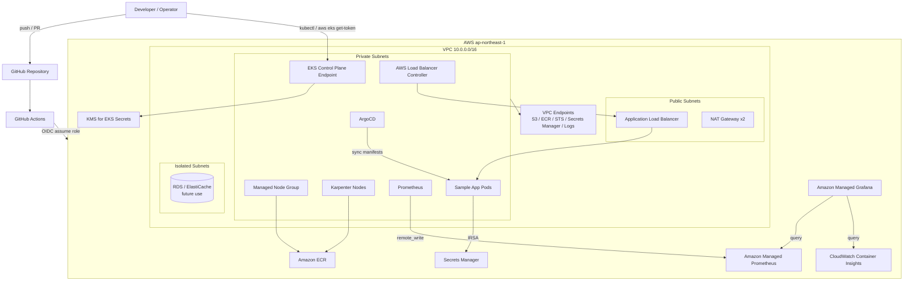
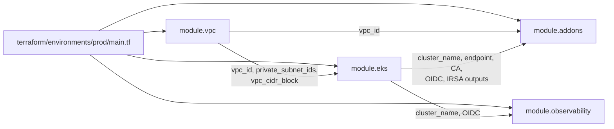
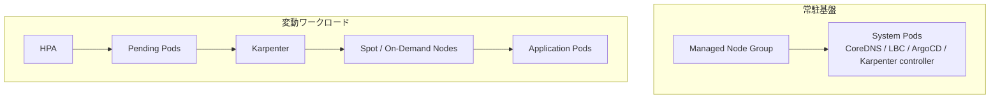
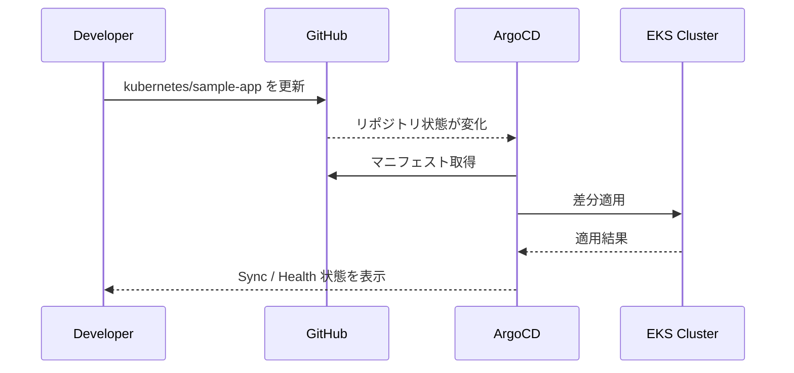
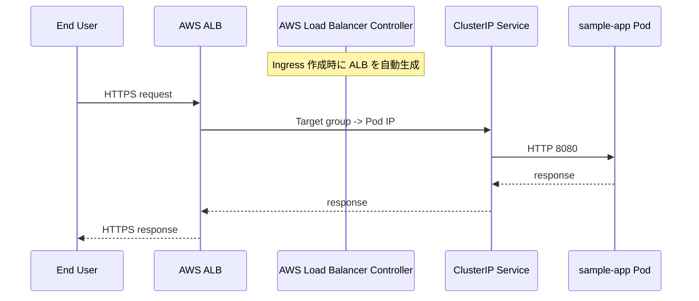
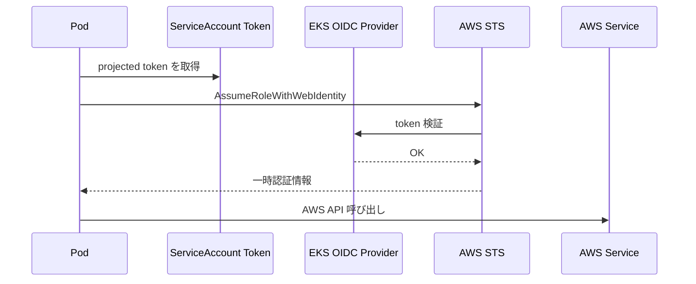
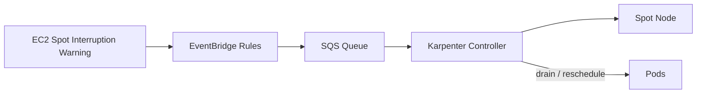
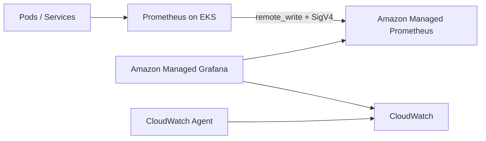

# ARCHITECTURE

このドキュメントは、`terraform-eks-production-platform` を「何を作るプロジェクトか」だけでなく、「どのファイルがどの責務を持ち、実際にどう連携して動くか」まで一気通貫で理解するための総合ドキュメントです。

既存の [`README.md`](/home/takuya/terraform-lab/terraform-eks-production-platform/README.md)、[`docs/architecture.md`](/home/takuya/terraform-lab/terraform-eks-production-platform/docs/architecture.md)、[`docs/network-design.md`](/home/takuya/terraform-lab/terraform-eks-production-platform/docs/network-design.md)、[`docs/cost-estimate.md`](/home/takuya/terraform-lab/terraform-eks-production-platform/docs/cost-estimate.md) を横断して、実装ベースで再構成しています。

## 1. プロジェクトの目的

このリポジトリは、AWS 上に本番運用を意識した EKS プラットフォームを Terraform で構築するための IaC プロジェクトです。

目指している状態は次の通りです。

- VPC から EKS、周辺アドオン、監視基盤までを Terraform で一貫管理する
- EKS ノードを Private Subnet に閉じ込め、ALB 経由でのみ公開する
- Kubernetes アプリ配備は ArgoCD による GitOps で行う
- アプリケーションのオートスケールは HPA + Karpenter の二段構えで行う
- 可観測性は CloudWatch + AMP + AMG の組み合わせで実現する
- Pod の AWS 権限は IRSA で最小権限化する

これは単なる EKS クラスター作成ではなく、ネットワーク、セキュリティ、配備、監視、運用まで含めた「EKS 本番基盤の雛形」を作るプロジェクトです。

## 2. 全体像

### 2.1 論理アーキテクチャ



### 2.2 ひとことで言うと

- `terraform/environments/prod` が全体の組み立て担当
- `terraform/modules/vpc` がネットワーク担当
- `terraform/modules/eks` がクラスター本体と AWS 側 IAM 担当
- `terraform/modules/addons` がクラスター内アドオン担当
- `terraform/modules/observability` が監視基盤担当
- `kubernetes/` が GitOps で流し込むアプリ定義担当

## 3. リポジトリ構成と責務

```text
terraform-eks-production-platform/
├── ARCHITECTURE.md                 # このドキュメント
├── README.md                       # クイックスタート
├── docs/
│   ├── architecture.md             # 概要設計
│   ├── network-design.md           # CIDR / NAT / VPCE 設計意図
│   └── cost-estimate.md            # 月額コスト試算
├── terraform/
│   ├── environments/prod/          # 本番環境の組み立て
│   └── modules/
│       ├── vpc/                    # VPC, subnet, route, NAT, VPCE
│       ├── eks/                    # EKS, node group, OIDC, IRSA, addons(AWS側)
│       ├── addons/                 # HelmでLBC / Karpenter / ArgoCD
│       └── observability/          # CloudWatch / AMP / AMG / Prometheus
├── kubernetes/
│   ├── argocd/applications/        # ArgoCD Application / AppProject
│   ├── karpenter/                  # NodePool / EC2NodeClass
│   └── sample-app/                 # Deployment / Service / Ingress / HPA / PDB
└── .github/workflows/              # Terraform plan/apply CI/CD
```

## 4. Terraform の組み立て順

`terraform/environments/prod/main.tf` が 4 モジュールを順に呼び出します。



### 4.1 `module.vpc`

役割:

- VPC 作成
- Public / Private / Isolated の 3 層サブネット作成
- IGW, NAT Gateway, route table 作成
- ECR / STS / Secrets Manager / CloudWatch Logs / S3 向け VPC Endpoint 作成

重要な設計意図:

- Private に EKS ノードを閉じ込める
- Isolated を将来の RDS / ElastiCache 用に確保する
- NAT Gateway は AZ ごとに配置して単一障害点を避ける
- VPC Endpoint で NAT コストとインターネット露出を減らす

### 4.2 `module.eks`

役割:

- EKS クラスター作成
- Managed Node Group 作成
- KMS による Kubernetes Secret 暗号化
- OIDC Provider 作成
- `aws-auth` ConfigMap 作成
- Karpenter / LBC / ArgoCD / sample-app 用 IRSA ロール作成
- Karpenter の Spot interruption 用 SQS + EventBridge 作成
- EKS managed addon (`vpc-cni`, `kube-proxy`, `coredns`) 作成

重要な設計意図:

- API サーバーは public/private 両対応だが、`public_access_cidrs` で接続元制限する
- Managed Node Group は常駐のシステム基盤
- アプリ増減は Karpenter に寄せる
- IAM は用途別に IRSA 分離する

### 4.3 `module.addons`

役割:

- Helm で AWS Load Balancer Controller を導入
- Helm で Karpenter を導入
- Helm で ArgoCD を導入
- ArgoCD admin パスワードを Secrets Manager に保存

重要な設計意図:

- LBC が Ingress から ALB を自動生成する
- Karpenter は SQS interruption queue を見て Spot ノード中断に備える
- ArgoCD は ClusterIP + ALB Ingress の構成で公開する

### 4.4 `module.observability`

役割:

- CloudWatch Container Insights を EKS addon で有効化
- AMP ワークスペース作成
- Prometheus を Helm で導入し AMP へ remote_write
- AMG ワークスペース作成

重要な設計意図:

- スクレイプはクラスター内 Prometheus
- 長期保存は AMP
- ダッシュボードは AMG
- AWS SSO を前提に Grafana 認証を寄せる

## 5. ネットワーク設計

### 5.1 サブネット設計

| レイヤー | CIDR | 主な配置先 | 役割 |
|---|---|---|---|
| Public | `10.0.0.0/24`, `10.0.1.0/24` | ALB, NAT Gateway | 外部入口と外向き通信の出口 |
| Private | `10.0.10.0/23`, `10.0.12.0/23` | EKS ノード, Pod | アプリ実行面 |
| Isolated | `10.0.20.0/24`, `10.0.21.0/24` | 将来の RDS / Cache | インターネット非接続のデータ層 |

### 5.2 通信の考え方

- インターネットから入る通信は ALB まで
- ALB から先は Kubernetes Ingress 経由で Pod に到達
- Pod から外向き AWS API はできるだけ VPC Endpoint を通す
- Node / Pod が一般インターネットに直接露出しないようにする

### 5.3 VPC Endpoint の意味

このプロジェクトでは次の Endpoint が重要です。

- `S3`: ECR レイヤー取得の実体
- `ECR API / ECR DKR`: イメージ認証と pull
- `STS`: IRSA の `AssumeRoleWithWebIdentity`
- `Secrets Manager`: Pod からのシークレット取得
- `CloudWatch Logs`: Container Insights の送信

つまり、Private サブネットの EKS が AWS サービスを使うための主要経路が VPCE です。

## 6. Kubernetes 実行基盤

### 6.1 EKS クラスター

クラスターの中核は [`terraform/modules/eks/main.tf`](/home/takuya/terraform-lab/terraform-eks-production-platform/terraform/modules/eks/main.tf) です。

特徴:

- Kubernetes バージョンは `1.29`
- Control Plane ログは `api`, `audit`, `authenticator`, `controllerManager`, `scheduler` を有効化
- Kubernetes Secret は KMS で暗号化
- endpoint public access を残しつつ CIDR 制限を強制

### 6.2 Managed Node Group と Karpenter の役割分担



考え方:

- Managed Node Group は「クラスターを最低限生かしておく土台」
- Karpenter は「アプリ負荷に応じた追加キャパシティ」

この分離により、Karpenter 自身が動くための足場を Managed Node Group 側に確保できます。

### 6.3 Karpenter のスケーリング設計

[`kubernetes/karpenter/node-pool.yaml`](/home/takuya/terraform-lab/terraform-eks-production-platform/kubernetes/karpenter/node-pool.yaml) では次を定義しています。

- `EC2NodeClass`
  - `amiFamily: Bottlerocket`
  - Private Subnet をタグ検索
  - Karpenter 用 SG をタグ検索
  - Karpenter 専用 Instance Profile を利用
  - ルートボリューム暗号化
  - IMDSv2 強制
- `NodePool`
  - instance family は `c5`, `m5`, `r5`
  - capacity type は `spot`, `on-demand`
  - `consolidationPolicy: WhenUnderutilized`
  - `consolidateAfter: 30m`
  - CPU / Memory 上限で暴走を防止

要するに、コストは Spot 優先で抑えつつ、枯渇時は On-Demand に逃がす設計です。

## 7. GitOps とアプリ配備

### 7.1 ArgoCD の役割

ArgoCD は Git リポジトリの内容をクラスターに同期するデプロイコントローラーです。

このリポジトリでは:

- Terraform が ArgoCD 自体をインストールする
- ArgoCD Application が `kubernetes/sample-app` を同期する
- 以後のアプリ変更は Git への commit が起点になる

### 7.2 GitOps フロー



### 7.3 sample-app の構成

[`kubernetes/sample-app/deployment.yaml`](/home/takuya/terraform-lab/terraform-eks-production-platform/kubernetes/sample-app/deployment.yaml) と [`kubernetes/sample-app/service.yaml`](/home/takuya/terraform-lab/terraform-eks-production-platform/kubernetes/sample-app/service.yaml) には、学習用ながら本番寄りのベストプラクティスが入っています。

- ServiceAccount に IRSA ロールをアノテーション
- `runAsNonRoot`, `seccompProfile`, `readOnlyRootFilesystem`
- `replicas: 2`
- PodAntiAffinity
- `livenessProbe` / `readinessProbe`
- `PDB`
- `HPA`
- Ingress は ALB + HTTPS リダイレクト前提

これは「EKS 上で安全に公開アプリを載せる最小構成の見本」という位置づけです。

## 8. リクエスト処理の流れ



ポイント:

- 外部公開の責任は ALB
- Kubernetes Service は内部ルーティング
- Pod は直接外部公開しない
- LBC が AWS リソース作成を肩代わりする

## 9. IAM / IRSA 設計

### 9.1 なぜ IRSA を使うのか

ノード IAM ロールを Pod 全体で共有すると、どの Pod も同じ AWS 権限を持ってしまいます。  
このプロジェクトは IRSA を使い、ServiceAccount ごとに IAM ロールを結びつけています。

### 9.2 このリポジトリで定義されている主な IRSA ロール

| 用途 | ServiceAccount | 主な権限 |
|---|---|---|
| Karpenter | `karpenter/karpenter` | EC2 起動/終了, SQS 受信, `iam:PassRole` |
| AWS Load Balancer Controller | `kube-system/aws-load-balancer-controller` | ALB/NLB 管理 |
| ArgoCD | `argocd/argocd-server` | S3 読み取り |
| sample-app | `sample-app/sample-app` | Secrets Manager 読み取り, KMS decrypt |
| CloudWatch Agent | `amazon-cloudwatch/cloudwatch-agent` | CloudWatch 送信 |
| Prometheus | `monitoring/prometheus-server` | AMP remote_write |

### 9.3 IRSA の流れ



### 9.4 Karpenter の Spot 中断処理

これはこのプロジェクトの理解ポイントのひとつです。



EC2 の Spot interruption warning を EventBridge で受け、SQS 経由で Karpenter が検知し、ノードドレインを行う設計です。

## 10. 可観測性

### 10.1 監視スタックの役割分担

| レイヤー | 役割 |
|---|---|
| CloudWatch Container Insights | ノード / Pod / ログの AWS ネイティブ監視 |
| Prometheus | クラスターメトリクス収集 |
| Amazon Managed Prometheus | 長期保存とマネージド運用 |
| Amazon Managed Grafana | ダッシュボードと可視化 |

### 10.2 メトリクスの流れ



### 10.3 実装上の特徴

- Prometheus は EKS 上で動くがローカル保持は `2h`
- 長期保存は AMP に逃がす
- Grafana はセルフホストせず AMG を利用
- Container Insights は EKS addon で管理

## 11. CI/CD と運用フロー

### 11.1 Terraform 側

`.github/workflows/terraform-plan.yml` と `.github/workflows/terraform-apply.yml` が用意されています。

流れ:

1. PR 時に `terraform plan`
2. `fmt` / `validate` / `plan` を実行
3. 結果を PR コメントに投稿
4. `main` 反映時に `terraform apply`

認証は GitHub Actions OIDC を使うため、長期 AWS アクセスキーは不要です。

### 11.2 Kubernetes 側

Terraform apply が終わると ArgoCD 自体がクラスターに入ります。  
その後は `kubernetes/` 配下の変更が ArgoCD によって同期されるため、Terraform と Kubernetes Manifest の責務が分かれています。

### 11.3 重要な境界線

- Terraform は「基盤とプラットフォーム部品」を作る
- ArgoCD は「アプリケーションマニフェスト」を配る
- HPA は「Pod 数」を増減する
- Karpenter は「Node 数 / Node 種別」を増減する

この責務分離を理解すると、障害時の切り分けがしやすくなります。

## 12. セキュリティ設計の要点

このプロジェクトの防御線は大きく 5 つです。

### 12.1 ネットワーク分離

- Public / Private / Isolated の三層分離
- ノードを Public に置かない
- DB 想定の Isolated を先に確保

### 12.2 IAM の最小権限

- Pod ごとに IRSA 分離
- ArgoCD は S3 read only
- sample-app は Secret path prefix に限定

### 12.3 データ暗号化

- EKS Secret は KMS 暗号化
- Node volume は EBS 暗号化
- ArgoCD admin password は Secrets Manager 格納

### 12.4 ノード / コンテナ hardening

- IMDSv2 強制
- Bottlerocket 採用
- `runAsNonRoot`
- `readOnlyRootFilesystem`
- `allowPrivilegeEscalation: false`
- `capabilities.drop: [ALL]`

### 12.5 認証のモダン化

- GitHub Actions は OIDC
- Grafana は AWS SSO
- EKS への CLI 接続は `aws eks get-token`

## 13. このリポジトリで特に押さえるべき設計判断

### 13.1 Managed Node Group + Karpenter の併用

完全に Karpenter だけに寄せず、まず常駐ノードを置いています。  
これは「Karpenter 自身やシステム Pod の実行基盤を安定させる」ための判断です。

### 13.2 Prometheus を消していない理由

AMP は保存先であって、スクレイパーではありません。  
そのため EKS 内に Prometheus が必要です。このプロジェクトはその役割分担を明確に実装しています。

### 13.3 ArgoCD を Terraform で入れる理由

ArgoCD の導入手順自体を手動化しないためです。  
“GitOps ツールをどう入れたのか” まで IaC 化しておくことで、再現性が上がります。

### 13.4 VPCE を多めに張っている理由

Private EKS では AWS API への依存が多く、NAT にすべて流すとコストも露出も増えます。  
このプロジェクトは ECR / STS / Secrets Manager / Logs を VPCE に逃がすことで、その問題を先回りして解消しています。

## 14. 現在の実装で前提になっている未設定項目

このリポジトリは完成度が高い一方で、いくつか「利用時に置き換える前提」の値があります。

### 14.1 Terraform 変数 / backend

- `terraform/environments/prod/backend.tf`
  - `REPLACE_WITH_ACCOUNT_ID`
- `terraform/environments/prod/terraform.tfvars.example`
  - 実運用値の投入が必要

### 14.2 Kubernetes マニフェスト

- `kubernetes/sample-app/deployment.yaml`
  - `REPLACE_ACCOUNT_ID`
- `kubernetes/sample-app/service.yaml`
  - 実ドメイン
  - ACM 証明書 ARN
- `kubernetes/argocd/applications/sample-app.yaml`
  - `YOUR_ORG`
  - `YOUR_REPO`

### 14.3 Grafana

- `terraform/modules/observability/main.tf` の `aws_grafana_role_association`
  - `user_ids = []` のため、SSO 管理者の紐付けは別途調整が必要

つまり、このリポジトリは「構造は揃っているが、アカウント固有値や組織固有値の差し込みはまだ必要」という状態です。

## 15. まず読むべきファイル順

初めて触る人には次の順番がおすすめです。

1. [`README.md`](/home/takuya/terraform-lab/terraform-eks-production-platform/README.md)
2. [`terraform/environments/prod/main.tf`](/home/takuya/terraform-lab/terraform-eks-production-platform/terraform/environments/prod/main.tf)
3. [`terraform/modules/vpc/main.tf`](/home/takuya/terraform-lab/terraform-eks-production-platform/terraform/modules/vpc/main.tf)
4. [`terraform/modules/eks/main.tf`](/home/takuya/terraform-lab/terraform-eks-production-platform/terraform/modules/eks/main.tf)
5. [`terraform/modules/eks/irsa.tf`](/home/takuya/terraform-lab/terraform-eks-production-platform/terraform/modules/eks/irsa.tf)
6. [`terraform/modules/addons/main.tf`](/home/takuya/terraform-lab/terraform-eks-production-platform/terraform/modules/addons/main.tf)
7. [`terraform/modules/observability/main.tf`](/home/takuya/terraform-lab/terraform-eks-production-platform/terraform/modules/observability/main.tf)
8. [`kubernetes/karpenter/node-pool.yaml`](/home/takuya/terraform-lab/terraform-eks-production-platform/kubernetes/karpenter/node-pool.yaml)
9. [`kubernetes/argocd/applications/sample-app.yaml`](/home/takuya/terraform-lab/terraform-eks-production-platform/kubernetes/argocd/applications/sample-app.yaml)
10. [`kubernetes/sample-app/deployment.yaml`](/home/takuya/terraform-lab/terraform-eks-production-platform/kubernetes/sample-app/deployment.yaml)

## 16. このプロジェクトを一文で説明すると

「AWS 上に、Private EKS・GitOps・Karpenter・IRSA・マネージド監視を組み合わせた、本番志向の Kubernetes プラットフォームを Terraform 中心で再現するプロジェクト」です。
