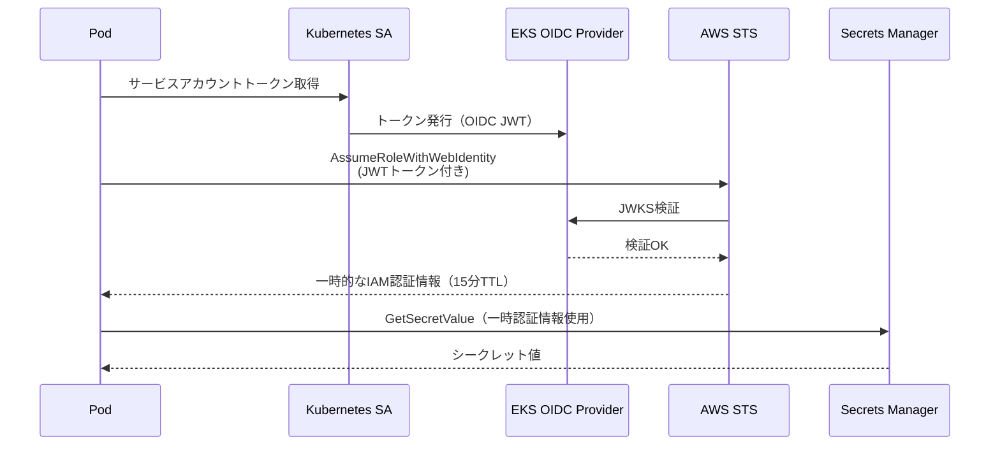

# アーキテクチャドキュメント

## システム全体構成図

```mermaid
graph TB
    subgraph Internet["インターネット"]
        User[ユーザー]
        GHActions[GitHub Actions\nCI/CD]
    end

    subgraph AWS["AWS ap-northeast-1"]
        subgraph VPC["VPC 10.0.0.0/16"]
            subgraph PublicSubnet["Public Subnet (10.0.0.0/24, 10.0.1.0/24)"]
                IGW[Internet Gateway]
                NAT[NAT Gateway × 2\nAZごと]
                ALB[Application\nLoad Balancer]
            end

            subgraph PrivateSubnet["Private Subnet (10.0.10.0/23, 10.0.12.0/23)"]
                subgraph EKS["EKS Cluster 1.29"]
                    subgraph SystemNS["kube-system / karpenter / argocd"]
                        LBC[AWS Load\nBalancer Controller]
                        Karpenter[Karpenter]
                        ArgoCD[ArgoCD]
                        CWAgent[CloudWatch\nContainer Insights]
                        Prometheus[Prometheus]
                    end

                    subgraph AppNS["sample-app"]
                        App1[App Pod 1]
                        App2[App Pod 2]
                    end
                end

                MNG[Managed\nNode Group\nx2]
                KarpenterNode[Karpenter\nNodes\n(Spot/OnDemand)]
            end

            subgraph IsolatedSubnet["Isolated Subnet (10.0.20.0/24, 10.0.21.0/24)"]
                RDS[(RDS\n将来拡張)]
                Cache[(ElastiCache\n将来拡張)]
            end

            subgraph VPCEndpoints["VPC Endpoints"]
                VPES3[S3 Gateway]
                VPECR[ECR API/DKR\nInterface]
                VPESM[Secrets Manager\nInterface]
                VPESTS[STS\nInterface]
                VPECW[CloudWatch Logs\nInterface]
            end
        end

        subgraph ManagedServices["AWSマネージドサービス"]
            ECR[Amazon ECR\nコンテナレジストリ]
            SecretsManager[Secrets Manager\n機密情報管理]
            KMS[KMS\n暗号化]
            CW[CloudWatch\nContainer Insights]
            AMP[Amazon Managed\nPrometheus]
            AMG[Amazon Managed\nGrafana]
        end
    end

    subgraph GitHub["GitHub"]
        GitRepo[Git Repository\nソースコード]
        Actions[GitHub Actions\nワークフロー]
    end

    User -->|HTTPS| ALB
    ALB -->|ターゲット転送| App1
    ALB -->|ターゲット転送| App2
    GHActions -->|OIDC + kubectl| EKS
    GitRepo -->|GitOps Sync| ArgoCD
    ArgoCD -->|マニフェスト適用| AppNS
    Karpenter -->|ノード起動| KarpenterNode
    CWAgent -->|メトリクス/ログ| CW
    Prometheus -->|Remote Write| AMP
    AMG -->|クエリ| AMP
    AMG -->|クエリ| CW
    App1 -->|IRSA| SecretsManager
    App2 -->|IRSA| SecretsManager
    ECR -->|イメージPull| PrivateSubnet
    VPECR -->|VPC内通信| ECR
    VPESTS -->|IRSA認証| ManagedServices
```

## レイヤー別アーキテクチャ説明

### 1. ネットワークレイヤー（VPC）

**3層ネットワーク設計の採用理由**

| レイヤー | 配置リソース | インターネットアクセス |
|---|---|---|
| Public | ALB, NAT Gateway | 双方向可能 |
| Private | EKS Node/Pod | NAT経由アウトバウンドのみ |
| Isolated | RDS, ElastiCache | 完全遮断 |

EKSノードをPrivateサブネットに配置することで、ノードが直接インターネットから攻撃されるリスクをなくす。Isolatedサブネットを別途設けることで、DBへのアクセスをネットワークレベルで制限できる。

### 2. コンピュートレイヤー（EKS）

**EKS 1.29 採用理由**
- AWS Fargateより自由度が高く、Karpenterとの組み合わせでコスト最適化できる
- セルフマネージドKubernetes（kubeadm等）より運用負荷が低い

**Karpenter vs Cluster Autoscaler**

| 観点 | Karpenter | Cluster Autoscaler |
|---|---|---|
| スケール速度 | 数十秒 | 数分 |
| スポット活用 | ネイティブ対応 | 限定的 |
| インスタンスタイプ | 動的選択 | 事前定義必要 |
| 設定複雑さ | 低 | 中 |

Karpenterを採用しスポットインスタンス活用でコストを最大70%削減する。

### 3. GitOpsレイヤー（ArgoCD）

**GitOps採用理由**
- Gitが唯一の真実の情報源となり環境の状態が常に明確
- PRレビューでKubernetesのデプロイ変更をコードレビューできる
- 誤った変更をgit revertで即座にロールバックできる

**ArgoCD vs Flux**

| 観点 | ArgoCD | Flux |
|---|---|---|
| UI | リッチなWeb UI | CLIベース |
| マルチクラスター | 容易 | 設定複雑 |
| 学習コスト | 中 | 低 |
| エコシステム | 豊富 | シンプル |

可視性とチームの運用効率を重視してArgoCDを採用。

### 4. 可観測性レイヤー

**3層の可観測性スタック**

```
ログ   : CloudWatch Container Insights → CloudWatch Logs
メトリクス: Prometheus → Amazon Managed Prometheus (AMP) → Amazon Managed Grafana (AMG)
トレース: (将来拡張: AWS X-Ray)
```

**マネージドサービスを使う理由**
- Prometheus/Grafanaサーバーの運用管理が不要
- ストレージの容量計画・バックアップが不要
- IAMベースのアクセス制御で統一管理できる

### 5. セキュリティレイヤー

**多層防御の実装**

1. **ネットワーク**: Private/Isolatedサブネットによるネットワーク分離
2. **認証**: IRSA（IAM Roles for Service Accounts）で最小権限を実現
3. **暗号化**: KMSによるEKS Secrets暗号化、EBSボリューム暗号化
4. **コンテナ**: IMDSv2強制、readOnlyRootFilesystem、runAsNonRoot
5. **CI/CD**: OIDC認証によりアクセスキー不要

## IRSA（IAM Roles for Service Accounts）アーキテクチャ



IRSAを用途別（Karpenter/LBC/ArgoCD/App）に分離することで、1つのコンポーネントが侵害されても他の権限を奪われない設計になっている。
