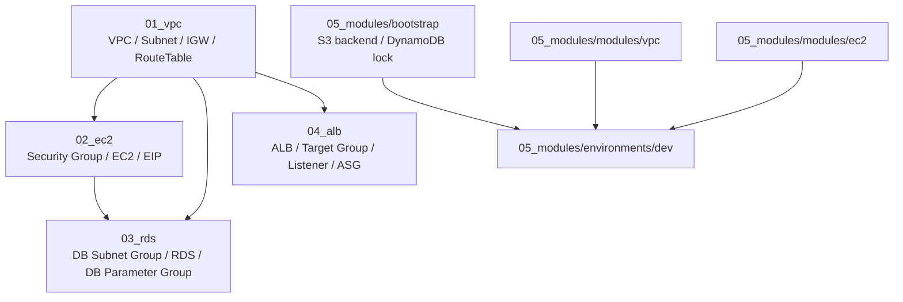
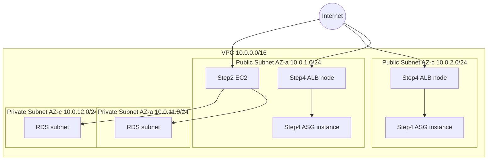
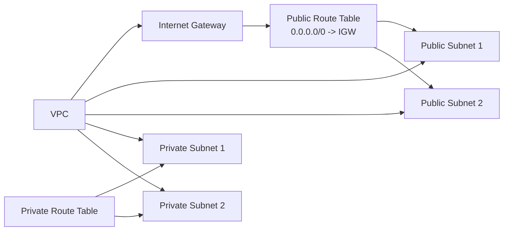
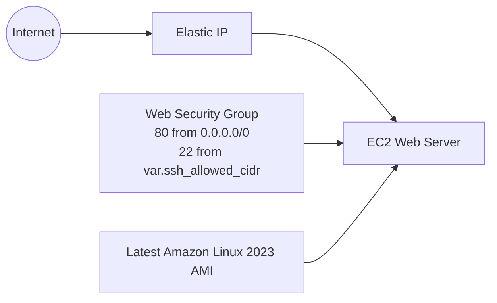
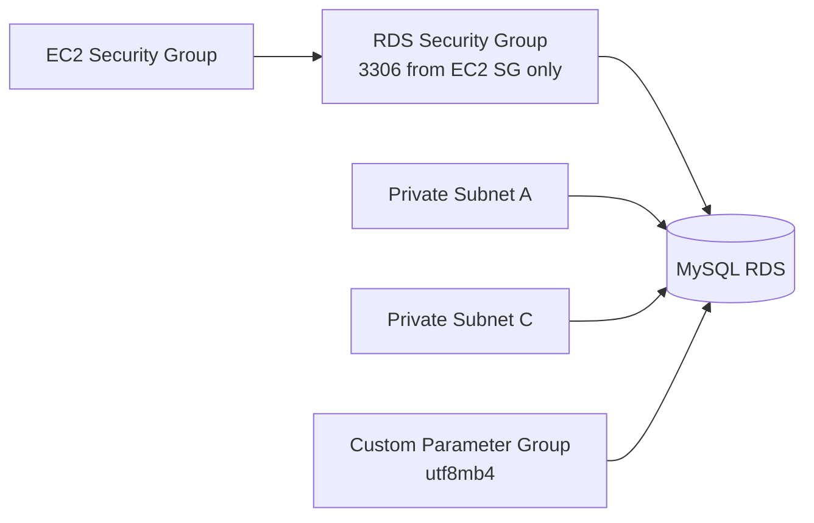
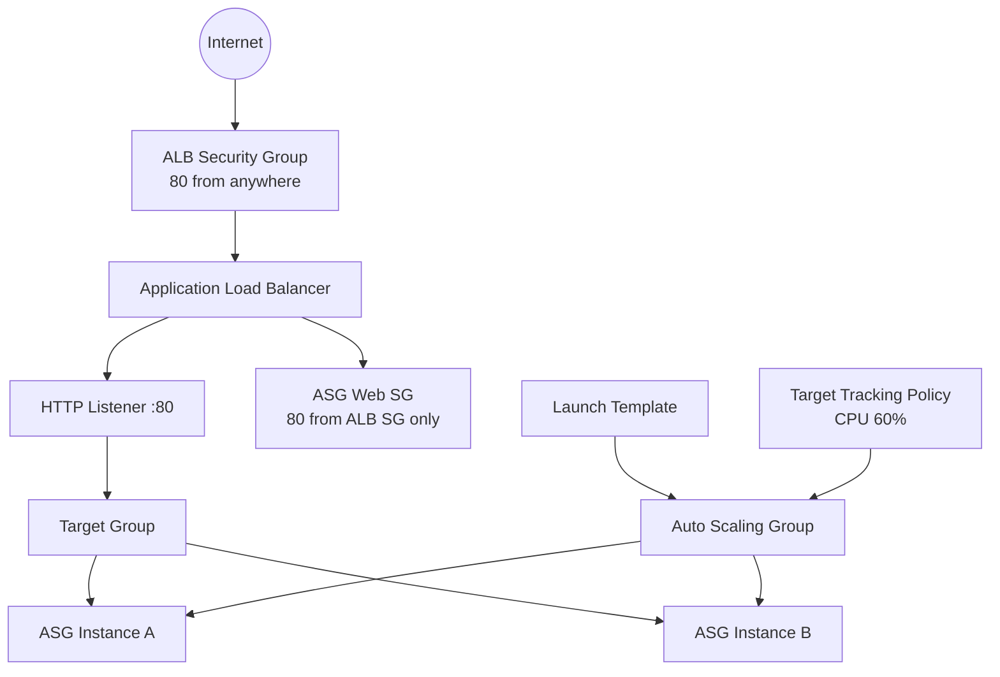
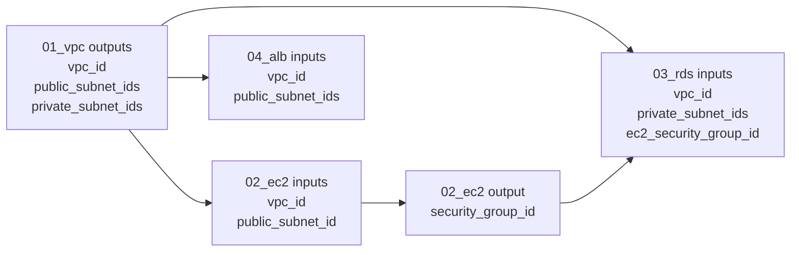
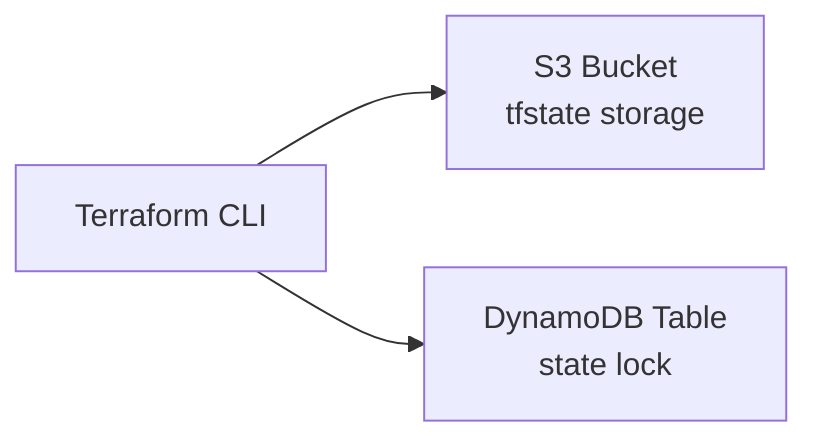
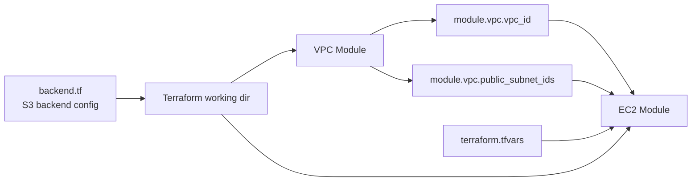

# ARCHITECTURE.md

## 1. このドキュメントの目的

このリポジトリ `terraform-handson` は、AWS インフラを Terraform で段階的に学ぶためのハンズオン集です。
単にリソースを作るだけでなく、次の 3 つを理解できるように設計されています。

1. AWS インフラの基本構成
2. Terraform の書き方と依存関係の扱い方
3. フラットな構成からモジュール構成へ発展させる考え方

README は進め方のガイドですが、この `ARCHITECTURE.md` は「プロジェクト全体を深く理解するための解説書」です。
実際のコマンドを追いながらハンズオンを進める場合は [README.md](./README.md) を併読してください。

---

## 2. 全体像

このプロジェクトは 5 段階で構成されています。

| Step | ディレクトリ | 主題 | 役割 |
|---|---|---|---|
| 1 | `01_vpc/` | VPC | 以降の全 Step の土台となるネットワークを作る |
| 2 | `02_ec2/` | EC2 | Web サーバーを 1 台構築し、UserData と EIP を学ぶ |
| 3 | `03_rds/` | RDS | EC2 からのみ接続できるプライベート DB を作る |
| 4 | `04_alb/` | ALB + ASG | 負荷分散とスケーリングの基本を学ぶ |
| 5 | `05_modules/` | モジュール化 | Step 1〜4 の設計を再利用可能な Terraform モジュールへ進化させる |

Step 1〜4 は「学習しやすいフラット構成」、Step 5 は「実務に近いモジュール構成」です。

---

## 3. 学習フロー全体図



### ポイント

- Step 1〜4 はそれぞれ独立した tfstate を持ちます。
- そのため、前 Step の `output` を次 Step の `variable` に渡して接続します。
- Step 5 では同じ `main.tf` の中でモジュール同士を接続するため、シェル経由の値受け渡しが不要になります。

---

## 4. リポジトリ構造

```text
terraform-handson/
├── README.md
├── ARCHITECTURE.md
├── CLAUDE.md
├── .gitignore
├── prompts/
│   ├── 01_vpc.md
│   ├── 02_ec2.md
│   ├── 03_rds.md
│   └── 04_alb.md
├── 01_vpc/
├── 02_ec2/
├── 03_rds/
├── 04_alb/
└── 05_modules/
    ├── bootstrap/
    ├── modules/
    │   ├── vpc/
    │   └── ec2/
    └── environments/
        └── dev/
```

### 補助ファイルの役割

- `README.md`
  プロジェクトの入口。実行順序、前提条件、コスト目安を案内します。
- `CLAUDE.md`
  コーディング規約や Terraform 学習用ルールをまとめています。
- `prompts/`
  各 Step を Claude Code と進めるための教材です。
- `.gitignore`
  `tfstate`、`tfvars`、`.terraform/` などの秘匿・生成物を Git 管理から外します。

---

## 5. AWS 構成の最終イメージ

Step 1〜4 を通したとき、学習対象としては次のような 3 層に近い構成になります。



### この構成で学べること

- パブリックサブネットとプライベートサブネットの違い
- 単体サーバー公開と ALB 経由公開の違い
- DB をインターネット非公開に保つネットワーク設計
- 複数 AZ による可用性の考え方

---

## 6. Step 1〜4 の設計思想

Step 1〜4 の大きな特徴は、各 Step が独立していて、学習単位が明確なことです。

### なぜ独立ディレクトリに分かれているのか

- 初学者が「今どの概念を学んでいるか」を見失いにくい
- 各 Step の `main.tf` が小さく保たれ、読みやすい
- `terraform plan` の差分がその Step の学習対象に集中する
- 逆に、実務観点では tfstate が分かれすぎていて、値の受け渡しが手作業になる

この「学習しやすいが運用では少し不便」という構成を、Step 5 で改善していくのが全体のストーリーです。

---

## 7. Step 1: `01_vpc/` のアーキテクチャ

### 役割

この Step は全インフラの土台となるネットワークを構築します。

### 作成する主なリソース

- `aws_vpc.main`
- `aws_internet_gateway.main`
- `aws_subnet.public[*]`
- `aws_subnet.private[*]`
- `aws_route_table.public`
- `aws_route_table.private`
- `aws_route_table_association.public[*]`
- `aws_route_table_association.private[*]`

### 構成図



### 実装上のポイント

- `data "aws_availability_zones"` を使い、利用可能な AZ を動的取得しています。
- パブリック/プライベートのサブネットは `count` で複数生成しています。
- パブリックサブネットには `map_public_ip_on_launch = true` を設定しています。
- プライベートルートテーブルにはデフォルトルートがなく、直接インターネットへ出ません。
- NAT Gateway をあえて作らず、コストと理解負荷を抑えています。

### 後続 Step への出力

- `vpc_id`
- `public_subnet_ids`
- `private_subnet_ids`

この出力が Step 2〜4 の接続点です。

---

## 8. Step 2: `02_ec2/` のアーキテクチャ

### 役割

VPC 上に Web サーバーを 1 台立て、セキュリティグループ、AMI の data source、UserData、自動初期化、EIP を学びます。

### 依存入力

- `vpc_id` は `01_vpc` から受け取る
- `public_subnet_id` は `01_vpc` のパブリックサブネット先頭要素を受け取る

### 作成する主なリソース

- `aws_security_group.web`
- `aws_instance.web`
- `aws_eip.web`
- `data.aws_ami.amazon_linux_2023`

### 構成図



### 実装上のポイント

- AMI をハードコードせず `data "aws_ami"` で最新取得します。
- UserData で Apache を自動インストールし、HTML を配置します。
- EIP を付与することで、再作成してもアクセス先 IP を固定化しやすくしています。
- SSH の許可 CIDR を変数化し、最小権限の考え方を学べる構造です。

### この Step の学習テーマ

- インフラ上の「1 台のサーバーを公開する」とは何か
- インスタンス初期化を手作業ではなくコード化するとは何か
- セキュリティグループが実質的な仮想ファイアウォールであること

### 後続 Step への出力

- `security_group_id`

この出力は Step 3 で「EC2 から来た通信だけ RDS に許可する」ために使われます。

---

## 9. Step 3: `03_rds/` のアーキテクチャ

### 役割

プライベートサブネット内に MySQL RDS を構築し、アプリケーションサーバーからのみ接続可能な DB 構成を学びます。

### 依存入力

- `vpc_id` は `01_vpc` から受け取る
- `private_subnet_ids` は `01_vpc` から受け取る
- `ec2_security_group_id` は `02_ec2` から受け取る

### 作成する主なリソース

- `aws_db_subnet_group.main`
- `aws_security_group.rds`
- `aws_db_parameter_group.mysql`
- `aws_db_instance.main`

### 構成図



### 実装上のポイント

- DB はパブリックサブネットではなくプライベートサブネットに配置されます。
- RDS への接続許可は CIDR ではなく `security_groups = [var.ec2_security_group_id]` で絞っています。
- `db_password` は `sensitive = true` で扱われ、plan の表示でマスクされます。
- 文字コードを `utf8mb4` にしたカスタムパラメータグループを使っています。
- ハンズオン用途のため `multi_az = false`、`backup_retention_period = 0` など、コスト重視の設定です。

### この Step の学習テーマ

- Web 層と DB 層の分離
- パブリック公開しないサービスの守り方
- Terraform における秘密情報の扱い

### 出力

- `db_endpoint`
- `db_host`
- `db_port`
- `db_name`
- `db_username`

---

## 10. Step 4: `04_alb/` のアーキテクチャ

### 役割

1 台公開から進んで、ALB を経由した複数インスタンス構成と Auto Scaling の基本を学びます。

### 依存入力

- `vpc_id` は `01_vpc` から受け取る
- `public_subnet_ids` は `01_vpc` から受け取る

### 作成する主なリソース

- `aws_security_group.alb`
- `aws_security_group.asg_web`
- `aws_lb.main`
- `aws_lb_target_group.web`
- `aws_lb_listener.http`
- `aws_launch_template.web`
- `aws_autoscaling_group.web`
- `aws_autoscaling_policy.cpu_tracking`

### 構成図



### 実装上のポイント

- ALB 用 SG と EC2 用 SG を分離し、直接アクセスを防いでいます。
- ALB は複数パブリックサブネットに配置され、AZ 冗長化を体験できます。
- Target Group のヘルスチェックで死活監視の概念を学べます。
- Launch Template に UserData を持たせ、ASG が起動する EC2 に共通設定を配布します。
- ASG は `health_check_type = "ELB"` を使い、ALB 側の観測結果で異常判定します。
- CPU 60% を目安にした Target Tracking Scaling Policy でオートスケーリングの雰囲気を学べます。

### この Step の学習テーマ

- 単体サーバー構成と冗長構成の違い
- L4/L7 のうち、ALB がアプリケーションレイヤーで振り分ける存在であること
- Auto Scaling が「サーバーを手で増やす」のではなく「条件で増減させる」考え方であること

### 出力

- `alb_dns_name`
- `web_url`
- `alb_arn`
- `target_group_arn`
- `asg_name`

---

## 11. Step 1〜4 の値受け渡し構造

Step 1〜4 は tfstate が分かれているため、出力値を次の Step に明示的に渡します。



### この方式のメリット

- 学習単位が明確
- 依存関係をあえて意識できる

### この方式の弱み

- シェル変数や手動コマンドに依存する
- 型安全性が弱い
- 複数環境運用には向かない

この弱みを解消するのが Step 5 です。

---

## 12. Step 5: `05_modules/` の位置づけ

Step 5 は、このリポジトリにおける「学習の後半戦」であり、実務寄りの Terraform 設計に踏み込む部分です。

ここでは Step 1〜4 の知識を前提にして、以下を学びます。

- モジュール化
- interface としての `variables.tf` / `outputs.tf`
- `for_each` を map で安全に扱う設計
- `dynamic` ブロック
- `lifecycle`
- S3 + DynamoDB によるリモートバックエンド

---

## 13. `05_modules/bootstrap/` のアーキテクチャ

### 役割

Terraform state をローカルではなく AWS 上で安全に管理するための基盤を作ります。

### 作成する主なリソース

- `aws_s3_bucket.tfstate`
- `aws_s3_bucket_versioning.tfstate`
- `aws_s3_bucket_server_side_encryption_configuration.tfstate`
- `aws_s3_bucket_public_access_block.tfstate`
- `aws_dynamodb_table.tfstate_lock`

### 構成図



### 実装上のポイント

- S3 バケット名は AWS アカウント ID を含み、グローバル一意性を確保しています。
- バケットはバージョニング有効で、state の復旧性を高めています。
- SSE-S3 による暗号化を有効にしています。
- Public Access Block により誤公開を防ぎます。
- DynamoDB のロックで、複数人同時 apply による state 破損を防ぎます。
- `prevent_destroy = true` で tfstate 格納先の誤削除を防ぎます。

---

## 14. `05_modules/modules/vpc/` のアーキテクチャ

### 役割

VPC を「再利用できる部品」として切り出したモジュールです。

### インターフェース

入力:

- `prefix`
- `env`
- `vpc_cidr`
- `public_subnets`
- `private_subnets`
- `tags`

出力:

- `vpc_id`
- `public_subnet_ids`
- `private_subnet_ids`
- `public_subnet_map`

### 内部実装の特徴

- Step 1 の `count` ベース構成を、Step 5 では `for_each` + `map(string)` に進化させています。
- サブネットを AZ 名で管理するため、インデックスずれによる意図しない再作成リスクを減らせます。
- `locals.tf` に命名規則と共通タグが切り出され、モジュール内部の責務が整理されています。

### なぜ `map` が重要か

`public_subnets = { "ap-northeast-1a" = "10.0.1.0/24" }` のように渡すことで、Terraform はリソースを添字ではなくキーで追跡できます。
これにより、AZ の追加・削除・並び替えに強い構成になります。

---

## 15. `05_modules/modules/ec2/` のアーキテクチャ

### 役割

EC2、Security Group、EIP を 1 つの再利用可能モジュールとして提供します。

### インターフェース

入力:

- `prefix`
- `env`
- `vpc_id`
- `subnet_id`
- `instance_type`
- `ingress_rules`
- `user_data`
- `tags`

出力:

- `instance_id`
- `public_ip`
- `security_group_id`

### 内部実装の特徴

- `data.aws_ami.amazon_linux` で最新 AMI を動的取得
- `dynamic "ingress"` で SG ルールを入力変数から展開
- `lifecycle.ignore_changes = [ami]` で AMI 更新だけでは不用意に再作成しない
- `lifecycle.create_before_destroy = true` で置き換え時の停止リスクを抑える

### `dynamic` が解決していること

Step 2 では HTTP と SSH を `main.tf` に固定で書いていました。
このモジュールでは、呼び出し側がルールを渡すだけで SG の中身を変えられます。
つまり「部品の汎用性」を大きく高めています。

---

## 16. `05_modules/environments/dev/` のアーキテクチャ

### 役割

モジュールを組み合わせて、実際の `dev` 環境を定義する場所です。

### 位置づけ

- `modules/` は部品
- `environments/dev/` はその部品の組み立てレシピ

### 構成図



### 実装上のポイント

- `module "vpc"` と `module "ec2"` を 1 つの `main.tf` 内で接続しています。
- `module.ec2` は `module.vpc.vpc_id` と `module.vpc.public_subnet_ids[0]` を直接参照します。
- これにより Terraform 自身が依存関係を解決し、作成順序を自動制御します。
- `backend.tf` は `bootstrap` で作った S3 バケットと DynamoDB テーブルに接続する設定です。

### Step 1〜4 からの改善点

- 手動の値受け渡しが不要
- 型が Terraform の中で守られる
- 構成の再利用性が高い
- `dev` 以外の `stg` `prod` に展開しやすい

---

## 17. 主要な Terraform パターンまとめ

このリポジトリは、単に AWS リソースを作るだけでなく、Terraform の書き方を段階的に教える教材になっています。

| パターン | 使われている場所 | 意味 |
|---|---|---|
| `locals` | ほぼ全 Step | 共通タグや命名規則を一元化する |
| `data` source | `01_vpc`, `02_ec2`, `04_alb`, `05_modules` | AWS の既存情報や最新 AMI を動的取得する |
| `count` | `01_vpc` | 初学者向けの複数リソース生成 |
| `for_each` | `05_modules/modules/vpc` | 安全で実務向きな複数リソース生成 |
| `dynamic` | `05_modules/modules/ec2` | ブロック自体を変数から生成する |
| `lifecycle` | `04_alb`, `05_modules/modules/ec2`, `05_modules/bootstrap` | 再作成順序や破壊防止を制御する |
| `output` | 全 Step | 後続構成や利用者に値を公開する |

---

## 18. セキュリティ設計の意図

このプロジェクトは学習用ですが、いくつかの重要なセキュリティ原則を自然に学べるように作られています。

### 守っていること

- RDS はプライベートサブネットに置く
- RDS への許可は CIDR ではなく EC2 の SG をソースにする
- tfstate 保存先 S3 は暗号化・バージョニング・パブリックアクセス遮断を有効化する
- `terraform.tfvars` を Git に含めない
- SSH 許可元 CIDR を変数化し、狭められるようにしている

### あえて簡略化していること

- Step 2 の SSH はデフォルトで `0.0.0.0/0`
- NAT Gateway は未導入
- RDS は Single-AZ
- バックアップ保持と削除保護はハンズオン向けに弱め

これは実務ベストプラクティスをすべて入れるのではなく、学習コストと AWS 利用コストのバランスを取るためです。

---

## 19. コスト設計の意図

このプロジェクトは「初級〜中級者が自分の AWS アカウントで触りやすいこと」を重視しています。

### コストを抑える工夫

- EC2 は `t3.micro`
- RDS は `db.t3.micro`
- RDS は Single-AZ
- NAT Gateway を使わない
- ALB は必要な Step にだけ登場する
- バックアップ保持や最終スナップショットを簡略化している

### 注意点

- ALB は時間課金があるため、放置コストが出やすい
- EIP は未アタッチ状態で課金が発生しうる
- ハンズオン終了後の削除が前提の設計になっている

---

## 20. 運用上の読み方

このプロジェクトを理解するときは、ファイルを次の順で読むと全体像を掴みやすいです。

1. `README.md`
2. `01_vpc/main.tf`
3. `02_ec2/main.tf`
4. `03_rds/main.tf`
5. `04_alb/main.tf`
6. `05_modules/README.md`
7. `05_modules/modules/vpc/*`
8. `05_modules/modules/ec2/*`
9. `05_modules/environments/dev/*`
10. `05_modules/bootstrap/*`

### 読み方のコツ

- まず「どの AWS リソースを作っているか」を見る
- 次に「それがどの変数を受け取っているか」を `variables.tf` で確認する
- 最後に「何を外へ返しているか」を `outputs.tf` で確認する

この順序で追うと、Terraform を「巨大な設定ファイル」ではなく「入力と出力を持つ設計物」として理解しやすくなります。

実際に手を動かす段階では、同じ順序に対応した実行コマンドを [README.md](./README.md) の `ハンズオン実行手順` で確認できます。

---

## 21. このプロジェクトの本質

このリポジトリの本質は、AWS ハンズオンであると同時に、Terraform 設計の進化を体験する教材であることです。

### 前半で学ぶこと

- VPC、EC2、RDS、ALB、ASG という AWS の基本部品
- Terraform の基本構文
- output を使った依存関係の受け渡し

### 後半で学ぶこと

- モジュール設計
- 再利用可能な interface の作り方
- リモートバックエンドによる実務的な state 管理
- 安全な `for_each`、`dynamic`、`lifecycle` の使いどころ

言い換えると、このプロジェクトは次の流れで理解が深まるように設計されています。

```text
AWS リソースを知る
  ↓
Terraform で 1 つずつ書けるようになる
  ↓
複数 Step をつないで構成として理解する
  ↓
モジュール化して再利用・運用できる形に進化させる
```

---

## 22. 今後このリポジトリを拡張するなら

発展方向として自然なのは次のようなものです。

- `05_modules/modules/rds` を追加し、RDS もモジュール化する
- `05_modules/modules/alb` を追加し、ALB/ASG を再利用可能にする
- `environments/stg` `environments/prod` を追加する
- NAT Gateway を導入して private subnet からの外向き通信を可能にする
- Systems Manager Session Manager に切り替え、SSH 鍵依存を下げる
- RDS を Multi-AZ、バックアップ有効、削除保護有効へ拡張する
- GitHub Actions で `terraform fmt` / `validate` / `plan` を自動化する

---

## 23. まとめ

`terraform-handson` は、単発の Terraform サンプル集ではありません。
VPC から始めて、EC2、RDS、ALB/ASG へ進み、最後にモジュール設計とリモートバックエンドへ到達する、段階的な学習アーキテクチャになっています。

特に重要なのは次の 3 点です。

1. Step 1〜4 は「理解しやすさ優先」のフラット構成
2. Step 5 は「再利用性と運用性」を意識したモジュール構成
3. 全体として、AWS の基礎と Terraform 設計の両方を同時に学べる

この視点で読むと、各 `.tf` ファイルが単なる設定ではなく、学習順序に沿って意図的に配置された設計教材であることが見えてきます。
