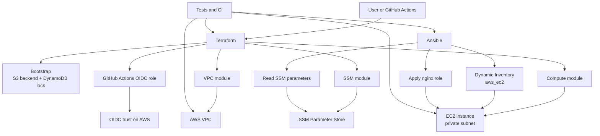
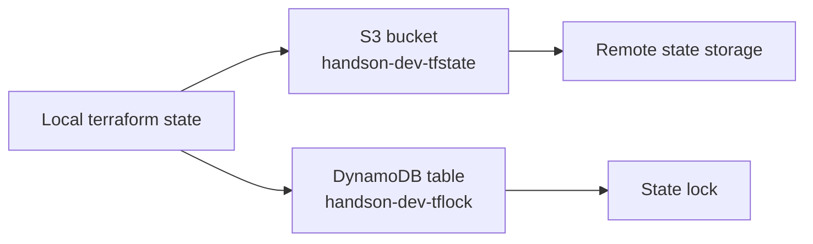
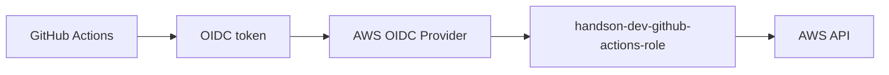
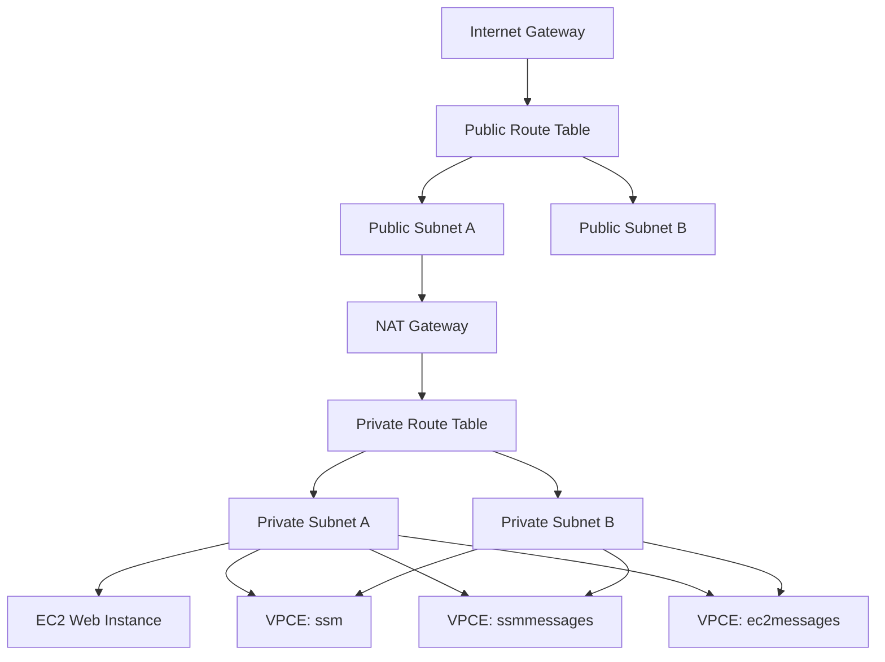
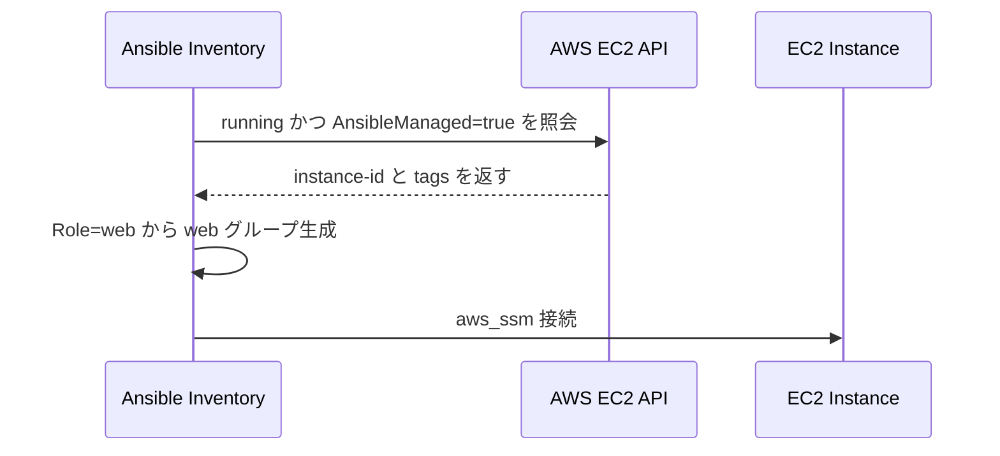
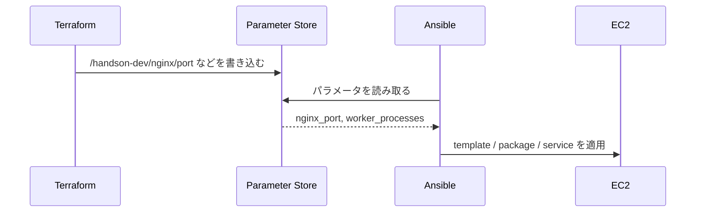
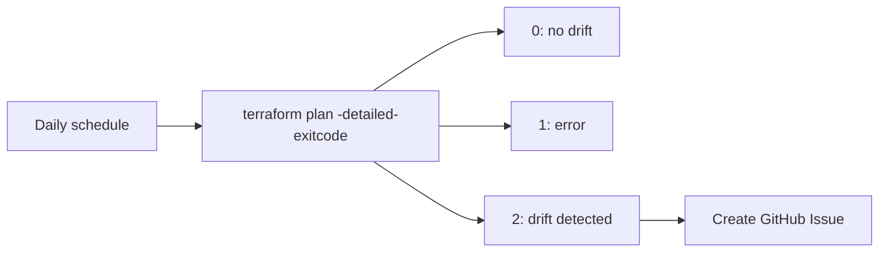
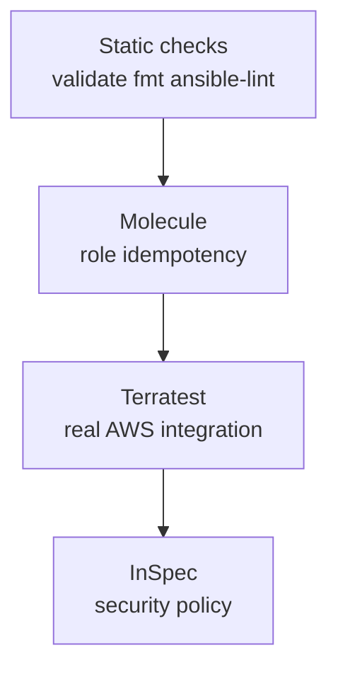
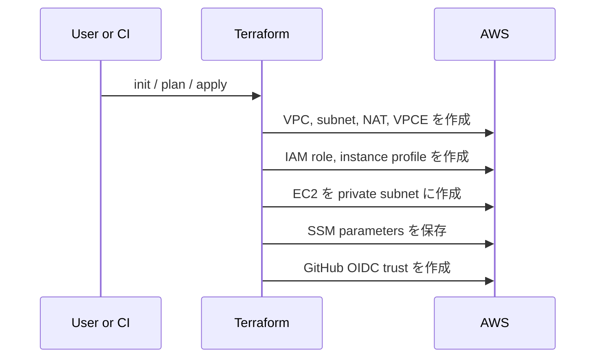
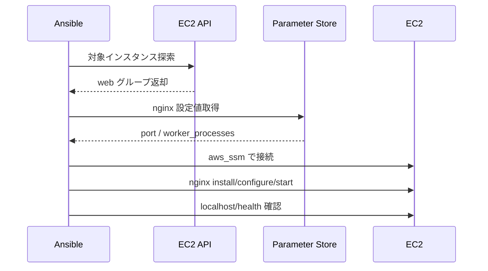

# ARCHITECTURE

## 1. このプロジェクトは何を作るのか

このリポジトリは、Terraform で AWS インフラを作り、Ansible で EC2 内部の nginx を構成し、GitHub Actions と各種テストで継続運用するための学習兼リファレンス実装です。

主題は単なる `nginx on EC2` ではなく、次の設計を一続きで理解できるようにすることです。

- Terraform と Ansible の責務分界
- SSH ではなく SSM Session Manager を使う運用
- SSM Parameter Store を Terraform→Ansible の受け渡し口にする構成
- テストと Drift 検知を含めた IaC/CM パイプライン

---

## 2. 全体像



要点は次の 3 層です。

- Terraform: AWS 上の「存在」を作る
- Ansible: EC2 内部の「状態」を揃える
- CI/Test: 変更を検証し、継続運用できる形にする

---

## 3. 責務分界

### Terraform の責務

- tfstate 用 S3 バケットと DynamoDB ロックテーブルの作成
- VPC、サブネット、ルート、NAT Gateway、SSM 用 VPC Endpoint の作成
- EC2、IAM ロール、インスタンスプロファイル、セキュリティグループの作成
- Ansible に渡す nginx 設定値の SSM Parameter Store への保存
- GitHub Actions から AWS に入るための OIDC プロバイダーと IAM ロールの定義

### Ansible の責務

- Dynamic Inventory で対象 EC2 を発見
- SSM 経由で EC2 に接続
- nginx パッケージの導入
- nginx 設定ファイルとコンテンツの配置
- サービス起動、reload、ヘルスチェック

### この境界が意味するもの

- Terraform は immutable な基盤を扱う
- Ansible は mutable な OS/ミドルウェア設定を扱う
- SSM Parameter Store が両者の橋渡しをする

---

## 4. ディレクトリ構成

```text
tf-ansible-nginx-pipeline/
├── terraform/
│   ├── bootstrap/
│   ├── environments/dev/
│   └── modules/
│       ├── vpc/
│       ├── compute/
│       └── ssm/
├── ansible/
│   ├── inventory/
│   ├── roles/nginx/
│   └── site.yml
├── .github/workflows/
├── tests/
│   ├── terratest/
│   └── inspec/
└── docs/
```

見方としては、

- `terraform/bootstrap`: state 基盤を先に作る特別領域
- `terraform/environments/dev`: 実際の dev 環境の組み立て
- `terraform/modules/*`: 再利用可能な責務単位
- `ansible/roles/nginx`: EC2 内部構成の本体
- `.github/workflows`: 自動実行フロー
- `tests/*`: 品質保証

---

## 5. Terraform アーキテクチャ

### 5.1 bootstrap 層

`terraform/bootstrap/` は remote state を置くための基盤を local state で先に作ります。



この層の重要ポイント:

- S3 バケットに `prevent_destroy = true`
- バージョニング有効
- SSE-S3 で暗号化
- DynamoDB を lock に利用

これは「backend 自体を backend で管理できない」という鶏と卵問題を避けるためです。

### 5.2 environment 層

`terraform/environments/dev/main.tf` は dev 環境の組み立て役です。

- S3 backend を利用
- provider は `ap-northeast-1`
- `module "vpc"`
- `module "compute"`
- `module "ssm"`
- `github_actions_oidc.tf` で CI 用 IAM/OIDC を追加

環境層は「モジュールをどう配線するか」を決める場所です。個々の AWS リソース詳細はモジュール側に寄せています。

### 5.3 vpc モジュール

`terraform/modules/vpc/` はネットワークの中心です。

作成する主なもの:

- 1 VPC
- 複数 public subnet
- 複数 private subnet
- 1 Internet Gateway
- 1 NAT Gateway
- public/private ルートテーブル
- SSM, ssmmessages, ec2messages の Interface VPC Endpoint
- VPC Endpoint 用 Security Group

設計上のポイント:

- AZ は `data.aws_availability_zones` から動的取得
- サブネットは `for_each` で AZ をキーに管理
- private subnet の出口は単一 NAT Gateway
- EC2 管理プレーンは SSM VPC Endpoint で閉域化

### 5.4 compute モジュール

`terraform/modules/compute/` は EC2 実体を作ります。

作成する主なもの:

- Amazon Linux 2023 AMI を動的取得
- EC2 用 IAM ロール
- `AmazonSSMManagedInstanceCore` アタッチ
- SSM パラメータ読取ポリシー
- インスタンスプロファイル
- インバウンドなしの Security Group
- private subnet の 1 台の EC2

設計上のポイント:

- SSH ではなく SSM 運用なので inbound ルールなし
- `user_data` は SSM エージェント確認だけ
- nginx 導入は Ansible に委譲
- ルートボリュームは `gp3`, 20GB, encrypted

### 5.5 ssm モジュール

`terraform/modules/ssm/` は Ansible に渡す設定値を持ちます。

現状のパラメータ:

- `/${name_prefix}/nginx/port`
- `/${name_prefix}/nginx/worker_processes`

このモジュールは「値の唯一の正本を Terraform 側に置く」ためのものです。

### 5.6 GitHub Actions OIDC

`terraform/environments/dev/github_actions_oidc.tf` では AWS 側の信頼設定を定義しています。



このロールは `repo:tk-21/tf-ansible-nginx-pipeline:ref:refs/heads/main` からのトークンだけを信頼します。

---

## 6. ネットワーク構成



### この構成の意味

- EC2 は private subnet に置かれる
- 直接 SSH しない
- 管理通信は SSM 系 VPC Endpoint を使う
- OS パッケージ取得などの外向き通信は NAT Gateway 経由

### 外部公開について

現状のコードでは、EC2 に対するインバウンド許可がなく、ALB や public IP もありません。つまり nginx は構成されても、基本的にはインターネットから直接アクセスする設計にはなっていません。

このリポジトリの nginx は「構成管理対象」としてのサンプルであり、公開 Web サービス完成形ではありません。

---

## 7. Ansible アーキテクチャ

### 7.1 実行入口

`ansible/site.yml` は非常に薄いエントリーポイントです。

処理の流れ:

1. `hosts: web`
2. `ping` で接続確認
3. `nginx` ロール適用
4. `http://localhost/health` を target 側で確認

site.yml が薄いことで、実処理を role に集約でき、拡張しやすくなっています。

### 7.2 Dynamic Inventory

`ansible/inventory/aws_ec2.yml` は AWS EC2 プラグインを使います。

対象の見つけ方:

- `tag:AnsibleManaged = true`
- `instance-state-name = running`
- hostname は `instance-id`
- `tags.Role` から `web` グループを生成
- 接続方式は `ansible_connection: aws_ssm`



### 7.3 nginx ロール

`ansible/roles/nginx/tasks/main.yml` はこのプロジェクトの Ansible 本体です。

主な流れ:

1. SSM Parameter Store から nginx 設定値を取得
2. `set_fact` でローカル変数化
3. nginx をインストール
4. ドキュメントルート作成
5. `nginx.conf` を template 配置
6. `index.html` を template 配置
7. サービス起動
8. 失敗時は `rescue` でログ取得
9. `always` で `nginx -t` 結果を記録

ハンドラーは `nginx reload` のみで、設定変更時だけ reload します。

### 7.4 Ansible と SSM パラメータの関係



これにより、Ansible 側で値をハードコードせずに済みます。

---

## 8. CI/CD と運用自動化

### 8.1 Terraform ワークフロー

`.github/workflows/terraform.yml`

トリガー:

- `pull_request` on `main`
- `push` to `main`

処理:

1. OIDC で AWS 認証
2. `terraform init`
3. `terraform validate`
4. `terraform fmt -check -recursive`
5. `terraform plan`
6. PR なら plan コメント投稿
7. `main` push なら `terraform apply -auto-approve`

### 8.2 Ansible ワークフロー

`.github/workflows/ansible.yml`

トリガー:

- Terraform ワークフロー完了後
- 手動 `workflow_dispatch`

処理:

1. OIDC で AWS 認証
2. Ansible 関連セットアップ
3. `ansible-lint`
4. Dynamic Inventory 確認
5. `ansible-playbook site.yml --check --diff`
6. 条件を満たせば本番適用

### 8.3 Drift Detection

`.github/workflows/drift-detection.yml`

トリガー:

- 毎日定時
- 手動実行

処理:

- `terraform plan -detailed-exitcode`
- exit code `2` なら Drift と判断
- GitHub Issue を自動作成



---

## 9. テスト戦略

このリポジトリは 4 層で品質を見る設計です。



### 静的解析

- Terraform: `validate`, `fmt`
- Ansible: `ansible-lint`

### Molecule

`ansible/roles/nginx/molecule/default/`

- Docker 上でロール単体テスト
- `converge -> idempotency -> verify`
- AWS を使わずロールの冪等性を確認

### Terratest

`tests/terratest/vpc_test.go`

- 実 AWS に apply
- VPC CIDR、サブネット数、SSM Online、SG inbound なしを検証
- `t.Cleanup()` で destroy

### InSpec

`tests/inspec/controls/security.rb`

- SSH/RDP inbound 禁止
- EBS 暗号化
- tfstate バケット非公開
- IAM wildcard action 抑止

---

## 10. 主要データフロー

### 10.1 プロビジョニングフロー



### 10.2 構成適用フロー



---

## 11. セキュリティモデル

このプロジェクトのセキュリティ設計は次の思想で揃っています。

- 静的 AWS アクセスキーを使わず OIDC を使う
- SSH を使わず SSM Session Manager を使う
- EC2 セキュリティグループにインバウンドを持たせない
- EBS を暗号化する
- tfstate を S3 に暗号化保存し、DynamoDB で lock する
- 設定値の受け渡しを Parameter Store に寄せる

セキュリティの中心は「管理プレーンをインターネット公開せず、認証と state と設定値の扱いを分離していること」です。

---

## 12. 現状の実装で理解しておくべき制約

このドキュメントでは理想ではなく、現状コードのまま見たときの注意点も明示します。

### 12.1 nginx は外部公開されない

現状の EC2 は private subnet にあり、インバウンド許可も ALB もありません。そのため、nginx は構成されても外部ユーザー向け公開サイトにはなりません。

### 12.2 Ansible の SSM パラメータ参照は `handson-dev` 固定

nginx ロールは `"/handson-dev/nginx/port"` と `"/handson-dev/nginx/worker_processes"` を直接読んでいます。Terraform 側は `name_prefix` ベースなので、将来 `stg` や `prod` を増やす場合、Ansible 側も環境変数化しないと追従できません。

### 12.3 CI 用 IAM ポリシーは現状かなり限定的

GitHub Actions ロールには state 参照系、`ec2:Describe*`、SSM 読み取り系はありますが、VPC/EC2/IAM/SSM Parameter の作成更新削除を広く行う権限は入っていません。つまり、Terraform ワークフローの `apply` ステップは、現状のポリシーのままだと意図どおり完走しない可能性があります。

### 12.4 コメントと実装に少し差がある箇所がある

- public subnet コメントに Bastion 配置とあるが Bastion は未実装
- `public_subnet_ids` output コメントに ALB 用とあるが ALB は未実装
- これは学習用の発展余地を残した状態と読めます

---

## 13. 拡張するとしたらどこからか

この構成は次の方向に自然に拡張できます。

- ALB と HTTPS を追加して nginx を外部公開する
- Auto Scaling Group 化して `compute` を単一 EC2 から拡張する
- Ansible の SSM パスを環境変数化して `dev/stg/prod` 対応する
- GitHub Actions ロールの権限を Terraform 実行要件に合わせて再設計する
- `terraform.tfvars` や環境別 inventory/group_vars を導入する

---

## 14. 読み進める順番

初見なら次の順番が理解しやすいです。

1. `terraform/bootstrap/` で state 基盤を理解する
2. `terraform/environments/dev/main.tf` で配線を見る
3. `terraform/modules/vpc/` でネットワークを理解する
4. `terraform/modules/compute/` で SSM 運用前提の EC2 を理解する
5. `terraform/modules/ssm/` で Terraform→Ansible 受け渡しを理解する
6. `ansible/inventory/aws_ec2.yml` と `ansible/site.yml` を読む
7. `ansible/roles/nginx/` で構成管理の本体を追う
8. `.github/workflows/` と `tests/` で運用面を押さえる

---

## 15. 一言で言うと

このプロジェクトは、

`Terraform が AWS 上の骨格を作り、Ansible が EC2 の中身を整え、SSM が両者の接着剤になり、GitHub Actions とテストがその一連の流れを継続可能にする`

という構成です。
