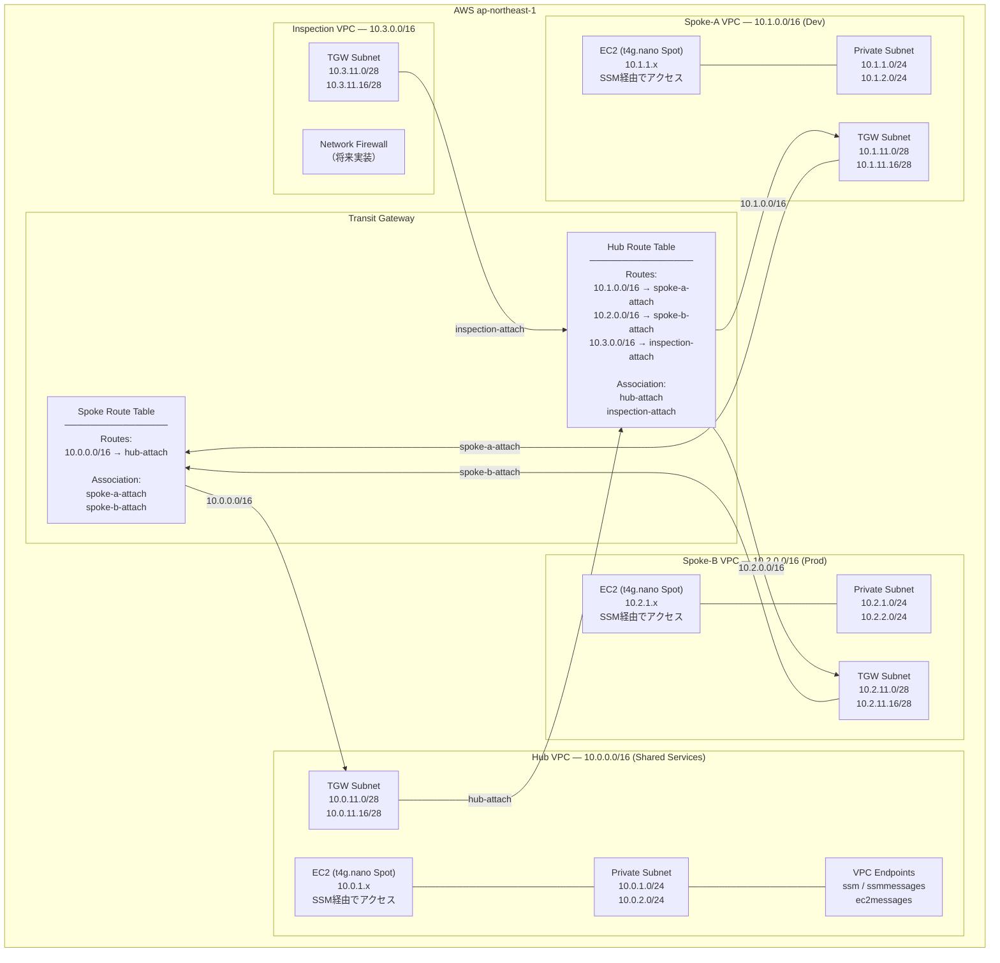
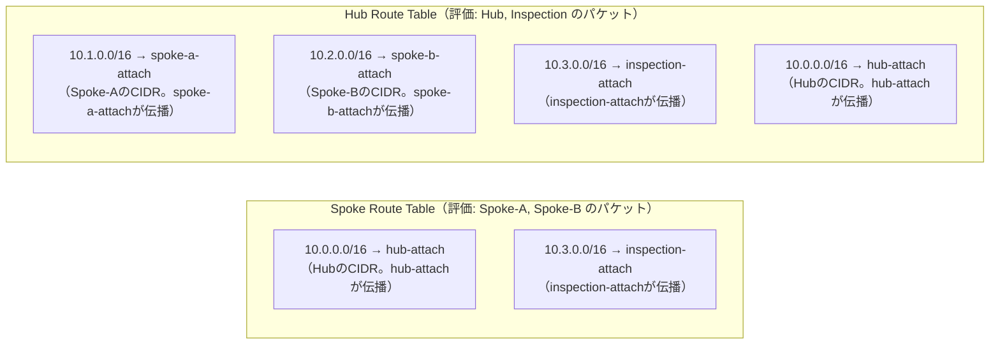

# ARCHITECTURE.md — tgw-multi-vpc-lab 完全理解ドキュメント

## 目次

1. [プロジェクト概要](#1-プロジェクト概要)
2. [ネットワーク全体構成](#2-ネットワーク全体構成)
3. [VPC設計詳細](#3-vpc設計詳細)
4. [Transit Gateway設計](#4-transit-gateway設計)
5. [通信制御の仕組み — Association と Propagation](#5-通信制御の仕組み--association-と-propagation)
6. [パケットの流れ（通信経路トレース）](#6-パケットの流れ通信経路トレース)
7. [VPCエンドポイント設計](#7-vpcエンドポイント設計)
8. [EC2テストインスタンス設計](#8-ec2テストインスタンス設計)
9. [Terraformモジュール構成](#9-terraformモジュール構成)
10. [コスト設計](#10-コスト設計)
11. [セキュリティ設計](#11-セキュリティ設計)

---

## 1. プロジェクト概要

**目的**: AWS Transit Gateway を使ったマルチVPCネットワーク（Hub-and-Spoke構成）を Terraform で実装し、ルートテーブルによる通信制御を体得する。

**実装する通信ポリシー**:

| 通信方向 | 許可/禁止 | 制御箇所 |
|----------|-----------|----------|
| Spoke-A ↔ Hub | ✅ 許可 | TGW Spoke RTにHub CIDRを伝播 |
| Spoke-B ↔ Hub | ✅ 許可 | TGW Spoke RTにHub CIDRを伝播 |
| Spoke-A ↔ Spoke-B | ❌ 禁止 | Spoke RT に互いのCIDRを伝播しない |
| 外部通信 | 🔄 Inspection VPC経由 | （Phase5以降で設定） |

---

## 2. ネットワーク全体構成

### 2-1. 論理構成図



### 2-2. サブネットCIDR一覧

| VPC | 用途 | サブネット種別 | CIDR | AZ |
|-----|------|---------------|------|----|
| Hub (10.0.0.0/16) | Shared Services | Private | 10.0.1.0/24 | ap-northeast-1a |
| Hub | | Private | 10.0.2.0/24 | ap-northeast-1c |
| Hub | | TGW専用 | 10.0.11.0/28 | ap-northeast-1a |
| Hub | | TGW専用 | 10.0.11.16/28 | ap-northeast-1c |
| Spoke-A (10.1.0.0/16) | Dev | Private | 10.1.1.0/24 | ap-northeast-1a |
| Spoke-A | | Private | 10.1.2.0/24 | ap-northeast-1c |
| Spoke-A | | TGW専用 | 10.1.11.0/28 | ap-northeast-1a |
| Spoke-A | | TGW専用 | 10.1.11.16/28 | ap-northeast-1c |
| Spoke-B (10.2.0.0/16) | Prod | Private | 10.2.1.0/24 | ap-northeast-1a |
| Spoke-B | | Private | 10.2.2.0/24 | ap-northeast-1c |
| Spoke-B | | TGW専用 | 10.2.11.0/28 | ap-northeast-1a |
| Spoke-B | | TGW専用 | 10.2.11.16/28 | ap-northeast-1c |
| Inspection (10.3.0.0/16) | NFW | TGW専用 | 10.3.11.0/28 | ap-northeast-1a |
| Inspection | | TGW専用 | 10.3.11.16/28 | ap-northeast-1c |

> **TGW専用サブネットを /28 にしている理由**: TGW ENIは1AZにつき1つのIPアドレスしか使わないため、/28（16アドレス）で十分。/24を割り当てるとIPアドレスが無駄になる。

---

## 3. VPC設計詳細

### 3-1. なぜサブネットを「Private」と「TGW専用」に分けるか

各VPCのサブネットは2種類に分離されている。

```
VPC (例: Spoke-A)
├── Private Subnet  [EC2, VPCエンドポイントを配置]
│     ルートテーブル: private-rtb
│     ルート: 10.0.0.0/8 → Transit Gateway
│
└── TGW Subnet  [Transit GatewayのENIだけが入る]
      ルートテーブル: tgw-rtb
      ルート: (デフォルトのみ — VPCローカル)
```

**分離する理由**: TGW経由のトラフィックルートとVPC内部通信のルートを**独立して制御**するため。同一ルートテーブルに統合すると、TGWへの静的ルートがVPC内通信に意図しない影響を与えるリスクがある。

### 3-2. VPCモジュール（`modules/vpc`）が管理するリソース

```
modules/vpc/
  ├── aws_vpc                          ─ VPC本体
  ├── aws_subnet.private (for_each)    ─ EC2配置用（AZごと）
  ├── aws_subnet.tgw (for_each)        ─ TGW ENI用（AZごと、/28）
  ├── aws_route_table.private          ─ Privateサブネット用RTB
  ├── aws_route_table.tgw              ─ TGW専用サブネット用RTB
  ├── aws_route_table_association      ─ サブネットとRTBの関連付け
  ├── aws_security_group.vpc_endpoint  ─ VPCエンドポイントのSG（443のみ許可）
  └── aws_vpc_endpoint × 3            ─ ssm / ssmmessages / ec2messages
```

### 3-3. VPCルートテーブルの設計

各VPCの **プライベートサブネット** のルートテーブルには、Terraform の `aws_route` リソース（`envs/main.tf`）で以下のルートが追加される。

```
宛先: 10.0.0.0/8  →  Transit Gateway
```

`/8` で集約することで、10.x.x.x 宛のすべてのトラフィック（Hub/Spoke-A/Spoke-B/Inspection）をまとめてTGWに向ける。TGW側のルートテーブルが最終的な到達可否を決める。

---

## 4. Transit Gateway設計

### 4-1. TGWの基本設定

```hcl
auto_accept_shared_attachments  = "disable"
default_route_table_association = "disable"   # 重要
default_route_table_propagation = "disable"   # 重要
dns_support      = "enable"
vpn_ecmp_support = "enable"
amazon_side_asn  = 64512
```

**`default_route_table_association/propagation` を `disable` にする理由**:  
デフォルトで有効にすると、すべてのVPCアタッチメントが自動的に同じルートテーブルに登録される。これではSpoke-A/B間の通信禁止など細かい通信制御ができないため、**手動でルートテーブルを設計**する。

### 4-2. TGWルートテーブルの2テーブル構成

```
Transit Gateway
├── Spoke Route Table  → Spoke-A / Spoke-B のアタッチメントが紐づく
│     伝播されるCIDR: 10.0.0.0/16 (Hubから) + 10.3.0.0/16 (Inspectionから)
│     ※ Spoke-A/B はここには伝播しない → Spoke同士が到達できない
│
└── Hub Route Table    → Hub / Inspection のアタッチメントが紐づく
      伝播されるCIDR: 10.1.0.0/16 (Spoke-Aから) + 10.2.0.0/16 (Spoke-Bから) + ...
      ※ HubはすべてのSpokeのCIDRを知っている → 折り返し通信が可能
```

### 4-3. アタッチメントとルートテーブルの関係（全体マトリクス）

| アタッチメント | Association（評価テーブル） | Propagation先（CIDRを広告） |
|----------------|-----------------------------|-----------------------------|
| hub-attach | **Hub RT** | Spoke RT |
| spoke-a-attach | **Spoke RT** | Hub RT |
| spoke-b-attach | **Spoke RT** | Hub RT |
| inspection-attach | **Hub RT** | Spoke RT |

---

## 5. 通信制御の仕組み — Association と Propagation

TGWのルーティング制御は **2つの概念** で構成される。

```
┌─────────────────────────────────────────────────────────────────┐
│  Association（関連付け）                                         │
│  パケットが届いたとき、「どのルートテーブルで評価するか」を決める│
│  各アタッチメントは1つのルートテーブルにのみ関連付けられる      │
└─────────────────────────────────────────────────────────────────┘

┌─────────────────────────────────────────────────────────────────┐
│  Propagation（伝播）                                             │
│  「自分のVPC CIDRを、どのルートテーブルに広告するか」を決める   │
│  複数のルートテーブルに同時に伝播できる                         │
└─────────────────────────────────────────────────────────────────┘
```

### 5-1. Spoke-A → Spoke-B が禁止される仕組み（ステップ追跡）

```
Step 1: Spoke-A の EC2 が 10.2.1.x (Spoke-B) 宛にパケットを送信

Step 2: VPCルートテーブルを参照
        宛先 10.2.1.x は 10.0.0.0/8 に一致
        → パケットは Transit Gateway へ転送される

Step 3: TGW が「どのルートテーブルで評価するか」を決定
        spoke-a-attach の Association = Spoke Route Table
        → Spoke Route Table でルートを検索

Step 4: Spoke Route Table のルートを検索
        ┌──────────────────────────────────────┐
        │ Spoke Route Table                    │
        │  10.0.0.0/16 → hub-attach  ✅ 存在   │
        │  10.2.0.0/16 → ???         ❌ なし   │  ← Spoke-BのCIDRが存在しない！
        └──────────────────────────────────────┘

Step 5: ルートが見つからない → パケットはドロップ（Spoke-B到達不可）
```

**なぜ Spoke-B のCIDRが Spoke RT に存在しないのか?**  
`spoke-b-attach` の Propagation 先は **Hub RT のみ**。Spoke RT には伝播していないため、Spoke RT には Spoke-B の 10.2.0.0/16 が一切存在しない。

### 5-2. Spoke-A → Hub が許可される仕組み（ステップ追跡）

```
Step 1: Spoke-A の EC2 が 10.0.1.x (Hub) 宛にパケットを送信

Step 2: VPCルートテーブル: 10.0.0.0/8 → Transit Gateway へ転送

Step 3: TGW: spoke-a-attach の Association = Spoke Route Table

Step 4: Spoke Route Table を検索
        ┌──────────────────────────────────────┐
        │ Spoke Route Table                    │
        │  10.0.0.0/16 → hub-attach  ✅ 存在   │  ← hub-attach が伝播した結果
        └──────────────────────────────────────┘

Step 5: hub-attach 経由で Hub VPC へ転送 → Hub EC2 に到達

Step 6: Hub EC2 から返信パケット
        hub-attach の Association = Hub Route Table
        Hub RT に 10.1.0.0/16 → spoke-a-attach が存在 → Spoke-A に返送
```

### 5-3. ルートテーブル内容の完全図



---

## 6. パケットの流れ（通信経路トレース）

### 6-1. Spoke-A EC2 → Hub EC2（SSM pingコマンドで確認）

```
Spoke-A EC2 (10.1.1.x)
  │  送信先: 10.0.1.x
  ▼
Spoke-A Private Subnet RTB
  │  ルート: 10.0.0.0/8 → tgw-xxxxx
  ▼
TGW (Spoke-A TGW Subnet経由 → spoke-a-attach)
  │  評価: Spoke Route Table
  │  ルート: 10.0.0.0/16 → hub-attach
  ▼
TGW (hub-attach → Hub TGW Subnet)
  │
  ▼
Hub VPC Private Subnet RTB
  │  ルート: ローカル (10.0.0.0/16)
  ▼
Hub EC2 (10.0.1.x) ✅ 到達
```

### 6-2. Spoke-A EC2 → Spoke-B EC2（遮断）

```
Spoke-A EC2 (10.1.1.x)
  │  送信先: 10.2.1.x
  ▼
Spoke-A Private Subnet RTB
  │  ルート: 10.0.0.0/8 → tgw-xxxxx
  ▼
TGW (spoke-a-attach)
  │  評価: Spoke Route Table
  │  10.2.0.0/16 のルートが存在しない
  ▼
❌ ドロップ（Spoke-B 到達不可）
```

---

## 7. VPCエンドポイント設計

### 7-1. なぜ NAT Gateway を使わないのか

| 項目 | NAT Gateway | VPC Endpoint |
|------|------------|--------------|
| 月額コスト | ~$45（固定）+ データ処理料 | ~$7.3/エンドポイント（3エンドポイント × 3VPC） |
| インターネット経由 | あり | **なし（AWSバックボーン）** |
| 対象サービス | すべて | 対応サービスのみ |
| このラボの用途 | 過剰 | 最適（SSM接続のみ必要） |

このラボではEC2への接続手段として SSM Session Manager のみを使用する。SSMに必要な3つのエンドポイントのみを作成し、インターネットへの経路を持たない設計にした（ADR-003）。

### 7-2. 必要なVPCエンドポイント

```
各VPC（Hub / Spoke-A / Spoke-B）に3つのInterfaceエンドポイントを作成
  ├── com.amazonaws.ap-northeast-1.ssm          → SSMエージェントの制御プレーン
  ├── com.amazonaws.ap-northeast-1.ssmmessages  → Session Managerのデータプレーン
  └── com.amazonaws.ap-northeast-1.ec2messages  → SSMエージェントのメッセージング
```

> **Inspection VPCにエンドポイントがない理由**: Inspection VPCにはEC2を配置しないため不要。

### 7-3. エンドポイントのセキュリティグループ

```
VPCエンドポイントSG（vpc-name-vpce-sg）:
  Ingress: TCP 443  from [VPC CIDR]    ← VPC内のEC2からのHTTPS
  Egress:  All      to   0.0.0.0/0
```

VPC CIDRのみを許可することで、そのVPC内のEC2だけがSSMサービスにアクセスできる。

---

## 8. EC2テストインスタンス設計

### 8-1. 配置場所とスペック

| インスタンス | VPC | サブネット | 用途 |
|-------------|-----|-----------|------|
| test-hub | Hub | Private (10.0.1.x) | pingのターゲット |
| test-spoke-a | Spoke-A | Private (10.1.1.x) | pingの送信元（SSMで接続） |
| test-spoke-b | Spoke-B | Private (10.2.1.x) | pingのターゲット（遮断確認） |

- **インスタンスタイプ**: `t4g.nano`（arm64 / Graviton2）
- **AMI**: Amazon Linux 2023（arm64）— 最新を `data` ソースで自動取得
- **購入オプション**: Spot Instance（コスト削減）
- **アクセス方法**: SSM Session Manager（キーペア不要、踏み台不要）

### 8-2. EC2に付与するIAMロール

```
IAMロール（instance_name-ssm-role）
  └── 管理ポリシー: AmazonSSMManagedInstanceCore
        ├── ssm:UpdateInstanceInformation
        ├── ssm:ListInstanceAssociations
        ├── ssmmessages:CreateControlChannel
        ├── ssmmessages:CreateDataChannel
        └── ... （SSM接続に必要な権限）
```

### 8-3. セキュリティグループ

```
EC2 SG（instance_name-sg）:
  Ingress: ICMP (-1/-1)  from 10.0.0.0/8   ← 内部レンジからのpingのみ許可
  Egress:  All           to   0.0.0.0/0
```

ICMPを `10.0.0.0/8`（RFC 1918の10系）全体から許可することで、すべてのVPCからのpingを受け付ける。遮断確認はTGWルートテーブルで行う。

### 8-4. 疎通確認スクリプト（`tests/connectivity_check.sh`）

```bash
# Spoke-A EC2からSSM Send Commandでpingを実行し、結果を判定
run_ping "$SPOKE_A_ID" "$HUB_IP"    "Spoke-A → Hub"    "true"   # 期待: PASS
run_ping "$SPOKE_A_ID" "$SPOKE_B_IP" "Spoke-A → Spoke-B" "false"  # 期待: FAIL（遮断）
```

terraform output からIPとインスタンスIDを自動取得するため、手動入力は不要。

---

## 9. Terraformモジュール構成

### 9-1. モジュール依存関係

```
envs/ap-northeast-1/main.tf
  │
  ├── module.hub_vpc        (modules/vpc)
  ├── module.spoke_a_vpc    (modules/vpc)
  ├── module.spoke_b_vpc    (modules/vpc)
  ├── module.inspection_vpc (modules/vpc)
  │
  ├── module.tgw            (modules/tgw)
  │     └── 依存なし
  │
  ├── module.hub_attach        (modules/tgw-attach)
  │     └── 依存: module.hub_vpc, module.tgw
  ├── module.spoke_a_attach    (modules/tgw-attach)
  │     └── 依存: module.spoke_a_vpc, module.tgw
  ├── module.spoke_b_attach    (modules/tgw-attach)
  │     └── 依存: module.spoke_b_vpc, module.tgw
  ├── module.inspection_attach (modules/tgw-attach)
  │     └── 依存: module.inspection_vpc, module.tgw
  │
  ├── aws_route.spoke_a_to_tgw  ─ depends_on: module.spoke_a_attach
  ├── aws_route.spoke_b_to_tgw  ─ depends_on: module.spoke_b_attach
  ├── aws_route.hub_to_tgw      ─ depends_on: module.hub_attach
  ├── aws_route.inspection_to_tgw ─ depends_on: module.inspection_attach
  │
  ├── module.test_ec2_hub     (modules/test-ec2)
  ├── module.test_ec2_spoke_a (modules/test-ec2)
  └── module.test_ec2_spoke_b (modules/test-ec2)
```

> **`depends_on` を明示する理由**: `aws_route` でTGWアタッチメントIDを直接参照していないため、Terraformの暗黙的依存関係が成立しない。アタッチメントが `available` 状態になる前にルートを追加しようとするとエラーになるため、明示的な依存を設定している。

### 9-2. 各モジュールの役割と設計ポイント

#### `modules/vpc` — VPCの汎用モジュール

- Hub/Spoke-A/Spoke-B/Inspection の **4VPCすべてに同一モジュールを使い回す**
- サブネットは `for_each` で AZ × CIDR のマッピングから生成
- VPCエンドポイント3種をモジュール内で一括管理（Inspection VPCを除く全VPCで自動作成）

```hcl
# for_each パターン: CIDRをキーにAZを決定
private_subnet_map = {
  for i, cidr in var.private_subnet_cidrs : cidr => local.azs[i % var.az_count]
}
```

#### `modules/tgw` — Transit Gateway本体

- TGW本体と **2つのルートテーブル**（Spoke RT / Hub RT）を管理
- デフォルトルートテーブルの自動関連付け・自動伝播を無効化

#### `modules/tgw-attach` — アタッチメント + ルーティング制御

- VPCアタッチメント、Association、Propagation を1つのモジュールで管理
- `route_table_id` : Association先（評価テーブル）
- `propagate_to_route_table_ids` : Propagation先（CIDRを広告するテーブル）のリスト

```hcl
# Spoke-A の設定例
module "spoke_a_attach" {
  route_table_id               = module.tgw.spoke_route_table_id   # Association
  propagate_to_route_table_ids = [module.tgw.hub_route_table_id]   # Propagation
}
```

#### `modules/test-ec2` — 疎通確認用EC2

- Spot Instance + t4g.nano で最小コストを実現
- IAMロール（SSM用）・セキュリティグループ・インスタンスプロファイルを一括管理

### 9-3. タグ戦略

`provider` の `default_tags` で全リソースに共通タグを自動付与する。

```hcl
# envs/ap-northeast-1/main.tf
provider "aws" {
  default_tags {
    tags = {
      Project     = var.project      # "tgw-multi-vpc-lab"
      Environment = var.environment  # "lab"
      ManagedBy   = "terraform"
    }
  }
}
```

個別リソースには `Name` タグを追加で付与する。

---

## 10. コスト設計

### 10-1. コスト最適化の工夫一覧

| 選択 | 代替案 | 削減効果 |
|------|--------|----------|
| EC2: t4g.nano (Graviton2) | t3.nano | 約20%安価 |
| EC2: Spot Instance | On-Demand | 最大90%削減 |
| SSM接続: VPCエンドポイント | NAT Gateway | ~$45/月 → ~$22/月 |
| NAT Gateway: 使用しない | 1台配置 | $45/月削減 |
| EC2を3台のみに限定 | 各VPC複数台 | インスタンス数最小化 |

### 10-2. 月額コスト概算（稼働時間による）

| リソース | 数量 | 単価（目安） | 月額（100h稼働） |
|---------|------|-------------|----------------|
| Transit Gateway | 1 | $0.07/h | $7 |
| TGW データ処理 | 〜 | $0.02/GB | 微小 |
| VPC Interface Endpoint | 9 (3種×3VPC) | $0.014/h | $3.78 |
| EC2 t4g.nano Spot | 3 | ~$0.002/h | $0.60 |
| **合計（概算）** | | | **~$11** |

> TGWはアタッチメント数×稼働時間で課金される（アタッチメント: 4本 × $0.05/h = $0.20/h）。実習後は速やかに `terraform destroy` を実行すること。

---

## 11. セキュリティ設計

### 11-1. インターネット非公開設計

このラボには **インターネットゲートウェイが存在しない**。すべての通信はAWSバックボーン内に閉じている。

```
外部からのアクセス経路: なし（IGW なし、パブリックサブネット なし）
EC2へのアクセス: SSM Session Manager（HTTPS/443、VPCエンドポイント経由）
```

### 11-2. 最小権限IAM

EC2 IAMロールは `AmazonSSMManagedInstanceCore` のみ。SSM接続に必要な最小限の権限だけを付与し、その他のAWSサービス操作権限は持たない。

### 11-3. セキュリティグループの設計思想

| SG | Ingress | 理由 |
|----|---------|------|
| VPCエンドポイントSG | TCP 443 from [VPC CIDR] | 同一VPC内からのHTTPSのみ |
| EC2 SG | ICMP from 10.0.0.0/8 | 疎通確認のpingのみ許可。SSH不要（SSM接続） |

### 11-4. 通信制御の二重防御

Spoke-A/B 間の通信禁止は **TGWルートテーブルで制御** している。これはネットワークレイヤー（L3）での制御であり、SGやNACLより根本的な遮断となる。

```
┌─────────────────────────────────────────────┐
│ 防御層1: TGWルートテーブル（ルートなし）     │ ← このラボの主役
│ 防御層2: EC2セキュリティグループ             │ ← 追加防御
└─────────────────────────────────────────────┘
```

---

## まとめ — このプロジェクトで学ぶ設計判断

| 設計判断 | 選択 | 理由 |
|----------|------|------|
| VPC間接続方式 | Transit Gateway | VPC数増加時のpeering数爆発を回避。推移的ルーティングが不要 |
| ルートテーブル構成 | 2テーブル（Spoke/Hub） | AssociationとPropagationを分離することでSpoke間禁止を宣言的に実現 |
| インターネット接続 | なし（エンドポイントのみ） | コスト削減 + セキュリティ向上。SSMだけで運用できる |
| サブネット分離 | Private + TGW専用 | TGW経由のルートとVPC内ルートを独立して管理 |
| EC2アクセス | SSM Session Manager | 踏み台不要、キーペア不要、監査ログが残る |
| IaC | Terraform (for_each中心) | 4VPC構成を同一モジュールで再利用。変更が1箇所で完結 |
