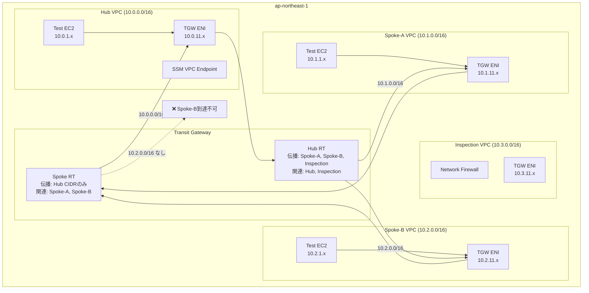
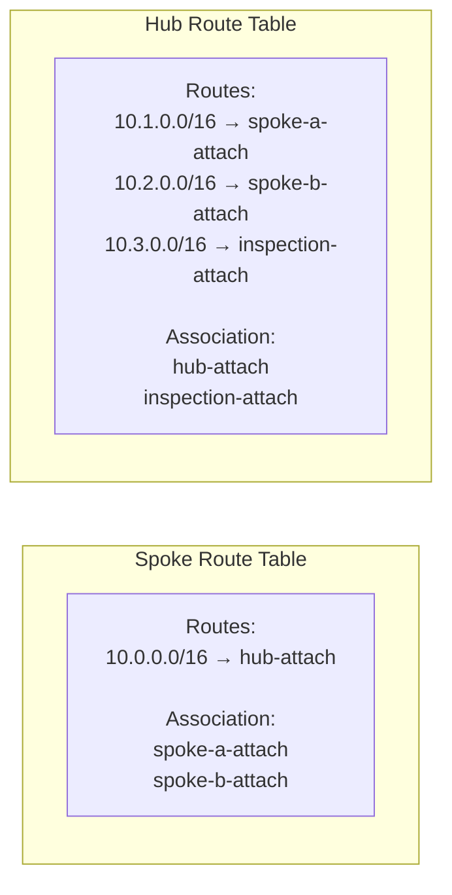

# アーキテクチャ図

## ネットワーク全体構成

```mermaid
graph TB
    subgraph "ap-northeast-1"
        subgraph "Spoke-A VPC (10.1.0.0/16)"
            EC2_A[Test EC2\n10.1.1.x]
            TGW_ENI_A[TGW ENI\n10.1.11.x]
        end

        subgraph "Spoke-B VPC (10.2.0.0/16)"
            EC2_B[Test EC2\n10.2.1.x]
            TGW_ENI_B[TGW ENI\n10.2.11.x]
        end

        subgraph "Hub VPC (10.0.0.0/16)"
            EC2_HUB[Test EC2\n10.0.1.x]
            TGW_ENI_HUB[TGW ENI\n10.0.11.x]
            SSM_EP[SSM VPC Endpoint]
        end

        subgraph "Inspection VPC (10.3.0.0/16)"
            NFW[Network Firewall]
            TGW_ENI_INS[TGW ENI\n10.3.11.x]
        end

        subgraph "Transit Gateway"
            SPOKE_RT["Spoke RT\n伝播: Hub CIDRのみ\n関連: Spoke-A, Spoke-B"]
            HUB_RT["Hub RT\n伝播: Spoke-A, Spoke-B, Inspection\n関連: Hub, Inspection"]
        end

        EC2_A --> TGW_ENI_A --> SPOKE_RT
        EC2_B --> TGW_ENI_B --> SPOKE_RT
        SPOKE_RT -->|10.0.0.0/16| TGW_ENI_HUB
        SPOKE_RT -.->|10.2.0.0/16 なし| X[❌ Spoke-B到達不可]

        EC2_HUB --> TGW_ENI_HUB --> HUB_RT
        HUB_RT -->|10.1.0.0/16| TGW_ENI_A
        HUB_RT -->|10.2.0.0/16| TGW_ENI_B
    end
```

## TGWルートテーブル詳細

```mermaid
graph LR
    subgraph "Spoke Route Table"
        SR["Routes:\n10.0.0.0/16 → hub-attach\n\nAssociation:\nspoke-a-attach\nspoke-b-attach"]
    end

    subgraph "Hub Route Table"
        HR["Routes:\n10.1.0.0/16 → spoke-a-attach\n10.2.0.0/16 → spoke-b-attach\n10.3.0.0/16 → inspection-attach\n\nAssociation:\nhub-attach\ninspection-attach"]
    end
```
