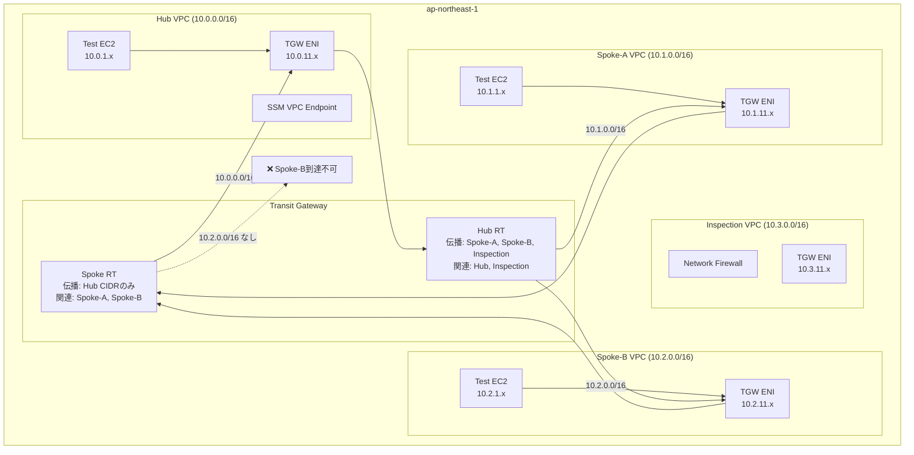
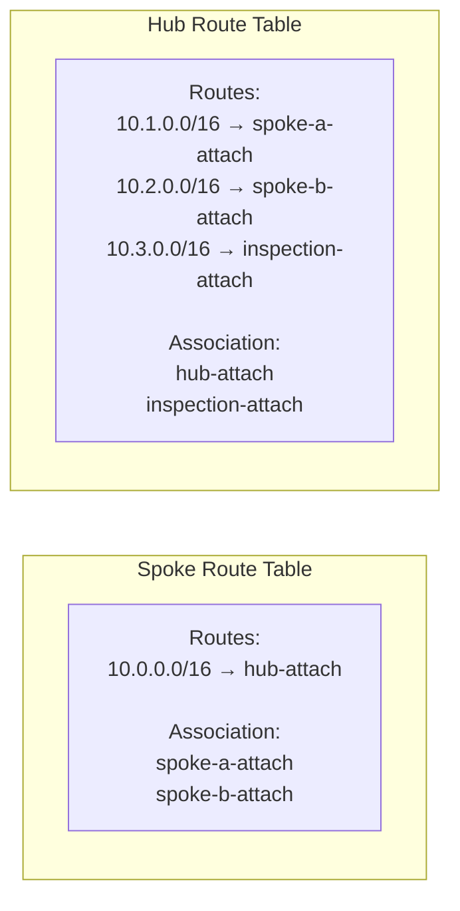

# Phase 5: ドキュメント整備 + ポートフォリオ化

## このフェーズの目的
実装したネットワーク設計を「面接で話せるレベル」に昇華させる。
ADRの「決定理由」は **自分の言葉で書くこと**（AI生成禁止）。

---

## タスク一覧

### 1. Mermaidアーキテクチャ図の作成

`docs/architecture.md` を作成:

````markdown
# アーキテクチャ図

## ネットワーク全体構成



## TGWルートテーブル詳細


````

### 2. ADRの作成

`docs/adr/` 配下に以下3つのADRを作成する。
**`## 決定理由` セクションは自分の言葉で記述すること。空欄のままにして後で記入すること。**

#### `docs/adr/001-tgw-vs-vpc-peering.md`

```markdown
# ADR-001: VPC PeeringではなくTransit Gatewayを採用する

## ステータス
採用済み

## コンテキスト
4つのVPCを相互接続する方法として、VPC PeeringとTransit Gatewayの2択を検討した。

## 決定
Transit Gatewayを採用する。

## 決定理由
<!-- ここは自分の言葉で記述すること（AI生成禁止） -->
<!-- 考慮すべき観点: VPC数が増えた場合のpeering数の爆発、推移的ルーティングの有無、通信制御の粒度 -->

## トレードオフ
- コスト: TGWはアタッチメント時間とデータ処理量で課金される
- レイテンシ: TGW経由は1ホップ追加される

## 参考
- [Transit Gateway vs VPC Peering](https://docs.aws.amazon.com/vpc/latest/tgw/tgw-peering.html)
```

#### `docs/adr/002-tgw-route-table-design.md`

```markdown
# ADR-002: TGWルートテーブルを2テーブル構成にする

## ステータス
採用済み

## コンテキスト
Spoke間通信を禁止しながら、HubとSpoke間の通信は許可するポリシーを実装する必要がある。

## 決定
Spoke用とHub用の2つのルートテーブルを作成し、SpokeのルートテーブルにはHub CIDRのみを伝播させる。

## 決定理由
<!-- ここは自分の言葉で記述すること（AI生成禁止） -->
<!-- 考慮すべき観点: なぜ1テーブルで実現できないのか、AssociationとPropagationの役割分担 -->

## 代替案
- ブラックホールルートで特定CIDRをドロップする方法
- Security Groupで制御する方法（なぜこれでは不十分か）

## 参考
```

#### `docs/adr/003-no-nat-gateway.md`

```markdown
# ADR-003: NATゲートウェイを使用せずVPCエンドポイントで代替する

## ステータス
採用済み

## コンテキスト
プライベートサブネット内のEC2からSSM Session Manager、ECR、S3等のAWSサービスにアクセスする必要がある。

## 決定
NATゲートウェイを使用せず、VPCエンドポイント（ssm, ssmmessages, ec2messages）で代替する。

## 決定理由
<!-- ここは自分の言葉で記述すること（AI生成禁止） -->
<!-- 考慮すべき観点: 月額コスト比較、セキュリティ（インターネット非公開）、このラボの用途に合った選択 -->

## トレードオフ
- VPCエンドポイントで対応できないサービスへはアクセス不可（yumアップデート等）
- エンドポイントごとに課金が発生する（ただしNATGWより安価）
```

### 3. Runbookの作成

`docs/runbook.md`:

```markdown
# Runbook: tgw-multi-vpc-lab

## 構成確認

### TGWルートテーブル確認
```bash
TGW_ID=$(terraform -chdir=envs/ap-northeast-1 output -raw tgw_id)

# Spoke RTのルート一覧
aws ec2 search-transit-gateway-routes \
  --transit-gateway-route-table-id <SPOKE_RT_ID> \
  --filters "Name=state,Values=active"

# Hub RTのルート一覧
aws ec2 search-transit-gateway-routes \
  --transit-gateway-route-table-id <HUB_RT_ID> \
  --filters "Name=state,Values=active"
```

### アタッチメントとルートテーブルの関連付け確認
```bash
aws ec2 get-transit-gateway-route-table-associations \
  --transit-gateway-route-table-id <SPOKE_RT_ID>
```

## トラブルシューティング

### 症状: Spoke-A → Hub に ping が通らない

確認手順:
1. TGWアタッチメントのStateがavailableか確認
2. Spoke RTにHubのCIDR（10.0.0.0/16）のルートが存在するか確認
3. Hub RTにSpoke-AのCIDR（10.1.0.0/16）のルートが存在するか確認
4. Spoke-AのVPCルートテーブルにTGWへのルートが存在するか確認
5. EC2のセキュリティグループがICMPを許可しているか確認

### 症状: SSM Session Managerで接続できない

確認手順:
1. VPCエンドポイント（ssm, ssmmessages, ec2messages）が存在するか確認
2. エンドポイントのSGがEC2からの443を許可しているか確認
3. EC2のIAMロールにAmazonSSMManagedInstanceCoreが付与されているか確認
4. SSMエージェントが起動しているか確認（起動直後は2〜3分待つ）
```

### 4. STAR形式の面接回答を作成

`docs/interview-star.md`:

```markdown
# 面接用STAR形式回答: TGWマルチVPCネットワーク設計

## 質問例: 「ネットワーク設計で難しかった経験を教えてください」

### Situation（状況）
マルチVPC環境で、開発環境と本番環境を同一ネットワークに収容しながら、
環境間の通信を完全に遮断する必要があった。

### Task（課題）
Transit Gatewayのルートテーブル設計で、
「どのVPCが何に到達できるか」を宣言的に制御する仕組みを構築すること。

### Action（行動）
<!-- 自分の言葉で記述すること -->
<!-- 記述すべきポイント: 2テーブル設計の発想、Associationで評価テーブルを決め、Propagationで到達先を制限した点 -->

### Result（結果）
<!-- 定量的な効果を記述すること -->
<!-- 例: Spoke間の通信が確認テストで100%遮断されたこと、TerraformでIaC化したことで再現性が確保されたこと -->

## 深掘り質問への準備

Q: 「なぜVPC Peeringではなく Transit Gatewayを使ったのですか？」
A: <!-- ADR-001の内容を元に自分の言葉で -->

Q: 「ルートテーブルを分けることなく、Security Groupで制御することはできますか？」
A: <!-- なぜSGだけでは不十分か（推移的ルーティングの問題） -->

Q: 「Inspection VPCを使った集中型ファイアウォールの仕組みを説明してください」
A: <!-- 0.0.0.0/0のデフォルトルートをInspection VPC経由にする設計を説明 -->
```

### 5. Zenn記事アウトラインの作成

`docs/zenn-outline.md`:

```markdown
# Zenn記事アウトライン

## タイトル案
「Transit Gateway × Terraform で実装するHub-and-Spoke VPC設計 ─ SAPの知識を手で動かす」

## 対象読者
- AWSのネットワーク設計を実務レベルで理解したいインフラエンジニア
- SAP-C02の知識をコードに落とし込みたい人

## 記事構成

### 1. はじめに（背景）
- SAP試験でTGWを知識として理解していても、実装経験がないと面接で詰まる
- このハンズオンで「設計判断の言語化」まで行うことを目指す

### 2. 設計する構成の概要
- Hub-and-Spoke構成のMermaid図
- 通信ポリシーの表

### 3. TGWルートテーブルの核心
- AssociationとPropagationの違い（図解）
- 2テーブル設計でSpoke間通信を遮断する仕組み

### 4. Terraformでの実装
- モジュール構成の解説
- for_eachを使った伝播先の管理

### 5. 疎通確認
- SSM Session Managerでの確認方法
- 期待通りに遮断されていることの確認

### 6. 設計判断のまとめ
- なぜVPC PeeringでなくTGWか
- NATGWなしでどう運用するか

### 7. おわりに
- GitHub リポジトリへのリンク
```

---

## 完了確認チェックリスト

- [ ] Mermaidアーキテクチャ図がレンダリングできる
- [ ] ADR 3本が `docs/adr/` に存在する
- [ ] ADRの `## 決定理由` を自分の言葉で埋めた
- [ ] STAR形式のActionとResultを自分で記述した
- [ ] Zenn記事アウトラインに自分の気づきを1つ以上追記した
- [ ] `terraform destroy` でコストのかかるリソースを削除した

---

## 口頭説明チェック（15分目安）

このプロジェクト全体を通して:

1. **Transit GatewayとVPC Peeringを比較して使い分けの判断基準を説明せよ**

2. **TGWルートテーブルのAssociationとPropagationを図なしで説明せよ**

3. **このプロジェクトで最も設計判断が難しかった点はどこか、なぜそれが難しかったか**
   ※ この質問への回答が面接で差がつくポイント

4. **本番環境でこの構成を採用するとしたら、何を追加・変更するか**
   （可用性・監視・コスト・セキュリティの観点で）

---

## プロジェクト完了後の後片付け

```bash
# コストのかかるリソースをすべて削除
terraform -chdir=envs/ap-northeast-1 destroy

# TGWは削除に時間がかかる（5〜10分）
# アタッチメントを先に削除してからTGW本体を削除すること

# 削除確認
aws ec2 describe-transit-gateways \
  --filters "Name=tag:Project,Values=tgw-multi-vpc-lab" \
  --query 'TransitGateways[*].State'
```