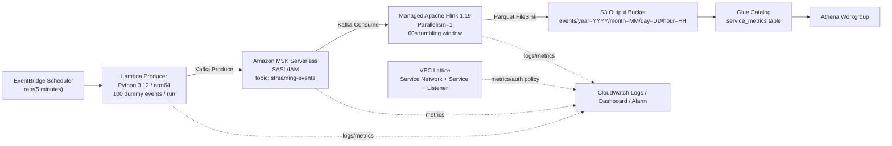
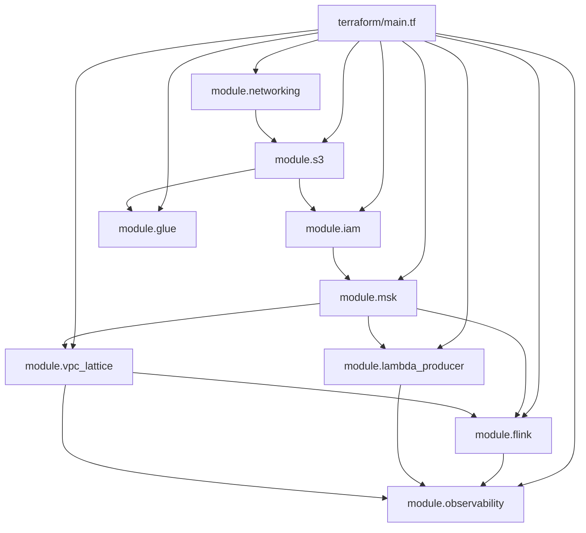

# ARCHITECTURE

このドキュメントは、`vpc-lattice-msk-flink-streaming-platform` の現在実装をベースに、構成・依存関係・実行時のデータフロー・セキュリティ境界をまとめた完全理解用ドキュメントです。

`README.md` が「概要説明」だとすると、こちらは「コードを読む前に全体像を掴み、読んだあとに答え合わせできる設計書」です。

## 1. このプロジェクトが作るもの

このプロジェクトは、AWS 上に以下の流れを持つリアルタイム集計基盤を Terraform で構築します。

1. EventBridge Scheduler が 5 分ごとに Lambda Producer を起動
2. Lambda Producer がダミーイベントを 100 件生成し、Amazon MSK Serverless に送信
3. Managed Service for Apache Flink が Kafka メッセージを読み取り、`service_name` ごとに 60 秒単位で集計
4. 集計結果を S3 に Parquet で保存
5. Glue Data Catalog と Athena で後段分析可能な形にする
6. CloudWatch Dashboard で Lambda / MSK / Flink / VPC Lattice を監視する

## 2. 全体アーキテクチャ

### 2.1 ランタイム構成



### 2.2 重要な読み方

- データ本流は `Lambda -> MSK -> Flink -> S3` です。
- VPC Lattice は Terraform 上で作成されていますが、現在コードでは Lambda と Flink は Lattice 経由ではなく、MSK の `bootstrap_brokers_sasl_iam` に直接接続しています。
- そのため、現状の VPC Lattice は「将来拡張を見据えて先に用意された制御面」であり、実データ経路の中核にはまだ入っていません。

## 3. Terraform ルート構成

`terraform/main.tf` は次の順序でモジュールを組み立てています。



## 4. モジュールごとの責務

| モジュール | 主な責務 | 主な出力 |
|---|---|---|
| `networking` | VPC、public/private subnet、IGW、NAT、Security Group 作成 | `vpc_id`, `private_subnet_ids`, `sg_*` |
| `s3` | Flink 出力用バケットと Flink JAR 保管用バケット作成 | `output_bucket_name`, `flink_app_bucket_name` |
| `iam` | Flink 実行ロール、Lambda 実行ロール、GitHub Actions OIDC ロール作成 | `flink_role_arn`, `producer_role_arn`, `github_actions_role_arn` |
| `msk` | MSK Serverless クラスターとクラスターポリシー作成 | `msk_bootstrap_brokers_sasl_iam`, `msk_cluster_name` |
| `lambda_producer` | Producer Lambda、Log Group、Scheduler 作成 | `lambda_function_name`, `scheduler_name` |
| `vpc_lattice` | Service Network、VPC Association、Service、TCP Listener、Auth Policy 作成 | `service_network_arn`, `service_id` |
| `flink` | Managed Flink アプリ、ログ設定、VPC 設定、環境変数注入 | `application_name`, `application_arn` |
| `glue` | Glue Database/Table、Athena Workgroup 作成 | `glue_database_name`, `athena_workgroup_name` |
| `observability` | Dashboard と Flink 停止検知 Alarm 作成 | `dashboard_url`, `flink_alarm_name` |

## 5. ネットワーク設計

### 5.1 VPC とサブネット

- VPC CIDR は `10.0.0.0/16`
- Private subnet は 2 つ
  - `10.0.1.0/24`
  - `10.0.2.0/24`
- Public subnet は 2 つ
  - `10.0.101.0/24`
  - `10.0.102.0/24`
- AZ は `ap-northeast-1a` と `ap-northeast-1c`
- Private subnet からの外向き通信は single NAT Gateway を経由

### 5.2 セキュリティグループ

| SG | 用途 | 主な許可 |
|---|---|---|
| `sg_msk` | MSK 用 | Lambda/Flink から `tcp/9098` ingress |
| `sg_lambda` | Lambda Producer 用 | `tcp/9098` egress to VPC, `tcp/443` egress to internet |
| `sg_flink` | Flink 用 | `tcp/8081` ingress from VPC, `tcp/9098` egress to VPC, `tcp/443` egress |
| `sg_vpc_lattice` | VPC Lattice 用 | `tcp/443` ingress from VPC, `tcp/9098` egress to MSK SG |

### 5.3 この設計で意図していること

- Lambda と Flink は private subnet 配置
- MSK は public exposure せず VPC 内限定
- ログ送信や S3 書き込みなどの AWS API 通信は NAT 経由
- Flink UI は VPC 内の `8081` のみ許可

## 6. データフロー詳細

### 6.1 Producer 側

`terraform/modules/lambda_producer/src/producer.py` では、Lambda が以下を行います。

1. `MSK_BOOTSTRAP_SERVERS` を環境変数から取得
2. `aws-msk-iam-sasl-signer` を使って OAUTHBEARER トークン生成
3. `kafka-python-ng` の `KafkaProducer` で SASL/IAM 接続
4. 100 件のダミーイベントを生成
5. `streaming-events` トピックに送信
6. 送信成功件数・失敗件数を構造化ログ出力

生成イベントの代表スキーマ:

```json
{
  "event_id": "uuid",
  "timestamp": "2026-05-06T12:34:56.000000",
  "service_name": "auth",
  "action": "login",
  "user_id": "u_1234",
  "latency_ms": 245,
  "status": "success",
  "region": "ap-northeast-1"
}
```

### 6.2 Stream Processing 側

`flink-app/src/main/java/com/example/streaming/StreamingJob.java` では、Flink が以下を行います。

1. Checkpoint を 60 秒ごとに実行
2. `BOOTSTRAP_SERVERS` で MSK に SASL/IAM 接続
3. Kafka Source で `streaming-events` を購読
4. JSON を `service_name`, `latency_ms`, `is_error` に変換
5. `service_name` 単位で `TumblingProcessingTimeWindows.of(Time.seconds(60))`
6. 以下を集計
   - `total_count`
   - `error_count`
   - `avg_latency_ms`
7. Parquet として `s3a://<output-bucket>/events/` へ保存

出力スキーマ:

| カラム | 型 | 意味 |
|---|---|---|
| `service_name` | string | サービス名 |
| `total_count` | bigint | 60 秒ウィンドウ内の総件数 |
| `error_count` | bigint | `status=error` の件数 |
| `avg_latency_ms` | double | 平均レイテンシ |
| `window_start` | string | 現在実装では常に `N/A` |
| `window_end` | string | 現在実装では常に `N/A` |

### 6.3 S3 への永続化

Flink は `DateTimeBucketAssigner` を使い、次のようなパスに書き込みます。

```text
s3://<output-bucket>/events/year=YYYY/month=MM/day=DD/hour=HH/
```

これにより、Athena から時刻パーティションを前提としたクエリがしやすくなります。

## 7. ストレージと分析基盤

### 7.1 S3 バケット

このプロジェクトでは 2 つの S3 バケットを作成します。

| バケット | 用途 |
|---|---|
| `${name_prefix}-output-${account_id}` | Flink 集計結果と Athena 結果出力 |
| `${name_prefix}-flink-app-${account_id}` | Flink JAR と checkpoint 保存 |

両方とも以下の設定があります。

- Versioning 有効
- SSE-S3 (`AES256`) 有効
- Public Access Block 有効

出力バケットだけはさらに Lifecycle があり、

- 90 日後に `STANDARD_IA`
- 365 日後に削除

となっています。

### 7.2 Glue / Athena

Glue では以下を作成します。

- Database: `${name_prefix}_streaming_db`
- Table: `service_metrics`
- Partition keys: `year`, `month`, `day`, `hour`

Athena Workgroup は別途 `${name_prefix}-workgroup` で作成され、結果出力先は同じ output bucket 内の `athena-results/` です。

## 8. IAM と認可モデル

### 8.1 Flink 実行ロール

Flink ロールは主に以下を持ちます。

- MSK 読み取り
- S3 読み書き
- CloudWatch Logs 出力
- VPC 内実行のための ENI 作成

ポイントは、Managed Flink が private subnet で動くため `ec2:CreateNetworkInterface` などが必須なことです。

### 8.2 Lambda Producer ロール

Producer ロールは主に以下を持ちます。

- MSK 書き込み
- CloudWatch Logs 出力
- Lambda の VPC ENI 作成

設計上、Producer に読み取り権限は付けていません。これは最小権限の意図に沿っています。

### 8.3 MSK クラスターポリシー

MSK は IAM ロール側だけではなく、クラスターポリシー側でもアクセスを許可しています。

- Lambda ロール: `WriteData` 系
- Flink ロール: `ReadData` 系

つまり、認可は次の 2 段で成立します。

1. クライアント IAM ロールに必要権限がある
2. MSK クラスター側ポリシーでもそのロールを許可している

### 8.4 GitHub Actions OIDC

CI/CD は長期アクセスキーを使わず、GitHub OIDC Provider で `AssumeRoleWithWebIdentity` します。

これはセキュリティ的には良い設計で、README の説明とも一致しています。

## 9. VPC Lattice の位置づけ

Terraform 上の `vpc_lattice` モジュールは以下を作成します。

- Service Network
- VPC Association
- MSK 用 Service
- TCP Listener (`9098`)
- Service Network Auth Policy

Auth Policy では、Lambda と Flink の IAM ロールに `vpc-lattice-svcs:Invoke` を許可しています。

### 9.1 ただし現在の実装上の注意

現在のコードを読む限り、VPC Lattice はまだ「通信の本番経路」には入っていません。

理由:

- Lambda は `MSK_BOOTSTRAP_SERVERS = module.msk.msk_bootstrap_brokers_sasl_iam`
- Flink も `BOOTSTRAP_SERVERS = var.msk_bootstrap_brokers`

となっており、どちらも Lattice のサービスエンドポイントを参照していません。

つまり、現状の理解としては次が正確です。

- MSK 接続の将来入口として VPC Lattice を先に作っている
- IAM ベースのサービスネットワーク構成はある
- しかし実際の Kafka クライアント接続先は direct MSK broker endpoint

## 10. 監視と運用

CloudWatch Dashboard には以下のメトリクスが並びます。

- MSK: `BytesInPerSec`, `BytesOutPerSec`
- Lambda: `Invocations`, `Errors`, `Duration p99`
- Flink: `numRecordsInPerSecond`, `numRecordsOutPerSecond`, `lastCheckpointDuration`
- VPC Lattice: `RequestCount`, `HTTPCode_Target_5XX_Count`

また、Flink の `numRecordsInPerSecond` が 5 分単位で 3 回連続 `0.1` 未満ならアラームになります。

## 11. CI/CD

`.github/workflows/terraform.yml` では次を実行します。

- `push` to `main`
- `pull_request` to `main`

ジョブは 2 つです。

1. `terraform-check`
   - `terraform fmt -check -recursive`
   - `terraform init -backend=false`
   - `terraform validate`
2. `terraform-plan`
   - PR 時のみ実行
   - backend 付き `terraform init`
   - `terraform plan`
   - 結果を PR コメントに投稿

このため、IaC としての基本的な品質ゲートは整っています。

## 12. 依存ファイルとビルド

### Flink

- ソース: `flink-app/src/main/java/com/example/streaming/StreamingJob.java`
- ビルド: `scripts/build_flink_app.sh`
- 生成物: `flink-app/target/streaming-job-1.0.0.jar`
- 配置先: `s3://<flink-app-bucket>/flink-app/streaming-job-1.0.0.jar`

### Lambda

- ソース: `terraform/modules/lambda_producer/src/producer.py`
- ビルド: `scripts/build_lambda.sh`
- 生成物: `terraform/modules/lambda_producer/lambda_producer.zip`

Lambda は Terraform 実行前に zip を手元でビルドしておく前提です。

## 13. 現在実装ベースでの既知ギャップ

このドキュメントでは理想像ではなく、コードから読み取れる差分も明示しておきます。

### 13.1 VPC Lattice が実データ経路に未接続

- Lambda/Flink とも direct MSK bootstrap broker を使用
- README にある「Lattice 経由で通信制御」は、現状は将来設計寄り

### 13.2 VPC Lattice のターゲット登録が見当たらない

`aws_vpclattice_target_group` はありますが、ターゲットアタッチメント相当の定義が見当たりません。

そのため、Lattice Service を作っていても、実際にどこへ forward するかの実体が不足している可能性があります。

### 13.3 Flink の `window_start` / `window_end` は未実装

README や phase ドキュメントではウィンドウ時刻を扱うように読めますが、現行コードではどちらも `N/A` 固定です。

### 13.4 Athena のパーティション登録自動化がない

Glue Table には partition key 定義がありますが、Crawler・`MSCK REPAIR TABLE`・partition projection のいずれもありません。

そのため、Parquet が S3 に出ても、そのままでは Athena から即座に読めない可能性があります。

### 13.5 Observability の VPC Lattice メトリクス次元が怪しい

ルートモジュールでは `module.vpc_lattice.service_id` を `vpc_lattice_service_name` として observability に渡しています。

メトリクス側は `ServiceName` 次元を期待しているため、ID と Name の不一致でグラフが空になる可能性があります。

### 13.6 開発運用ルールとのズレ

- プロジェクトルートに `.venv` が現時点では存在しない
- `requirements.txt` も見当たらない

これは AGENTS/運用ルールとは少しずれており、今後整備余地があります。

## 14. このプロジェクトをひとことで言うと

「MSK を中心にしたリアルタイム集計基盤を、Terraform で一通り再現したポートフォリオ実装」です。

現時点でも、Lambda 生成イベントを Flink で集計し S3/Glue/Athena に流す骨格は十分揃っています。一方で、VPC Lattice の実データ経路化、Athena パーティション運用、Flink のウィンドウ時刻出力は、次の改善ポイントとして明確です。
