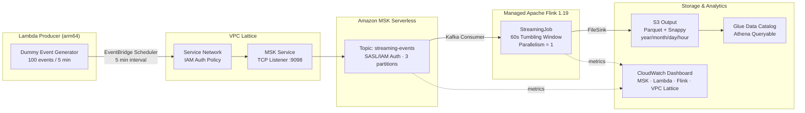

# vpc-lattice-msk-flink-streaming-platform

> Real-time streaming platform using VPC Lattice × Amazon MSK × Apache Flink on AWS

[\](https://www.terraform.io/)
[\](https://flink.apache.org/)
[\](https://aws.amazon.com/)

Lambda ProducerがダミーデータをAmazon MSK（Kafka）に送信し、VPC Lattice でサービス間通信を制御しながら、Apache Flink がリアルタイム集計してS3にParquet形式で保存するストリーミング基盤。

## このハンズオンで得られること

- Terraform で AWS のストリーミング基盤をモジュール分割して構築する流れを理解できる
- Amazon MSK Serverless に対して、Lambda と Flink から SASL/IAM 認証で接続する方法を学べる
- Managed Service for Apache Flink を使って、Kafka ストリームをリアルタイム集計し S3 に Parquet 出力する構成を体験できる
- Glue Data Catalog と Athena を組み合わせて、ストリーミング集計結果を分析可能な形にする流れを理解できる
- CloudWatch Dashboard と Alarm を使って、ストリーミング基盤の監視ポイントを整理できる
- 実務に近い形で、ビルド、デプロイ、検証、後片付けまで一連の運用手順を追える

## Architecture



## 主要コンポーネント / Key Components

### VPC Lattice
- Service Network を介したL7アクセス制御
- IAM Auth Policy で「どのロールがどのサービスに接続できるか」を宣言
- 将来のマルチアカウント展開を AWS RAM 経由でゼロ変更対応

### Amazon MSK Serverless
- ブローカー管理不要のフルマネージド Kafka
- SASL/IAM 認証でアクセスキー不使用
- ポート 9098 (TLS) のみ開放

### Managed Service for Apache Flink
- Parallelism = 1 でコスト最適化（約 $8/月）
- 60秒タンブリングウィンドウで `service_name` 別に集計
- EXACTLY_ONCE セマンティクスで正確な集計を保証

### Glue Data Catalog + Athena
- S3 の Parquet ファイルを仮想テーブルとして定義
- `year/month/day/hour` パーティション構成で高速クエリ
- Athena engine v3 を採用

### CloudWatch Dashboard
- MSK・Lambda・Flink・VPC Lattice の主要メトリクスを一元表示
- Flink の処理が止まった場合にアラームで通知

## ディレクトリ構造

```
vpc-lattice-msk-flink-streaming-platform/
├── terraform/
│   ├── main.tf                    # Provider設定・モジュール呼び出し
│   ├── variables.tf
│   ├── outputs.tf
│   ├── locals.tf
│   └── modules/
│       ├── networking/            # VPC・サブネット・SG
│       ├── vpc_lattice/           # Service Network・Service・Association
│       ├── msk/                   # MSK Serverless クラスター
│       ├── flink/                 # Managed Flink アプリ
│       ├── lambda_producer/       # ダミーデータ生成 Lambda
│       ├── s3/                    # 出力先 S3 バケット
│       ├── glue/                  # Glue Data Catalog・Athena Workgroup
│       └── observability/         # CloudWatch Dashboard・Alarm
├── flink-app/
│   ├── pom.xml
│   └── src/main/java/com/example/streaming/StreamingJob.java
└── scripts/
    ├── build_flink_app.sh
    └── build_lambda.sh
```

## Getting Started

### Prerequisites

- Terraform >= 1.6
- Python 3.12
- Java 17
- Maven 3.9+
- AWS CLI v2
- AWS アカウント（`ap-northeast-1` 推奨）
- Terraform state 用の S3 バケット

### 事前に理解しておくこと

- Terraform のデフォルト値では、主要リソース名は `streaming-dev-*` になります
- 例:
  - Flink アプリ名: `streaming-dev-flink-app`
  - Lambda 関数名: `streaming-dev-producer`
  - MSK クラスター名: `streaming-dev-msk-cluster`
- この README では `terraform apply` まで含めて手順を記載していますが、実行主体はユーザーです
- Flink アプリ用 JAR と Lambda zip は、Terraform 実行前にローカルでビルドしておく必要があります

### 0. 変数を準備する

以下を自分の環境に合わせて決めます。

```bash
export AWS_REGION=ap-northeast-1
export AWS_ACCOUNT_ID=123456789012
export TF_STATE_BUCKET=your-terraform-state-bucket
```

Terraform state 用の S3 バケットが未作成なら、先にユーザー自身で用意してください。

### 1. AWS 認証を確認する

```bash
aws sts get-caller-identity
aws configure get region
```

期待すること:

- `Account` が `AWS_ACCOUNT_ID` と一致する
- 利用リージョンが `ap-northeast-1` になっている

### 2. Python 仮想環境を用意する

このリポジトリでは Lambda パッケージ作成時に `pip` を使うため、プロジェクトルートで仮想環境を使うのが安全です。

```bash
python3 -m venv .venv
source .venv/bin/activate
which python
```

期待すること:

- `which python` の出力が `.venv/bin/python` を指している

補足:

- 現在のリポジトリには `requirements.txt` は含まれていません
- Lambda 用依存ライブラリは `scripts/build_lambda.sh` 実行時に zip 内へ直接インストールされます

### 3. Lambda デプロイパッケージをビルドする

Terraform は `terraform/modules/lambda_producer/lambda_producer.zip` を前提に Lambda を作成します。先に zip を生成します。

```bash
bash scripts/build_lambda.sh
```

期待すること:

- `terraform/modules/lambda_producer/lambda_producer.zip` が作成される

注意:

- スクリプト内で `kafka-python-ng`、`aws-lambda-powertools`、`aws-msk-iam-sasl-signer` をインストールします
- ローカル環境依存を避けたい場合は、Linux/arm64 に近い環境でビルドしてください

### 4. Terraform を初期化して先に S3 バケット群を作成する

Flink JAR のアップロード先バケットは Terraform で作成されるため、まず一度インフラを作成します。

```bash
cd terraform

terraform init \
  -backend-config="bucket=${TF_STATE_BUCKET}" \
  -backend-config="key=vpc-lattice-msk-flink/terraform.tfstate" \
  -backend-config="region=${AWS_REGION}"

terraform plan \
  -var="aws_account_id=${AWS_ACCOUNT_ID}" \
  -var="backend_bucket=${TF_STATE_BUCKET}"
```

`plan` を確認して問題なければ、ユーザー自身で `apply` を実行します。

```bash
terraform apply \
  -var="aws_account_id=${AWS_ACCOUNT_ID}" \
  -var="backend_bucket=${TF_STATE_BUCKET}"
```

### 5. 作成された S3 バケット名を確認する

Flink JAR をアップロードするため、Terraform output からバケット名を確認します。

```bash
terraform output
```

特に確認する値:

- `flink_app_bucket_id`
- `output_bucket_id`
- `flink_app_name`
- `producer_role_arn`
- `msk_bootstrap_brokers_sasl_iam`

`flink_app_bucket_id` の値をメモしておきます。

### 6. Flink アプリをビルドして S3 にアップロードする

Terraform で作成した Flink アプリ用バケットに JAR を配置します。

```bash
cd ..
bash scripts/build_flink_app.sh YOUR_FLINK_APP_BUCKET
```

例:

```bash
bash scripts/build_flink_app.sh streaming-dev-flink-app-123456789012
```

期待すること:

- `flink-app/target/streaming-job-1.0.0.jar` が生成される
- `s3://YOUR_FLINK_APP_BUCKET/flink-app/streaming-job-1.0.0.jar` にアップロードされる

### 7. Flink JAR アップロード後に再度 Terraform を適用する

Managed Flink アプリは S3 上の JAR を参照するため、JAR 配置後に再度 `plan` と `apply` を行うと安全です。

```bash
cd terraform

terraform plan \
  -var="aws_account_id=${AWS_ACCOUNT_ID}" \
  -var="backend_bucket=${TF_STATE_BUCKET}"
```

問題なければ、ユーザー自身で再度 `apply` を実行します。

```bash
terraform apply \
  -var="aws_account_id=${AWS_ACCOUNT_ID}" \
  -var="backend_bucket=${TF_STATE_BUCKET}"
```

### 8. Flink アプリを起動する

Terraform で作成された Managed Flink アプリは、作成直後に自動実行されない前提で手動起動します。

```bash
aws kinesisanalyticsv2 start-application \
  --application-name streaming-dev-flink-app \
  --run-configuration '{}' \
  --region ${AWS_REGION}
```

補足:

- `project_name` や `environment` を変えた場合は、アプリ名も変わります
- 正確な名前は `terraform output flink_app_name` で確認できます

### 9. Lambda Producer を手動実行して動作確認する

自動スケジュールを待たずに、まず手動で 1 回流して確認します。

```bash
aws lambda invoke \
  --function-name streaming-dev-producer \
  --payload '{}' \
  --region ${AWS_REGION} \
  /tmp/producer-output.json

cat /tmp/producer-output.json
```

補足:

- デフォルト名は `streaming-dev-producer`
- 正確な名前は `terraform output` または AWS コンソールで確認できます

### 10. CloudWatch Logs で Lambda と Flink の状態を見る

Lambda 側:

```bash
aws logs tail /aws/lambda/streaming-dev-producer --follow --region ${AWS_REGION}
```

Flink 側:

```bash
aws logs tail /aws/kinesis-analytics/streaming-dev-flink-app --follow --region ${AWS_REGION}
```

確認ポイント:

- Lambda が `success_count` を出している
- Flink 側で Kafka 接続エラーや S3 書き込みエラーが出ていない

### 11. S3 に Parquet が出力されることを確認する

手動実行またはスケジュール実行から数分待って確認します。

```bash
aws s3 ls s3://streaming-dev-output-${AWS_ACCOUNT_ID}/events/ --recursive --region ${AWS_REGION}
```

期待すること:

- `year=YYYY/month=MM/day=DD/hour=HH/` 配下にファイルが見える

### 12. Athena / Glue で確認する

Glue Database と Table は Terraform で作成されますが、S3 パーティションが自動登録されない場合があります。まずは Athena コンソールで以下を試します。

```sql
MSCK REPAIR TABLE service_metrics;
```

その後、例として次のようなクエリを実行します。

```sql
SELECT
  service_name,
  SUM(total_count) AS total_events,
  SUM(error_count) AS total_errors,
  AVG(avg_latency_ms) AS avg_latency
FROM service_metrics
GROUP BY service_name
ORDER BY total_events DESC;
```

補足:

- Database 名は `terraform output glue_database_name` で確認できます
- Athena Workgroup 名は `terraform output athena_workgroup_name` で確認できます

### 13. CloudWatch Dashboard を開く

```bash
cd terraform
terraform output cloudwatch_dashboard_url
```

確認ポイント:

- Lambda Invocations / Errors
- MSK BytesInPerSec / BytesOutPerSec
- Flink Records In/sec / Out/sec
- Flink checkpoint duration

### 14. 定常動作の確認

この時点で以下が揃えば、ハンズオンとしては成功です。

- EventBridge Scheduler が 5 分おきに Lambda を起動している
- Lambda が MSK にイベントを書き込めている
- Flink が MSK から読んで S3 に Parquet を出力している
- Glue / Athena で集計データを参照できる
- CloudWatch Dashboard で主要メトリクスを追える

### 15. よくあるつまずきポイント

1. `lambda_producer.zip` がない
   `bash scripts/build_lambda.sh` を先に実行します。
2. Flink 起動時に JAR が見つからない
   `scripts/build_flink_app.sh` で正しい S3 バケットへアップロードされているか確認します。
3. Lambda は成功しているのに S3 に何も出ない
   Flink アプリが起動済みか、CloudWatch Logs に Kafka 接続エラーがないかを確認します。
4. Athena で結果が見えない
   `MSCK REPAIR TABLE service_metrics;` を試し、パーティションが認識されているか確認します。

## コスト見積もり / Cost Estimate

| Service | Monthly Cost |
|---|---|
| MSK Serverless | ~$5 |
| Managed Flink (1 KPU) | ~$8 |
| Lambda Producer | < $1 |
| S3 | < $1 |
| VPC Lattice | < $1 |
| CloudWatch | < $1 |
| **Total** | **~$16/month** |

## Architecture Decisions

### なぜ VPC Lattice を MSK 接続に使うのか

従来の MSK 接続は VPC Peering や PrivateLink を手動設定する必要があり、アクセス制御はセキュリティグループのみ。VPC Lattice を導入することで：

1. **L7レベルの IAM Auth Policy** — ロール単位で「どの Lambda/Flink がどのサービスに接続できるか」を宣言的に管理
2. **将来の拡張性** — AWS RAM で別アカウントへの Service Network 共有がゼロ変更で可能
3. **サービスメッシュの起点** — 将来 ECS/EKS のサービス間通信も同じ仕組みで統一できる

### なぜ MSK Serverless なのか

- ブローカー台数・ストレージのキャパシティプランニング不要
- 開発/PoC 用途で実績の少ない時間帯のコストを最小化
- SASL/IAM 認証がデフォルトで有効（PLAINTEXT 誤設定リスクがない）

### なぜ Flink Parallelism = 1 なのか

PoC/ポートフォリオ用途では 1 KPU（≒1 vCPU）で十分。本番スケールが必要な場合は `parallelism` を増やすだけで水平スケールが可能。

## CI/CD

GitHub Actions + OIDC 認証（アクセスキー不使用）。

| Secret | Description |
|---|---|
| `AWS_ROLE_ARN` | OIDC で assume する IAM ロール ARN |
| `TF_STATE_BUCKET` | Terraform state 用 S3 バケット名 |
| `AWS_ACCOUNT_ID` | AWS アカウント ID |

- PR 作成時: `terraform fmt` → `terraform validate` → `terraform plan`（結果をPRコメントに自動投稿）
- main マージ時: fmt / validate のみ（apply は手動）

## Cleanup

```bash
# 1. Flink アプリを停止
aws kinesisanalyticsv2 stop-application \
  --application-name streaming-dev-flink-app \
  --region ${AWS_REGION}

# 2. S3 バケットを空にする（destroy 前に必要）
aws s3 rm s3://streaming-dev-output-${AWS_ACCOUNT_ID} --recursive
aws s3 rm s3://streaming-dev-flink-app-${AWS_ACCOUNT_ID} --recursive

# 3. インフラを削除
cd terraform
terraform destroy \
  -var="aws_account_id=${AWS_ACCOUNT_ID}" \
  -var="backend_bucket=${TF_STATE_BUCKET}"
```

## License

MIT
