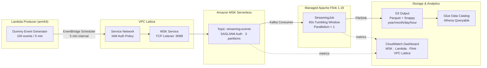

# vpc-lattice-msk-flink-streaming-platform

> Real-time streaming platform using VPC Lattice × Amazon MSK × Apache Flink on AWS

[\](https://www.terraform.io/)
[\](https://flink.apache.org/)
[\](https://aws.amazon.com/)

Lambda ProducerがダミーデータをAmazon MSK（Kafka）に送信し、VPC Lattice でサービス間通信を制御しながら、Apache Flink がリアルタイム集計してS3にParquet形式で保存するストリーミング基盤。

## Architecture



## 主要コンポーネント / Key Components

### VPC Lattice
- Service Network を介したL7アクセス制御
- IAM Auth Policy で「どのロールがどのサービスに接続できるか」を宣言
- 将来のマルチアカウント展開を AWS RAM 経由でゼロ変更対応

### Amazon MSK Serverless
- ブローカー管理不要のフルマネージド Kafka
- SASL/IAM 認証でアクセスキー不使用
- ポート 9098 (TLS) のみ開放

### Managed Service for Apache Flink
- Parallelism = 1 でコスト最適化（約 $8/月）
- 60秒タンブリングウィンドウで `service_name` 別に集計
- EXACTLY_ONCE セマンティクスで正確な集計を保証

### Glue Data Catalog + Athena
- S3 の Parquet ファイルを仮想テーブルとして定義
- `year/month/day/hour` パーティション構成で高速クエリ
- Athena engine v3 を採用

### CloudWatch Dashboard
- MSK・Lambda・Flink・VPC Lattice の主要メトリクスを一元表示
- Flink の処理が止まった場合にアラームで通知

## ディレクトリ構造

```
vpc-lattice-msk-flink-streaming-platform/
├── terraform/
│   ├── main.tf                    # Provider設定・モジュール呼び出し
│   ├── variables.tf
│   ├── outputs.tf
│   ├── locals.tf
│   └── modules/
│       ├── networking/            # VPC・サブネット・SG
│       ├── vpc_lattice/           # Service Network・Service・Association
│       ├── msk/                   # MSK Serverless クラスター
│       ├── flink/                 # Managed Flink アプリ
│       ├── lambda_producer/       # ダミーデータ生成 Lambda
│       ├── s3/                    # 出力先 S3 バケット
│       ├── glue/                  # Glue Data Catalog・Athena Workgroup
│       └── observability/         # CloudWatch Dashboard・Alarm
├── flink-app/
│   ├── pom.xml
│   └── src/main/java/com/example/streaming/StreamingJob.java
└── scripts/
    ├── build_flink_app.sh
    └── test_producer.sh
```

## Getting Started

### Prerequisites

- Terraform >= 1.6
- Java 17（Flink アプリビルド用）
- AWS CLI v2
- AWS アカウント（ap-northeast-1 推奨）

### Deploy

```bash
# 1. Flink アプリをビルドして S3 にアップロード
bash scripts/build_flink_app.sh YOUR_FLINK_APP_BUCKET

# 2. インフラをデプロイ
cd terraform
terraform init \
  -backend-config="bucket=YOUR_STATE_BUCKET" \
  -backend-config="key=vpc-lattice-msk-flink/terraform.tfstate" \
  -backend-config="region=ap-northeast-1"

terraform apply \
  -var="aws_account_id=YOUR_ACCOUNT_ID" \
  -var="backend_bucket=YOUR_STATE_BUCKET"

# 3. Flink アプリを起動
aws kinesisanalyticsv2 start-application \
  --application-name streaming-flink-app \
  --region ap-northeast-1
```

### Verify

```bash
# Lambda を手動実行してデータを送信
bash scripts/test_producer.sh

# 約 6 分後、S3 に Parquet が出力されていることを確認
aws s3 ls s3://streaming-output-YOUR_ACCOUNT/events/ --recursive

# Athena でクエリ（マネジメントコンソール or AWS CLI）
# SELECT service_name, SUM(total_count), AVG(avg_latency_ms)
# FROM streaming_db.service_metrics
# WHERE year='2026' AND month='04'
# GROUP BY service_name
# ORDER BY SUM(total_count) DESC

# terraform output で主要リソースを確認
terraform output
```

## コスト見積もり / Cost Estimate

| Service | Monthly Cost |
|---|---|
| MSK Serverless | ~$5 |
| Managed Flink (1 KPU) | ~$8 |
| Lambda Producer | < $1 |
| S3 | < $1 |
| VPC Lattice | < $1 |
| CloudWatch | < $1 |
| **Total** | **~$16/month** |

## Architecture Decisions

### なぜ VPC Lattice を MSK 接続に使うのか

従来の MSK 接続は VPC Peering や PrivateLink を手動設定する必要があり、アクセス制御はセキュリティグループのみ。VPC Lattice を導入することで：

1. **L7レベルの IAM Auth Policy** — ロール単位で「どの Lambda/Flink がどのサービスに接続できるか」を宣言的に管理
2. **将来の拡張性** — AWS RAM で別アカウントへの Service Network 共有がゼロ変更で可能
3. **サービスメッシュの起点** — 将来 ECS/EKS のサービス間通信も同じ仕組みで統一できる

### なぜ MSK Serverless なのか

- ブローカー台数・ストレージのキャパシティプランニング不要
- 開発/PoC 用途で実績の少ない時間帯のコストを最小化
- SASL/IAM 認証がデフォルトで有効（PLAINTEXT 誤設定リスクがない）

### なぜ Flink Parallelism = 1 なのか

PoC/ポートフォリオ用途では 1 KPU（≒1 vCPU）で十分。本番スケールが必要な場合は `parallelism` を増やすだけで水平スケールが可能。

## CI/CD

GitHub Actions + OIDC 認証（アクセスキー不使用）。

| Secret | Description |
|---|---|
| `AWS_ROLE_ARN` | OIDC で assume する IAM ロール ARN |
| `TF_STATE_BUCKET` | Terraform state 用 S3 バケット名 |
| `AWS_ACCOUNT_ID` | AWS アカウント ID |

- PR 作成時: `terraform fmt` → `terraform validate` → `terraform plan`（結果をPRコメントに自動投稿）
- main マージ時: fmt / validate のみ（apply は手動）

## Cleanup

```bash
# 1. Flink アプリを停止
aws kinesisanalyticsv2 stop-application \
  --application-name streaming-flink-app \
  --region ap-northeast-1

# 2. S3 バケットを空にする（destroy 前に必要）
aws s3 rm s3://streaming-output-YOUR_ACCOUNT --recursive

# 3. インフラを削除
cd terraform
terraform destroy \
  -var="aws_account_id=YOUR_ACCOUNT_ID" \
  -var="backend_bucket=YOUR_STATE_BUCKET"
```

## License

MIT
