# VPC Network Deep Dive — アーキテクチャ完全解説

## 目次

1. [プロジェクト概要](#1-プロジェクト概要)
2. [全体アーキテクチャ図](#2-全体アーキテクチャ図)
3. [CIDR・サブネット設計](#3-cidrサブネット設計)
4. [Phase 1: Hub-Spoke VPC 基盤](#4-phase-1-hub-spoke-vpc-基盤)
5. [Phase 2: VPC Peering とルーティング](#5-phase-2-vpc-peering-とルーティング)
6. [Phase 3: VPC Endpoint](#6-phase-3-vpc-endpoint)
7. [Phase 4: カスタム PrivateLink](#7-phase-4-カスタム-privatelink)
8. [通信フロー早見表](#8-通信フロー早見表)
9. [セキュリティグループ設計](#9-セキュリティグループ設計)
10. [IAM 設計](#10-iam-設計)
11. [Terraform モジュール設計](#11-terraform-モジュール設計)
12. [Terraform State 管理](#12-terraform-state-管理)
13. [コスト設計](#13-コスト設計)
14. [学習チェックポイント](#14-学習チェックポイント)
15. [ADR 一覧](#15-adr-一覧)

---

## 1. プロジェクト概要

AWSネットワーク設計を実務レベルで体得するための段階的ハンズオン。
「なぜこの設計なのか」を一問一答で答えられるエンジニアになることがゴール。

| フェーズ | テーマ | 核心的な問い |
|---|---|---|
| Phase 1 | Hub-Spoke VPC 基盤 | なぜ Hub-Spoke 構成か？TGW との違いは？ |
| Phase 2 | VPC Peering + ルーティング | Peering でルート対称性が必要な理由は？ |
| Phase 3 | VPC Endpoint | Gateway 型と Interface 型の技術的違いは？ |
| Phase 4 | カスタム PrivateLink | NLB が必要な理由は？Peering との本質的な違いは？ |

**設計制約**

| 制約 | 内容 |
|---|---|
| コスト | $5/月以内 |
| NAT Gateway | 使用禁止（Session Manager で代替） |
| IAM アクセスキー | 発行禁止（Instance Profile 使用） |
| IMDSv2 | 必須（IMDSv1 は SSRF リスクのため禁止） |
| EC2 | arm64 (t4g.nano) 限定（x86 比 約 20% コスト削減） |

---

## 2. 全体アーキテクチャ図

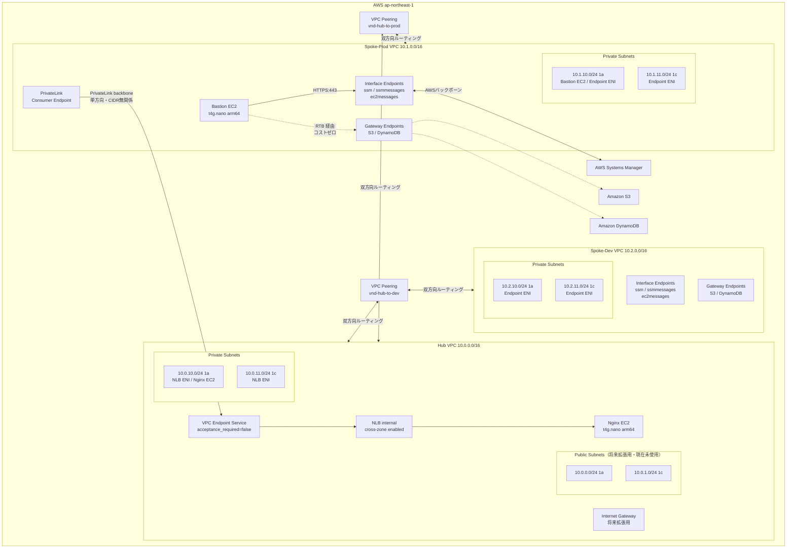

---

## 3. CIDR・サブネット設計

### VPC CIDR 割り当て

| VPC | CIDR | 用途 | IGW |
|---|---|---|---|
| Hub | `10.0.0.0/16` | 共有サービス・PrivateLink 公開元 | あり（将来拡張用） |
| Spoke-Prod | `10.1.0.0/16` | 本番相当ワークロード | なし |
| Spoke-Dev | `10.2.0.0/16` | 開発相当ワークロード | なし |

CIDR を /16 単位で第 2 オクテットにより分離しているため、Peering 設定時の CIDR 重複リスクがなく、IP アドレス（`10.X.x.x`）を見ただけで所属 VPC が判別できる。

### サブネット詳細

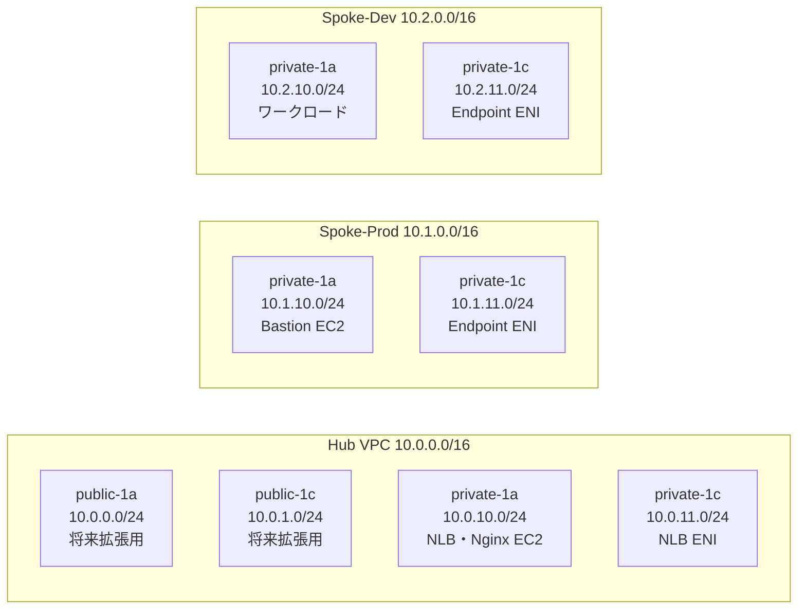

**サブネットを /24 にした理由**: AWS は各サブネットで 5 IP を予約するため /24（使用可能 251 IP）が学習用途に十分な余裕を持つ。/28（11 IP）のような Endpoint 専用サブネット分割は今回スコープ外とした。

**第 3 オクテットのルール**: `10.x.0.0/24`〜`10.x.1.0/24` が Public、`10.x.10.0/24`〜`10.x.11.0/24` が Private。10 番台を Private に使うことで AZ 追加時も `10.x.12.0/24`、`10.x.13.0/24` と自然に拡張できる。

---

## 4. Phase 1: Hub-Spoke VPC 基盤

### 作成リソース

| 環境 | 作成されるリソース |
|---|---|
| Hub | VPC / Public×2 + Private×2 サブネット / Public・Private RTB / IGW / default SG 無効化 |
| Spoke-Prod | VPC / Private×2 サブネット / Private RTB / default SG 無効化 |
| Spoke-Dev | VPC / Private×2 サブネット / Private RTB / default SG 無効化 |

### Hub-Spoke 構成にする理由

| 観点 | フラット VPC（単一） | Hub-Spoke |
|---|---|---|
| 環境分離 | 不可（prod/dev が混在） | VPC 単位で完全分離 |
| 爆発半径 | 全環境に影響 | 各 Spoke に限定 |
| 拡張性 | CIDR 枯渇リスク | Spoke 追加で対応 |
| 将来の TGW 移行 | 困難 | そのまま移行可 |

### vpc モジュールの内部構造

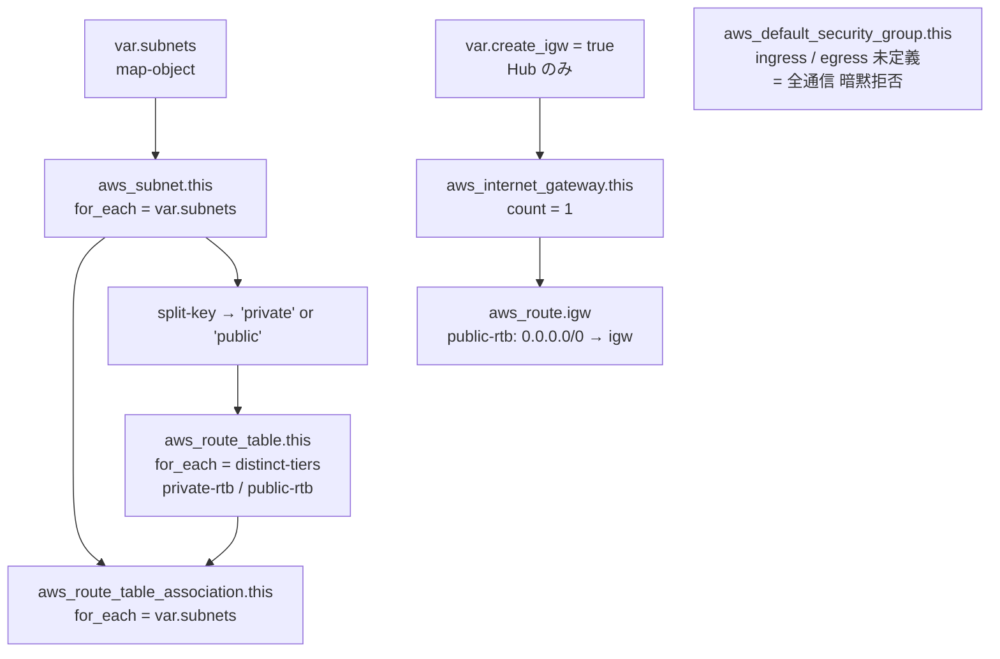

**`count` ではなく `for_each` を使う理由**: `count` はインデックスベースのため、サブネットリストの中間要素を削除すると後続リソースの再作成が発生する。`for_each` はキーベースのため、該当リソースのみ差分適用される。

**default SG 無効化の意図**: EC2 などが意図せず default SG にアタッチされた場合に通信が通らないようにするセキュリティハードニング。明示的な SG 設計を強制できる。

---

## 5. Phase 2: VPC Peering とルーティング

### Peering 接続トポロジー

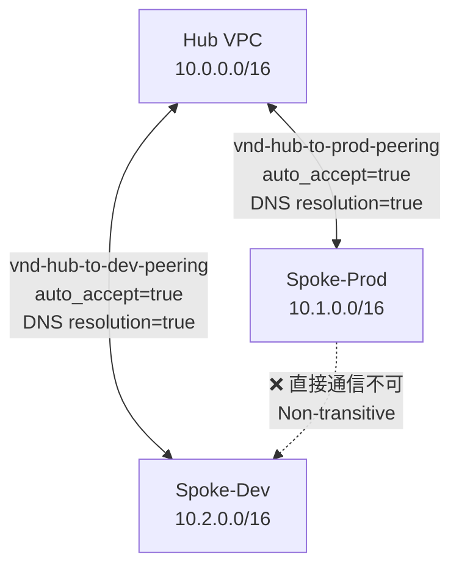

**Spoke 間通信が不可な理由（Non-transitive）**: VPC Peering は単純な L3 ルーティング。Hub を中継点として転送する機能を持たない。Prod → Hub → Dev のパケット転送は Hub のルートテーブルに該当エントリがなく到達不可。これが **Transit Gateway が必要になる本質的な理由** でもある。

### Phase 2 完了後のルートテーブル全体像

**Hub private-rtb**

| Destination | Target | 設定タイミング |
|---|---|---|
| `10.0.0.0/16` | local | VPC 作成時（自動） |
| `10.1.0.0/16` | `pcx-xxx`（Hub↔Prod） | Phase 2 |
| `10.2.0.0/16` | `pcx-yyy`（Hub↔Dev） | Phase 2 |

**Hub public-rtb**

| Destination | Target | 設定タイミング |
|---|---|---|
| `10.0.0.0/16` | local | VPC 作成時 |
| `0.0.0.0/0` | `igw-xxx` | Phase 1 |
| `10.1.0.0/16` | `pcx-xxx` | Phase 2 |
| `10.2.0.0/16` | `pcx-yyy` | Phase 2 |

**Spoke-Prod private-rtb**

| Destination | Target | 設定タイミング |
|---|---|---|
| `10.1.0.0/16` | local | VPC 作成時 |
| `10.0.0.0/16` | `pcx-xxx` | Phase 2 |
| `pl-xxx`（S3） | `vpce-s3` | Phase 3 |
| `pl-yyy`（DDB） | `vpce-ddb` | Phase 3 |

### ルート対称性が必要な理由

TCP はステートフルなプロトコル。SYN は Hub → Spoke に到達しても、SYN-ACK が Spoke → Hub へ戻れなければ接続が確立しない。Peering 接続だけでは通信できず、**双方向のルートテーブルエントリが必ず必要**。

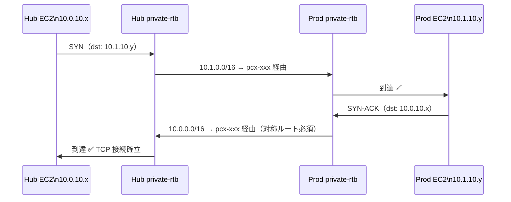

### DNS 解決の有効化が必要な理由

```hcl
accepter  { allow_remote_vpc_dns_resolution = true }
requester { allow_remote_vpc_dns_resolution = true }
```

Spoke から Hub の Interface Endpoint のプライベート DNS 名（例: `ssm.ap-northeast-1.amazonaws.com`）を Peering 越しに解決できるようにする設定。これがないと名前解決がパブリック IP に向いてしまい、プライベート経路が使えない。

---

## 6. Phase 3: VPC Endpoint

### Gateway 型 vs Interface 型

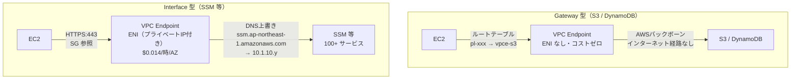

| 比較観点 | Gateway 型 | Interface 型 |
|---|---|---|
| 実装方式 | ルートテーブルに Prefix List ルートを追加 | 指定サブネットに ENI（プライベート IP）を作成 |
| 対応サービス | S3 / DynamoDB のみ | 100+ の AWS サービス |
| コスト | **無料** | $0.014/時/AZ |
| セキュリティ制御 | エンドポイントポリシーのみ | SG + エンドポイントポリシー |
| DNS | 変更なし（Prefix List ルートで動作） | `private_dns_enabled=true` でサービス名を上書き |
| マルチ AZ | ルートテーブル経由で自動対応 | 各 AZ にサブネット指定が必要 |

### Session Manager が動く仕組み（NAT Gateway 不要の理由）

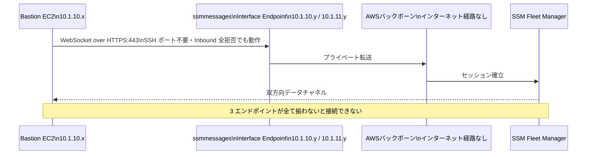

**3 エンドポイントが全て必要な理由**:

| エンドポイント | 役割 | 欠けた場合 |
|---|---|---|
| `ssm` | SSM API（パラメータストア・セッション開始要求） | セッション開始コマンドが失敗 |
| `ssmmessages` | Session Manager のデータチャネル（WebSocket） | セッション確立後に通信不能 |
| `ec2messages` | SSM Run Command のメッセージング | Run Command が失敗 |

### SG 責務分離設計

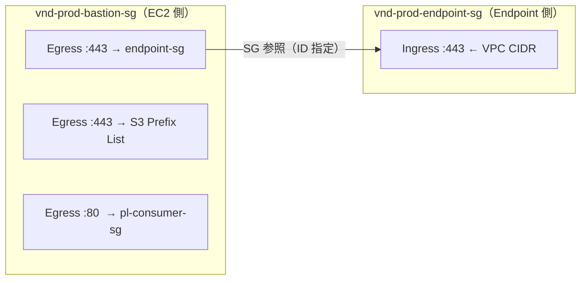

Endpoint 側の SG で許可ルールを集約する設計の利点：新しい EC2 を追加するたびに Inbound ルールを変更する必要がない。EC2 の SG に「Endpoint SG への egress」を追加するだけでよい。

---

## 7. Phase 4: カスタム PrivateLink

### PrivateLink 全体構成

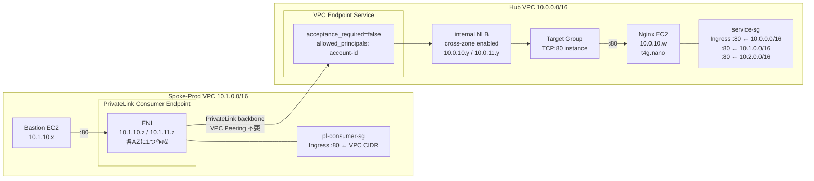

### NLB が必要な 3 つの理由

PrivateLink はバックエンドとして **NLB または GLB のみ**を受け付ける。

| 理由 | 詳細 |
|---|---|
| **固定 ENI** | NLB は各 AZ のサブネットに固定 ENI（プライベート IP）を作成する。PrivateLink はこの固定 IP をルーティング先として登録する。EC2 の IP は可変なので直接指定できない |
| **ヘルスチェック** | NLB が背後の EC2 の死活監視を行い、不健全なターゲットへのルーティングを自動停止する |
| **スケーラビリティ** | Auto Scaling で EC2 が増減しても Consumer 側は常に同じ Endpoint DNS 名でアクセスできる |

### PrivateLink vs VPC Peering の本質的な違い

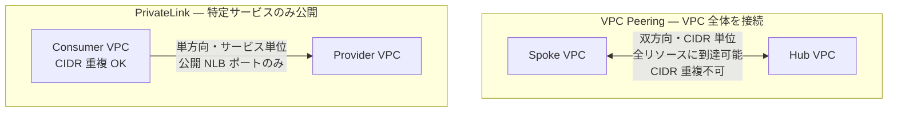

| 観点 | VPC Peering | PrivateLink |
|---|---|---|
| 通信方向 | 双方向（お互いの VPC 全体） | 単方向（公開サービスのみ） |
| CIDR オーバーラップ | **不可** | **可（無関係）** |
| 公開粒度 | VPC 全体 | 特定 NLB ポートのみ |
| コスト | 無料（転送量のみ） | $0.014/時/AZ + データ量 |
| Consumer の承認制御 | なし | `acceptance_required` で制御可 |
| 典型的なユースケース | 社内 VPC 間の自由な通信 | SaaS モデル・最小権限サービス公開 |

### Provider / Consumer の Terraform 実装フロー

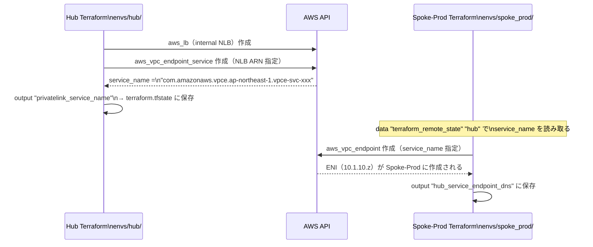

**`private_dns_enabled = false` の理由**: カスタム PrivateLink は AWS マネージドサービスと異なり、既存の DNS 名（例: `ssm.ap-northeast-1.amazonaws.com`）に対応するドメインを持たない。Consumer は Endpoint の DNS 名（`vpce-xxx.vpce-svc-xxx.ap-northeast-1.vpce.amazonaws.com`）で直接アクセスする。Route53 プライベートホストゾーンと組み合わせれば任意の名前でアクセス可能。

---

## 8. 通信フロー早見表

### フロー 1: Session Manager（Spoke-Prod Bastion → SSM）

```
Bastion EC2 (10.1.10.x)
  │ :443 [bastion-sg: egress to endpoint-sg]
  ↓
ssmmessages Interface Endpoint ENI (10.1.10.y)
  │ [endpoint-sg: ingress :443 from 10.1.0.0/16]
  ↓
AWS バックボーン（インターネット経路なし）
  ↓
SSM Fleet Manager ←→ 双方向 WebSocket データチャネル確立
```

### フロー 2: S3 アクセス（Spoke-Prod Bastion → S3）

```
Bastion EC2 (10.1.10.x)
  │ :443 [bastion-sg: egress to S3 Prefix List]
  ↓
Spoke-Prod private-rtb: pl-xxx → vpce-s3（Gateway Endpoint）
  │ ENI なし・ルートテーブルのみで動作
  ↓
Amazon S3（パブリック IP だがインターネット経路は使わない）
```

### フロー 3: PrivateLink（Spoke-Prod Bastion → Hub Nginx）

```
Bastion EC2 (10.1.10.x)
  │ :80 [bastion-sg: egress to pl-consumer-sg]
  ↓
PrivateLink Consumer Endpoint ENI (10.1.10.z)
  │ [pl-consumer-sg: ingress :80 from 10.1.0.0/16]
  ↓
AWS PrivateLink バックボーン（VPC Peering 不要・CIDR 無関係）
  ↓
Hub NLB ENI (10.0.10.y)
  │ NLB がヘルスチェック済みのターゲットへ転送
  ↓ [service-sg: ingress :80 from 10.0.0.0/16, 10.1.0.0/16, 10.2.0.0/16]
Nginx EC2 (10.0.10.w)
  → レスポンス: "<h1>Hub Service via PrivateLink - ip-10-0-xx-xx</h1>"
```

### フロー 4: VPC Peering（Hub ↔ Spoke-Prod 双方向）

```
Hub リソース (10.0.10.x)          Spoke-Prod リソース (10.1.10.y)
  │                                     │
  │ Hub private-rtb:                    │ Prod private-rtb:
  │ 10.1.0.0/16 → pcx-xxx              │ 10.0.0.0/16 → pcx-xxx
  └──────────── pcx-xxx ───────────────┘
               VPC Peering Connection
               （双方向ルート必須）
```

---

## 9. セキュリティグループ設計

### Spoke-Prod の SG 全体図

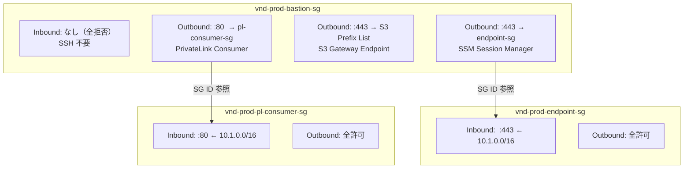

### Hub の SG

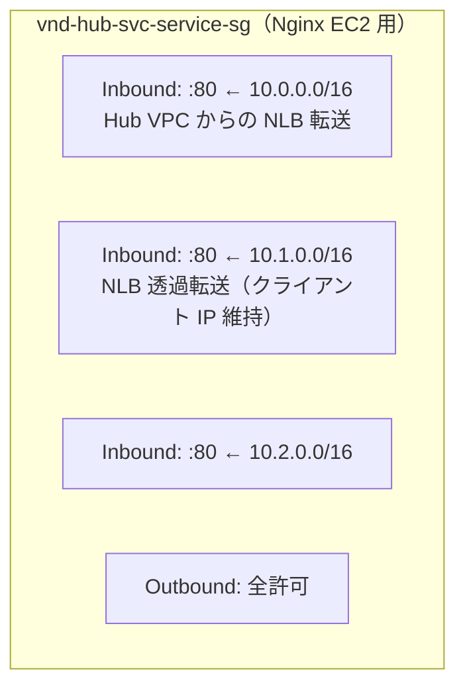

**NLB でクライアント IP が透過される理由**: NLB は L4 ロードバランサーのため送信元 IP を変換しない。Nginx EC2 の SG で Spoke の CIDR を許可する必要がある理由がここにある。

---

## 10. IAM 設計

### Spoke-Prod Bastion

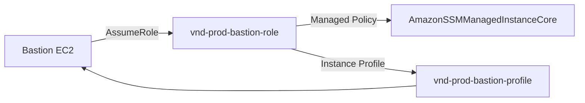

### Hub Nginx EC2

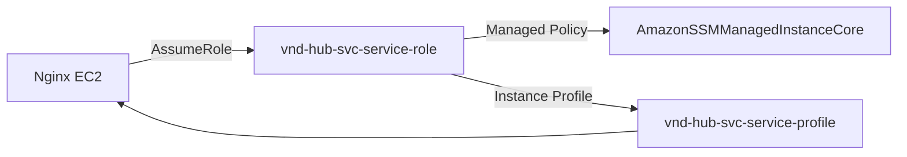

`AmazonSSMManagedInstanceCore` が付与する権限（最小限）:

| 権限 | 用途 |
|---|---|
| `ssm:UpdateInstanceInformation` | SSM にインスタンスを登録 |
| `ssmmessages:CreateControlChannel` | Session Manager コントロールチャネル確立 |
| `ssmmessages:CreateDataChannel` | Session Manager データチャネル確立 |
| `ec2messages:GetMessages` | Run Command の受信 |
| `s3:GetObject` | セッションログの S3 保存 |

### IMDSv2 強制の理由

```hcl
metadata_options {
  http_endpoint               = "enabled"
  http_tokens                 = "required"   # IMDSv2 必須
  http_put_response_hop_limit = 1            # コンテナからのメタデータアクセス防止
}
```

IMDSv1 は単純な GET リクエストでアクセスできるため SSRF 攻撃でインスタンス認証情報が窃取されるリスクがある。IMDSv2 はセッショントークンが必要なため SSRF に耐性を持つ。

---

## 11. Terraform モジュール設計

### モジュール一覧

| モジュール | パス | 責務 |
|---|---|---|
| `vpc` | `modules/vpc/` | VPC・サブネット・RTB・IGW |
| `vpc_peering` | `modules/vpc_peering/` | Peering 接続と双方向ルート追加 |
| `endpoint` | `modules/endpoint/` | Gateway/Interface Endpoint と SG |
| `privatelink` | `modules/privatelink/` | NLB + Nginx EC2 + Endpoint Service |

### モジュール依存関係

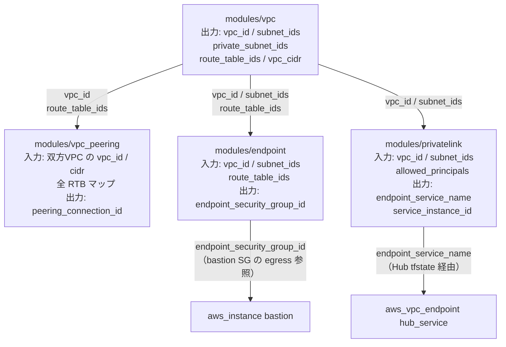

### 各モジュールの変数・Output

#### `modules/vpc`

| 変数 | 型 | 説明 |
|---|---|---|
| `prefix` | string | リソース名プレフィックス（例: `vnd-hub`） |
| `cidr_block` | string | VPC CIDR |
| `subnets` | map(object) | サブネット定義（cidr / az / public） |
| `create_igw` | bool | IGW 作成フラグ（Hub のみ true） |

| Output | 説明 |
|---|---|
| `vpc_id` | VPC ID |
| `vpc_cidr` | VPC CIDR ブロック |
| `subnet_ids` | `{ "private-1a" = "subnet-xxx" }` のマップ |
| `route_table_ids` | `{ "private" = "rtb-xxx" }` のマップ |
| `private_subnet_ids` | private プレフィックスのサブネット ID リスト |

#### `modules/vpc_peering`

| 変数 | 型 | 説明 |
|---|---|---|
| `requester_vpc_id` | string | 申請側 VPC ID（Hub） |
| `requester_vpc_cidr` | string | 申請側 VPC CIDR |
| `requester_route_table_ids` | map(string) | Hub の全 RTB マップ |
| `accepter_vpc_id` | string | 承認側 VPC ID（Spoke） |
| `accepter_vpc_cidr` | string | 承認側 VPC CIDR |
| `accepter_route_table_ids` | map(string) | Spoke の全 RTB マップ |

#### `modules/endpoint`

| 変数 | 型 | 説明 |
|---|---|---|
| `gateway_endpoints` | map(object) | `{ "s3" = { policy = null } }` 形式 |
| `interface_endpoints` | set(string) | `["ssm", "ssmmessages", "ec2messages"]` 形式 |

| Output | 説明 |
|---|---|
| `endpoint_security_group_id` | Interface Endpoint 用 SG ID（EC2 の egress 参照用） |
| `gateway_endpoint_ids` | Gateway Endpoint ID マップ |
| `interface_endpoint_ids` | Interface Endpoint ID マップ |

#### `modules/privatelink`

| 変数 | 型 | 説明 |
|---|---|---|
| `service_subnet_id` | string | Nginx EC2 を配置するサブネット ID |
| `nlb_subnet_ids` | list(string) | NLB ENI を配置するサブネット ID リスト（マルチ AZ） |
| `allowed_cidr_blocks` | list(string) | Nginx SG への許可 CIDR |
| `allowed_principals` | list(string) | Consumer 許可アカウントの IAM ARN |

| Output | 説明 |
|---|---|
| `endpoint_service_name` | Consumer が Endpoint 作成時に指定するサービス名 |
| `nlb_arn` | NLB の ARN |
| `service_instance_id` | Nginx EC2 の Instance ID（Session Manager 接続確認用） |

---

## 12. Terraform State 管理

### State の分割戦略

```
envs/
├── hub/          → terraform.tfstate（Hub 専用）
├── spoke_prod/   → terraform.tfstate（Spoke-Prod 専用）
└── spoke_dev/    → terraform.tfstate（Spoke-Dev 専用）
```

State を環境ごとに分割する理由：

| 理由 | 詳細 |
|---|---|
| **爆発半径の限定** | Spoke-Prod の State 破損が Hub や Spoke-Dev に影響しない |
| **並行作業** | Hub と Spoke-Dev を同時に apply 可能 |
| **権限分離** | 将来的に環境ごとに IAM 権限を分けられる |
| **destroy の安全性** | Spoke-Prod だけを destroy しても他環境に影響しない |

### State 間の参照関係

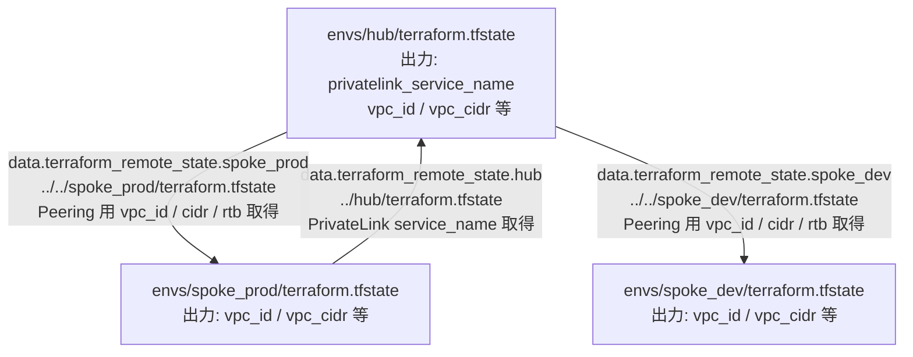

### 推奨 apply 順序

```bash
# Step 1: Spoke を先に apply（Hub が参照するため）
cd envs/spoke_prod && terraform init && terraform apply
cd envs/spoke_dev  && terraform init && terraform apply

# Step 2: Hub を apply（Peering + PrivateLink Service）
cd envs/hub && terraform init && terraform apply
# → output.privatelink_service_name が tfstate に保存される

# Step 3: Spoke-Prod に Consumer Endpoint を作成
cd envs/spoke_prod && terraform apply
# → data.terraform_remote_state.hub で service_name を読み取る
```

### 推奨 destroy 順序（コスト発生リソースの削除）

```bash
# Consumer を先に destroy してから Provider を destroy
cd envs/spoke_prod && terraform destroy
cd envs/spoke_dev  && terraform destroy
cd envs/hub        && terraform destroy
```

---

## 13. コスト設計

### リソース別コスト（東京リージョン）

| リソース | 単価 | 月額（常時起動） | 対策 |
|---|---|---|---|
| NLB（Hub） | $0.0243/時 | $17.5 | 検証後 destroy |
| Interface Endpoint × 3（Spoke-Prod 2AZ） | $0.014/時/AZ × 2 × 3 | $30.2 | 検証後 destroy |
| Interface Endpoint × 3（Spoke-Dev 2AZ） | $0.014/時/AZ × 2 × 3 | $30.2 | 検証後 destroy |
| PrivateLink Consumer EP（Spoke-Prod 2AZ） | $0.014/時/AZ × 2 | $20.2 | 検証後 destroy |
| EC2 t4g.nano × 2（Bastion + Nginx） | $0.0052/時 × 2 | $7.5 | 検証時のみ起動 |
| VPC Peering（接続自体） | 無料 | $0 | — |
| Gateway Endpoint（S3/DynamoDB） | 無料 | $0 | — |

### $5/月 以内の達成方法（2 時間で完結させる前提）

| フェーズ | 2 時間のコスト |
|---|---|
| Phase 1（VPC のみ） | $0 |
| Phase 2（+ Peering） | $0 |
| Phase 3（+ Interface Endpoint） | $0.17 |
| Phase 4（+ NLB + PrivateLink） | $0.12 |
| **合計** | **$0.29** |

### 禁止パターン

```hcl
# ❌ NAT Gateway は使用禁止（$0.062/時 = $44/月）
resource "aws_nat_gateway" "this" { ... }

# ❌ IAM アクセスキーは発行禁止
resource "aws_iam_access_key" "this" { ... }

# ❌ IMDSv1 は許可禁止
metadata_options { http_tokens = "optional" }   # required にすること
```

---

## 14. 学習チェックポイント

### Phase 1: Hub-Spoke 基盤

- [ ] Hub-Spoke 構成にする理由を 3 つ説明できる（環境分離・爆発半径・拡張性）
- [ ] `for_each` vs `count` の違いとそれぞれの使いどころを説明できる
- [ ] default SG を無効化する意図を説明できる

### Phase 2: VPC Peering

- [ ] VPC Peering が Non-transitive（非推移的）である理由を説明できる
- [ ] ルート対称性（双方向ルート）が必要な理由を TCP の観点から説明できる
- [ ] Spoke 間直接通信が不可な理由と TGW が解決する点を説明できる
- [ ] `dns_resolution = true` がなぜ必要かを説明できる

### Phase 3: VPC Endpoint

- [ ] Gateway 型と Interface 型の技術的な実装の違いを説明できる
- [ ] Session Manager に 3 つのエンドポイントが必要な理由を説明できる
- [ ] NAT Gateway なしで AWS API に到達できる理由を説明できる
- [ ] SG 間参照設計（Endpoint SG に Inbound を集約）の利点を説明できる

### Phase 4: カスタム PrivateLink

- [ ] NLB がなぜ必要かを「固定 ENI」の観点から説明できる
- [ ] PrivateLink が CIDR オーバーラップを気にしない理由を説明できる
- [ ] `private_dns_enabled = false` にした理由を説明できる
- [ ] `acceptance_required` の本番での意義を説明できる
- [ ] VPC Peering と PrivateLink を使い分ける判断基準を 3 つ挙げられる

---

## 15. ADR 一覧

| ADR | タイトル | 決定内容 |
|---|---|---|
| [ADR-001](adr/ADR-001_cidr_design.md) | CIDR 設計 | /16 単位で第 2 オクテット分離、サブネットは /24 統一 |
| [ADR-002](adr/ADR-002_peering_vs_tgw.md) | Peering vs TGW | コストと学習目的から Peering を採用。TGW は $72/月のため対象外 |
| [ADR-003](adr/ADR-003_endpoint_strategy.md) | Endpoint 戦略 | S3/DynamoDB は Gateway（無料）、SSM 系は Interface（必要）、NAT GW 禁止 |
| [ADR-004](adr/ADR-004_privatelink_design.md) | PrivateLink 設計 | NLB + VPC Endpoint Service、`acceptance_required=false`（学習用） |

---

*最終更新: 2026-05-19 — Phase 1〜4 全フェーズ実装済み*
