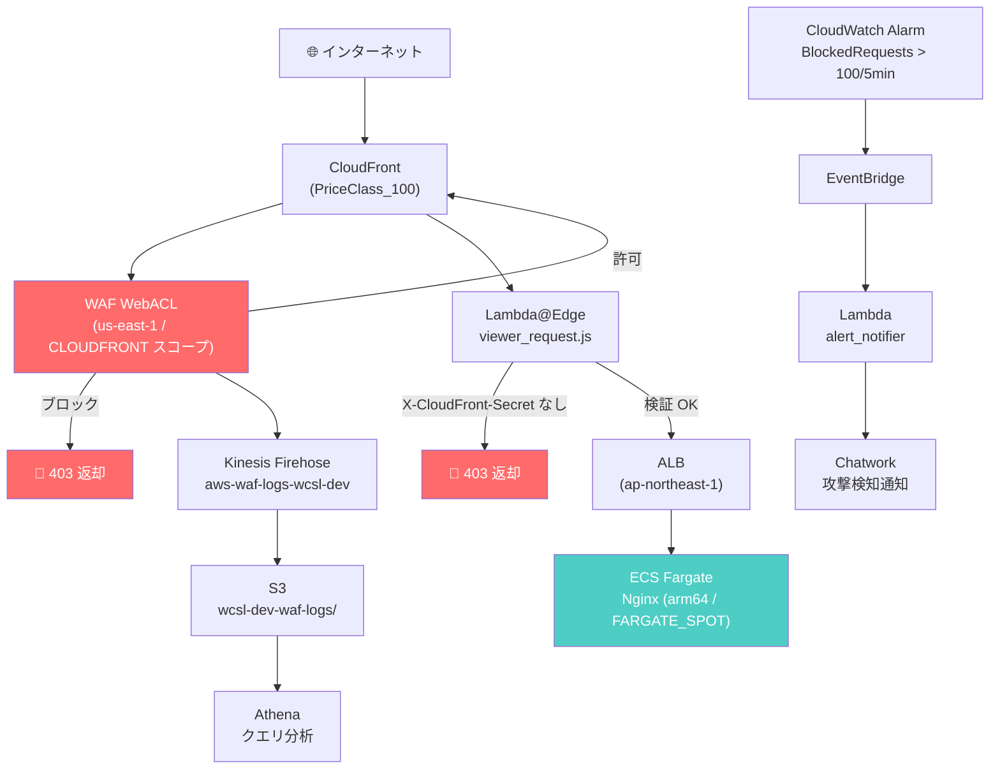

# waf-cloudfront-security-lab

AWS WAF v2 + CloudFront + Lambda@Edge による **エンタープライズ級 Web セキュリティ基盤**のハンズオンラボ。
Terraform でゼロから構築し、攻撃シミュレーションまで通しで体験する。

---

## このハンズオンで得られること

### 技術スキル

| カテゴリ | 具体的に身につくこと |
|---|---|
| **WAF 設計** | マネージドルールと自作ルールの使い分け、`count → block` 昇格の判断基準、False Positive への対処方法 |
| **多層防御** | CloudFront → WAF → Lambda@Edge → ALB → ECS の各層が何を守り何を通すか |
| **ログ分析** | WAF ログを Kinesis Firehose → S3 → Athena に流し、SQL で攻撃元 IP・ルールヒット数・国別統計を分析する |
| **通知設計** | CloudWatch Alarm → EventBridge → Lambda → Chatwork の疎結合な通知パイプライン |
| **Lambda@Edge** | 環境変数が使えない制約の回避方法、viewer-request での軽量なヘッダー検証パターン |
| **コスト最適化** | NAT Gateway 不使用（VPC Endpoint 代替）、arm64 Graviton2、FARGATE_SPOT、GZIP 圧縮、Glacier ライフサイクル |
| **IAM 最小権限** | ワイルドカード禁止・SSM によるシークレット管理・`ecr:GetAuthorizationToken` の `*` が必須な理由 |
| **Terraform 実践** | provider alias によるマルチリージョン管理、`local_file` を使ったデプロイ時コード生成 |

### ポートフォリオとして説明できるようになること

- 「WAF を CLOUDFRONT スコープにした理由と、us-east-1 に置くことの運用上の注意点」
- 「マネージドルールを count から始める運用標準と block に切り替える判断基準」
- 「Kinesis Firehose を WAF ログに選んだ理由（CloudWatch Logs との差分）」
- 「Shield Advanced の月額 $3,000 が正当化されるユースケースとコスト保護の仕組み」

---

## アーキテクチャ



詳細なアーキテクチャ解説は [ARCHITECTURE.md](ARCHITECTURE.md) を参照。

---

## フェーズ構成

| Phase | テーマ | 主要リソース |
|-------|--------|-------------|
| 1 | 基盤構築 | VPC・VPC Endpoint・ECS Fargate・ALB・ACM |
| 2 | WAF + CloudFront | WAF WebACL・マネージドルール・CloudFront |
| 3 | カスタムルール + ログ基盤 | Regex ルール・Kinesis Firehose・S3・Athena |
| 4 | Lambda@Edge + 通知 | Lambda@Edge・CloudWatch Alarm・EventBridge・Chatwork |
| 5 | 動作検証・クリーンアップ | 攻撃シミュレーション・Athena 分析・ADR 記述 |

---

## ハンズオン実行手順

### 前提条件の確認

以下がすべて揃っていることを確認してから始めること。

```bash
# Terraform バージョン確認（>= 1.9 必須）
terraform version

# AWS CLI 認証確認
aws sts get-caller-identity

# デフォルトリージョン確認（ap-northeast-1 であること）
aws configure get region
```

必要なもの一覧:

| 項目 | 内容 |
|---|---|
| Terraform | >= 1.9 |
| AWS CLI | 設定済み（`ap-northeast-1` デフォルト） |
| Route53 ホストゾーン | 自分のドメインのパブリックゾーンが存在すること |
| Chatwork アカウント | API トークンと通知先 Room ID |
| AWS アカウント ID | 後続の手順で使用 |

---

### Step 1: tfstate 用バックエンドリソースを作成する

Terraform の状態ファイルを保存する S3 バケットと DynamoDB テーブルを手動で作成する。
**これは Terraform 管理外のため、一度だけ手動で実行する。**

```bash
ACCOUNT_ID=$(aws sts get-caller-identity --query Account --output text)
BUCKET_NAME="wcsl-tfstate-${ACCOUNT_ID}"

# S3 バケット作成（バージョニング + 暗号化）
aws s3api create-bucket \
  --bucket "${BUCKET_NAME}" \
  --region ap-northeast-1 \
  --create-bucket-configuration LocationConstraint=ap-northeast-1

aws s3api put-bucket-versioning \
  --bucket "${BUCKET_NAME}" \
  --versioning-configuration Status=Enabled

aws s3api put-bucket-encryption \
  --bucket "${BUCKET_NAME}" \
  --server-side-encryption-configuration \
  '{"Rules":[{"ApplyServerSideEncryptionByDefault":{"SSEAlgorithm":"AES256"}}]}'

# DynamoDB テーブル作成（ステートロック用）
aws dynamodb create-table \
  --table-name wcsl-tfstate-lock \
  --attribute-definitions AttributeName=LockID,AttributeType=S \
  --key-schema AttributeName=LockID,KeyType=HASH \
  --billing-mode PAY_PER_REQUEST \
  --region ap-northeast-1

echo "バックエンド準備完了: ${BUCKET_NAME}"
```

---

### Step 2: SSM Parameter Store にシークレットを登録する

**CloudFront シークレット（us-east-1）**: Lambda@Edge と CloudFront が共有するランダム文字列。
ALB への直接アクセスを防ぐために使用する。

```bash
# ランダム文字列を生成
CF_SECRET=$(openssl rand -hex 32)
echo "生成されたシークレット: ${CF_SECRET}"

# us-east-1 の SSM に登録（CloudFront・Lambda@Edge が us-east-1 で参照するため）
aws ssm put-parameter \
  --region us-east-1 \
  --name "/wcsl/dev/cloudfront-secret" \
  --value "${CF_SECRET}" \
  --type SecureString \
  --description "CloudFront origin verification secret"
```

**Chatwork API トークン（ap-northeast-1）**: 攻撃検知通知に使用する。

```bash
# Chatwork API トークンを登録（YOUR_TOKEN を実際のトークンに置き換える）
aws ssm put-parameter \
  --region ap-northeast-1 \
  --name "/wcsl/dev/chatwork-token" \
  --value "YOUR_CHATWORK_API_TOKEN" \
  --type SecureString \
  --description "Chatwork API token for WAF alert notification"
```

> **Chatwork API トークンの取得方法**:
> Chatwork にログイン → 右上のアカウント名 → 「API トークン」

---

### Step 3: backend.tf を自分のアカウントに合わせて編集する

```bash
cd terraform

ACCOUNT_ID=$(aws sts get-caller-identity --query Account --output text)
echo "アカウント ID: ${ACCOUNT_ID}"
```

`terraform/backend.tf` を開き、`YOUR_ACCOUNT_ID` を上記のアカウント ID に置き換える:

```hcl
terraform {
  backend "s3" {
    bucket         = "wcsl-tfstate-123456789012"   # ← YOUR_ACCOUNT_ID に変更
    key            = "waf-cloudfront-security-lab/terraform.tfstate"
    region         = "ap-northeast-1"
    dynamodb_table = "wcsl-tfstate-lock"
    encrypt        = true
  }
}
```

---

### Step 4: terraform init

```bash
cd terraform
terraform init
```

正常完了時の出力:

```
Initializing the backend...
Successfully configured the backend "s3"!

Initializing provider plugins...
- Installing hashicorp/aws v5.x.x...
- Installing hashicorp/local v2.x.x...
- Installing hashicorp/archive v2.x.x...

Terraform has been successfully initialized!
```

---

### Step 5: terraform plan で変更内容を確認する

`domain_name` は Route53 に登録済みのドメイン名、`chatwork_room_id` は通知先の Room ID を指定する。

```bash
terraform plan \
  -var="domain_name=example.com" \
  -var="chatwork_room_id=123456789"
```

確認すべきポイント:

```
# 作成されるリソース数の目安（全フェーズ完了時）
Plan: 60〜70 add, 0 change, 0 destroy

# 必ずチェックする項目
+ module.waf.aws_wafv2_web_acl.main          ← us-east-1 に作成されるか
+ module.cloudfront.aws_lambda_function.viewer_request  ← us-east-1 か
+ module.origin.aws_vpc_endpoint.ecr_api     ← NAT Gateway がないことを確認
```

---

### Step 6: terraform apply でデプロイする

> **注意**: `terraform apply` はユーザー自身が実行すること。
> ACM の DNS 検証で Route53 レコードが作成されてから証明書が発行されるまで
> **最大 5〜10 分**かかる。

```bash
terraform apply \
  -var="domain_name=example.com" \
  -var="chatwork_room_id=123456789"
```

`yes` を入力して実行。完了までの目安: **10〜15 分**。

完了後、output を確認する:

```bash
terraform output

# 期待される出力例:
# alb_dns_name                  = "wcsl-dev-alb-XXXXXXXXXX.ap-northeast-1.elb.amazonaws.com"
# cloudfront_domain_name        = "XXXXXXXXXXXX.cloudfront.net"
# webacl_arn                    = "arn:aws:wafv2:us-east-1:..."
# waf_logs_bucket_name          = "wcsl-dev-waf-logs-XXXXXXXXXXXX"
# athena_workgroup_name         = "wcsl-dev-waf"
# athena_database_name          = "wcsl_dev_waf"
# alert_alarm_name              = "wcsl-dev-waf-block-high"
```

---

### Step 7: Athena テーブルを作成する

WAF ログを Athena でクエリするためのテーブルは Named Query として保存されている。
**デプロイ後に一度だけ手動実行が必要。**

```bash
# Named Query の内容を取得
QUERY_ID=$(aws athena list-named-queries \
  --work-group wcsl-dev-waf \
  --region us-east-1 \
  --query 'NamedQueryIds[0]' \
  --output text)

aws athena get-named-query \
  --named-query-id "${QUERY_ID}" \
  --region us-east-1 \
  --query 'NamedQuery.QueryString' \
  --output text
```

AWS コンソールでの手順:
1. **Athena コンソール** (us-east-1) を開く
2. ワークグループを `wcsl-dev-waf` に切り替える
3. 「Saved queries」から `create-waf-logs-table` を選択
4. 「Run query」を実行する

---

### Step 8: WAF 動作検証

デプロイが完了したら、各 WAF ルールが期待通りに動作するか検証する。

```bash
CF_DOMAIN=$(cd terraform && terraform output -raw cloudfront_domain_name)
ALB_DNS=$(cd terraform && terraform output -raw alb_dns_name)

# CloudFront ドメインのみで検証
./scripts/test_waf.sh "${CF_DOMAIN}"

# ALB 直接アクセス防止も含めて検証
./scripts/test_waf.sh "${CF_DOMAIN}" "${ALB_DNS}"
```

**期待される出力（全 PASS が正常）:**

```
=== WAF 動作検証 ===
対象: https://XXXXXXXXXXXX.cloudfront.net

✅ PASS: 正常リクエスト (HTTP 200)
✅ PASS: SQLi ブロック (HTTP 403)
✅ PASS: 管理パス /admin (HTTP 403)
✅ PASS: 管理パス /.env (HTTP 403)
✅ PASS: 管理パス /.git (HTTP 403)
✅ PASS: 不正 UA: sqlmap (HTTP 403)
✅ PASS: 不正 UA: nikto (HTTP 403)
✅ PASS: 不正 UA: masscan (HTTP 403)
✅ PASS: XSS ブロック (HTTP 403)
✅ PASS: ALB 直接アクセス（CF ヘッダーなし） (HTTP 403)

=== 結果: PASS=10, FAIL=0 ===
```

> **FAIL が出た場合**: WAF ルールが `count` モードになっていないか確認する。
> `AWSManagedRulesCommonRuleSet` と `AWSManagedRulesKnownBadInputsRuleSet` は
> 意図的に `count` モードのため、これらのルール起因のリクエストは 403 にならない。

---

### Step 9: 攻撃シミュレーションを実行する

Athena でログを確認するための攻撃パターンを一括送信する。

```bash
CF_DOMAIN=$(cd terraform && terraform output -raw cloudfront_domain_name)
./scripts/simulate_attack.sh "${CF_DOMAIN}"
```

送信される攻撃パターン:
- SQLi: 10 種（`' OR '1'='1`・`UNION SELECT`・`DROP TABLE` 等）
- XSS: 5 種（`<script>alert(1)</script>` 等）
- スキャンツール UA: 7 種（sqlmap・nikto・nessus 等）
- 管理パス探索: 7 種（`/admin`・`/.env`・`/wp-admin` 等）

---

### Step 10: Athena でログを分析する

攻撃シミュレーション実行から **約 5 分後**（Firehose のバッファリング間隔）に S3 にログが届く。

**コンソール手順:**
1. Athena コンソール（us-east-1）を開く
2. ワークグループを `wcsl-dev-waf` に切り替える
3. データベース `wcsl_dev_waf` を選択する

**クエリ 1: ブロックされた上位 IP を確認する**

```sql
-- athena/queries/top_blocked_ips.sql
SELECT
  httpRequest.clientIp    AS client_ip,
  httpRequest.country     AS country,
  COUNT(*)                AS blocked_count,
  MAX(from_unixtime(timestamp / 1000)) AS last_seen
FROM waf_logs
WHERE action = 'BLOCK'
  AND year  = '2026'
  AND month = '07'    -- 実行月に合わせて変更
GROUP BY 1, 2
ORDER BY blocked_count DESC
LIMIT 20;
```

**クエリ 2: どの WAF ルールが何回ヒットしたか確認する**

```sql
-- athena/queries/rule_match_summary.sql
SELECT
  terminatingRuleId  AS rule_id,
  action,
  COUNT(*)           AS match_count
FROM waf_logs
WHERE year  = '2026'
  AND month = '07'
GROUP BY 1, 2
ORDER BY match_count DESC;
```

**クエリ 3: 国別のブロック率を確認する**

```sql
-- athena/queries/country_breakdown.sql
SELECT
  httpRequest.country  AS country,
  COUNT(*)             AS total_requests,
  SUM(CASE WHEN action = 'BLOCK' THEN 1 ELSE 0 END) AS blocked_count,
  ROUND(100.0 * SUM(CASE WHEN action = 'BLOCK' THEN 1 ELSE 0 END) / COUNT(*), 2) AS block_rate_pct
FROM waf_logs
WHERE year  = '2026'
  AND month = '07'
GROUP BY 1
ORDER BY total_requests DESC;
```

> **クエリがスキャンする最大データ量**: 1 GB（ワークグループで制限済み）。
> 年月フィルタ（`year` / `month`）を必ず指定すること。省略するとフルスキャンになる。

---

### Step 11: Chatwork への攻撃検知通知を確認する

CloudWatch Alarm が ALARM 状態になると EventBridge 経由で Chatwork に通知が届く。

**手動でアラームを ALARM 状態にしてテストする:**

```bash
# アラームを強制的に ALARM 状態にする
aws cloudwatch set-alarm-state \
  --alarm-name "wcsl-dev-waf-block-high" \
  --state-value ALARM \
  --state-reason "テスト: WAF ブロック数しきい値超過の手動テスト" \
  --region us-east-1
```

Chatwork に以下のようなメッセージが届けば成功:

```
[info][title]⚠️ WAF 攻撃検知アラート[/title]
アラーム名: wcsl-dev-waf-block-high
状態: ALARM
理由: テスト: WAF ブロック数しきい値超過の手動テスト
リージョン: us-east-1
コンソール: https://console.aws.amazon.com/wafv2/homev2/web-acls
[/info]
```

**テスト後に OK 状態へ戻す:**

```bash
aws cloudwatch set-alarm-state \
  --alarm-name "wcsl-dev-waf-block-high" \
  --state-value OK \
  --state-reason "テスト完了" \
  --region us-east-1
```

---

### Step 12: WAF マネージドルールを block に昇格させる（オプション）

`count` モードで一定期間運用してログを確認し、誤検知がなければ `block` に切り替える。

```bash
# 現在 count モードのルール（初期デプロイ時点）
# - AWSManagedRulesCommonRuleSet     (priority 10)
# - AWSManagedRulesKnownBadInputsRuleSet (priority 20)

# Athena で count ルールのヒット数を確認してから block に切り替える
# terraform/modules/waf/main.tf の対象ルールを以下に変更:
#   override_action { count {} }
#     ↓
#   override_action { none {} }    ← マネージドルールのデフォルトアクション（block）を有効化
```

---

### Step 13: クリーンアップ

**Lambda@Edge を含む CloudFront の削除には順序が重要。**

```bash
cd terraform

# 1. CloudFront を先に削除する
#    Lambda@Edge のエッジレプリカ削除が開始される
terraform destroy \
  -target=module.cloudfront \
  -var="domain_name=example.com" \
  -var="chatwork_room_id=123456789"
```

CloudFront の削除が完了したら、コンソールで確認する:
- **CloudFront コンソール** → ディストリビューションの Status が `Deployed` → 消えていること
- Lambda@Edge のレプリカ削除には数分〜数十分かかる

```bash
# 2. 残りのリソースをすべて削除する
terraform destroy \
  -var="domain_name=example.com" \
  -var="chatwork_room_id=123456789"
```

```bash
# 3. 削除確認
aws wafv2 list-web-acls --scope CLOUDFRONT --region us-east-1
aws cloudfront list-distributions
aws s3 ls | grep wcsl

# tfstate バックエンドリソースも削除する（不要な場合）
ACCOUNT_ID=$(aws sts get-caller-identity --query Account --output text)
aws s3 rb "s3://wcsl-tfstate-${ACCOUNT_ID}" --force
aws dynamodb delete-table --table-name wcsl-tfstate-lock --region ap-northeast-1

echo "クリーンアップ完了"
```

---

## コスト試算（月額）

| サービス | 想定コスト | 備考 |
|---|---|---|
| ALB | ~$20 | 固定費（$0.0243/時） |
| WAF WebACL | ~$10 | WebACL $5 + ルール $3 + リクエスト数 |
| VPC Endpoint (Interface 型 4 本) | ~$15 | $0.01/時 × 4 本 × 2AZ |
| CloudFront | ~$5 | PriceClass_100・低トラフィック |
| ECS Fargate | ~$5 | arm64 + FARGATE_SPOT |
| Kinesis Firehose | ~$1 | 低トラフィック（従量課金） |
| S3 | ~$1 | GZIP 圧縮 + ライフサイクル管理 |
| Lambda | ~$0 | 無料枠内 |
| Shield Advanced | $3,000+ | **Phase 4 のみ有効化・即削除** |
| **合計（Shield 除く）** | **~$57** | ハンズオン期間だけ使用 |

---

## ディレクトリ構成

```
waf-cloudfront-security-lab/
├── ARCHITECTURE.md              # 完全理解ドキュメント（設計意図・実装詳細）
├── terraform/
│   ├── main.tf                  # モジュール呼び出し
│   ├── variables.tf             # 入力変数
│   ├── outputs.tf               # 出力値
│   ├── backend.tf               # S3 + DynamoDB によるステート管理
│   └── modules/
│       ├── waf/                 # WAF WebACL・ルール・Regex Pattern Set
│       ├── cloudfront/          # CloudFront + Lambda@Edge
│       ├── origin/              # VPC・ALB・ECS Fargate
│       ├── waf-logs/            # Kinesis Firehose + S3 + Athena
│       └── alert/               # CloudWatch Alarm → Chatwork 通知
├── lambda/
│   ├── edge/viewer_request.js   # Lambda@Edge: X-CloudFront-Secret 検証
│   └── alert_notifier/main.py  # 攻撃検知 → Chatwork 通知
├── athena/queries/              # WAF ログ分析 SQL クエリ集
├── scripts/
│   ├── test_waf.sh              # WAF 動作検証（PASS/FAIL 出力）
│   └── simulate_attack.sh      # 攻撃パターン一括送信
└── docs/
    ├── architecture.md          # Mermaid アーキテクチャ図
    ├── waf-rule-design.md       # WAF ルール設計思想（自己記述）
    └── adr/                     # Architecture Decision Records 4 本
```

---

## ADR（設計判断記録）

| ADR | 決定内容 |
|---|---|
| [001](docs/adr/001-waf-scope-cloudfront.md) | WAF スコープを CLOUDFRONT にした理由 |
| [002](docs/adr/002-managed-vs-custom-rules.md) | マネージドルールと count モード開始の理由 |
| [003](docs/adr/003-shield-advanced-trade-off.md) | Shield Advanced のコストトレードオフ |
| [004](docs/adr/004-kinesis-firehose-for-waf-logs.md) | Kinesis Firehose を WAF ログに選んだ理由 |

> **ADR 記述ルール**: 各 ADR は自分の言葉で記述すること。AI 生成テキストの貼り付け禁止。

---

## 参考ドキュメント

- [ARCHITECTURE.md](ARCHITECTURE.md) — 設計意図・モジュール詳解・リージョン戦略・FAQ
- [docs/architecture.md](docs/architecture.md) — Mermaid アーキテクチャ図（詳細版）
- [docs/waf-rule-design.md](docs/waf-rule-design.md) — WAF ルール設計思想
