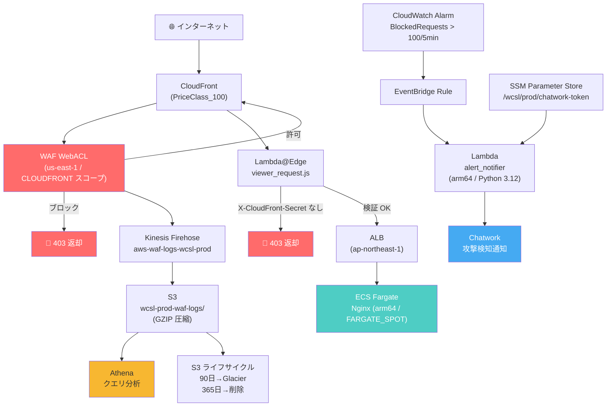

# アーキテクチャ概要

## 全体構成図



## リクエストフロー

```
① User → CloudFront (エッジロケーション)
② CloudFront → WAF WebACL 評価
   ├─ ブロック → 403 即返却（エッジで完結）
   └─ 許可 → Lambda@Edge (viewer_request) 実行
③ Lambda@Edge → X-CloudFront-Secret ヘッダー検証
   ├─ ヘッダーなし → 403（ALB への直アクセス防止）
   └─ 検証 OK → ALB へ転送
④ ALB → ECS Fargate (プライベートサブネット)
⑤ WAF ログ → Kinesis Firehose → S3 → Athena（非同期）
⑥ CloudWatch Alarm 発火 → EventBridge → Lambda → Chatwork（非同期）
```

## コンポーネント一覧

| コンポーネント | リージョン | 役割 |
|---|---|---|
| CloudFront | グローバル (us-east-1 管理) | CDN・HTTPS 終端・WAF アタッチ |
| WAF WebACL | us-east-1 (CLOUDFRONT スコープ) | SQLi/XSS/レートリミット・カスタムルール |
| Lambda@Edge | us-east-1 (レプリカ: エッジ) | ALB 直アクセス防止・カスタムヘッダー検証 |
| ALB | ap-northeast-1 | ロードバランシング・ヘルスチェック |
| ECS Fargate | ap-northeast-1 (プライベート) | アプリケーションサーバ (Nginx / arm64) |
| Kinesis Firehose | us-east-1 | WAF ログのリアルタイム転送 |
| S3 | ap-northeast-1 | WAF ログ永続化・ライフサイクル管理 |
| Athena | ap-northeast-1 | ログクエリ・攻撃分析 |
| CloudWatch | us-east-1 / ap-northeast-1 | メトリクス監視・アラーム |
| EventBridge | ap-northeast-1 | アラームイベントのルーティング |
| Lambda (alert_notifier) | ap-northeast-1 | Chatwork 通知 |
| SSM Parameter Store | ap-northeast-1 | Chatwork トークン管理 |

## セキュリティ多層防御

```
Layer 1: CloudFront (DDoS 軽減・エッジキャッシュ)
Layer 2: WAF WebACL (マネージドルール + カスタムルール)
Layer 3: Lambda@Edge (カスタムヘッダー検証)
Layer 4: ALB (セキュリティグループ: CloudFront IP のみ許可)
Layer 5: ECS (プライベートサブネット・VPC Endpoint 経由のみ)
```
