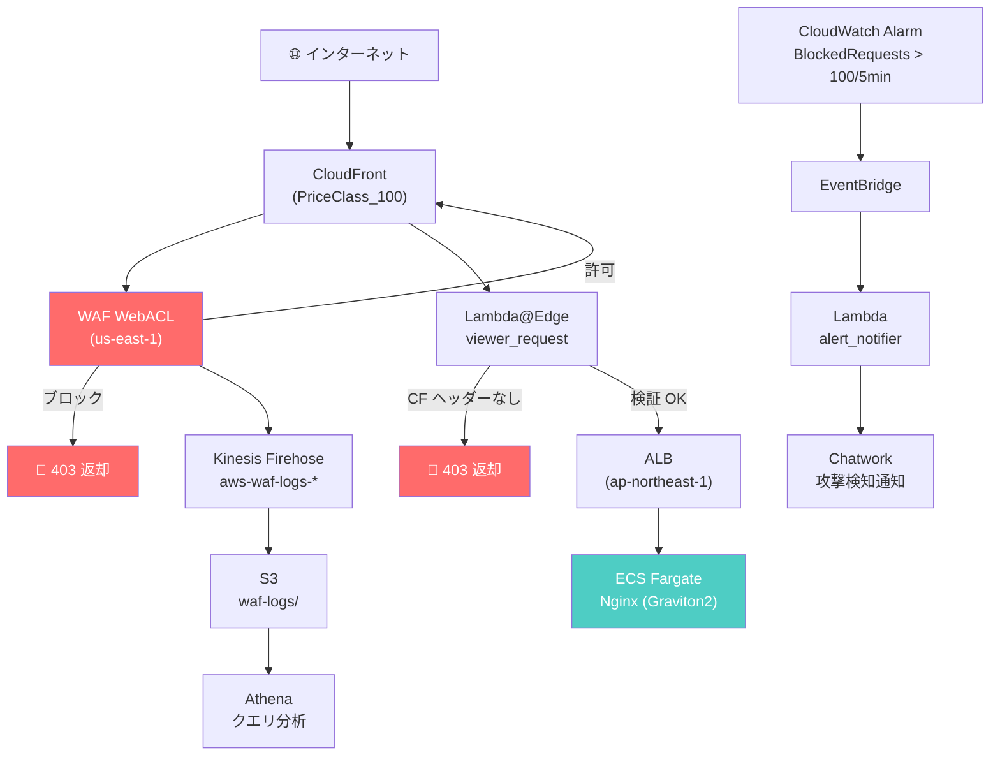

# Phase 5 — 動作検証・攻撃シミュレーション・ADR 完成・クリーンアップ

## 前フェーズの確認

以下が完了していること：
- Lambda@Edge がデプロイされている
- Chatwork への通知が動作している
- WAF ログが S3 → Athena でクエリできる

---

## このフェーズの目的

全構成を通した動作検証と攻撃シミュレーションを行い、
ADR・README・Zenn 記事草案を完成させる。
「作った」から「説明できる」状態への転換フェーズ。

## 完了条件

- [ ] 攻撃シミュレーションスクリプトが全テスト PASS
- [ ] Athena で攻撃ログが確認できる
- [ ] ADR 4 本を自分の言葉で記述完了
- [ ] README にアーキテクチャ図（Mermaid）が入っている
- [ ] 口頭説明チェック全項目クリア
- [ ] `terraform destroy` でリソースが全て削除されている

---

## 作成するファイル一覧

```
scripts/
├── test_waf.sh
└── simulate_attack.sh
docs/
├── architecture.md
├── waf-rule-design.md（自分で記述）
└── adr/
    ├── 001-waf-scope-cloudfront.md（自分で記述）
    ├── 002-managed-vs-custom-rules.md（自分で記述）
    ├── 003-shield-advanced-trade-off.md（自分で記述）
    └── 004-kinesis-firehose-for-waf-logs.md（自分で記述）
README.md
```

---

## 実装指示

### scripts/test_waf.sh

各 WAF ルールが期待通りに動作するかを検証するスクリプト。
`PASS` / `FAIL` を出力すること。

```bash
#!/bin/bash
set -euo pipefail

CF_DOMAIN="${1:?Usage: $0 <cloudfront-domain>}"
PASS=0
FAIL=0

check() {
  local name="$1"
  local expected_status="$2"
  local url="$3"
  local extra_args="${4:-}"

  actual=$(curl -s -o /dev/null -w "%{http_code}" ${extra_args} "${url}")

  if [ "${actual}" = "${expected_status}" ]; then
    echo "✅ PASS: ${name} (HTTP ${actual})"
    PASS=$((PASS + 1))
  else
    echo "❌ FAIL: ${name} (expected ${expected_status}, got ${actual})"
    FAIL=$((FAIL + 1))
  fi
}

echo "=== WAF 動作検証 ==="

# 正常リクエスト（許可）
check "正常リクエスト" "200" "https://${CF_DOMAIN}/"

# SQLi → ブロック
check "SQLi ブロック" "403" "https://${CF_DOMAIN}/?id=1' OR '1'='1"

# 管理パス → ブロック
check "管理パス /admin" "403" "https://${CF_DOMAIN}/admin"
check "管理パス /.env"  "403" "https://${CF_DOMAIN}/.env"

# 不正 UA → ブロック
check "不正 UA: sqlmap" "403" "https://${CF_DOMAIN}/" "-A 'sqlmap/1.0'"
check "不正 UA: nikto"  "403" "https://${CF_DOMAIN}/" "-A 'nikto'"

# ALB 直接アクセス → Lambda@Edge が弾く（403）
ALB_DNS="${2:-}"
if [ -n "${ALB_DNS}" ]; then
  check "ALB 直接アクセス（CF ヘッダーなし）" "403" "https://${ALB_DNS}/"
fi

echo ""
echo "=== 結果: PASS=${PASS}, FAIL=${FAIL} ==="
[ "${FAIL}" -eq 0 ] && exit 0 || exit 1
```

### scripts/simulate_attack.sh

Athena でログを確認するための攻撃パターンを一括送信するスクリプト。

```bash
#!/bin/bash
CF_DOMAIN="${1:?Usage: $0 <cloudfront-domain>}"

echo "攻撃シミュレーション開始（ログは S3 に記録されます）"

# SQLi 攻撃パターン（20 種）
sqli_payloads=(
  "' OR '1'='1"
  "' OR 1=1--"
  "'; DROP TABLE users;--"
  "' UNION SELECT 1,2,3--"
  "1' AND SLEEP(5)--"
)

for payload in "${sqli_payloads[@]}"; do
  curl -s -o /dev/null "https://${CF_DOMAIN}/?id=$(python3 -c "import urllib.parse; print(urllib.parse.quote('${payload}'))")"
  sleep 0.5
done

# XSS 攻撃パターン
curl -s -o /dev/null "https://${CF_DOMAIN}/?q=<script>alert(1)</script>"
curl -s -o /dev/null "https://${CF_DOMAIN}/?q=javascript:alert(document.cookie)"

# スキャンツール UA
for ua in "sqlmap/1.0" "nikto" "nessus" "masscan" "nmap scripting engine"; do
  curl -s -o /dev/null -A "${ua}" "https://${CF_DOMAIN}/"
done

echo "完了。5 分後に S3 でログを確認してください。"
echo "Athena クエリ: athena/queries/top_blocked_ips.sql"
```

### docs/architecture.md

以下の Mermaid 図を生成すること：



### docs/adr/ （自分で記述すること）

以下の 4 本を**自分の言葉で**記述すること。AI 生成禁止。

**001-waf-scope-cloudfront.md**
- なぜ ALB への直接 WAF（REGIONAL）ではなく CloudFront スコープにしたか
- us-east-1 に WAF を置くことの運用上の注意点

**002-managed-vs-custom-rules.md**
- マネージドルールと自作ルールの使い分け基準
- count モードから始める運用標準を採用した理由

**003-shield-advanced-trade-off.md**
- Shield Advanced の月額 $3,000 のコストに見合うユースケース
- Standard との具体的な差分（DDoS 緩和・コスト保護・サポート）

**004-kinesis-firehose-for-waf-logs.md**
- WAF ログを CloudWatch Logs に直接送れない理由（仕様上の制約）
- Firehose + S3 + Athena の構成を選んだ理由

---

## 口頭説明チェック（最終）

以下のテーマを各 3〜5 分で説明できるか自己チェックすること：

### チェック 1: アーキテクチャ全体説明
「CloudFront → WAF → Lambda@Edge → ALB → ECS の流れを図なしで説明せよ」

### チェック 2: WAF ルール設計
「マネージドルールを count から始めた理由と、block に切り替える判断基準を説明せよ」

### チェック 3: ログ分析基盤
「WAF ログを Kinesis Firehose で S3 に送り Athena で分析する構成を説明せよ」

### チェック 4: コスト設計
「このプロジェクトで意識したコスト最適化のポイントを全て挙げよ」

予想回答例（参考）：
- NAT Gateway 不使用（VPC Endpoint 代替）
- FARGATE_SPOT 主軸
- CloudFront PriceClass_100（全世界配信ではない）
- Firehose GZIP 圧縮
- S3 ライフサイクル（90 日 Glacier → 365 日削除）
- Athena スキャン量制限（1 GB 上限）
- Shield Advanced は検証後即削除

### チェック 5: 面接想定 Q&A

Q: 「WAF だけで十分では？CloudFront が必要な理由は？」
→ CDN によるエッジキャッシュ・DDoS 軽減・グローバル配信・HTTPS 終端

Q: 「Lambda@Edge でなく CloudFront Functions でよいのでは？」
→ Node.js ランタイムが必要な処理・SSM 参照の有無・実行時間の違い

Q: 「Shield Advanced を本番で使うか？」
→ 大規模 DDoS リスクのあるサービスなら検討。ただしコスト保護機能とサポート込みで判断

---

## クリーンアップ手順

```bash
# 1. Lambda@Edge の削除には時間がかかる（レプリカの削除待ち）
#    先に CloudFront との関連付けを外してから destroy すること

# 2. CloudFront を先に削除（Lambda@Edge レプリカの削除が始まる）
terraform destroy -target=module.cloudfront
# → 数分待つ（コンソールで CloudFront が Disabled になるまで）

# 3. 残りリソースを削除
terraform destroy

# 4. 削除確認
aws wafv2 list-web-acls --scope CLOUDFRONT --region us-east-1
aws cloudfront list-distributions
aws s3 ls | grep wcsl

echo "クリーンアップ完了"
```

---

## ポートフォリオ化チェックリスト

- [ ] GitHub に push している
- [ ] README にアーキテクチャ図・構成説明・コスト試算が入っている
- [ ] ADR 4 本が自分の言葉で書かれている
- [ ] Zenn 記事の草案（タイトル・見出し構成）ができている
- [ ] 口頭説明チェック全項目クリア済み

---

## Zenn 記事草案タイトル案

- 「Terraform で作る WAF + CloudFront 多層防御基盤〜攻撃検知から Chatwork 通知まで〜」
- 「AWS WAF を count から始めて本番に育てる運用設計とログ分析基盤」
- 「Lambda@Edge と WAF で守る CloudFront セキュリティの全体設計」